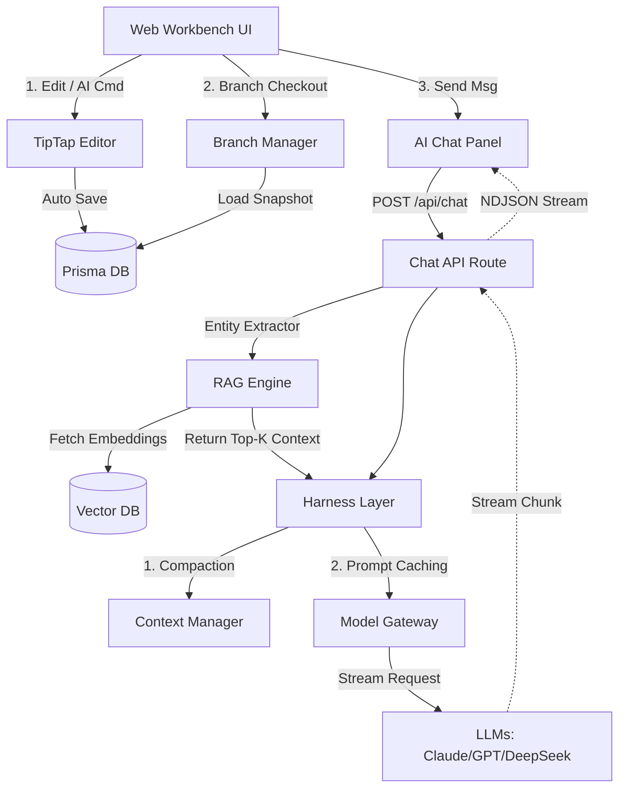

# DreamWeaver V3 架构演进方案 (Architecture Evolution)

## 1. 架构目标 (Architecture Goals)
基于 V2 搭建的全栈底座 (Next.js + Prisma) 与基础 AI 路由，V3 将解决 **海量上下文处理成本 (RAG & Harness)** 与 **多分支版本控制 (Git-like Branching)** 两大核心架构挑战。

## 2. 核心架构演进 (Core Evolution)

### 2.1 引入 Harness 工程 (Harness Engineering)
参考 Claude Code 的设计理念，引入 Harness 层作为 AI 调用的工程基础设施：

1.  **Prompt Cache Harness (提示词缓存引擎)**:
    - **痛点**: 每次请求带上整本小说背景和知识库，Token 成本极高且响应慢。
    - **方案**: 利用 Anthropic/OpenAI 的 Prompt Caching API，将“系统指令”、“世界观设定集”、“前文摘要”作为静态缓存层，仅更新最新交互和当前选中段落。
    - **实现**: `src/lib/harness/prompt-cache.ts`。

2.  **Compaction Harness (上下文压缩引擎)**:
    - **痛点**: 上下文窗口限制 (128K/200K) 容易在长篇连载中爆窗。
    - **方案**: 对超长历史章节进行分级压缩 (Level 1: 完整段落 -> Level 2: 章节摘要 -> Level 3: 卷级事件线)。
    - **实现**: `src/lib/harness/compactor.ts`。

### 2.2 检索增强生成架构 (RAG System)
1.  **向量数据库 (Vector DB)**:
    - **选型**: 考虑到项目初期轻量化，可以使用 `pgvector` (配合 PostgreSQL) 或本地化的向量库 (如 Chroma/Qdrant，若全量切换至云端可使用 Pinecone/Supabase Vector)。
    - **模型**: `text-embedding-3-small` (OpenAI) 或开源本地模型。
2.  **数据流转**:
    - **Ingestion**: 当角色 (Character) 或设定 (WorldSetting) 保存/更新时，触发 Embedding 任务并存入向量表。
    - **Retrieval**: 拦截用户的 `/api/chat` 请求，先提取关键字/实体名，进行 Top-K 向量相似度检索。
    - **Injection**: 将命中的设定注入 Prompt Cache Harness，构建完整 System Prompt。

### 2.3 多分支叙事系统 (Git-like Version Control)
1.  **数据模型设计 (Prisma Schema Evolution)**:
    - `Branch`: `id`, `projectId`, `name`, `parentBranchId`, `createdAt`.
    - `Commit` (快照): `id`, `branchId`, `message`, `createdAt`.
    - `ChapterSnapshot`: 章节在特定 Commit 下的内容快照，通过关联表与 `Commit` 绑定。
2.  **分支操作抽象**:
    - **Checkout (切换)**: 根据选中的 `Branch` 加载其最新的 `Commit`，并在工作台编辑器中呈现。
    - **Merge (合并)**: 采用简单的三方对比或基于 AI 的合并冲突解决。
    - **Fork (分叉)**: 基于当前光标位置或章节末尾，克隆当前上下文到一个新 Branch，供 AI "假设性推演" (What-if)。

## 3. 系统组件交互图 (System Component Diagram)

## 4. 技术栈增补 (Tech Stack Additions)
- **Vector DB**: `pgvector` (若迁移到真实 Postgres) 或暂时使用内存级/轻量级向量检索方案用于 Mock 驱动。
- **Embeddings**: `@ai-sdk/openai` 的 `embed` 函数。
- **AI SDK**: Vercel AI SDK Core 的 `streamText`, `generateText` 继续深度使用。

## 5. 灰度发布策略
- V3 将采用特性开关 (Feature Flag) `NEXT_PUBLIC_ENABLE_BRANCHING=true` 和 `NEXT_PUBLIC_ENABLE_RAG=true`，确保不影响 V2 已交付的线性创作链路。