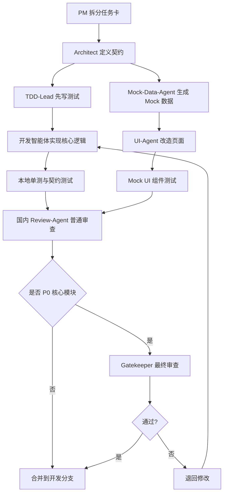

# 卡牌物语 AI 小说编辑器 · 多模型智能体分工与任务拆解方案 v1.0

> **版本**：v1.0
> **日期**：2026-05-02
> **适用项目**：卡牌物语 AI 小说编辑器 / OpenCode 二开 / TDD + Mock 驱动开发
> **当前环境**：Trae-cn 国内版为开发主阵地
> **核心策略**：国内模型主开发，网页强模型做项目管理，高价通道做最终 Review
> **开发方式**：TDD + Mock 数据 + Provider 抽象 + 分角色并行开发
> **交付目标**：8-10 周内部 Alpha，前 2 周完成"假数据但真流程"的编辑器雏形

---

## **一、总体判断：你的安排方向是对的，但需要进一步收敛**

你提出的思路是合理的：**国内模式担任开发主力，网页强模型做项目管理，高价通道做代码 Review**。这套分工符合成本、效率和质量控制的平衡。

但我建议做两点优化。

第一，**不要按模型品牌固定角色，而要按任务类型路由模型**。同一个模型今天适合写 UI，明天可能更适合写测试；同一个任务也可能先由低成本模型初稿，再由强模型审查。因此要设计"智能体角色固定，底层模型可替换"的结构。

第二，**高价模型不要做日常 Review，而只做合并门禁 Review**。如果每个小任务都用最高价通道审查，会很快变成成本黑洞。更好的方式是：国内模型先自测和互审，网页强模型做里程碑审查，高价通道只看 P0 核心模块、跨模块集成、合并前风险。

---

## **二、模型分层策略**

为了避免团队被具体模型绑定，建议把你当前可用的模型资源分成 5 类能力池，而不是直接把某一个模型永久绑定到某个职位。

| 能力池 | 适合任务 | 不适合任务 | 使用频率 |
|---|---|---|---|
| 国内代码主力池 | 写代码、改 UI、补测试、实现 Provider、生成 Mock 数据 | 最终架构裁决、复杂跨模块 Review | 高频 |
| 国内长上下文分析池 | 阅读 PRD、分析 Code Wiki、拆任务、生成模块设计 | 高频小代码修改 | 中高频 |
| 国内创意/文案池 | 生成英文章节 Mock、角色卡、世界观、UI 文案、示例数据 | 严格代码逻辑 | 中频 |
| 网页强模型池 | 项目管理、架构裁决、跨模块一致性检查、周评审 | 大量重复代码生成 | 低中频 |
| 高价审查池 | 合并前代码 Review、安全 Review、沙箱隔离 Review、同步协议 Review | 日常开发，普通 UI 修改 | 低频，只用于门禁 |

这套分层的关键是：**免费和低成本模型吃掉 80% 工作，强模型只做"判断题"和"裁判"，高价模型只做"保险丝"。**

---

## **三、智能体体系设计**

建议你在 Trae-cn 中创建一组固定的自定义智能体。每个智能体有明确职责、输入、输出、禁止事项和验收标准。模型可以在背后替换，但智能体角色不要频繁变。

---

## **四、核心智能体角色总览**

| 智能体 | 主要职责 | 推荐模型池 | 输出物 | 是否参与代码 |
|---|---|---|---|---|
| PM-Orchestrator 项目经理 | 拆任务、排期、冲突裁决、周评审 | 网页强模型池 | 周计划、任务卡、风险清单 | 不直接写代码 |
| Architect 架构师 | 模块边界、契约、Provider、技术决策 | 网页强模型池 + 国内长上下文池 | 架构文档、接口契约 | 少量关键代码 |
| TDD-Lead 测试负责人 | 测试策略、测试用例、CI 门禁 | 国内代码主力池 | 单测、组件测试、契约测试 | 写测试为主 |
| Mock-Data-Agent Mock 数据工程师 | fixtures、scenarios、假数据服务 | 国内创意/文案池 + 国内代码主力池 | Mock 数据、场景包 | 写 Mock 代码 |
| UI-Agent 前端改造工程师 | OpenCode UI 改造、页面、组件 | 国内代码主力池 | 页面组件、状态展示 | 主力写代码 |
| LocalData-Agent 本地数据工程师 | SQLite、文件模型、版本记录 | 国内代码主力池 | 数据层、Repository | 主力写代码 |
| Sandbox-Agent 沙箱工程师 | 沙箱隔离、路径安全、worktree/目录方案 | 国内代码主力池 | 沙箱 API、安全测试 | 主力写代码 |
| Branch-Agent 分支剧情工程师 | DAG、节点、边、校验、预览路径 | 国内代码主力池 | Branch 模型和校验器 | 主力写代码 |
| AgentBridge-Agent AI 接入工程师 | Agent 调度、工具白名单、任务状态机 | 国内代码主力池 | AgentProvider、任务流 | 主力写代码 |
| Sync-Agent 同步工程师 | 发布 Payload、同步冲突、配额、资产上传 | 国内代码主力池 | SyncProvider、接口适配 | 主力写代码 |
| Review-Agent 普通审查员 | 国内模型自审、格式审查、测试覆盖检查 | 国内长上下文池 | Review 评论 | 不直接改主代码 |
| Gatekeeper 最终审查员 | P0 风险审查、合并前审查 | 高价审查池 | 合并意见、阻断项 | 不直接写代码 |

---

## **五、推荐的最佳工作流**

我建议采用"三级审查 + 双轨开发"的工作流。

所谓双轨开发，是指 UI 和核心逻辑同时推进：

```text
UI 轨：Mock 数据 → 页面组件 → 假流程 → 交互修正
核心轨：TDD 测试 → 数据模型 → Provider → 本地真实实现
```

所谓三级审查，是指：

```text
第一级：开发智能体自测
第二级：国内 Review 智能体互审
第三级：网页强模型/高价通道做门禁审查
```

完整流程如下：



这套流程可以保证日常开发不被高价模型拖慢，同时关键模块不会裸奔。

---

## **六、自定义智能体详细设计**

### **6.1 PM-Orchestrator 项目经理智能体**

PM 智能体不写代码。它的任务是把 PRD 拆成可执行任务，维护节奏，判断是否偏离 MVP，发现范围膨胀。

它最适合交给网页强模型，因为项目经理需要长上下文、稳定判断和跨模块一致性，而不是高频生成代码。

**职责范围：**

| 项目 | 内容 |
|---|---|
| 输入 | PRD、Code Wiki、当前任务进展、测试结果、Review 结果 |
| 输出 | 周计划、日任务、风险清单、阻塞项、降级建议 |
| 禁止 | 直接生成大段业务代码、擅自增加新功能 |
| 评价标准 | 是否收敛 MVP，是否发现依赖冲突，是否能砍掉非必要任务 |

**推荐系统提示词：**

```text
你是卡牌物语 AI 小说编辑器项目的 PM-Orchestrator。
你的职责不是写代码，而是拆任务、控范围、识别风险、维护 MVP 节奏。
项目采用 OpenCode 二开、TDD、Mock 数据、Provider 抽象和多智能体并行开发。
你必须坚持以下原则：
1. 只服务 MVP，不扩展非必要功能。
2. 每个任务必须有输入、输出、验收标准、依赖关系。
3. UI 允许 Mock 先行，核心逻辑必须 TDD。
4. 高风险模块必须进入 Gatekeeper Review。
5. 如果任务超过 2 天，应继续拆小。
输出格式必须包含：任务清单、依赖关系、风险、验收标准、是否需要高价审查。
```

---

### **6.2 Architect 架构师智能体**

架构师负责模块边界和契约设计。它不应该天天改 UI，也不应该陷入普通代码细节。它的核心职责是保证所有人都围绕同一套类型、Provider 和数据契约开发。

**职责范围：**

| 项目 | 内容 |
|---|---|
| 输入 | PRD、OpenCode Code Wiki、现有目录、任务需求 |
| 输出 | 类型定义、Provider 接口、模块边界、目录结构、架构决策记录 |
| 禁止 | 频繁重构已稳定模块、引入复杂框架 |
| 评价标准 | 是否降低耦合，是否支持 Mock/真实实现切换 |

**重点关注的契约：**

```text
ProjectProvider
ChapterProvider
CharacterProvider
WorldProvider
BranchProvider
SandboxProvider
AgentProvider
SyncProvider
QuotaProvider
AssetProvider
```

**推荐系统提示词：**

```text
你是 AI 小说编辑器项目的 Architect。
你负责架构边界、类型契约、Provider 抽象和模块依赖控制。
你的核心目标是让 UI、Mock、本地数据、Agent、同步服务可以并行开发。
你必须优先输出接口、类型和目录结构，而不是直接实现所有代码。
所有设计必须满足：
1. MockProvider 和 RealProvider 可替换。
2. Local-first，数据优先保存在本地。
3. 沙箱和分支必须解耦。
4. Agent 只能通过白名单工具访问当前项目和当前沙箱。
5. MVP 阶段不引入复杂工作流 DSL。
输出必须包含：架构决策、接口定义、模块边界、禁止依赖、测试建议。
```

---

### **6.3 TDD-Lead 测试负责人智能体**

TDD 负责人是这个项目最关键的角色之一。它要提前把核心逻辑测试写好，避免后面 UI 做出来但底层不可靠。

**职责范围：**

| 项目 | 内容 |
|---|---|
| 输入 | 类型契约、PRD 功能点、模块边界 |
| 输出 | 单测、组件测试、契约测试、测试清单 |
| 禁止 | 为了覆盖率写无意义测试 |
| 评价标准 | 是否覆盖核心风险，是否能阻止错误合并 |

**优先测试对象：**

```text
章节状态机
沙箱路径隔离
分支 DAG 校验
AI 任务状态机
同步 Payload 生成
版本快照与回滚
配额判断
工具白名单
```

**推荐系统提示词：**

```text
你是 AI 小说编辑器项目的 TDD-Lead。
你的任务是在实现前先定义测试用例，优先覆盖确定性强、风险高的核心逻辑。
你不追求形式化覆盖率，而是追求防止真实事故。
必须优先测试：
1. 沙箱不能越权访问。
2. AI 任务取消后不能继续写文件。
3. 分支 DAG 不能出现循环和孤儿节点。
4. synced/published 章节不能被 AI 直接覆盖。
5. 同步 Payload 必须符合契约。
输出必须包含：测试意图、测试用例、边界场景、伪代码或测试代码、验收标准。
```

---

### **6.4 Mock-Data-Agent Mock 数据工程师**

Mock 数据智能体负责让 UI 在真实后端和真实模型接入前就能跑起来。它不是简单造假数据，而是模拟未来真实系统的状态。

**职责范围：**

| 项目 | 内容 |
|---|---|
| 输入 | 数据契约、UI 页面需求、PRD 场景 |
| 输出 | fixtures、scenarios、MockProvider |
| 禁止 | 在组件内部写死数据 |
| 评价标准 | Mock 能否覆盖正常、异常、边界状态 |

**必须生成的 Mock 场景：**

```text
empty-project
shanhai-demo
ten-chapter-project
thirty-card-project
branch-heavy-project
ai-task-failed
sync-conflict
multi-sandbox-project
quota-exceeded
published-readonly
```

**推荐系统提示词：**

```text
你是 AI 小说编辑器项目的 Mock-Data-Agent。
你的职责是基于正式数据契约生成 Mock fixtures、Mock providers 和典型业务场景。
你的 Mock 数据必须服务 UI 和组件测试，不能散落在页面组件中。
必须覆盖：
1. 空项目。
2. 山海经 Demo 项目。
3. 多章节项目。
4. 多分支项目。
5. AI 任务失败。
6. 同步冲突。
7. 配额不足。
8. 多沙箱版本。
输出必须包含：fixtures、scenario、MockProvider 方法、异常场景说明。
```

---

### **6.5 UI-Agent 前端改造智能体**

UI 智能体负责 OpenCode 的界面改造。它的工作方式应该是 Mock 先行，不等真实数据和真实 Agent。

**职责范围：**

| 项目 | 内容 |
|---|---|
| 输入 | UI 设计大纲、MockProvider、组件需求 |
| 输出 | 项目首页、章节树、编辑区、AI 面板、分支页、同步面板 |
| 禁止 | 直接调用真实后端、直接写死业务数据 |
| 评价标准 | 是否能跑通"假数据但真流程" |

**P0 页面：**

```text
项目首页
章节树
Markdown 编辑器
AI 指令面板
角色卡页面
世界观页面
分支剧情列表
AI 任务日志面板
同步发布面板
```

**推荐系统提示词：**

```text
你是 AI 小说编辑器项目的 UI-Agent。
你负责基于 OpenCode 二开 UI，将代码工具界面改造成小说创作编辑器。
你必须使用 Provider 获取数据，不能在组件中写死 Mock。
当前阶段目标是"假数据但真流程"：
打开项目 → 选择章节 → 编辑正文 → 点击 AI 续写 → 显示任务状态 → 插入结果 → 创建分支 → 同步发布。
输出必须包含：组件结构、状态设计、用户交互、错误态、空状态、加载态。
```

---

### **6.6 LocalData-Agent 本地数据智能体**

本地数据智能体负责 local-first 的核心。这个角色必须严格 TDD，因为本地数据一旦错，后期很难补救。

**职责范围：**

| 项目 | 内容 |
|---|---|
| 输入 | 数据契约、文件目录规范、测试用例 |
| 输出 | 本地 Repository、SQLite 表、文件读写、版本记录 |
| 禁止 | 绕过 Provider 直接让 UI 操作文件 |
| 评价标准 | 数据可保存、可恢复、可迁移、可回滚 |

**推荐系统提示词：**

```text
你是 AI 小说编辑器项目的 LocalData-Agent。
你负责 local-first 本地数据层，包括项目目录、SQLite、Markdown 文件、JSON 元数据和版本快照。
你必须遵守 TDD，先满足测试，再实现功能。
所有 UI 和 Agent 都只能通过 Provider/Repository 访问数据。
必须保证：
1. 创建项目时目录结构完整。
2. 章节保存后可恢复。
3. AI 修改前自动创建版本快照。
4. published/synced 内容不能被直接覆盖。
5. 文件系统和 SQLite 索引保持一致。
输出必须包含：实现代码、测试代码、边界处理、迁移说明。
```

---

### **6.7 Sandbox-Agent 沙箱智能体**

沙箱是高风险模块，必须由专门智能体负责。这个角色应该进入高价审查池的最终 Review，因为路径隔离和越权访问是 P0 风险。

**职责范围：**

| 项目 | 内容 |
|---|---|
| 输入 | 沙箱设计、文件目录、权限规则 |
| 输出 | 沙箱 API、路径校验、隔离测试 |
| 禁止 | 允许 Agent 自由访问项目外路径 |
| 评价标准 | 当前沙箱外路径全部拒绝 |

**推荐系统提示词：**

```text
你是 AI 小说编辑器项目的 Sandbox-Agent。
你负责多沙箱、路径隔离、版本空间和 Agent 文件访问边界。
这是 P0 安全模块，必须测试先行。
你必须保证：
1. Agent 只能读写当前项目当前沙箱。
2. 相对路径逃逸必须被拒绝。
3. 兄弟沙箱默认不可访问。
4. 项目外目录不可访问。
5. 删除、归档、切换沙箱必须有明确日志。
如 Git worktree 复杂度过高，MVP 可降级为目录复制方案。
输出必须包含：路径校验函数、测试用例、沙箱生命周期 API、降级方案。
```

---

### **6.8 Branch-Agent 分支剧情智能体**

分支剧情是产品差异化能力。它的核心不是 UI 画布，而是 DAG 数据结构和校验器。

**职责范围：**

| 项目 | 内容 |
|---|---|
| 输入 | BranchNode、BranchEdge、主产品问答分支模型 |
| 输出 | 分支模型、DAG 校验、路径预览、同步映射 |
| 禁止 | MVP 阶段优先做复杂画布 |
| 评价标准 | 分支结构能被读者端消费 |

**推荐系统提示词：**

```text
你是 AI 小说编辑器项目的 Branch-Agent。
你负责互动小说的分支剧情模型，包括节点、边、条件、问答选项、隐藏路径和汇合节点。
MVP 阶段不追求复杂画布，优先保证数据结构正确。
你必须实现：
1. 创建节点。
2. 创建边。
3. 检测循环。
4. 检测孤儿节点。
5. 检测无出口节点。
6. 生成可预览路径。
7. 映射到主产品问答分支同步 Payload。
输出必须包含：数据结构、校验规则、测试用例、同步映射。
```

---

### **6.9 AgentBridge-Agent AI 接入智能体**

这个角色负责 AI 任务流，而不是负责具体模型输出质量。MVP 阶段要先接 FakeAgent，再接真实 Agent。

**职责范围：**

| 项目 | 内容 |
|---|---|
| 输入 | Agent 任务协议、工具白名单、模型网关接口 |
| 输出 | AgentProvider、任务状态机、日志系统、工具调用 |
| 禁止 | 测试直接依赖真实模型 |
| 评价标准 | 任务可取消、失败可重试、日志可追踪 |

**推荐系统提示词：**

```text
你是 AI 小说编辑器项目的 AgentBridge-Agent。
你负责 AI Agent 调度、FakeAgent、真实 Agent 适配、工具白名单和任务状态机。
你必须先实现 FakeAgentProvider，让 UI 和测试不依赖真实模型。
任务状态必须覆盖：
pending、running、success、failed、retrying、cancelled。
必须保证：
1. 取消任务后不能继续写文件。
2. 失败任务可以重试。
3. 每次 AI 写入前必须创建版本快照。
4. 所有工具调用必须通过白名单。
5. 所有 AI 调用必须记录日志。
输出必须包含：AgentProvider 接口、Fake 实现、状态机测试、工具权限测试。
```

---

### **6.10 Sync-Agent 同步智能体**

同步智能体负责把本地内容发布到主产品。它必须以契约测试为核心，因为同步失败通常不是代码运行失败，而是字段不一致、状态不一致、冲突处理不清楚。

**职责范围：**

| 项目 | 内容 |
|---|---|
| 输入 | 后端 API 草案、主产品数据模型、本地数据模型 |
| 输出 | SyncProvider、Payload、冲突处理、发布状态 |
| 禁止 | 自动覆盖服务端内容 |
| 评价标准 | 能稳定从本地生成服务端可消费数据 |

**推荐系统提示词：**

```text
你是 AI 小说编辑器项目的 Sync-Agent。
你负责章节、分支、资产、配额和发布状态同步。
MVP 阶段采用人工确认覆盖，不做复杂自动合并。
你必须先实现 MockSyncProvider，再实现 RemoteSyncProvider。
必须保证：
1. 只同步 ready_to_sync 状态内容。
2. 草稿和非当前沙箱不默认同步。
3. 本地与服务端同时修改时进入冲突状态。
4. Payload 必须通过契约测试。
5. 同步结果必须写入 sync_records。
输出必须包含：Payload 类型、Mock 同步、冲突场景、契约测试。
```

---

### **6.11 Review-Agent 国内普通审查智能体**

普通审查由国内长上下文模型承担即可。它不做最终裁决，主要看规范、测试、字段一致性、是否跑偏 MVP。

**推荐系统提示词：**

```text
你是 AI 小说编辑器项目的 Review-Agent。
你负责普通代码审查，不直接改代码。
审查重点：
1. 是否符合 PRD。
2. 是否符合 Provider 抽象。
3. 是否有测试。
4. 是否引入了不必要复杂度。
5. 是否破坏 Mock/真实实现切换。
6. 是否存在明显边界遗漏。
输出格式：
- 必须修改
- 建议修改
- 可接受风险
- 是否需要 Gatekeeper 审查
```

---

### **6.12 Gatekeeper 最终审查智能体**

Gatekeeper 只用于 P0 风险模块，不用于普通页面。它适合放到最高质量但最高成本的通道。

**进入 Gatekeeper 的条件：**

```text
沙箱路径隔离
Agent 工具白名单
同步 Payload
章节版本回滚
AI 任务状态机
权限和配额
跨模块 Provider 契约
主分支合并前 Review
```

**推荐系统提示词：**

```text
你是 AI 小说编辑器项目的 Gatekeeper。
你只负责高风险代码合并前审查，不负责日常开发。
你必须以阻断风险为第一目标。
重点检查：
1. 是否可能造成数据丢失。
2. 是否可能越权访问文件。
3. 是否可能覆盖已发布内容。
4. 是否可能导致同步协议不兼容。
5. 是否可能导致 Agent 在取消后继续写入。
6. 是否缺少关键测试。
输出必须明确：
- Blocker：必须阻断合并
- Major：合并前必须修
- Minor：可后续修
- Approved：可以合并
```

---

## **七、任务拆细：按智能体并行开发**

下面是我建议的首批任务拆解。每个任务尽量控制在 0.5-2 天，避免一个任务拖太久。

---

## **八、第 0 周：PoC + 契约 + Mock 地基**

第 0 周的目标是确认 OpenCode 二开可行，并搭好并行开发地基。

| 任务编号 | 任务 | 主责智能体 | 审查智能体 | 验收标准 |
|---|---|---|---|---|
| W0-01 | 读取现有 Code Wiki，确认 OpenCode 目录结构 | Architect | PM | 输出模块边界说明 |
| W0-02 | 定义核心 TypeScript 类型 | Architect | Review | Project/Chapter/Branch/AITask 等类型完成 |
| W0-03 | 定义 Provider 接口 | Architect | Review | 9 类 Provider 接口完成 |
| W0-04 | 建立 fixtures 目录 | Mock-Data | UI | Mock 数据不写死在组件 |
| W0-05 | 创建山海经 Demo Mock 项目 | Mock-Data | PM | 至少 3 章、5 角色、5 分支节点 |
| W0-06 | 建立测试框架和命名规范 | TDD-Lead | Architect | 单测可运行 |
| W0-07 | OpenCode UI 插入小说面板 PoC | UI-Agent | Architect | 能显示项目首页 |
| W0-08 | FakeAgentProvider PoC | AgentBridge | TDD-Lead | 点击 AI 按钮返回假内容 |
| W0-09 | LocalProject 创建目录 PoC | LocalData | TDD-Lead | 能创建项目目录和章节文件 |
| W0-10 | 沙箱路径校验 PoC | Sandbox | Gatekeeper | 项目外路径访问被拒绝 |

第 0 周结束后，如果 `W0-07`、`W0-08`、`W0-10` 不通过，就不应该进入完整开发，而是重新评估 OpenCode 二开难度。

---

## **九、第 1-2 周：假数据但真流程**

这两周目标非常明确：**做出"假数据但真流程"的编辑器**。

也就是你当前选中的这句话：这两周的目标不是完成真实后端，也不是完成真实模型，而是用 Mock 数据跑通真实用户流程。

### **第 1 周任务**

| 任务编号 | 任务 | 主责智能体 | 验收标准 |
|---|---|---|---|
| W1-01 | 项目首页 UI | UI-Agent | 显示项目状态、章节数、配额、同步状态 |
| W1-02 | 左侧章节树 UI | UI-Agent | 支持章节选择、状态标记 |
| W1-03 | Markdown 编辑区 Mock | UI-Agent | 可编辑、保存到 MockProvider |
| W1-04 | AI 指令面板 Mock | UI-Agent + AgentBridge | 续写/改写/摘要按钮可触发 FakeAgent |
| W1-05 | AI 任务状态面板 | UI-Agent | pending/running/success/failed 显示正确 |
| W1-06 | 角色卡页面 | UI-Agent + Mock-Data | 可查看角色详情 |
| W1-07 | 世界观页面 | UI-Agent + Mock-Data | 可查看地点、异兽、规则 |
| W1-08 | 组件测试：空状态/加载态/失败态 | TDD-Lead | 关键 UI 状态有测试 |

### **第 2 周任务**

| 任务编号 | 任务 | 主责智能体 | 验收标准 |
|---|---|---|---|
| W2-01 | 分支剧情列表页 | Branch-Agent + UI-Agent | 可显示节点和边 |
| W2-02 | 创建分支节点 Mock 流程 | Branch-Agent | 可创建选择节点/问答节点 |
| W2-03 | 同步发布面板 Mock | Sync-Agent + UI-Agent | 可显示待同步章节 |
| W2-04 | 同步冲突 Mock 场景 | Mock-Data + Sync-Agent | 显示人工确认覆盖 |
| W2-05 | 配额不足 Mock 场景 | Mock-Data | AI 按钮禁用并提示 |
| W2-06 | 多沙箱切换 Mock UI | Sandbox + UI-Agent | 可切换 main/experiment |
| W2-07 | Fake 完整链路演示 | PM + UI-Agent | 项目→章节→AI→分支→同步全跑通 |
| W2-08 | 第一次里程碑审查 | PM-Orchestrator | 输出是否进入真实数据替换 |

---

## **十、第 3-4 周：本地真实数据替换 Mock**

第 3-4 周的关键不是做新功能，而是把 `MockProvider` 逐步替换成 `LocalProvider`。

| 任务编号 | 任务 | 主责智能体 | 审查 |
|---|---|---|---|
| W3-01 | 实现 LocalProjectProvider | LocalData | TDD |
| W3-02 | 实现 LocalChapterProvider | LocalData | TDD |
| W3-03 | 实现 LocalCharacterProvider | LocalData | TDD |
| W3-04 | 实现 LocalWorldProvider | LocalData | TDD |
| W3-05 | 章节版本快照 | LocalData | Gatekeeper |
| W3-06 | SQLite 索引表 | LocalData | Review |
| W3-07 | 文件与 SQLite 一致性校验 | LocalData | TDD |
| W4-01 | LocalSandboxProvider | Sandbox | Gatekeeper |
| W4-02 | 沙箱切换真实实现 | Sandbox + UI | Gatekeeper |
| W4-03 | 目录复制降级方案 | Sandbox | Review |
| W4-04 | 本地数据替换 UI Mock | UI-Agent | Review |
| W4-05 | 本地数据回归测试 | TDD-Lead | PM |

---

## **十一、第 5-6 周：真实 Agent 与分支核心**

这一阶段风险最高，必须控制范围。不要上来做复杂多 Agent 协作，先完成单 Agent 任务闭环。

| 任务编号 | 任务 | 主责智能体 | 审查 |
|---|---|---|---|
| W5-01 | AgentTask 状态机 | AgentBridge | TDD |
| W5-02 | 工具白名单 | AgentBridge | Gatekeeper |
| W5-03 | AI 续写真实适配 | AgentBridge | Review |
| W5-04 | AI 改写真实适配 | AgentBridge | Review |
| W5-05 | AI 摘要真实适配 | AgentBridge | Review |
| W5-06 | 取消任务后禁止写入 | AgentBridge | Gatekeeper |
| W5-07 | AI 调用日志 | AgentBridge | TDD |
| W6-01 | BranchNode/BranchEdge 本地实现 | Branch-Agent | TDD |
| W6-02 | DAG 循环检测 | Branch-Agent | TDD |
| W6-03 | 孤儿节点检测 | Branch-Agent | TDD |
| W6-04 | 分支路径预览 | Branch-Agent | Review |
| W6-05 | 分支与章节关联 | Branch-Agent + LocalData | Review |
| W6-06 | 分支 UI 接本地真实数据 | UI-Agent | Review |

---

## **十二、第 7-8 周：同步、配额、发布闭环**

这两周完成从编辑器到主产品测试环境的同步。

| 任务编号 | 任务 | 主责智能体 | 审查 |
|---|---|---|---|
| W7-01 | SyncPayload 契约测试 | Sync-Agent | TDD |
| W7-02 | 章节同步 Mock 到真实适配 | Sync-Agent | Review |
| W7-03 | 分支同步 Payload | Sync-Agent + Branch | Review |
| W7-04 | 圈子绑定 Mock 到真实适配 | Sync-Agent | Review |
| W7-05 | 配额查询 Provider | Sync-Agent | Review |
| W7-06 | 资产上传最小实现 | Sync-Agent | Review |
| W8-01 | 同步冲突识别 | Sync-Agent | Gatekeeper |
| W8-02 | 人工确认覆盖 | Sync-Agent + UI | Review |
| W8-03 | sync_records 落库 | Sync-Agent + LocalData | TDD |
| W8-04 | 主产品测试环境渲染验证 | PM + Sync | Gatekeeper |
| W8-05 | 第二次里程碑审查 | PM | 是否进入 Alpha 冻结 |

---

## **十三、第 9-10 周：Alpha 冻结与内容试生产**

最后两周不应该继续加功能，只做修复、体验优化和真实内容生产。

| 任务编号 | 任务 | 主责智能体 | 验收 |
|---|---|---|---|
| W9-01 | 内部 Dogfooding | PM + 全员 | 连续使用 3 天 |
| W9-02 | 首批 10 章内容试生产 | 内容 + UI | 可保存、可同步 |
| W9-03 | 30 张卡牌文案试生产 | 内容 + AgentBridge | 产出结构化数据 |
| W9-04 | 20 个分支节点试生产 | Branch | DAG 校验通过 |
| W9-05 | 数据丢失风险检查 | Gatekeeper | 无 P0 风险 |
| W10-01 | 性能优化 | UI + LocalData | 大项目加载可接受 |
| W10-02 | 错误提示和空状态修复 | UI | 体验可用 |
| W10-03 | 最终 PR Review | Gatekeeper | P0 无阻断 |
| W10-04 | Alpha 发布包 | PM + Architect | 可给内部成员使用 |
| W10-05 | Alpha 验收报告 | PM | 决定 v1.1 范围 |

---

## **十四、模型调用预算和使用规则**

你的资源里有免费最新版大模型，这是优势，但仍然要制定规则，否则会出现上下文混乱、输出风格不一致、代码质量参差的问题。

### **14.1 日常开发规则**

日常开发尽量用国内主力模型完成，包括 UI 组件、测试、Provider 实现、Mock 数据、文档补全。每个任务都要求输出：

```text
修改文件列表
实现思路
测试用例
风险点
是否需要 Review
```

### **14.2 网页强模型使用规则**

网页强模型只用于这些场景：

```text
每周计划
任务重新拆解
架构冲突裁决
PRD 与实现偏差检查
里程碑复盘
是否砍功能的判断
```

不要让它天天写零碎代码，否则上下文成本和管理成本都会变高。

### **14.3 高价审查通道使用规则**

高价审查通道只用于这些情况：

```text
P0 模块首次合并
沙箱隔离相关代码
Agent 工具白名单相关代码
同步覆盖和冲突处理
版本回滚和数据恢复
主分支发布前最终 Review
```

普通 UI 改颜色、文案、布局、Mock 数据，不需要进入高价审查。

---

## **十五、PR 合并门禁设计**

建议每个 PR 都打标签，决定是否需要普通 Review 或 Gatekeeper Review。

| PR 标签 | 示例 | 审查方式 |
|---|---|---|
| `ui-only` | 页面布局、组件状态 | 国内 Review 即可 |
| `mock-only` | fixtures、scenarios | 国内 Review 即可 |
| `test-only` | 单测、组件测试 | 国内 Review 即可 |
| `local-data` | SQLite、文件读写 | 普通 Review + 必要时 Gatekeeper |
| `sandbox-risk` | 路径隔离、沙箱切换 | 必须 Gatekeeper |
| `agent-risk` | 工具白名单、任务写文件 | 必须 Gatekeeper |
| `sync-risk` | 同步覆盖、冲突处理 | 必须 Gatekeeper |
| `release` | Alpha 包、主分支合并 | 必须 Gatekeeper |

合并规则建议：

```text
ui-only / mock-only：
  类型检查通过 + 普通 Review 通过即可合并

local-data / branch：
  单测通过 + 普通 Review 通过

sandbox-risk / agent-risk / sync-risk：
  单测通过 + 契约测试通过 + Gatekeeper 通过

release：
  所有测试通过 + PM 里程碑审查 + Gatekeeper 通过
```

---

## **十六、每个智能体的标准任务输入格式**

为了让多个模型输出稳定，建议你给每个智能体任务时都使用统一格式。

```markdown
## 任务背景

当前项目：卡牌物语 AI 小说编辑器  
当前阶段：第 X 周 / 模块 X  
技术基线：OpenCode 二开 + TDD + Mock Provider  
相关文档：PRD-v1.0-MVP-AI-Novel-Editor.md

## 任务目标

请完成：XXX

## 输入资料

- 相关类型：
- 相关文件：
- 相关 Mock：
- 相关测试：

## 约束条件

- 必须通过 Provider，不允许组件直接访问真实数据源
- 必须保持 MockProvider 和 RealProvider 可替换
- P0 核心逻辑必须有测试
- 不允许扩大 MVP 范围

## 输出要求

- 修改文件列表
- 实现方案
- 代码或伪代码
- 测试用例
- 风险点
- 是否需要 Gatekeeper Review
```

这个格式可以减少不同模型"自说自话"的概率。

---

## **十七、我建议的更优安排**

你原来的安排是：

```text
国内模式：开发主力
网页强模型：项目管理
高价通道：代码 Review
```

我建议升级为：

```text
国内模式：
  80% 日常开发 + 测试 + Mock + UI + 文档细化

网页强模型：
  任务拆解 + 架构裁决 + 周评审 + 范围控制

高价通道：
  只做 P0 风险模块的合并门禁 Review
```

并且增加两个关键机制：

```text
1. Review-Agent 国内普通审查
   先用国内模型做第一轮 Review，过滤明显问题。

2. Gatekeeper 高价最终审查
   只审查高风险模块，降低成本。
```

这样既能利用国内模型的免费和高频优势，又不会牺牲关键模块质量。

---

## **十八、最终推荐执行版**

### **开发主力**

国内可用模型负责以下内容：

```text
UI 组件
Mock 数据
Provider 实现
本地数据层
测试用例
分支 DAG
任务状态机
普通 Review
文档更新
```

### **项目管理**

网页强模型负责以下内容：

```text
每周任务拆解
范围控制
架构一致性
里程碑复盘
风险判断
是否降级
是否砍功能
```

### **最终审查**

高价通道负责以下内容：

```text
沙箱隔离
Agent 工具权限
同步冲突
版本回滚
数据丢失风险
主分支合并前 Review
Alpha 发布前 Review
```

---

## **十九、第一批应该创建的文档**

建议你在 `caiode/docs/planning/` 下继续创建以下文档：

```text
MODEL-AGENT-ROLES-v1.0.md
TDD-MOCK-DEVELOPMENT-PLAN-v1.0.md
WEEK-0-POC-TASKS-v1.0.md
PROVIDER-CONTRACTS-v1.0.md
GATEKEEPER-REVIEW-RULES-v1.0.md
```

其中当前这份内容可以保存为：

```text
caiode/docs/planning/MODEL-AGENT-ROLES-v1.0.md
```

这份文档的作用是统一团队对"哪个智能体做什么、哪个模型池负责什么、什么时候需要高价审查"的认知。后续开发时，每个任务都可以回到这份文档判断该交给哪个智能体。

---

## **二十、最终结论**

这套多模型自定义智能体方案完全可行，而且非常适合你们现在的阶段。

最稳的组织方式是：

```text
国内模型 = 高频开发工人
网页强模型 = 项目经理 + 架构裁判
高价通道 = 安全审查员 + 最终门禁
```

不要让最强模型做所有事，也不要让免费模型独立决定架构。真正高效的方式是：**用国内模型快速生产，用网页强模型控制方向，用高价模型守住 P0 风险。**

这样你们可以在第 2 周做出"假数据但真流程"的编辑器，在第 4 周替换成本地真实数据，在第 6 周接入真实 Agent，在第 8 周跑通同步发布，到第 10 周进入内部 Alpha。

---

## **文档信息**

**创建时间**：2026-05-02  
**最后更新**：2026-05-02  
**文档版本**：v1.0  
**相关文档**：
- PRD：`PRD-v1.0-MVP-AI-Novel-Editor.md`
- 大纲：`PRD-v1.0-Outline.md`
