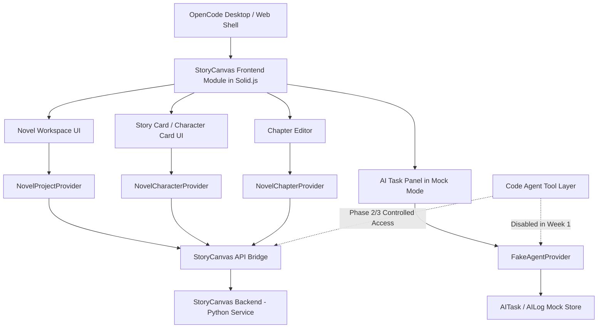
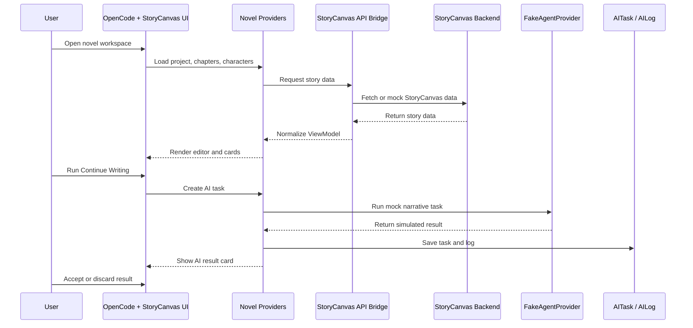

# StoryCanvas 与 OpenCode 集成架构调研报告（评审修订版）

**生成时间**：2026-05-15  
**修订版本**：v3.0（三层职责分离 + Week 1 Mock MVP）  
**分析目标**：评估 StoryCanvas 与 OpenCode 的轻量集成方案，聚焦 Week 1 Mock 原型验证

---

## 评审意见

本方案的"后端隔离 + 前端移植"方向成立，建议通过技术预研，并进入 Week 1 MVP Mock 验证阶段。

评审认为，StoryCanvas 后端不宜在当前阶段重写为 OpenCode 后端模块。更合理的方式是保留 StoryCanvas Python 后端作为独立叙事服务，通过 API Bridge 向 OpenCode 前端提供标准化数据。OpenCode 负责承载小说编辑器工作台、Provider 抽象、任务状态、日志系统和桌面端运行环境。

同时，代码智能体工具链不应在 Week 1 直接接入真实执行能力。Week 1 应仅使用 FakeAgentProvider 模拟 AI 续写、改写、摘要、角色语气改写、任务失败、任务取消、权限拒绝和配额不足等状态。

本方案当前不建议以"微前端 + 完整 API 网关"作为 MVP 的一阶段目标。MVP 阶段应降级为"OpenCode 内嵌 StoryCanvas 前端模块 + Provider 层 + StoryCanvas API Bridge + Mock Adapter"的轻量集成方案。待前端闭环、数据契约和 Mock 任务流验证通过后，再评估是否升级为微前端、WebSocket Bridge、生产鉴权和真实 Agent 工具接入。

综合判断：方案可行，但必须控制范围。建议 Week 1 只验证项目工作台、章节编辑器、故事卡/角色卡侧栏、AI Mock 任务面板、AI 结果卡片和 AI 日志抽屉，不迁移完整 Canvas，不接真实模型，不启用真实工具执行，不建设生产级网关。

---

## 一、核心策略：三层职责分离

### 1.1 架构定位

| 系统 | 推荐定位 | 一期是否接入 | 评审意见 |
|---|---|---:|---|
| **OpenCode** | 前端工作台、桌面壳、Provider/Tool/Session 基础设施 | 是 | 作为主承载平台 |
| **StoryCanvas** | 独立叙事后端、故事卡、剧情引擎、创作数据服务 | 是 | 保持 Python 后端隔离 |
| **代码智能体工具链** | 文件读写、任务执行、受控编辑、后续自动化能力 | 暂缓真实接入 | Week 1 只做 FakeAgentProvider |
| **API Bridge** | 前端适配层、接口映射、状态转换 | 是 | 一期重点实现 |
| **微前端/API 网关** | 复杂集成与部署治理 | 暂缓 | 不建议 MVP 阶段过早建设 |

### 1.2 核心策略对比

| 对比项 | 原策略（完全融合） | 当前策略（三层分离） |
|--------|------------------|-------------------|
| **后端** | Python → TypeScript 重写 | ✅ 保持 Python 独立 |
| **前端** | React → Solid.js 重写 | 🔄 选择性迁移（卡片/编辑器优先） |
| **架构** | Monorepo 融合 | MVP API Bridge + 长期微前端 |
| **AI 接入** | 直接接真实模型 | ✅ Week 1 使用 FakeAgentProvider |
| **代码工具链** | 直接接入 | ✅ 暂缓，Phase 2/3 受控接入 |
| **工作量** | ~7 周 | ✅ **~3 周（MVP）** |
| **复杂度** | 高 | ✅ 中 |

---

## 二、MVP 阶段目标架构



### 架构分层说明

| 层次 | 职责 | 说明 |
|------|------|------|
| **Presentation Layer** | OpenCode Shell + StoryCanvas UI 模块 | 小说工作台、故事卡、章节编辑器、AI 任务面板 |
| **Application Layer** | Novel Providers | Project/Chapter/Character/Agent/Log Provider |
| **Bridge Layer** | API Bridge + Mock Adapter | 数据契约转换、Mock 数据支持 |
| **Service Layer** | StoryCanvas Python Backend | 叙事引擎、故事卡 API、Pipeline |

---

## 三、融合度评估（评审修订版）

### 3.1 技术栈兼容性

| 模块 | StoryCanvas | OpenCode | 兼容性 | 融合策略 |
|------|-------------|----------|--------|----------|
| **前端框架** | React 18 | Solid.js | 🟡 中 | 选择性迁移 |
| **状态管理** | Zustand | TanStack Query | 🟢 高 | Provider + API |
| **数据库** | SQLite | SQLite (Drizzle) | 🟢 高 | 独立 |
| **后端语言** | Python + FastAPI | TypeScript + Hono | 🟢 高 | 独立 |
| **AI Provider** | 自实现 | @ai-sdk | 🟢 高 | FakeAgentProvider |
| **构建工具** | Vite | Vite + Turborepo | 🟢 高 | 复用 |

**融合度得分**：4.5 / 5（高）

### 3.2 功能模块对应关系

| StoryCanvas 模块 | OpenCode 对应模块 | 可复用度 | Week 1 建议 |
|-----------------|------------------|---------|-------------|
| Story Card UI | 新开发 | 🟡 中 | ✅ 优先迁移 |
| Chapter Editor | 新开发 | 🟡 中 | ✅ 优先迁移 |
| Canvas Editor | 新开发 | 🔴 高 | ❌ 暂缓 |
| ReactFlow | 无对应 | 🔴 高 | ❌ 暂缓 |
| Narrative Panel | Session UI | 🟢 高 | ✅ 复用布局 |
| Python Backend | - | ✅ 独立 | ✅ 保持不变 |
| LLM Integration | Provider System | 🟢 高 | ✅ FakeAgentProvider |

---

## 四、Week 1 前端迁移范围

### 4.1 迁移难度拆解

| 模块 | 迁移难度 | Week 1 建议 |
|---|---:|---|
| 普通表单 / 卡片 / 列表 | 低 | ✅ 可直接重写 |
| 故事卡 UI | 中 | ✅ 优先迁移 |
| 状态管理逻辑 | 中 | ✅ Zustand → Solid Store / Query |
| Canvas 编辑器 | 高 | ❌ 暂缓完整迁移 |
| ReactFlow 相关能力 | 高 | ❌ 先做静态原型 |
| 实时协同 / WebSocket | 高 | ❌ 暂缓 |

### 4.2 Week 1 MVP 交付物

**✅ 必须包含**：
- 项目工作台（Mock 数据）
- 章节编辑器
- 故事卡/角色卡侧栏
- AI Mock 任务面板
- AI 结果卡片
- AI 日志抽屉
- FakeAgentProvider
- Mock StoryCanvas API Adapter

**❌ 不包含**：
- 完整 Canvas 编辑器
- 完整 ReactFlow 迁移
- 真实模型调用
- 真实代码智能体工具执行
- 复杂 API Gateway
- 生产级鉴权
- 真实云同步
- 多 Agent 编排
- 插件市场
- 发布系统

---

## 五、API Bridge 设计

### 5.1 核心职责

1. **数据契约转换**：把 StoryCanvas 后端返回的数据转换成 OpenCode 前端可用的 ViewModel
2. **隐藏后端字段差异**：统一不同版本后端的接口差异
3. **统一错误格式**：标准化错误响应
4. **统一任务状态**：定义 AITask 状态机
5. **支持 Mock 数据切换**：通过配置切换 Mock/真实数据

### 5.2 数据契约定义

```typescript
// 核心业务对象
interface Project {
  id: string
  name: string
  description: string
  createdAt: Date
  updatedAt: Date
}

interface Chapter {
  id: string
  projectId: string
  title: string
  content: string
  order: number
  status: 'draft' | 'published' | 'archived'
  createdAt: Date
  updatedAt: Date
}

interface Character {
  id: string
  projectId: string
  name: string
  description: string
  avatar?: string
  traits: string[]
  createdAt: Date
}

interface StoryCard {
  id: string
  projectId: string
  type: 'character' | 'location' | 'event' | 'item'
  title: string
  content: string
  metadata: Record<string, unknown>
}

interface AITask {
  id: string
  projectId: string
  type: 'continue' | 'rewrite' | 'summary' | 'character_rewrite'
  status: 'pending' | 'running' | 'completed' | 'failed' | 'cancelled'
  input: Record<string, unknown>
  output?: string
  error?: string
  createdAt: Date
  completedAt?: Date
}

interface AILog {
  id: string
  taskId: string
  timestamp: Date
  level: 'info' | 'warn' | 'error'
  message: string
  metadata?: Record<string, unknown>
}
```

### 5.3 API Bridge 实现

```typescript
// packages/app/src/novel/api/storycanvas-bridge.ts

export class StoryCanvasAPIBridge {
  private baseUrl: string
  private useMock: boolean

  constructor(options: { baseUrl: string; useMock: boolean }) {
    this.baseUrl = options.baseUrl
    this.useMock = options.useMock
  }

  // 项目操作
  async getProjects(): Promise<Project[]> {
    if (this.useMock) {
      return this.getMockProjects()
    }
    const response = await fetch(`${this.baseUrl}/api/projects`)
    return response.json()
  }

  // 章节操作
  async getChapters(projectId: string): Promise<Chapter[]> {
    if (this.useMock) {
      return this.getMockChapters(projectId)
    }
    const response = await fetch(`${this.baseUrl}/api/projects/${projectId}/chapters`)
    return response.json()
  }

  async updateChapter(chapterId: string, content: string): Promise<Chapter> {
    if (this.useMock) {
      return this.updateMockChapter(chapterId, content)
    }
    const response = await fetch(`${this.baseUrl}/api/chapters/${chapterId}`, {
      method: 'PUT',
      body: JSON.stringify({ content }),
      headers: { 'Content-Type': 'application/json' }
    })
    return response.json()
  }

  // AI 任务操作
  async createAITask(input: {
    projectId: string
    type: AITask['type']
    context: Record<string, unknown>
  }): Promise<AITask> {
    if (this.useMock) {
      return this.createMockAITask(input)
    }
    const response = await fetch(`${this.baseUrl}/api/ai/tasks`, {
      method: 'POST',
      body: JSON.stringify(input),
      headers: { 'Content-Type': 'application/json' }
    })
    return response.json()
  }

  // Mock 数据生成
  private getMockProjects(): Project[] {
    return [
      {
        id: 'mock-project-1',
        name: '山海志异',
        description: '一部奇幻小说',
        createdAt: new Date('2024-01-01'),
        updatedAt: new Date()
      }
    ]
  }

  private getMockChapters(projectId: string): Chapter[] {
    return [
      {
        id: 'mock-chapter-1',
        projectId,
        title: '第一章：奇遇',
        content: '清晨的阳光透过窗户，洒在少年的脸上...',
        order: 1,
        status: 'draft',
        createdAt: new Date(),
        updatedAt: new Date()
      }
    ]
  }

  private updateMockChapter(chapterId: string, content: string): Chapter {
    return {
      id: chapterId,
      projectId: 'mock-project-1',
      title: '第一章：奇遇',
      content,
      order: 1,
      status: 'draft',
      createdAt: new Date(),
      updatedAt: new Date()
    }
  }

  private createMockAITask(input: {
    projectId: string
    type: AITask['type']
    context: Record<string, unknown>
  }): Promise<AITask> {
    return Promise.resolve({
      id: `mock-task-${Date.now()}`,
      projectId: input.projectId,
      type: input.type,
      status: 'completed',
      input: input.context,
      output: this.generateMockOutput(input.type),
      createdAt: new Date(),
      completedAt: new Date()
    })
  }

  private generateMockOutput(type: AITask['type']): string {
    const outputs: Record<AITask['type'], string> = {
      continue: '少年缓缓睁开眼睛，发现自己置身于一个陌生的房间...',
      rewrite: '改写后的章节内容...',
      summary: '本章主要讲述了主角的奇遇经历...',
      character_rewrite: '角色语气已调整为更生动的表达方式...'
    }
    return outputs[type] || '生成的内容...'
  }
}
```

---

## 六、FakeAgentProvider 设计

### 6.1 Agent 概念边界

为避免混淆，统一命名：

| 类型 | 名称 | 用途 | Week 1 接入 |
|------|------|------|-------------|
| 创作生成 | **Narrative AI** | 小说续写、改写、摘要、剧情建议 | ✅ FakeNarrativeAgentProvider |
| 任务执行 | **Workspace Agent** | OpenCode 内部任务抽象、会话、工具编排 | ❌ 暂缓 |
| 文件操作 | **Code Tool Agent** | 受控文件编辑、代码修改、自动化任务 | ❌ 暂缓 |

### 6.2 FakeAgentProvider 实现

```typescript
// packages/app/src/novel/provider/fake-agent-provider.ts

import type { AITask, AITaskType } from '../types'

export class FakeAgentProvider {
  private taskQueue: Map<string, AITask> = new Map()

  async executeTask(task: {
    type: AITaskType
    context: Record<string, unknown>
    projectId: string
  }): Promise<AITask> {
    const taskId = `task-${Date.now()}`
    
    // 创建任务
    const aiTask: AITask = {
      id: taskId,
      projectId: task.projectId,
      type: task.type,
      status: 'running',
      input: task.context,
      createdAt: new Date()
    }
    
    this.taskQueue.set(taskId, aiTask)
    
    // 模拟异步执行（1-3秒延迟）
    await new Promise(resolve => setTimeout(resolve, 1000 + Math.random() * 2000))
    
    // 模拟各种结果
    const result = this.generateResult(task.type)
    aiTask.status = result.status
    aiTask.output = result.output
    aiTask.error = result.error
    aiTask.completedAt = new Date()
    
    return aiTask
  }

  private generateResult(type: AITaskType): {
    status: AITask['status']
    output?: string
    error?: string
  } {
    // 模拟不同结果（80% 成功，20% 失败）
    const successRate = Math.random()
    
    if (successRate < 0.1) {
      // 10% 任务取消
      return { status: 'cancelled' }
    } else if (successRate < 0.2) {
      // 10% 任务失败
      return { 
        status: 'failed', 
        error: '模拟任务失败：网络超时' 
      }
    } else {
      // 80% 成功
      const outputs: Record<AITaskType, string> = {
        continue: '少年缓缓睁开眼睛，发现自己置身于一个陌生的房间。窗外传来奇怪的鸟鸣声，空气中弥漫着淡淡的花香...',
        rewrite: '清晨，第一缕阳光穿透薄雾，少年从沉睡中醒来。他环顾四周，发现自己躺在一张古木床上...',
        summary: '本章讲述了主角意外穿越到异世界的经历，结识了神秘的引路人，并了解到这个世界的基本规则。',
        character_rewrite: '【角色语气调整】将主角的性格从懦弱调整为勇敢果断，使其更符合英雄成长的叙事主线。'
      }
      return { status: 'completed', output: outputs[type] }
    }
  }

  getTask(taskId: string): AITask | undefined {
    return this.taskQueue.get(taskId)
  }

  listTasks(projectId: string): AITask[] {
    return Array.from(this.taskQueue.values())
      .filter(task => task.projectId === projectId)
      .sort((a, b) => b.createdAt.getTime() - a.createdAt.getTime())
  }
}
```

---

## 七、Week 1 MVP 产品闭环



### 通过标准

用户可以：
1. 打开一个 Mock 小说项目
2. 查看章节和角色
3. 触发 AI Mock 续写
4. 查看结果
5. 采纳或丢弃
6. 记录日志

---

## 八、风险评估

| 风险 | 等级 | 影响 | 建议 |
|---|---:|---|---|
| React → Solid.js 迁移低估 | 高 | UI 工期膨胀 | 先迁移卡片/列表/编辑器，暂缓 Canvas |
| API Bridge 未定义 | 高 | 前后端耦合严重 | Week 1 先出契约文档 |
| 三类 Agent 概念混淆 | 高 | 权限和职责不清 | 统一命名与边界 |
| 过早接真实模型 | 中高 | 干扰 MVP 验证 | Week 1 只用 FakeAgentProvider |
| 过早做微前端网关 | 中 | 基础设施过重 | 先用轻量 Bridge |
| Canvas 迁移复杂 | 高 | 卡住主线 | 先做静态故事卡和章节编辑 |
| StoryCanvas 后端接口不稳定 | 中 | 前端频繁修改 | 用 Adapter 隔离 |
| 代码工具层权限过大 | 高 | 安全和数据风险 | 沙箱、白名单、审计后再接 |

---

## 九、阶段路线建议

### Phase 0：当前评审修订（本阶段）

交付物：
- STORYCANVAS-OPENCODE-INTEGRATION-REPORT.md（本文件）
- WEEK1-STORYCANVAS-FRONTEND-MIGRATION-SCOPE.md
- WEEK1-STORYCANVAS-API-BRIDGE-CONTRACT.md

### Phase 1：Week 1 MVP 原型与 Mock 接入

交付物：
- 小说项目工作台
- 章节编辑器
- 故事卡/角色卡侧栏
- AI Mock 任务面板
- AI 结果卡片
- AI 日志抽屉
- FakeAgentProvider
- Mock StoryCanvas API Adapter

### Phase 2：StoryCanvas 后端 API 真实连通

通过标准：OpenCode 前端可以通过 API Bridge 读取 StoryCanvas 后端数据

### Phase 3：受控 AI 写作能力

通过标准：真实生成和 FakeAgentProvider 可以通过配置切换

### Phase 4：受控代码智能体工具层

通过标准：工具调用有白名单、沙箱路径、审计日志、回滚机制和用户确认

---

## 十、代码智能体工具层接入边界

| 阶段 | 接入方式 | 是否允许真实执行 | 说明 |
|---|---|---:|---|
| **Week 1** | FakeAgentProvider | 否 | 只模拟写作任务 |
| **Week 2** | 受控 Provider | 否/部分 | 只读 Mock 文件或内存数据 |
| **Week 3** | 沙箱文件读写 | 有限允许 | 只能读写小说项目目录 |
| **Week 4** | 工具执行白名单 | 谨慎允许 | 禁用命令执行和外部网络 |
| **后续** | 完整 Code Tool Agent | 需单独评审 | 必须有权限、审计、回滚 |

### 早期允许的能力

- 读取章节
- 读取角色卡
- 读取故事卡
- 生成建议
- 写入草稿区
- 保存 AI 日志

### 早期禁止的能力

- 执行 Bash
- 读取环境变量
- 访问系统目录
- 访问项目外路径
- 发起网络搜索
- 抓取网页
- 修改配置文件
- 自动提交 Git
- 调用真实外部工具

---

## 附录：文件迁移对照表

| StoryCanvas 文件 | 迁移目标 | Week 1 状态 |
|-----------------|----------|-------------|
| `frontend/src/components/StoryCard/` | `packages/app/src/novel/components/StoryCard/` | ✅ 优先迁移 |
| `frontend/src/components/ChapterEditor/` | `packages/app/src/novel/components/ChapterEditor/` | ✅ 优先迁移 |
| `frontend/src/components/NarrativePanel/` | `packages/app/src/novel/components/NarrativePanel/` | ✅ 优先迁移 |
| `frontend/src/components/Canvas/` | `packages/app/src/novel/components/Canvas/` | ❌ 暂缓 |
| `frontend/src/store/` | `packages/app/src/novel/context/` | ✅ 状态管理迁移 |
| `frontend/src/api/` | `packages/app/src/novel/api/` | ✅ API Bridge |
| `backend/` | 保持不变 | ✅ 独立 |

---

*本报告基于 StoryCanvas 和 OpenCode v1.4.0 源码分析生成*  
*修订版本 v3.0 - 三层职责分离 + Week 1 Mock MVP*  
*评审结论：通过预研，进入 Week 1 Mock MVP；不通过完整融合开发立项*
