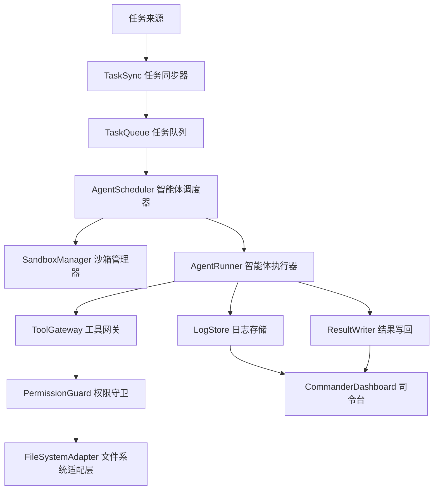
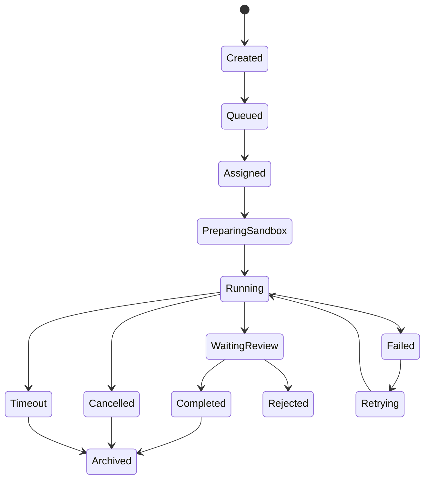

### **总体判断：方案方向有价值，但当前更像愿景清单，缺少边界、架构闭环、权限模型和可验收交付标准，暂不建议直接进入开发。**

基于你选中的设计方案来看，这个多智能体插件的目标覆盖了任务同步、沙箱隔离、智能体调度、持续运行、飞书集成、司令台界面、权限控制和生命周期钩子等方向，整体具备产品化潜力。但当前文档把大量高复杂度能力一次性列为“高优先级”，缺少 MVP 收敛、技术边界、失败处理、安全策略和可测试指标，容易导致实现失控。

### **评审结论**

建议结论为：**有条件通过方案方向评审，但不通过详细设计评审。**

当前方案可以作为“愿景版需求文档”保留，但不能直接作为研发执行依据。进入开发前，需要补充一版更工程化的设计文档，重点明确：系统边界、核心流程、数据结构、权限模型、任务状态机、沙箱隔离方式、异常恢复机制、MVP 范围和验收标准。

### **主要优点**

方案最有价值的地方在于，它抓住了多智能体自动化开发系统的几个关键问题：任务从哪里来、任务如何分配、智能体如何隔离、结果如何追踪、过程如何可视化、产物如何版本化。这些方向是成立的，尤其是“任务同步”“沙箱管理”“文件权限管理”“任务状态追踪”“司令台界面”几项，确实构成了一个多智能体开发平台的核心骨架。

另一个优点是方案意识到了“规则约束”和“输出标准化”的重要性。多智能体系统最容易失控的地方，不是单个任务做不出来，而是多个任务同时运行后，产物不可追踪、权限边界不清、错误难以归因。因此，把规则、skill、Git 版本管理、任务生命周期钩子放进设计里，是正确方向。

此外，“每日进度汇报”“飞书任务查看”“司令台界面”这些功能说明该方案不只是做一个后台执行器，而是希望形成面向团队协作的管理界面。这对长期产品化是有价值的。

### **核心问题一：范围过大，MVP 不清晰**

当前最大问题是功能范围明显过大。文档中几乎所有核心功能都标为“高优先级”，包括任务同步、沙箱管理、智能体分配、模型能力利用、规则约束、任务拆解、文件权限、插件设置、钩子系统、自动化触发、司令台、动画人物、24/7 运行、飞书查看、每日汇报等。

这些能力每一项都可以独立成为一个子系统。全部放入第一阶段，会导致项目无法按期收敛，也难以定义“第一个可用版本”的边界。

建议将 MVP 收敛为四个最小闭环：**任务读取、单任务沙箱、单智能体执行、结果回写与日志记录**。只有这个闭环跑通后，再逐步扩展多智能体调度、司令台、飞书集成、每日汇报和动画展示。

建议把当前功能重新分层：

| 层级 | 建议范围 | 说明 |
|---|---|---|
| P0 | 任务同步、单任务沙箱、单智能体执行、日志记录、权限白名单 | 构成最小可用闭环 |
| P1 | 多智能体调度、任务队列、失败重试、司令台基础状态展示 | 构成可管理系统 |
| P2 | 飞书集成、每日汇报、插件设置页、生命周期钩子 | 构成团队协作能力 |
| P3 | 智能体动画、复杂协作、长期 24/7 运行优化 | 产品体验增强 |

### **核心问题二：缺少系统架构边界**

文档目前描述了很多目标，但没有说明系统由哪些模块组成、模块之间如何通信、哪些运行在插件侧、哪些运行在后台服务侧、哪些依赖本地文件系统、哪些依赖外部工具。

建议补充一张架构分层图，至少明确以下模块：



建议在详细设计中明确每个模块的职责。例如 TaskSync 只负责读取任务，不负责执行；AgentScheduler 只负责分配任务，不直接操作文件；ToolGateway 只暴露白名单工具；PermissionGuard 负责路径、命令、环境变量和网络访问限制；AgentRunner 负责执行状态流转和日志落盘。

### **核心问题三：权限与沙箱设计描述不足**

方案提到“文件独立权限”“任务间互不干扰”“沙箱管理”，但没有定义权限边界。对于多智能体系统，这是最高风险点之一。

至少需要明确以下规则：

每个任务必须绑定唯一 sandboxId，智能体只能访问该沙箱目录。所有文件读写必须经过统一的 FileSystemAdapter，禁止智能体直接访问任意绝对路径。工具调用需要通过 ToolGateway 白名单，不允许默认开放命令执行、系统环境变量读取、全局目录扫描、网络请求和凭据文件读取。

尤其需要补充“禁止项”。当前方案只写了要实现权限，但没有写哪些行为明确禁止。建议加入类似规则：

| 权限项 | 默认策略 | 说明 |
|---|---|---|
| 读取项目目录 | 允许 | 仅限当前任务沙箱 |
| 写入项目目录 | 允许 | 仅限当前任务沙箱 |
| 读取系统目录 | 禁止 | 如用户目录、系统配置目录等 |
| 读取环境变量 | 禁止 | 避免泄露密钥 |
| 执行任意命令 | 默认禁止 | 仅允许白名单命令 |
| 访问网络 | 默认禁止 | 需单独授权 |
| 修改 Git 主分支 | 禁止 | 必须通过任务分支或沙箱 |
| 跨任务读写文件 | 禁止 | 防止任务间污染 |

这一部分建议作为 P0 的强制设计项，而不是后续增强项。

### **核心问题四：任务状态机缺失**

当前文档提到任务同步、任务追踪、每日汇报，但没有定义任务状态流转。没有状态机，多智能体系统很难处理失败、取消、重试、超时和恢复。

建议至少定义 Task 状态机：



建议每个状态都定义进入条件、退出条件、可执行操作和日志要求。例如 Running 状态必须持续写入心跳；Cancelled 后禁止继续写文件；Failed 必须记录失败原因、最后一次工具调用和可重试标识；Completed 必须产出标准化任务报告。

### **核心问题五：多智能体协作没有定义通信机制**

方案中写到“多智能体协作”，但没有说明智能体之间如何通信、是否共享上下文、是否允许互相读写文件、是否有主从关系、是否有仲裁机制。

建议不要在 MVP 中实现复杂多智能体协作。第一阶段只做“多任务多实例并行”，而不是“多个智能体共同完成一个任务”。这两个概念复杂度完全不同。

建议拆分为：

“多智能体并行”是 P1，表示多个任务可以同时运行，每个任务一个独立智能体。

“多智能体协作”是 P2 或 P3，表示一个任务可以拆成多个子任务，由多个智能体分工处理，并通过协调器合并结果。

如果要做协作，需要增加 Coordinator 角色，负责拆解、分派、合并、冲突解决和最终验收。否则多个智能体直接协作会带来上下文污染和文件冲突。

### **核心问题六：结果标准化不足**

文档中提到“输出结果标准化”，但没有定义标准格式。建议每个任务执行结束后，都必须生成结构化报告，而不是只依赖自然语言总结。

建议标准化产物包括：

```markdown
# Task Report

## 基本信息
- taskId:
- agentId:
- sandboxId:
- startedAt:
- finishedAt:
- status:

## 用户目标
原始任务描述。

## 执行摘要
本次完成了什么。

## 修改文件
- path:
  - changeType:
  - reason:

## 工具调用记录
- toolName:
- inputSummary:
- outputSummary:
- status:

## 风险与遗留问题
列出未完成项、潜在风险和需要人工确认的内容。

## 验收建议
说明如何验证本任务是否完成。
```

同时建议机器可读数据使用 JSON 存储，Markdown 只作为人类查看版本。

### **核心问题七：“24/7 持续运行”风险被低估**

“24/7 智能体运行”是一个非常高风险能力，不应直接标为早期高优先级。长期后台运行会带来任务失控、资源泄露、重复执行、写入冲突、凭据泄露、网络异常、模型调用超额、日志膨胀等问题。

建议将 24/7 改成“可控后台任务队列”。早期只允许用户手动启动、暂停、取消任务。后续再加入调度策略，例如每日定时巡检、失败重试、空闲时执行低优先级任务等。

对于持续运行，必须补充以下机制：

任务锁，防止同一任务被重复执行；心跳检测，识别卡死任务；超时机制，超过上限自动取消；配额机制，限制每日任务数和调用成本；熔断机制，连续失败后停止调度；审计日志，记录所有关键操作。

### **核心问题八：飞书集成应后置**

飞书任务管理和每日汇报对团队使用有价值，但它不是核心执行闭环的一部分。过早接入外部协作系统，会把复杂度从本地插件扩展到身份认证、消息格式、权限、失败重发和外部 API 限流。

建议第一阶段只定义 NotificationAdapter 接口，不直接绑定具体平台。后续可以实现 FeishuNotificationProvider、WebhookNotificationProvider、LocalNotificationProvider 等。

接口层可以先设计为：

```ts
interface NotificationProvider {
  sendTaskAssigned(event: TaskAssignedEvent): Promise<void>
  sendTaskCompleted(event: TaskCompletedEvent): Promise<void>
  sendDailyReport(report: DailyReport): Promise<void>
}
```

这样既保留扩展性，也避免 MVP 被外部集成拖慢。

### **核心问题九：插件设置页不应先于核心能力**

插件设置页被列为高优先级，但在系统能力未稳定前，设置项很容易反复变化。建议早期使用配置文件或默认配置，等任务队列、沙箱、权限、日志和智能体执行稳定后，再做可视化设置页。

第一阶段建议只保留最小配置：

| 配置项 | 说明 |
|---|---|
| workspaceRoot | 工作区根目录 |
| sandboxRoot | 沙箱根目录 |
| maxConcurrentTasks | 最大并发任务数 |
| allowedTools | 工具白名单 |
| taskTimeoutMs | 单任务超时时间 |
| logLevel | 日志级别 |

### **核心问题十：缺少测试策略**

当前方案没有明确测试设计。对于这种自动化执行系统，测试不应只覆盖 UI，还必须覆盖权限、沙箱、状态机和异常恢复。

建议补充以下测试类型：

| 测试类型 | 覆盖内容 |
|---|---|
| 单元测试 | 状态机、权限判断、路径校验、任务解析 |
| 集成测试 | 任务同步到执行完成的完整链路 |
| 沙箱测试 | 不同任务是否互相隔离 |
| 权限测试 | 是否能阻止越权读取、越权写入、危险命令 |
| 失败恢复测试 | 中断、超时、取消、重试 |
| 并发测试 | 多任务同时执行是否冲突 |
| 回归测试 | 固定任务输入是否生成稳定报告 |

其中权限测试和沙箱测试应作为 P0 阶段的硬性验收项。

### **具体修改建议**

建议将“白嫖内置大模型能力”改成更正式、合规的表述，例如“复用 IDE 内置模型能力”或“通过合规接口调用已有模型能力”。原表述不适合作为正式设计文档用语，也容易引发合规和维护问题。

建议将“智能体动画展示”从核心功能中移出，放入体验增强模块。动画形象对演示有帮助，但不应和任务执行、权限隔离、日志追踪处于同一优先级。

建议将“基于外部编码助手工作流模式管理任务执行”改成更中性的“借鉴成熟 Agent 工作流模式管理任务执行”，避免方案过度绑定某个特定实现。

建议将“多智能体协作”拆成两个阶段：第一阶段只做“多任务并行执行”，第二阶段再做“单任务多智能体协作”。

建议增加“不可做事项”章节，明确系统禁止访问敏感路径、禁止跨沙箱写入、禁止默认执行任意命令、禁止在任务取消后继续写入、禁止无日志的文件修改。

### **建议补充的详细设计目录**

建议下一版设计文档按下面结构重写：

```markdown
# 多智能体插件详细设计文档

## 1. 目标与非目标
## 2. MVP 范围
## 3. 系统架构
## 4. 核心模块设计
### 4.1 TaskSync
### 4.2 TaskQueue
### 4.3 AgentScheduler
### 4.4 SandboxManager
### 4.5 AgentRunner
### 4.6 ToolGateway
### 4.7 PermissionGuard
### 4.8 LogStore
### 4.9 CommanderDashboard

## 5. 数据结构
## 6. 任务状态机
## 7. 权限与沙箱模型
## 8. 工具白名单设计
## 9. 日志与审计
## 10. 异常处理与恢复
## 11. 并发与锁机制
## 12. 配置项
## 13. 测试策略
## 14. 分阶段交付计划
## 15. 验收标准
```

### **建议的 P0 版本验收标准**

P0 不建议追求“完整多智能体平台”，而是先交付一个可验证的最小系统。建议 P0 验收标准如下：

系统能够从任务列表读取一个任务，并为该任务创建独立沙箱；系统能够启动一个智能体实例处理该任务；智能体只能访问当前沙箱内文件；所有文件读写都有日志；任务执行过程有明确状态变化；任务完成后生成标准化报告；任务失败时能记录错误并停止写入；用户可以在司令台看到任务状态、日志和产物摘要。

权限方面，P0 必须验证智能体无法读取沙箱外文件，无法读取环境变量，无法执行未授权命令，无法在任务取消后继续修改文件。

### **最终评审意见**

该方案的产品方向成立，适合继续推进。但当前文档更偏“愿景与功能清单”，还不具备直接开发所需的工程细节。建议先冻结愿景，重写一版 MVP 详细设计，把第一阶段目标收敛到“任务同步 → 沙箱创建 → 单智能体执行 → 权限控制 → 日志报告 → 人工验收”这一条主链路。

在补齐系统架构、权限沙箱、任务状态机、工具白名单、日志审计、异常恢复和测试策略之前，不建议直接进入大规模编码。当前最优先要做的不是增加更多功能，而是降低系统复杂度，建立一个可控、可测、可恢复的最小闭环。

*内容由 AI 生成仅供参考*