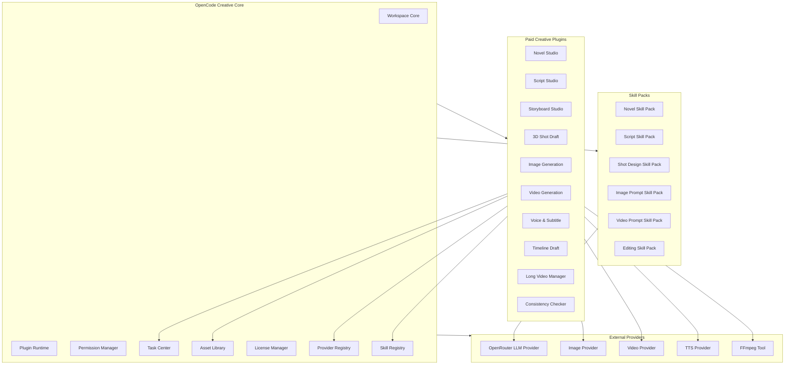
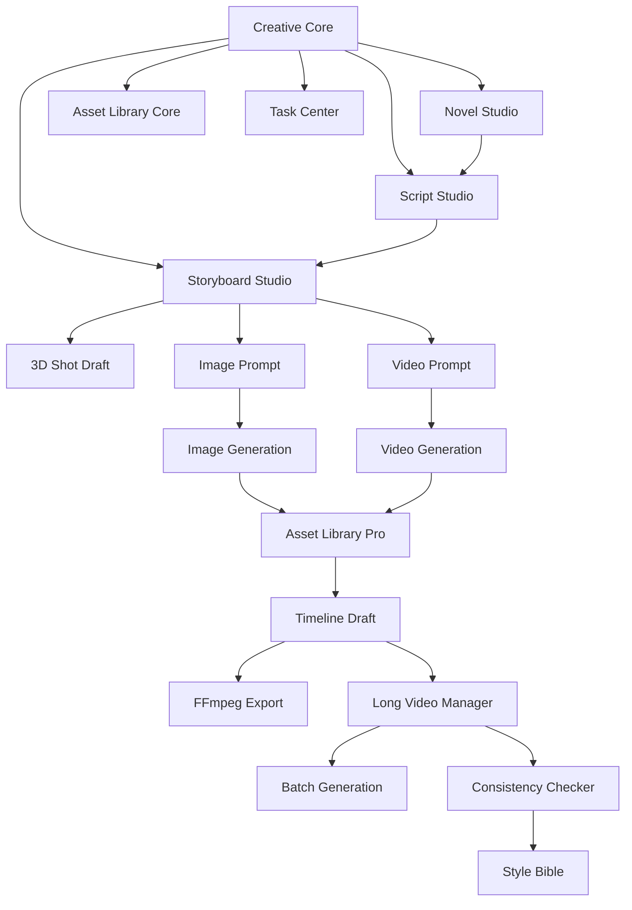

### **建议把项目重构为“OpenCode Creative Studio 插件平台”：核心底座免费/基础授权，小说、剧本、分镜、3D 草稿、图像生成、视频生成、剪辑、长视频管理等能力全部做成可独立安装、独立付费、独立迭代的插件。**

新的 Roadmap 不再按“一个大平台一次性开发”推进，而是按 **Core Platform + Paid Plugin Modules + Skill Packs + Provider Credits** 推进。这样可以降低开发风险，也能更早商业化：先卖单模块，例如“小说创作插件”“3D 分镜草稿插件”“短视频素材包插件”，再逐步组合成长视频完整生产流。

---

## **一、项目新定位**

项目建议正式定位为：

```text
OpenCode Creative Studio
基于 OpenCode 二次开发的 AI 创作插件平台
```

一句话定义：

```text
一个从小说、剧本、分镜、3D 草稿到短视频/长视频生产的模块化 AI 创作工作台。
```

产品不再是一个臃肿的“全功能创作平台”，而是一个插件化生态：

```text
OpenCode Core
  + Novel Plugin
  + Script Plugin
  + Storyboard Plugin
  + 3D Shot Draft Plugin
  + Image Generation Plugin
  + Video Generation Plugin
  + Voice & Subtitle Plugin
  + Timeline Editing Plugin
  + Long Video Manager Plugin
  + Consistency Checker Plugin
  + Skill Packs
  + Provider Packs
```

核心原则是：

```text
底座统一
模块独立
能力可插拔
按模块付费
按生成消耗计费
按项目规模升级
```

---

## **二、商业模式调整：从“卖平台”改为“卖插件 + 卖工作流 + 卖生成额度”**

### **1. 免费/基础层**

基础层只提供最小工作台能力，目的是让用户能进入生态。

| 模块 | 是否付费 | 说明 |
|---|---:|---|
| Workspace Core | 免费/基础授权 | 项目、文件、任务、资产基础管理 |
| Plugin Runtime | 免费 | 插件加载、扩展点、权限系统 |
| Mock Provider | 免费 | 用于试用和演示 |
| Basic Asset Library | 免费 | 基础资产管理 |
| Basic Task Center | 免费 | 本地任务状态和日志 |

### **2. 单模块付费层**

每个创作环节做成独立付费插件。

| 插件 | 付费方式 | 核心价值 |
|---|---|---|
| Novel Studio Plugin | 单模块购买 / 订阅 | 小说、角色、世界观、章节 |
| Script Studio Plugin | 单模块购买 / 订阅 | 小说转剧本、对白、动作行 |
| Storyboard Studio Plugin | 单模块购买 / 订阅 | 剧本转分镜、镜头卡 |
| 3D Shot Draft Plugin | 单模块购买 / 订阅 | Three.js 3D 镜头草稿 |
| Image Prompt Plugin | 单模块购买 / 订阅 | 图像提示词与参考图 |
| Image Generation Plugin | 订阅 + 额度 | 接入图像生成 Provider |
| Video Prompt Plugin | 单模块购买 / 订阅 | 视频提示词、镜头运动 |
| Video Generation Plugin | 订阅 + 额度 | 接入视频生成 Provider |
| Voice & Subtitle Plugin | 单模块购买 / 额度 | 旁白、字幕、TTS |
| Timeline Draft Plugin | 单模块购买 | 短片时间线、FFmpeg 合成 |
| Long Video Manager Plugin | 高级订阅 | 长视频项目、批量任务 |
| Consistency Plugin | 高级订阅 | 角色/风格/剧情一致性 |
| Team Collaboration Plugin | 团队订阅 | 多人协作、权限、审阅 |

### **3. 组合包**

为了提升客单价，可以设计组合包。

| 套餐 | 包含模块 | 目标用户 |
|---|---|---|
| Writer Pack | Novel + Script | 小说作者、网文作者 |
| Visual Story Pack | Script + Storyboard + Image Prompt | 分镜师、短视频策划 |
| Short Video Pack | Storyboard + Image + Video + Subtitle + Timeline | 短视频创作者 |
| 3D Director Pack | Storyboard + 3D Shot Draft + Camera Tools | 分镜导演、AI 视觉策划 |
| Long Video Pack | 全部核心插件 + Consistency + Long Video Manager | 动画团队、IP 内容团队 |
| Team Studio Pack | Long Video Pack + Collaboration + Cost Dashboard | 小团队/工作室 |

### **4. 生成额度**

LLM、图像、视频、TTS 都不应该直接混入插件售价，而应作为额度或 Provider 成本单独管理。

```text
插件费 = 功能使用权
生成额度 = 模型/接口消耗
Skill Pack = 高级提示词/工作流模板
```

这样商业结构更清晰。

---

## **三、插件化总体架构**



核心底座只负责：

```text
插件加载
权限控制
任务调度
资产管理
License 校验
Provider 注册
Skill 注册
日志审计
项目文件结构
```

每个插件自己负责：

```text
页面
数据模型
命令
任务类型
Skill 调用
资产类型
导出格式
付费权限
```

---

## **四、插件运行时设计**

### **1. 插件 Manifest**

每个插件必须有独立 manifest，用于声明能力、权限、价格、入口和依赖。

```typescript
type CreativePluginManifest = {
  id: string
  name: string
  version: string
  description: string
  category:
    | 'story'
    | 'script'
    | 'storyboard'
    | '3d'
    | 'image'
    | 'video'
    | 'audio'
    | 'editing'
    | 'workflow'
    | 'team'

  pricing: {
    model: 'free' | 'one_time' | 'subscription' | 'credits' | 'bundle'
    sku: string
    trialDays?: number
  }

  dependencies: {
    coreVersion: string
    plugins?: string[]
    providers?: string[]
    skills?: string[]
  }

  permissions: {
    fileRead?: boolean
    fileWrite?: boolean
    assetRead?: boolean
    assetWrite?: boolean
    taskCreate?: boolean
    providerUse?: string[]
    networkAccess?: boolean
    ffmpegAccess?: boolean
  }

  extensionPoints: {
    pages?: string[]
    panels?: string[]
    commands?: string[]
    assetTypes?: string[]
    taskTypes?: string[]
    skills?: string[]
    providers?: string[]
  }
}
```

### **2. 插件扩展点**

OpenCode Core 需要提供稳定扩展点。

| 扩展点 | 用途 |
|---|---|
| `workspace.page` | 注册新页面 |
| `workspace.panel` | 注册侧栏/右栏面板 |
| `command.palette` | 注册命令 |
| `asset.type` | 注册资产类型 |
| `task.type` | 注册任务类型 |
| `skill.type` | 注册 Skill |
| `provider.type` | 注册 Provider |
| `export.format` | 注册导出格式 |
| `settings.section` | 注册设置页面 |
| `license.feature` | 注册付费功能点 |

### **3. License Gate**

每个插件能力都要经过 License Gate。

```typescript
type LicenseGateResult = {
  allowed: boolean
  reason?: 'not_installed' | 'trial_expired' | 'license_missing' | 'quota_exceeded'
  upgradeUrl?: string
}
```

插件 UI 必须支持：

```text
未安装
试用中
已购买
已过期
额度不足
需要升级套餐
```

---

## **五、两年插件化 Roadmap**

时间从 **2026-05-15** 开始，规划到 **2028-05**。

### **阶段总览**

| 阶段 | 时间 | 核心目标 | 商业目标 |
|---|---|---|---|
| Phase 0 | 2026.05-2026.06 | 插件底座与项目路书 | 确定商业架构 |
| Phase 1 | 2026.06-2026.08 | Story-to-Shot MVP | 内测 Writer Pack |
| Phase 2 | 2026.09-2026.11 | 分镜 + 3D Shot Draft | 推出 Visual Story Pack |
| Phase 3 | 2026.12-2027.02 | 图像/视频 Prompt 与资产库 | 推出 Short Video Pack Alpha |
| Phase 4 | 2027.03-2027.05 | 图像/视频 Provider 接入 | 生成额度计费 |
| Phase 5 | 2027.06-2027.08 | 短片时间线与 FFmpeg 合成 | Short Video Pack 正式版 |
| Phase 6 | 2027.09-2027.11 | 长视频项目管理 | Long Video Pack Beta |
| Phase 7 | 2027.12-2028.02 | 一致性系统与批量生产 | Studio Pack |
| Phase 8 | 2028.03-2028.05 | 插件市场与团队协作 | 商业化 v2.0 |

---

# **Phase 0：插件底座与项目路书，2026.05-2026.06**

## **目标**

先不做业务大而全，先把插件化开发的地基确定下来。

必须完成：

```text
Plugin Runtime
Plugin Manifest
License Manager Mock
Provider Registry
Skill Registry
Task Center Core
Asset Library Core
Workspace Extension Points
```

## **交付物**

| 交付物 | 说明 |
|---|---|
| `PLUGIN-ARCHITECTURE.md` | 插件系统架构 |
| `PLUGIN-MANIFEST-SPEC.md` | 插件声明格式 |
| `LICENSE-GATE-SPEC.md` | 单模块付费权限模型 |
| `SKILL-REGISTRY-SPEC.md` | Skill 注册与调用规范 |
| `PROVIDER-REGISTRY-SPEC.md` | OpenRouter/图像/视频 Provider 规范 |
| `TASK-CENTER-SPEC.md` | 所有生成任务统一进入任务中心 |
| `ASSET-LIBRARY-SPEC.md` | 资产对象、版本、来源、引用关系 |

## **验收标准**

```text
能加载一个 Mock 插件
能在工作台注册一个页面
能在命令面板注册一个命令
能创建一个 Mock 任务
能写入一个 Mock 资产
能判断插件是否已授权
能显示“未购买/试用/已购买/过期”
```

## **商业验证**

这一阶段不收费，但必须把付费点埋好。

```text
每个插件都有 SKU
每个功能有 feature flag
每个生成任务有 cost metadata
每个 Provider 有 quota metadata
```

---

# **Phase 1：Story-to-Shot MVP，2026.06-2026.08**

## **目标**

完成从故事到镜头的最小闭环，形成第一个可演示产品。

## **插件范围**

### **1. Novel Studio Plugin**

功能：

```text
项目设定
世界观
角色卡
章节大纲
章节正文
AI 续写 Mock
AI 改写 Mock
AI 摘要 Mock
```

### **2. Script Studio Plugin**

功能：

```text
章节转剧本场景
场景头
动作行
对白
旁白
场景摘要
```

### **3. Storyboard Studio Plugin Alpha**

功能：

```text
剧本场景转 Shot 卡
景别
机位
镜头运动
情绪目标
图像 prompt 草稿
```

## **Skill**

```text
NovelSkill
ScriptConvertSkill
StoryboardGenerateSkill
```

先接 OpenRouter 的文本模型，但必须保留 Mock 模式。

## **验收标准**

```text
输入一个故事概念
生成 3 个角色
生成 1 个章节大纲
生成 3 个剧本场景
每个场景生成 3 个 Shot
每个 Shot 有镜头描述和 prompt 草稿
所有任务进入 Task Center
所有产物进入 Asset Library
```

## **商业版本**

```text
Writer Pack 内测版
包含 Novel Studio + Script Studio
Storyboard Alpha 免费试用
```

---

# **Phase 2：分镜 + 3D Shot Draft，2026.09-2026.11**

## **目标**

让用户能把分镜变成 3D 构图草稿。

## **新增插件**

### **1. 3D Shot Draft Plugin**

核心功能：

```text
Three.js 3D 视口
地面网格
方位轴
透视相机
OrbitControls
TransformControls
基础几何体：圆柱、方块、球体、平面、墙体
角色占位
相机预设
导出当前视角 PNG
保存 Shot3DDraft
```

### **2. Shot Camera Plugin**

可以并入 3D Shot Draft，也可以独立收费。

功能：

```text
相机位置
相机目标
FOV
景别模板
镜头运动模板
Godot 风格 Perspective View
镜头参考图导出
```

## **验收标准**

```text
每个 Shot 能打开 3D 草稿
能生成圆柱/方块/角色占位
能旋转、平移、缩放视角
能移动物体
能调整相机
能导出当前视角参考图
参考图自动进入 Asset Library
```

## **商业版本**

```text
Visual Story Pack
= Storyboard Studio + 3D Shot Draft + Shot Camera
```

这是第一批可以明确单独收费的模块。

---

# **Phase 3：图像/视频 Prompt 与资产库，2026.12-2027.02**

## **目标**

把分镜和 3D 草稿转成图像/视频生成资产包。

## **新增插件**

### **1. Image Prompt Plugin**

功能：

```text
Shot → 图像 prompt
角色视觉描述
场景视觉描述
风格模板
负面 prompt
参考图绑定
Prompt 版本管理
```

### **2. Video Prompt Plugin**

功能：

```text
Shot → 视频 prompt
镜头运动描述
角色动作描述
时长
帧率建议
运动强度
视频生成参数
```

### **3. Asset Library Pro Plugin**

功能：

```text
资产标签
版本管理
引用关系
Shot 绑定
Prompt 绑定
参考图绑定
批量导出
```

## **验收标准**

```text
每个 Shot 能生成图像 prompt
每个 Shot 能生成视频 prompt
每个 prompt 有版本
每个 prompt 能绑定参考图
资产库能按项目/场景/Shot 筛选
```

## **商业版本**

```text
Short Video Pack Alpha
= Storyboard + Image Prompt + Video Prompt + Asset Library Pro
```

---

# **Phase 4：图像/视频 Provider 接入，2027.03-2027.05**

## **目标**

开始接入真实图像/视频生成服务，但仍通过 Provider 抽象和任务中心管理。

## **新增插件**

### **1. Image Generation Plugin**

功能：

```text
图像 Provider 注册
生成任务
候选图
失败重试
成本记录
结果入库
```

### **2. Video Generation Plugin**

功能：

```text
视频 Provider 注册
Shot 视频生成
候选视频
失败重试
任务队列
结果入库
```

## **Provider 设计**

```text
ImageGenerationProvider
VideoGenerationProvider
OpenRouterTextProvider
TTSProvider
```

Provider 必须统一：

```text
输入 schema
输出 schema
错误 schema
成本 metadata
任务状态
日志
```

## **验收标准**

```text
能对一个 Shot 生成候选图
能把候选图保存到资产库
能对一个 Shot 创建视频生成任务
能查看任务状态
失败任务可重试
生成成本可记录
```

## **商业模式**

```text
插件订阅 + 生成额度
```

也就是：

```text
Image Generation Plugin 收功能费
图像生成消耗走额度
Video Generation Plugin 收功能费
视频生成消耗走额度
```

---

# **Phase 5：短片时间线与 FFmpeg 合成，2027.06-2027.08**

## **目标**

把多个镜头素材组织成 30-90 秒短片草稿。

## **新增插件**

### **1. Timeline Draft Plugin**

功能：

```text
镜头排序
时长设置
图片/视频片段放入时间线
字幕轨
旁白轨
背景音乐占位
转场标记
预览草稿
```

### **2. FFmpeg Export Plugin**

功能：

```text
图片序列合成
视频片段拼接
字幕烧录
音频合成
导出 mp4
导出日志
```

## **验收标准**

```text
能把 5-10 个 Shot 片段放入时间线
能设置每个片段时长
能生成字幕
能添加旁白音频或占位
能导出 30-90 秒 mp4 草稿
```

## **商业版本**

```text
Short Video Pack 正式版
= Storyboard + Image/Video Prompt + Image/Video Generation + Timeline + FFmpeg Export
```

这是第一个完整商业包。

---

# **Phase 6：长视频项目管理，2027.09-2027.11**

## **目标**

从短片扩展到长视频生产管理，但不追求全自动成片。

## **新增插件**

### **1. Long Video Manager Plugin**

功能：

```text
长视频项目
章节
场景
镜头
素材完成度
批量任务
进度看板
版本管理
```

### **2. Batch Generation Plugin**

功能：

```text
批量生成 Shot
批量生成 prompt
批量提交图像任务
批量提交视频任务
批量重试
批量导出
```

## **验收标准**

```text
能创建 10-30 分钟视频项目
能拆成章节/场景/镜头
能查看每个场景完成度
能批量生成 prompt
能批量提交生成任务
能查看批量任务状态
```

## **商业版本**

```text
Long Video Pack Beta
= Long Video Manager + Batch Generation + Asset Library Pro
```

---

# **Phase 7：一致性系统与半自动生产，2027.12-2028.02**

## **目标**

解决长视频最核心的角色一致性、风格一致性、剧情连续性。

## **新增插件**

### **1. Consistency Checker Plugin**

功能：

```text
角色一致性检查
场景一致性检查
风格一致性检查
剧情连续性检查
Prompt 差异检查
资产差异检查
```

### **2. Style Bible Plugin**

功能：

```text
角色视觉圣经
场景视觉圣经
镜头语言模板
色彩风格模板
Prompt 锁定字段
参考图管理
```

### **3. Human Review Gate Plugin**

功能：

```text
人工审核节点
通过/驳回
修订建议
版本对比
批量确认
```

## **验收标准**

```text
系统能检查同一角色在多个 Shot 中的描述差异
系统能检查同一场景风格偏移
系统能输出一致性风险报告
批量生产流程中可以插入人工确认
```

## **商业版本**

```text
Studio Pack
= Long Video Pack + Consistency + Style Bible + Human Review Gate
```

---

# **Phase 8：插件市场、团队协作与商业化 v2.0，2028.03-2028.05**

## **目标**

把产品从单机/小团队工具升级为可商业化平台。

## **新增插件**

### **1. Team Collaboration Plugin**

功能：

```text
团队工作区
角色权限
评论
审阅
任务分配
版本审批
```

### **2. Plugin Marketplace**

功能：

```text
插件安装
插件更新
插件购买
Skill Pack 购买
模板购买
License 管理
```

### **3. Publishing Pack Plugin**

功能：

```text
短视频标题
简介
标签
封面文案
发布素材包
平台格式检查
```

## **验收标准**

```text
用户能按模块购买插件
用户能安装/卸载插件
团队能协作审阅项目
项目能导出完整发布包
系统能统计插件使用和生成成本
```

## **商业版本**

```text
Creative Production Studio v2.0
```

---

## **六、插件付费优先级**

建议按商业价值和开发难度排序。

| 优先级 | 插件 | 原因 |
|---|---|---|
| P0 | Novel Studio | 用户入口，开发可控 |
| P0 | Storyboard Studio | 连接文本和视频的关键 |
| P0 | 3D Shot Draft | 差异化强，视觉价值高 |
| P0 | Image Prompt Plugin | 立刻服务图像生成 |
| P1 | Image Generation Plugin | 可以产生额度收入 |
| P1 | Video Prompt Plugin | 短视频核心 |
| P1 | Asset Library Pro | 所有生成资产都依赖 |
| P2 | Video Generation Plugin | 成本高但价值大 |
| P2 | Timeline Draft | 短片闭环 |
| P2 | Long Video Manager | 第二年重点 |
| P3 | Consistency Checker | 高级用户付费能力 |
| P3 | Team Collaboration | 团队版商业化 |

第一批付费插件建议是：

```text
Novel Studio
Storyboard Studio
3D Shot Draft
Image Prompt Plugin
```

因为它们不依赖昂贵的视频生成接口，能尽快做出可卖的生产力工具。

---

## **七、插件依赖关系**



这个依赖关系有一个好处：用户可以按需购买，不会被迫买完整平台。

例如：

```text
小说作者只买 Novel Studio + Script Studio
分镜师只买 Storyboard + 3D Shot Draft
短视频创作者买 Short Video Pack
工作室买 Long Video Pack + Consistency
```

---

## **八、单模块付费策略**

### **建议价格结构**

这里不直接定最终价格，但建议分层：

| 类型 | 价格策略 |
|---|---|
| 基础插件 | 低价一次性 / 低价订阅 |
| 专业插件 | 中价订阅 |
| 生成插件 | 订阅 + 额度 |
| 团队插件 | 按席位订阅 |
| Skill Pack | 单独购买 |
| 模板包 | 单独购买 |
| Provider 额度 | 按量充值 |

### **适合一次性购买的模块**

```text
Novel Studio
Script Studio
Storyboard Studio
3D Shot Draft
Timeline Draft
```

### **适合订阅的模块**

```text
Image Generation
Video Generation
Long Video Manager
Consistency Checker
Team Collaboration
```

### **适合额度制的能力**

```text
LLM 调用
图像生成
视频生成
TTS
字幕识别
大规模批量任务
```

---

## **九、项目文件与插件目录建议**

建议项目结构这样设计：

```text
caiode/
├── packages/
│   ├── app/
│   │   └── src/
│   │       ├── core/
│   │       │   ├── plugin-runtime/
│   │       │   ├── license/
│   │       │   ├── task-center/
│   │       │   ├── asset-library/
│   │       │   ├── provider-registry/
│   │       │   └── skill-registry/
│   │       │
│   │       ├── plugins/
│   │       │   ├── novel-studio/
│   │       │   ├── script-studio/
│   │       │   ├── storyboard-studio/
│   │       │   ├── shot-draft-3d/
│   │       │   ├── image-prompt/
│   │       │   ├── image-generation/
│   │       │   ├── video-prompt/
│   │       │   ├── timeline-draft/
│   │       │   └── long-video-manager/
│   │       │
│   │       └── shared/
│   │           ├── types/
│   │           ├── ui/
│   │           └── utils/
│
├── docs/
│   └── roadmap/
│       ├── PRODUCT-ROADMAP-PLUGIN-FIRST.md
│       ├── PLUGIN-ARCHITECTURE.md
│       ├── COMMERCIAL-PLUGIN-MODEL.md
│       ├── TWO-YEAR-DEVELOPMENT-PLAN.md
│       └── MODULE-PRICING-STRATEGY.md
```

---

## **十、研发执行方式**

每个插件都必须按照同一套流程开发。

```text
1. 插件 PRD
2. Manifest 定义
3. 数据模型
4. Mock Provider
5. UI 原型
6. Skill 接入
7. Task 接入
8. Asset 接入
9. License Gate
10. 验收文档
```

每个插件完成时，必须回答：

```text
这个插件是否可独立启用？
是否可独立禁用？
是否有独立 SKU？
是否有试用模式？
是否有 Mock 模式？
是否有任务日志？
是否有资产输出？
是否能和其他插件组合？
```

---

## **十一、30 天启动计划**

接下来 30 天不要直接做所有业务插件，先做插件底座和第一个可付费插件雏形。

### **第 1 周：插件底座**

```text
Plugin Manifest
Plugin Runtime
Plugin Registry
Extension Point
Mock License Gate
Mock Billing State
```

### **第 2 周：Skill + Provider 底座**

```text
Skill Registry
OpenRouter Provider Adapter
Mock LLM Provider
Task Center
AILog
Cost Metadata
```

### **第 3 周：Novel Studio Alpha**

```text
Novel Plugin Manifest
项目设定
角色卡
章节大纲
AI Mock 续写
OpenRouter 真实文本调用可选
License Gate
```

### **第 4 周：Storyboard + 3D Shot Draft Spike**

```text
Shot Card
Shot Prompt
Three.js 3D 视口
相机预设
导出参考图
作为 Visual Story Pack 雏形
```

30 天验收标准：

```text
能加载 Novel Studio Plugin
能判断 Novel Studio 是否已购买
能运行 Novel Skill
能创建角色和章节
能生成 Shot 卡
能打开 3D Shot Draft
能导出参考图
能看到模块付费入口
```

---

## **十二、给 Trae 的项目路书生成提示词**

下面这段可以直接给 Trae，用于在仓库中创建正式 Roadmap 文档。

```markdown
# 任务：创建插件化商业 Roadmap 项目路书

## 一、背景

当前项目为 caiode / OpenCode 二次开发，目标是建设从小说、剧本、分镜、3D 草稿、短片剪辑、短视频到长视频生产的完整 AI 创作平台。

现在项目策略调整为：

```text
插件化实现
分模块开发
单模块付费
组合包销售
Skill + OpenRouter 第三方 LLM
Provider 化接入图像/视频/TTS/FFmpeg
```

请基于该策略创建正式项目路书文档。

## 二、创建文档

请创建目录：

```text
docs/roadmap/
```

并创建以下文件：

```text
docs/roadmap/PRODUCT-ROADMAP-PLUGIN-FIRST.md
docs/roadmap/PLUGIN-ARCHITECTURE.md
docs/roadmap/COMMERCIAL-PLUGIN-MODEL.md
docs/roadmap/TWO-YEAR-DEVELOPMENT-PLAN.md
docs/roadmap/MODULE-PRICING-STRATEGY.md
docs/roadmap/FIRST-30-DAYS-ACTION-PLAN.md
```

## 三、文档内容要求

### 1. PRODUCT-ROADMAP-PLUGIN-FIRST.md

必须说明：

- 项目定位
- 为什么采用插件化
- OpenCode Core 与 Paid Plugins 的关系
- 从小说到长视频的完整创作流
- 插件优先开发原则
- 不做大一统平台，先做模块化生态

### 2. PLUGIN-ARCHITECTURE.md

必须定义：

- Plugin Runtime
- Plugin Manifest
- Extension Points
- Skill Registry
- Provider Registry
- Task Center
- Asset Library
- License Gate
- 权限边界
- 插件依赖关系图

### 3. COMMERCIAL-PLUGIN-MODEL.md

必须定义：

- 免费核心能力
- 单模块付费插件
- 插件组合包
- 生成额度
- Skill Pack
- 模板包
- 团队版
- License 状态
- 试用模式

### 4. TWO-YEAR-DEVELOPMENT-PLAN.md

必须按 2026.05 到 2028.05 拆成 8 个阶段：

- Phase 0：插件底座
- Phase 1：Story-to-Shot MVP
- Phase 2：分镜 + 3D Shot Draft
- Phase 3：图像/视频 Prompt 与资产库
- Phase 4：图像/视频 Provider 接入
- Phase 5：短片时间线与 FFmpeg 合成
- Phase 6：长视频项目管理
- Phase 7：一致性系统与半自动生产
- Phase 8：插件市场、团队协作与商业化 v2.0

每个阶段必须包含：

- 目标
- 插件
- Skill
- Provider
- 验收标准
- 商业版本

### 5. MODULE-PRICING-STRATEGY.md

必须定义：

- 单模块付费策略
- 组合包策略
- 额度策略
- 试用策略
- 哪些模块适合一次性购买
- 哪些模块适合订阅
- 哪些模块适合额度制

不要写具体最终价格，只写定价方法和付费边界。

### 6. FIRST-30-DAYS-ACTION-PLAN.md

必须按周拆解：

- 第 1 周：插件底座
- 第 2 周：Skill + Provider 底座
- 第 3 周：Novel Studio Alpha
- 第 4 周：Storyboard + 3D Shot Draft Spike

必须包含验收标准。

## 四、禁止事项

不要实现代码。
不要接真实支付。
不要接真实图像/视频生成接口。
不要写死某个模型。
不要把所有能力做成单体。
不要绕过 License Gate。
不要让 UI 直接调用 Provider。
不要让插件直接执行高权限工具。

## 五、最终回复格式

完成后回复：

```text
已完成插件化商业 Roadmap 项目路书。

一、创建文件
-

二、核心策略
- 插件化：
- 单模块付费：
- Skill：
- OpenRouter：
- Provider：
- 任务中心：
- 资产库：

三、两年阶段
-

四、30 天行动计划
-

五、Git 状态
-
```
```

---

## **十三、最终项目路书结论**

新的项目路书应明确：

```text
不做一个巨大的全能创作软件。
做一个 OpenCode Creative Studio 插件平台。
```

两年目标不是“一个版本做完所有功能”，而是：

```text
第一年：
做出可卖的单模块插件和短视频生产流。

第二年：
做出长视频项目管理、一致性系统、批量生成和团队商业化。
```

最重要的产品策略是：

```text
用插件降低开发风险。
用单模块付费提前商业化。
用组合包提高客单价。
用生成额度覆盖模型成本。
用 Skill Pack 形成内容方法论壁垒。
用 OpenCode Core 承载统一工作流。
```

这条路线比“大一统平台”更适合作为真实开发路书，也更适合指导后续每个阶段的工程拆解、商业验证和团队排期。

*内容由 AI 生成仅供参考*