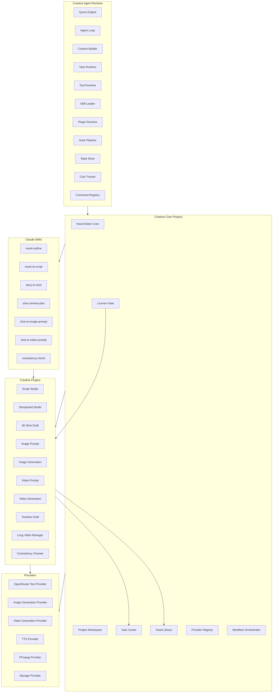
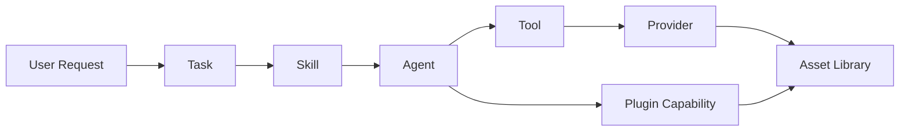
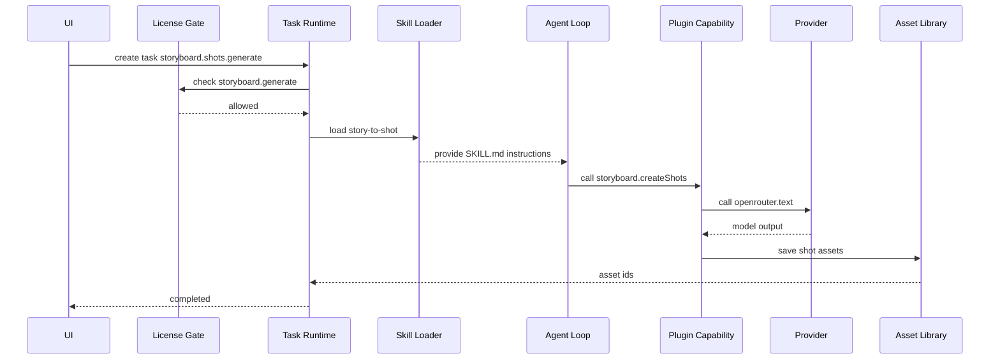

### **建议把 `claude-code-src` 作为“Agent Runtime 架构蓝本”，重构成 OpenCode Creative Studio 的底座；原 OpenCode 组件降级为补充层；插件不直接被 UI 调用，而是在 Task 执行过程中由 Claude Skill 引导 Agent 调用对应 Plugin / Tool / Provider。**

但需要先纠正一个关键点：`claude-code-src` 虽然在公网有大量解析和镜像，但从公开资料看，它更准确地说是 `@anthropic-ai/claude-code@2.1.88` 发布包 source map 暴露后被提取/反编译出来的研究材料，不等同于正式开源授权代码。因此你的项目应该采用 **clean-room architecture rewrite**：借鉴架构、抽象、流程和模块边界，不直接复制源码实现。

---

## **一、对 claude-code-src 2.1.88 的调研结论**

公网资料显示，`@anthropic-ai/claude-code@2.1.88` 曾随 npm 包发布了 source map，里面包含大量 TypeScript 源码。公开分析普遍提到该版本包含约 1,900 个 TypeScript / TSX 文件，规模在 16 万行到 50 多万行之间，具体统计口径不同；关键文件包括 `QueryEngine.ts`、`query.ts`、`Tool.ts`、`commands.ts`、`context.ts`、`cost-tracker.ts` 等。资料中还明确指出，这些代码虽然可在 GitHub 镜像或解析站看到，但并不意味着它具有自由开源许可证，适合用作技术研究和架构参考，而不适合直接复制进商业项目。 [GitHub willin](https://github.com/willin/claude-code-source-code) [TurboDocx](https://www.turbodocx.com/blog/claude-code-source-map-leak-npm-security) [Varonis](https://www.varonis.com/blog/claude-code-leak)

从架构上看，Claude Code 的核心不是普通 CLI，而是一个 **Agentic Runtime**。它的关键设计包括：`QueryEngine` 管理会话生命周期，`query()` 作为主 Agent Loop，工具系统通过统一 `Tool` 抽象注册和执行，命令系统处理 slash command，上下文系统负责系统提示和用户输入上下文，状态层保存会话、任务、文件缓存和成本信息，Skill 系统采用“元数据先发现、内容按需加载”的方式，Hook 系统提供生命周期扩展点，插件系统提供扩展入口。公开解析还强调了它的 AsyncGenerator Agent Loop、流式工具执行、并发读工具、写工具串行化、上下文压缩、成本追踪、子 Agent 协调等设计。 [Claude Code From Source](https://claude-code-from-source.com/) [Deep Dive Claude Code](https://deep-dive-claude-code.vercel.app/source/QueryEngine)

结合你当前 GitHub 页面 `storytree/caiode/claude-code-src` 的目录结构，可以确认你仓库里的版本至少保留了这些关键模块：

```text
assistant/
bootstrap/
bridge/
cli/
commands/
components/
context/
coordinator/
hooks/
plugins/
query/
server/
services/
skills/
state/
tasks/
tools/
QueryEngine.ts
Task.ts
Tool.ts
commands.ts
context.ts
cost-tracker.ts
query.ts
tasks.ts
tools.ts
main.tsx
```

这说明它非常适合作为 OpenCode Creative Studio 的 **运行时参考底座**，尤其适合复用其架构思想：Agent Loop、Tool Runtime、Task Runtime、Skill Loader、Plugin Runtime、Context Builder、State Store、Cost Tracker、Hook Pipeline 和 Command Registry。

---

## **二、重构总原则：Claude-Code-Style Runtime 为主，OpenCode 组件为补充**

你现在的架构方向应该从：

```text
OpenCode 二次开发 + 创作插件
```

升级为：

```text
Claude-Code-Style Agent Runtime + OpenCode Creative Core + 插件化创作系统
```

也就是说，`claude-code-src` 不只是参考目录，而应该成为架构抽象的主来源；原 OpenCode 的组件、UI、配置、已有工具和生态能力作为补充层接入。

新的定位应是：

```text
claude-code-src 架构思想
  = Agent Runtime / Tool Runtime / Skill Runtime / Task Runtime / State / Context / Hook / Plugin 的底层蓝图

OpenCode 原组件
  = 可复用 UI、文件系统、已有命令、已有工具、开发体验和插件生态补充

OpenCode Creative Studio
  = 面向小说、剧本、分镜、3D 草稿、图像、视频、剪辑和长视频生产的 AI 创作工作台
```

这能避免两类风险：第一，不把 OpenCode 改成一个臃肿业务系统；第二，不把 Claude Code 的反编译源码直接复制，而是做结构层面的 clean-room 重构。

---

## **三、目标架构：Creative Agent Runtime**

建议把底座命名为：

```text
Creative Agent Runtime
```

它不是普通插件平台，而是一个面向创作流程的 Agent 执行内核。



这个架构里，最重要的分工是：

```text
Runtime 负责 Agent 怎么运行。
Core 负责创作项目怎么管理。
Novel Editor 负责创作入口。
Plugin 负责可售卖业务模块。
Skill 负责 Agent 做事的方法说明。
Provider 负责外部模型和生成服务。
Tool 负责具体可执行动作。
Task 负责耗时任务生命周期。
Asset Library 负责所有产物沉淀。
License Gate 负责商业权限。
```

---

## **四、claude-code-src 模块到新底座的映射**

你当前页面里看到的目录可以映射成下面的 Creative Runtime 模块。

| claude-code-src 模块 | 新架构模块 | 重构用途 |
|---|---|---|
| `QueryEngine.ts` | `CreativeQueryEngine` | 会话生命周期、Agent 请求入口、流式响应输出 |
| `query.ts` | `AgentLoop` | 主循环：模型响应、工具调用、观察结果、继续推理 |
| `Tool.ts` | `CreativeTool` | 所有工具的统一接口和权限模型 |
| `tools.ts` / `tools/` | `ToolRegistry` | 注册文件、搜索、FFmpeg、3D 截图、导出等工具 |
| `Task.ts` / `tasks.ts` / `tasks/` | `TaskRuntime` | 生成分镜、生成图像、生成视频、导出视频等任务 |
| `skills/` | `SkillLoader` | 发现 `.claude/skills/*/SKILL.md`，按需加载 Skill |
| `plugins/` | `PluginRuntime` | 加载创作插件 manifest、页面、命令、任务类型 |
| `commands.ts` / `commands/` | `CommandRegistry` | 插件命令、生成命令、导出命令、调试命令 |
| `context.ts` / `context/` | `CreativeContextBuilder` | 构造小说、角色、世界观、镜头、资产上下文 |
| `state/` | `StateStore` | 会话状态、项目状态、任务状态、插件状态 |
| `services/` | `ServiceLayer` | Provider、License、Asset、Project、Cost 服务 |
| `bridge/` | `ProviderBridge` | OpenRouter、图像、视频、TTS、FFmpeg、IDE 桥接 |
| `coordinator/` | `WorkflowOrchestrator` | 多步骤工作流、批处理、子 Agent 协作 |
| `hooks/` | `HookPipeline` | 插件生命周期、任务前后、资产生成后触发 |
| `cost-tracker.ts` | `CostTracker` | OpenRouter、图像、视频、TTS、存储成本统计 |
| `components/` / `ink/` / `screens/` | `UI Reference` | 可作为终端 UI 参考，但 Creative Studio 应优先 Web/桌面 UI |
| `server/` | `LocalServer` | 本地 API、插件调试、任务队列、外部集成 |
| `voice/` | `VoiceInput` | 后续作为语音输入插件或 Provider 补充 |
| `migrations/` | `MigrationRuntime` | 项目 schema、插件数据、资产库升级 |

这里的关键不是逐字迁移代码，而是迁移 **抽象边界**。

---

## **五、最关键的架构修正：Skill 调用插件，而不是 UI 直接调用插件**

你提出“任务过程中通过 Claude Skill 调用各个插件模块”，这个方向是对的，但需要定义清楚调用链。

正确链路应该是：

```text
用户在 UI 发起任务
  ↓
Core 创建 Creative Task
  ↓
Task Runtime 选择 Skill
  ↓
Skill Loader 加载 SKILL.md
  ↓
Agent 根据 Skill 指令决定要使用哪些 Plugin Capability
  ↓
Plugin Runtime 暴露可调用能力
  ↓
Tool Runtime / Provider Registry 执行具体动作
  ↓
Asset Library 保存产物
  ↓
Task Center 更新状态
```

也就是说，UI 不应该直接说：

```text
调用 StoryboardPlugin.generate()
```

而应该说：

```text
创建一个 storyboard.generate task
```

然后任务内部加载：

```text
story-to-shot Skill
```

Skill 再指导 Agent 使用：

```text
Storyboard Studio Plugin capability
OpenRouter Provider
Asset Write Tool
```

---

## **六、Skill、Plugin、Provider、Tool 的最终关系**

必须固定这套定义，后面所有文档都按这个来。

```text
Skill = Agent 按需加载的任务说明包
Plugin = 产品模块和商业模块
Provider = 外部服务适配器
Tool = Agent 可调用的具体执行动作
Task = 一次可追踪、可取消、可恢复的任务实例
Asset = 任务产物
```

它们的关系是：



举例：

```text
story-to-shot Skill
  不是 Storyboard Plugin
  不是 OpenRouter
  不是分镜 UI
  它只是告诉 Agent 如何把小说场景拆成镜头

Storyboard Studio Plugin
  是产品模块
  提供分镜页面、Shot 数据结构、分镜编辑器、导出能力

OpenRouter Provider
  是 LLM 调用适配器
  负责模型、密钥、计费、重试、错误处理

WriteAssetTool
  是具体工具
  负责把生成结果写入 Asset Library
```

---

## **七、插件模块通过 Skill 暴露给 Agent 的方式**

建议每个插件声明自己的 Agent Capability，而不是让 Skill 直接 import 插件代码。

插件 manifest 应包含：

```ts
export interface CreativePluginManifest {
  id: string
  name: string
  version: string
  status: 'dev' | 'alpha' | 'beta' | 'stable' | 'deprecated'

  category:
    | 'core-extension'
    | 'script'
    | 'storyboard'
    | 'image'
    | 'video'
    | 'audio'
    | 'timeline'
    | 'quality'

  pages?: PluginPageContribution[]
  panels?: PluginPanelContribution[]
  commands?: PluginCommandContribution[]
  taskTypes?: PluginTaskTypeContribution[]
  assetTypes?: PluginAssetTypeContribution[]

  agentCapabilities?: PluginAgentCapability[]

  requiredSkills?: string[]
  requiredProviders?: string[]
  requiredTools?: string[]

  license: {
    sku: string
    trialDays?: number
    requiredPlan?: 'free' | 'creator' | 'pro' | 'studio'
    features: string[]
  }
}
```

其中最重要的是：

```ts
agentCapabilities?: PluginAgentCapability[]
```

例如 Storyboard 插件：

```ts
agentCapabilities: [
  {
    id: 'storyboard.createShots',
    description: 'Create structured storyboard shots from a novel scene or script scene.',
    inputSchema: 'CreateShotsInput',
    outputSchema: 'StoryboardShotList',
    requiredSkill: 'story-to-shot',
    requiredProvider: 'openrouter.text',
    requiredLicenseFeature: 'storyboard.generate'
  },
  {
    id: 'storyboard.refineShot',
    description: 'Refine one storyboard shot with better camera, composition, and motion.',
    inputSchema: 'RefineShotInput',
    outputSchema: 'StoryboardShot',
    requiredSkill: 'shot-camera-plan',
    requiredProvider: 'openrouter.text',
    requiredLicenseFeature: 'storyboard.refine'
  }
]
```

这样 Skill 不直接“调用插件代码”，而是让 Agent 调用已注册的插件能力：

```text
Plugin Capability = Agent 可见的业务能力接口
```

---

## **八、Skill 的目录与内容设计**

建议项目级 Skill 统一放：

```text
.claude/skills/
```

原因是它更容易兼容 Claude Code，同时 OpenCode 也可以做兼容式发现。

首批 Skill：

```text
.claude/skills/
├── novel-outline/
│   └── SKILL.md
├── novel-to-script/
│   └── SKILL.md
├── story-to-shot/
│   └── SKILL.md
├── shot-camera-plan/
│   └── SKILL.md
├── shot-to-image-prompt/
│   └── SKILL.md
├── shot-to-video-prompt/
│   └── SKILL.md
├── timeline-assembly/
│   └── SKILL.md
└── consistency-check/
    └── SKILL.md
```

`story-to-shot/SKILL.md` 可以写成：

```markdown
---
name: story-to-shot
description: Convert a novel scene or script scene into structured storyboard shots with camera, composition, motion, duration, and prompt seeds.
when_to_use: Use when a task requires storyboard generation, shot breakdown, camera planning, or visual scene decomposition.
---

# Story to Shot

## Purpose

Transform narrative or script content into production-ready storyboard shot data.

## Required Plugin Capability

Use the `storyboard.createShots` capability when available.

## Required Context

Read:
- selected chapter or scene
- character cards
- location descriptions
- visual style settings
- continuity notes

## Workflow

1. Identify the scene goal.
2. Extract action, emotion, conflict, location, and characters.
3. Split the scene into visual beats.
4. Convert each beat into 1-3 shots.
5. For each shot, define shot size, camera angle, camera movement, composition, duration, image prompt seed, and video prompt seed.
6. Return structured JSON that matches the Storyboard Shot schema.

## Rules

- Do not generate images directly.
- Do not generate videos directly.
- Do not invent existing assets.
- Save generated shots through the task output channel.
```

注意这句：

```text
Use the `storyboard.createShots` capability when available.
```

这就是 Skill 调用插件模块的方式：不是代码级 import，而是 Agent 能力级调用。

---

## **九、Task Runtime：所有生成行为必须任务化**

Claude Code 的重要启发之一是：Agent 不是一次性函数调用，而是一个可持续运行、可观察、可中断、可压缩上下文的循环。因此你的 Creative Studio 里，所有 AI 生成动作都应该是 Task。

任务类型示例：

```text
novel.outline.generate
novel.chapter.draft
script.fromNovel.generate
storyboard.shots.generate
shot.cameraPlan.generate
image.prompt.generate
image.asset.generate
video.prompt.generate
video.asset.generate
timeline.assemble
video.export
consistency.check
```

Task 基础结构：

```ts
export interface CreativeTask {
  id: string
  type: string
  title: string

  status:
    | 'queued'
    | 'running'
    | 'waiting_for_permission'
    | 'waiting_for_user'
    | 'completed'
    | 'failed'
    | 'cancelled'

  projectId: string
  sourceAssetIds: string[]
  outputAssetIds: string[]

  skillName?: string
  pluginId?: string
  providerIds?: string[]

  licenseFeature?: string

  input: unknown
  output?: unknown
  error?: CreativeTaskError

  cost?: {
    inputTokens?: number
    outputTokens?: number
    providerCostUsd?: number
    localComputeCost?: number
  }

  createdAt: string
  updatedAt: string
}
```

运行流程：



---

## **十、OpenCode 原组件应该如何作为补充**

原 OpenCode 不应该完全丢弃。它可以补充以下能力：

```text
1. 现有浏览器/编辑器/工作区 UI
2. 文件树、终端、编辑器、项目配置
3. 已有 Agent 操作习惯
4. 现有工具执行方式
5. 插件生态和扩展点
6. MCP / 外部工具集成
7. 开发者调试体验
```

但底层运行逻辑建议改成：

```text
Claude-Code-style QueryEngine
Claude-Code-style Tool Runtime
Claude-Code-style Task Runtime
Claude-Code-style Skill Loader
Claude-Code-style Context Builder
Claude-Code-style Cost Tracker
```

换句话说：

```text
OpenCode 负责产品外壳和已有生态
claude-code-src 架构负责 Agent 内核
Creative Core 负责创作业务抽象
Plugin Runtime 负责商业模块化
```

---

## **十一、小说编辑器必须是 Core Product**

你之前已经确认：小说编辑器不是普通插件。这一点要写进架构底层。

```text
Novel Editor Core
  = OpenCode Creative Studio 的基础入口
  = 所有下游插件的内容源
  = 不作为普通插件售卖
```

Novel Core 需要内置：

```text
Project
StoryWorld
Character
Location
Timeline
Chapter
Scene
Beat
Draft
Revision
ContinuityNote
```

下游插件都消费 Novel Core 的数据：

```text
Novel Scene
  ↓
Script Studio：改写成剧本场景
  ↓
Storyboard Studio：拆成镜头
  ↓
3D Shot Draft：生成 3D 构图草稿
  ↓
Image Prompt：生成图像提示词
  ↓
Image Generation：生成图像资产
  ↓
Video Prompt：生成视频提示词
  ↓
Video Generation：生成视频资产
  ↓
Timeline Draft：拼接剪辑草稿
  ↓
Long Video Manager：管理长项目结构
```

---

## **十二、License Gate 与按需加载设计**

你要求“插件按开发进度、按需、按付费加载”，建议做三层加载控制。

### **1. 按开发进度加载**

插件 manifest：

```ts
status: 'dev' | 'alpha' | 'beta' | 'stable' | 'deprecated'
```

加载规则：

```text
dev 环境：dev / alpha / beta / stable 全部可见
内测环境：alpha / beta / stable 可见
公测环境：beta / stable 可见
正式环境：stable 可见
deprecated：默认隐藏，只读兼容
```

### **2. 按需加载**

启动时只加载 manifest：

```text
manifest eager load
```

真正使用时再加载：

```text
UI lazy load
Task handler lazy load
Skill on-demand load
Provider on-demand load
Tool permission-gated load
```

也就是：

```text
打开分镜页面时才加载 Storyboard UI
执行分镜任务时才加载 story-to-shot Skill
调用模型时才加载 OpenRouter Provider
导出视频时才加载 FFmpeg Provider
```

### **3. 按付费授权加载**

License 状态：

```text
not_installed
trial
licensed
expired
quota_exceeded
read_only
disabled
```

权限规则：

```text
not_installed：显示介绍页，不允许执行任务
trial：允许有限次数或有限天数
licensed：完整功能
expired：已有资产只读，新任务禁用
quota_exceeded：禁止 Provider 调用，但允许编辑已有资产
read_only：仅查看和导出
disabled：完全隐藏或管理员禁用
```

---

## **十三、重构后的目录结构建议**

建议不要直接把 `claude-code-src` 混进业务代码，而是保留为研究参考，另建 clean-room runtime。

```text
caiode/
├── claude-code-src/
│   └── ... 原始研究参考，不直接改造成产品代码
│
├── packages/
│   ├── creative-runtime/
│   │   ├── query-engine/
│   │   ├── agent-loop/
│   │   ├── context-builder/
│   │   ├── task-runtime/
│   │   ├── tool-runtime/
│   │   ├── skill-loader/
│   │   ├── plugin-runtime/
│   │   ├── hook-pipeline/
│   │   ├── state-store/
│   │   ├── command-registry/
│   │   └── cost-tracker/
│   │
│   ├── creative-core/
│   │   ├── novel-core/
│   │   ├── project-workspace/
│   │   ├── task-center/
│   │   ├── asset-library/
│   │   ├── provider-registry/
│   │   ├── license-gate/
│   │   └── workflow-orchestrator/
│   │
│   ├── creative-providers/
│   │   ├── openrouter/
│   │   ├── image-generation/
│   │   ├── video-generation/
│   │   ├── tts/
│   │   ├── ffmpeg/
│   │   └── storage/
│   │
│   ├── creative-plugins/
│   │   ├── script-studio/
│   │   ├── storyboard-studio/
│   │   ├── shot-draft-3d/
│   │   ├── image-prompt/
│   │   ├── image-generation/
│   │   ├── video-prompt/
│   │   ├── video-generation/
│   │   ├── timeline-draft/
│   │   ├── long-video-manager/
│   │   └── consistency-checker/
│   │
│   └── app/
│       ├── routes/
│       ├── shell/
│       ├── panels/
│       └── ui/
│
├── .claude/
│   └── skills/
│       ├── novel-outline/
│       ├── novel-to-script/
│       ├── story-to-shot/
│       ├── shot-camera-plan/
│       ├── shot-to-image-prompt/
│       ├── shot-to-video-prompt/
│       ├── timeline-assembly/
│       └── consistency-check/
│
└── docs/
    └── roadmap/
        ├── PRODUCT-ROADMAP-PLUGIN-FIRST.md
        ├── CLAUDE-CODE-SRC-ARCHITECTURE-BASELINE.md
        ├── CREATIVE-AGENT-RUNTIME-ARCHITECTURE.md
        ├── CREATIVE-CORE-ARCHITECTURE.md
        ├── SKILL-DEFINITION-AND-USAGE.md
        ├── PLUGIN-RUNTIME-SPEC.md
        ├── PLUGIN-LOAD-AND-LICENSE-FLOW.md
        └── NOVEL-EDITOR-AS-CORE-PRODUCT.md
```

重点是：

```text
claude-code-src/ 只作为研究参考
packages/creative-runtime/ 才是你的 clean-room runtime
```

---

## **十四、具体重构阶段**

### **Phase 0：架构基线分析**

目标是把 `claude-code-src` 的真实结构分析清楚，但不复制实现。

产物：

```text
docs/roadmap/CLAUDE-CODE-SRC-ARCHITECTURE-BASELINE.md
```

必须分析：

```text
QueryEngine.ts
query.ts
Tool.ts
tools.ts
Task.ts
tasks.ts
commands.ts
context.ts
cost-tracker.ts
plugins/
skills/
services/
state/
bridge/
coordinator/
hooks/
```

输出内容：

```text
模块职责
核心抽象
数据流
可借鉴点
不可复制点
对应 Creative Runtime 模块
```

---

### **Phase 1：Creative Runtime 最小内核**

先做内核，不做完整业务 UI。

实现：

```text
CreativeQueryEngine
AgentLoop
TaskRuntime
ToolRuntime
SkillLoader
PluginRuntime
ProviderRegistry
StateStore
CostTracker
```

MVP 只需要跑通一个任务：

```text
从小说场景生成分镜 JSON
```

链路：

```text
Novel Scene
  → storyboard.shots.generate Task
  → story-to-shot Skill
  → storyboard.createShots capability
  → OpenRouterTextProvider mock
  → Shot Asset
```

---

### **Phase 2：Novel Editor Core**

小说编辑器作为 Core Product，而不是插件。

实现：

```text
Project
StoryWorld
Character
Location
Chapter
Scene
Beat
Draft
ContinuityNote
```

提供基础能力：

```text
新建项目
新建角色
编辑章节
选择场景
创建生成任务
查看任务结果
查看资产库
```

---

### **Phase 3：首批插件**

先实现 5 个插件：

```text
Script Studio
Storyboard Studio
3D Shot Draft
Image Prompt
Image Generation
```

每个插件必须包含：

```text
manifest
pages
commands
taskTypes
assetTypes
agentCapabilities
requiredSkills
requiredProviders
licenseFeatures
```

---

### **Phase 4：Provider 接入**

先 Mock，再接真实服务。

顺序：

```text
MockTextProvider
OpenRouterTextProvider
MockImageProvider
ImageGenerationProvider
MockVideoProvider
VideoGenerationProvider
FFmpegProvider
StorageProvider
```

---

### **Phase 5：License Gate 和商业化**

实现：

```text
插件安装状态
试用状态
购买状态
额度状态
离线只读状态
功能级 feature gate
任务级 license check
Provider quota check
```

---

## **十五、必须修改 PRODUCT-ROADMAP-PLUGIN-FIRST.md**

当前文档里这一段：

```text
OpenCode Creative Core
  └── Skill Registry — Skill 注册与调用
```

建议改为：

```text
OpenCode Creative Core
  └── Skill Loader / Skill Catalog — 发现 .claude/skills、.opencode/skills 中的 SKILL.md，并在 Agent 执行任务时按需加载
```

同时 `Paid Creative Plugins` 里建议把 `Novel Studio` 移出插件列表，改成：

```text
Creative Core Product
  └── Novel Editor Core

Paid Creative Plugins
  ├── Script Studio
  ├── Storyboard Studio
  ├── 3D Shot Draft
  ├── Image Prompt / Generation
  ├── Video Prompt / Generation
  ├── Voice & Subtitle
  ├── Timeline Draft
  ├── Long Video Manager
  └── Consistency Checker
```

并新增说明：

```text
Skill 不是产品插件。
Plugin 才是产品模块和付费单元。
Provider 负责外部模型和生成服务。
Tool 负责具体执行动作。
Task 负责统一调度和生命周期管理。
小说编辑器是 Core Product，不作为普通付费插件。
```

---

## **十六、给 Trae 的深度调研与重构提示词**

你可以直接把下面这段给 Trae 执行。

```markdown
# 任务：深入调研 claude-code-src 2.1.88，并重构为 OpenCode Creative Studio 底座

## 一、背景

当前仓库为 storytree/caiode。

`caiode/claude-code-src` 是反编译/提取后的 claude-code-cli 2.1.88 研究版本。公网已有大量解析。该目录只能作为架构研究参考，不允许直接复制源码实现。

目标是基于 claude-code-src 的架构思想，clean-room 重构一个 OpenCode Creative Studio 的 Creative Agent Runtime。

原 OpenCode 组件作为补充层使用。小说编辑器是 Core Product。剧本、分镜、3D 草稿、图像生成、视频生成、剪辑、长视频管理等作为插件。任务过程中通过 Claude Skill 调用各个插件模块。

## 二、必须读取的源码范围

请递归读取并分析：

```text
caiode/claude-code-src/QueryEngine.ts
caiode/claude-code-src/query.ts
caiode/claude-code-src/Tool.ts
caiode/claude-code-src/tools.ts
caiode/claude-code-src/Task.ts
caiode/claude-code-src/tasks.ts
caiode/claude-code-src/commands.ts
caiode/claude-code-src/context.ts
caiode/claude-code-src/cost-tracker.ts
caiode/claude-code-src/costHook.ts
caiode/claude-code-src/main.tsx

caiode/claude-code-src/assistant/
caiode/claude-code-src/bootstrap/
caiode/claude-code-src/bridge/
caiode/claude-code-src/commands/
caiode/claude-code-src/context/
caiode/claude-code-src/coordinator/
caiode/claude-code-src/hooks/
caiode/claude-code-src/plugins/
caiode/claude-code-src/query/
caiode/claude-code-src/server/
caiode/claude-code-src/services/
caiode/claude-code-src/skills/
caiode/claude-code-src/state/
caiode/claude-code-src/tasks/
caiode/claude-code-src/tools/
caiode/claude-code-src/types/
```

不要只列目录。必须提炼每个模块的职责、核心抽象、数据流、可迁移设计和不可复制风险。

## 三、架构总目标

将项目重构为：

```text
Creative Agent Runtime
  ├── CreativeQueryEngine
  ├── AgentLoop
  ├── ContextBuilder
  ├── TaskRuntime
  ├── ToolRuntime
  ├── SkillLoader
  ├── PluginRuntime
  ├── HookPipeline
  ├── CommandRegistry
  ├── StateStore
  └── CostTracker

Creative Core
  ├── Novel Editor Core
  ├── Project Workspace
  ├── Task Center
  ├── Asset Library
  ├── Provider Registry
  ├── License Gate
  └── Workflow Orchestrator

Creative Plugins
  ├── Script Studio
  ├── Storyboard Studio
  ├── 3D Shot Draft
  ├── Image Prompt
  ├── Image Generation
  ├── Video Prompt
  ├── Video Generation
  ├── Timeline Draft
  ├── Long Video Manager
  └── Consistency Checker
```

## 四、重要概念定义

必须严格使用以下定义：

```text
Skill = Agent 按需加载的 SKILL.md 任务说明包
Plugin = 产品模块和商业模块
Provider = 外部服务适配器
Tool = Agent 可调用的具体执行动作
Task = 可追踪、可取消、可恢复的任务实例
Asset = 任务产物
License Gate = 插件和功能权限控制
```

禁止把 Skill 写成 Plugin。
禁止把 OpenRouter 写成 Skill。
禁止让 UI 直接调用插件生成逻辑。
任务必须通过 Task Runtime 运行。
任务过程中通过 Skill 指导 Agent 调用 Plugin Capability。

## 五、Skill 调用插件模块的标准链路

实现和文档中必须使用此链路：

```text
用户在 UI 发起任务
  ↓
Core 创建 Creative Task
  ↓
Task Runtime 检查 License Gate
  ↓
Task Runtime 选择并加载 Skill
  ↓
Skill Loader 读取 .claude/skills/<name>/SKILL.md
  ↓
Agent 根据 Skill 指令调用 Plugin Capability
  ↓
Plugin Capability 调用 Tool / Provider
  ↓
Asset Library 保存产物
  ↓
Task Center 更新状态
```

## 六、Skill 目录

创建或规划：

```text
.claude/skills/
├── novel-outline/
│   └── SKILL.md
├── novel-to-script/
│   └── SKILL.md
├── story-to-shot/
│   └── SKILL.md
├── shot-camera-plan/
│   └── SKILL.md
├── shot-to-image-prompt/
│   └── SKILL.md
├── shot-to-video-prompt/
│   └── SKILL.md
├── timeline-assembly/
│   └── SKILL.md
└── consistency-check/
    └── SKILL.md
```

## 七、Plugin Manifest 规范

请设计 `CreativePluginManifest`，至少包含：

```text
id
name
version
status
category
pages
panels
commands
taskTypes
assetTypes
agentCapabilities
requiredSkills
requiredProviders
requiredTools
license
settings
```

其中 `agentCapabilities` 是 Skill 调用插件能力的桥梁。

## 八、需要创建/更新的文档

创建：

```text
docs/roadmap/CLAUDE-CODE-SRC-ARCHITECTURE-BASELINE.md
docs/roadmap/CREATIVE-AGENT-RUNTIME-ARCHITECTURE.md
docs/roadmap/CREATIVE-CORE-ARCHITECTURE.md
docs/roadmap/SKILL-DEFINITION-AND-USAGE.md
docs/roadmap/PLUGIN-RUNTIME-SPEC.md
docs/roadmap/PLUGIN-LOAD-AND-LICENSE-FLOW.md
docs/roadmap/NOVEL-EDITOR-AS-CORE-PRODUCT.md
```

更新：

```text
docs/roadmap/PRODUCT-ROADMAP-PLUGIN-FIRST.md
```

必须把：

```text
Skill Registry — Skill 注册与调用
```

改成：

```text
Skill Loader / Skill Catalog — 发现 .claude/skills、.opencode/skills 中的 SKILL.md，并在 Agent 执行任务时按需加载
```

并把 Novel Studio 从 Paid Plugins 中移出，改为 Novel Editor Core。

## 九、输出要求

完成后输出：

```text
已完成 claude-code-src 深度调研与 Creative Runtime 重构方案。

一、读取范围
-

二、claude-code-src 架构基线
-

三、可迁移设计
-

四、不可直接复制风险
-

五、Creative Agent Runtime 新架构
-

六、Skill 调用插件模块链路
-

七、Plugin Manifest 规范
-

八、创建/更新文件
-

九、下一步开发建议
-
```
```

---

## **十七、最终架构结论**

最终方向应定为：

```text
以 claude-code-src 的 Agent Runtime 架构为主底座
以 OpenCode 原组件作为补充
以小说编辑器作为 Core Product
以插件作为商业模块
以 Claude Skill 作为任务执行说明
以 Plugin Capability 作为 Skill 调用插件的桥梁
以 Provider 作为外部生成服务适配层
以 Task Runtime 管理所有生成、导出、检查、合成任务
以 Asset Library 沉淀所有产物
以 License Gate 控制模块付费和额度
```

一句话说就是：

```text
OpenCode Creative Studio = Claude-Code-style Agent Runtime + Novel Core + Skill-driven Plugin System + Provider-based Generation Pipeline
```

这套架构比“普通 OpenCode 插件化”更稳，因为它把创作任务放进 Agent Runtime，而不是把各个 AI 生成按钮散落在 UI 里。

*内容由 AI 生成仅供参考*