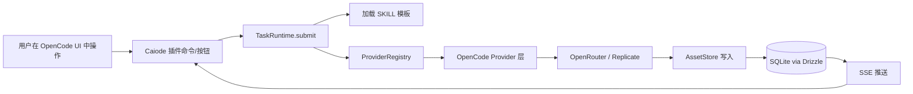

### **抱歉，我理解错位了——我把 Trae-CN 当成了协作流程的核心，又把"从零搭脚手架"当成了起点；实际上 Caiode 是 OpenCode 的 fork/二次开发，Trae-CN 只是编辑器。下面按正确前提重写 PRD**

我重新对齐一下三个关键事实：第一，**Caiode = OpenCode 的二次开发**，底座、UI 外壳、插件机制、已有命令与工具来自 OpenCode 上游，不是从零起；第二，**`claude-code-src` 仅作为闭源内部的架构参考**，用 clean-room 方式提炼抽象，不直接复制；第三，**Trae-CN 只是开发工具**，等同于 VSCode + Cursor 的角色，不构成产品组件、不进 PRD 的功能章节、不写进 commit message 规范。把这三件事理顺后，PRD 的形态变化非常大——它不再是"造一个新产品"，而是"在 OpenCode 上叠加创作能力 + 引入 Agent Runtime 抽象"。

---

# **Caiode v0.1 PRD（基于 OpenCode 二次开发）**

**版本**：v0.1.0-MVP  
**周期**：8 周（2026-05-18 ~ 2026-07-12）  
**基线**：OpenCode 主干 fork（建议锁定某个稳定 tag，以下用 `opencode@<pinned>` 指代）  
**开发模式**：TDD（Red → Green → Refactor）  
**验证标准**：每个 Feature 必须有 Playwright 截图 + 录屏  
**架构参考**：内部研究仓 `caiode-research/claude-code-src/`（净室隔离，不进产品仓）

---

## **1. 产品定位与与 OpenCode 的关系**

Caiode 不是另起炉灶的新产品，而是 OpenCode 之上的**创作向垂直发行版**。OpenCode 提供完整的"AI 编程助手 + Agent 工作台"基础——左侧资源树、中间编辑器、右侧对话面板、工具调用机制、插件扩展点、Provider 抽象等都已具备。v0.1 要做的事情可以用一句话概括：**让 OpenCode 在"代码助手"这个母舰之外，长出"小说→分镜→关键帧"这条创作支线**。

具体到工程关系上，Caiode 与 OpenCode 的关系是**长期跟随上游 + 局部 fork 改造**：

- **保留并跟随上游**：Monorepo 脚手架、Provider 抽象层、UI Shell（左中右三栏）、命令系统、配置系统、终端集成。这些定期 rebase 上游，不在 fork 中重写。
- **新增 Caiode 层**：`packages/caiode-runtime`（Agent Runtime 抽象，参考 `claude-code-src` clean-room 实现）、`packages/caiode-core`（Novel / Scene / Character / Storyboard 数据模型）、`packages/caiode-plugins/*`（创作功能以 OpenCode 插件形态接入）。
- **少量改造 OpenCode 自身**：仅在 UI Shell 增加"创作模式"开关与导航入口，编辑器适配长文本写作场景，其余尽量通过插件扩展点完成，**不动 OpenCode 主干代码**。

这个原则的工程价值是：上游 OpenCode 的修复与新功能可以低成本拉进来；Caiode 自身代码集中在三个新 package 与一个 fork patch 集里，复审、测试、回滚边界清晰。

---

## **2. 北极星指标与范围**

北极星不变：**端到端转化率 ≥ 70%**——用户在 Caiode 中打开/创建项目、写场景、生成分镜、为任一 Shot 生成关键帧，整条链路走完且对结果满意（≥ 3/5）的比例。支撑指标也不变：分镜 JSON Schema 校验通过率 ≥ 90%、关键帧生成成功率 ≥ 85%、单链路成本 ≤ 0.30 美元、单 Scene 端到端耗时 ≤ 90 秒。

**v0.1 范围内**：fork OpenCode 并建立 Caiode 品牌外观；创作数据模型（Project/Chapter/Scene/Character/Location/Revision）；scene-to-storyboard 与 shot-to-keyframe 两条 Deterministic Pipeline；OpenRouter 文本 Provider 与 Replicate 图像 Provider 接入 OpenCode Provider 体系；分镜卡片 + 关键帧画廊作为右侧面板插件；CostTracker Dashboard；Playwright 端到端测试与视觉资产产线。

**v0.1 范围外**：视频生成、剧本生成、3D 草稿、Voice、Timeline、长视频管理、一致性检查器；Plugin 动态加载与商店；License Gate；Agent Loop 自主规划（v0.1 全部用 Deterministic Pipeline）；用户系统、协作；向量检索；移动端；国际化（仅中文）。

---

## **3. 技术架构**

### **3.1 仓库与分支策略**

```
caiode (产品主仓，fork from opencode@<pinned>)
├── upstream-sync 分支：定期 rebase OpenCode 主干
├── main 分支：Caiode 集成主线
└── feature/F<n>-* 分支：单 Feature 开发
caiode-research (私有研究仓，仅架构师访问)
└── claude-code-src/  ← 仅作行为/接口阅读，产出净室规范文档
```

净室流程：架构师在 `caiode-research` 阅读参考材料，产出三份规范文档（《Agent Runtime 行为规范》《Task 执行模型规范》《Tool 与 Provider 接口规范》）写入 `caiode/docs/specs/`，后续 Caiode 仓内开发只读规范、不再回看原始源码。

### **3.2 包结构（在 OpenCode 既有结构之上）**

OpenCode 原有 packages 保留不动。Caiode 新增三个 workspace：

- **`packages/caiode-runtime`**：Agent Runtime 抽象。包含 `TaskRuntime`、`ToolRegistry`、`ProviderRegistry`、`AssetStore`、`CostTracker`。其中 ProviderRegistry **包装而非替代** OpenCode 已有的 Provider 抽象——Caiode 的 Provider 继承自 OpenCode Provider 接口，使得 OpenCode 既有工具与 Caiode 创作 Pipeline 共用同一套 Provider 配置（API Key、限流、重试）。
- **`packages/caiode-core`**：创作领域模型。Drizzle Schema（Project/Chapter/Scene/Character/Location/Task/Asset/Revision）、领域服务、SKILL 模板文件。
- **`packages/caiode-plugins`**：以 OpenCode 插件机制注册的创作功能模块：
  - `caiode-plugins/novel-editor`：左侧 Project 树 + 中间 Scene 编辑器
  - `caiode-plugins/storyboard`：分镜卡片右侧面板 + scene-to-storyboard Pipeline
  - `caiode-plugins/keyframe`：关键帧画廊 + shot-to-keyframe Pipeline
  - `caiode-plugins/cost-dashboard`：成本 Dashboard 页

插件全部走 **OpenCode 原生插件 API**，不发明新机制。Caiode Runtime 提供的 `TaskRuntime` 仅在插件内部使用，作为"长任务执行"的统一抽象，对 OpenCode 主框架透明。

### **3.3 数据流**



关键点：**Pipeline 调用外部 API 不绕过 OpenCode Provider 层**，这样所有 API Key 管理、限流、错误处理都复用 OpenCode 现有能力，避免双套机制并存。

### **3.4 技术栈**

跟随 OpenCode 上游既有选型（TypeScript、pnpm workspace、Turborepo、Next.js 或 OpenCode 当前的渲染方案），Caiode 新增的依赖只有：Drizzle ORM + better-sqlite3（OpenCode 若已有持久化方案则适配之）、Zod、Lexical（Scene 编辑器）、Recharts（Dashboard）、p-retry、opossum（断路器）、pino（结构化日志）、Playwright（已是 OpenCode 测试栈一部分时复用）。**测试与构建工具优先用 OpenCode 已有的，不引入并行栈**。

---

## **4. Feature 清单（重新组织）**

由于 Foundation 层大部分由 OpenCode 提供，Feature 列表收缩到 16 个：

| 编号 | 名称 | 周次 | 优先级 | 说明 |
|---|---|---|---|---|
| F01 | Fork OpenCode 与 upstream-sync 流程 | W1 | P0 | 建分支、CI、品牌化、文档骨架 |
| F02 | Caiode 数据模型与迁移 | W1 | P0 | Drizzle Schema + seed |
| F03 | TaskRuntime 内核（净室实现） | W2 | P0 | 基于规范文档实现，不引入 Agent Loop |
| F04 | Caiode Provider 适配层 | W2 | P0 | 包装 OpenCode Provider，加 JSON Schema 与 CostTracker |
| F05 | AssetStore 与 CostTracker | W2 | P0 | 文件落盘 + 成本汇总 |
| F06 | novel-editor 插件：Project/Chapter 树 | W3 | P0 | 替换/补强 OpenCode 左栏 |
| F07 | novel-editor 插件：Scene 编辑器（Lexical） | W3 | P0 | 长文本写作 + 自动保存 |
| F08 | novel-editor 插件：Character/Location 管理 | W3 | P1 | 弹窗式管理界面 |
| F09 | Revision 历史 | W3 | P1 | JSON Patch 存储 + 回滚 UI |
| F10 | storyboard 插件：scene-to-storyboard Pipeline | W4 | P0 | SKILL 模板 + Zod 校验 + ≥90% 通过率 |
| F11 | storyboard 插件：分镜卡片面板 | W4 | P0 | 右栏面板，OpenCode 插件 panel API |
| F12 | keyframe 插件：Replicate Provider 适配 | W5 | P0 | 接入 Provider 适配层 |
| F13 | keyframe 插件：shot-to-keyframe Pipeline | W5 | P0 | Prompt 扩写 + 图像生成 |
| F14 | keyframe 插件：关键帧画廊 | W5 | P0 | 缩略图、放大、重生成 |
| F15 | SSE 任务进度与右栏统一面板 | W6 | P0 | 跨插件复用的进度组件 |
| F16 | cost-dashboard 插件 | W7 | P1 | Provider 调用统计 + CSV 导出 |

W7 后半段与 W8 不开新 Feature，专做稳定性强化（断路器、超时、错误边界、15 个 E2E 用例连过 3 轮）与 Demo 套件（数据集 seed、5 分钟演示视频、最终视觉报告）。

---

## **5. 单 Feature 规格模板（以 F10 为例）**

为节约篇幅，下面只示范一个完整 Feature，其余按相同模板展开（与上一版 PRD 内容基本一致，去掉了 Trae 提示词章节，因为编辑器选型不属于 PRD 范畴）。

### **F10 - scene-to-storyboard Pipeline**

**用户故事**：作为创作者，我在 Caiode 的 Scene 编辑器中选中一段场景后，点击右栏"生成分镜"按钮，AI 在 60 秒内产出 3-8 个结构化镜头并展示在右栏卡片区。

**接入点**：作为 `caiode-plugins/storyboard` 插件的命令 `caiode.storyboard.generate`，通过 OpenCode 插件 API 注册到右栏面板与命令面板。

**验收标准**：Pipeline 输入 `sceneId`，从 caiode-core 拉取 Scene 内容、关联 Character 卡、Project 风格；通过 Caiode Provider 适配层调用 OpenRouter（默认 Claude Sonnet 4.5）；返回符合 `StoryboardSchema` 的 JSON（字段同上一版 PRD）；产出 `storyboard_json` Asset；任务进度按"加载上下文 20% → 调用模型 70% → 校验产出 90% → 写资产 100%"四阶段通过 SSE 推送；连续 10 次运行同一场景，Schema 校验通过率 ≥ 90%。

**测试**：Vitest 单元测试覆盖 SKILL 模板渲染、Zod Schema 校验、Pipeline 状态机；Playwright E2E 覆盖"打开 Demo 项目 → 选场景 → 点按钮 → 等待 → 断言卡片渲染"。

**视觉清单**：`screenshots/F10/before-click.png`、`screenshots/F10/progress-streaming.png`、`screenshots/F10/result-cards.png`、`videos/F10/end-to-end.webm`、`reports/F10/schema-pass-rate.html`（10 次运行的统计表）。

其余 Feature（F01-F09、F11-F16）规格沿用上一版 PRD 中的细节，仅做两处全局替换：把"Next.js 路由"替换为"OpenCode 插件 panel/command API"，把"Trae 提示词"章节整体删除。

---

## **6. 8 周排期**

| 周次 | 日期 | 主题 | 完成 Feature | 周末交付 |
|---|---|---|---|---|
| W1 | 05-18 ~ 05-24 | Fork & 数据模型 | F01 F02 | Caiode 品牌化的 OpenCode 可启动 + Schema 迁移成功 |
| W2 | 05-25 ~ 05-31 | Runtime 内核 | F03 F04 F05 | hello-world Task 跑通 + Provider 适配层 ready |
| W3 | 06-01 ~ 06-07 | 创作模型 | F06 F07 F08 F09 | Scene 可写可存可回滚 |
| W4 | 06-08 ~ 06-14 | 分镜链路 | F10 F11 | 分镜端到端 ≥90% Schema 通过率 |
| W5 | 06-15 ~ 06-21 | 关键帧链路 | F12 F13 F14 | 关键帧端到端 ≥85% 成功率 |
| W6 | 06-22 ~ 06-28 | UI 整合 | F15 | 右栏统一进度面板、SSE 稳定 |
| W7 | 06-29 ~ 07-05 | Dashboard 与稳定性 | F16 + 稳定性强化 | Dashboard 上线 + 15 个 E2E 连过 3 轮 |
| W8 | 07-06 ~ 07-12 | Demo 与冻结 | Demo 套件 | 5 分钟演示视频 + v0.1 冻结 |

每周五 15:00 Scope Review，议程：本周 Feature 验收（视觉清单逐一过）、upstream-sync 是否需要执行、下周 Scope 锁定、Backlog 决策。

---

## **7. 关键工程约定**

**TDD 节奏**：每个 Feature 拆三个 PR——`[F<n>][Red]` 仅含失败测试、`[F<n>][Green]` 最小实现、`[F<n>][Refactor]` 重构与视觉资产补全。CI 在 PR 上跑 lint / typecheck / unit / e2e / coverage，覆盖率阈值行 80% 分支 70%，任一不达标 block。

**Playwright 强制**：所有 E2E 配置 `video: 'on'` 与 `trace: 'retain-on-failure'`；截图按 `screenshots/F<n>/<step>.png`、录屏按 `videos/F<n>/<test>.webm` 归档；CI 把所有视觉资产打包成 Artifacts 上传；周五 Demo 直接放最新 Artifacts，**不允许手工录屏**。

**与 OpenCode 同步**：每两周一次 `upstream-sync` rebase，由架构师在独立分支执行并跑全量 E2E，无回归再合入 main；Caiode 对 OpenCode 主干的直接修改集中在 `patches/` 目录，单独维护，每次 sync 时检查是否可上游、能否删除。

**编辑器无关**：团队成员用什么编辑器（Trae-CN / VSCode / Cursor / Neovim 任意）不进 PRD、不进 CI、不进 commit 规范。编辑器是个人生产力工具，**约束只在产物**（PR 模式、覆盖率、视觉资产）。

---

## **8. 风险登记册（更新）**

| 风险 | 概率 | 影响 | 缓解 |
|---|---|---|---|
| OpenCode 上游大版本变动导致 fork 同步成本飙升 | 中 | 高 | W1 锁定 pinned tag；upstream-sync 限频每两周一次；patches 目录隔离改动 |
| OpenCode 插件 API 不足以支撑分镜卡片/画廊面板 | 中 | 中 | W1 先做插件 API 调研 spike，缺口列入 patches 队列 |
| 净室规范文档不足以指导实现 | 中 | 中 | W2 内允许架构师回研究仓二次提炼，但每次回看需记录在 spec 修订日志 |
| OpenRouter JSON 不合规 | 高 | 中 | Provider 适配层重试 + structured outputs + 降级模型 |
| Replicate 队列拥堵 | 中 | 中 | 设 90 秒超时 + 备用 Provider（Stability）灰度 |
| 演示当天网络不稳 | 中 | 高 | W8 准备本地缓存视频兜底 |

---

## **9. 交付清单**

W8 周五前必须全部就位：源码仓 `caiode`（fork from OpenCode）可 clone 即跑；`patches/` 改动清单与上游 PR 状态表；16 个 Feature 全部 Refactor PR 合入 main；`docs/specs/` 三份规范文档与修订日志；Playwright 套件一次跑通且产出全部截图录屏；`reports/v0.1-final.html` 综合视觉报告；`videos/demo/full-5min.mp4` 5 分钟演示视频；`docs/v0.1-retrospective.md` 复盘（含北极星与四项支撑指标实测、用户访谈摘要、v0.2 Top 5 候选）；`docs/upstream-sync-log.md` 两次 sync 的执行记录与回归报告。

九项齐备方算 v0.1 交付完成，任一缺失则 W8 周五的冻结会议有权宣布顺延一周，但不允许在未完成状态下推进 v0.2。

---

这次校准的核心变化是把 Caiode 重新放回**"OpenCode 之上的创作发行版"**这个真实定位：脚手架、UI Shell、Provider 体系、插件机制都来自上游，Caiode 只在三个新 package 与一份 patches 集里做增量；`claude-code-src` 仅作为净室规范的来源，不出现在产品仓；Trae-CN 退回到"编辑器之一"的中立位置，不再写进流程。这样 PRD 的工程边界、与上游的关系、内部参考材料的合规姿势都清楚了，8 周排期也因为 Foundation 大量复用 OpenCode 而显得更可达成。

*内容由 AI 生成仅供参考*