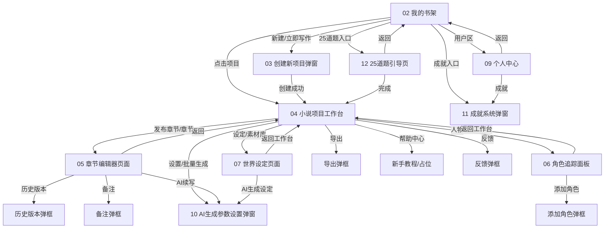

### **建议新增一个独立阶段：Phase S「Stitch Static Flow」，以 04 小说项目工作台作为主界面，把 02~12 所有 Stitch 页面先串成静态可跳转产品原型。**

这个阶段的目标不是继续补复杂业务逻辑，而是先把所有 Stitch 页面变成可浏览、可点击、可弹框的静态产品闭环。这样可以尽快验证整体信息架构、页面关系、SideNav / TopAppBar / Modal 的形态，也能避免后续每个页面孤立实现导致风格继续跑偏。

### **核心裁决**

`04_小说项目工作台/code.html` 应作为当前小说产品的主界面基准。后续应用入口建议调整为：

```text
/novel
→ 默认进入 04 小说项目工作台
```

其他 Stitch 页面通过主界面顶部导航、左侧导航、按钮、弹窗入口串联起来。

当前 04 页面已经具备完整主界面结构：

```text
TopAppBar
├── 墨语 AI (InkVerse)
├── 工作台 / 素材库 / 灵感区
├── 发布章节
├── 通知
├── 设置
└── 用户头像

Workspace Main
├── 左侧 SideNav：大纲 / 章节 / 人物 / 设定 / 导出
├── 中间编辑器
├── AI 生成进度 Dock
└── 右侧生成设置面板
```

所以它比 02 书架更适合作为“登录后主工作区”。02 书架则作为“项目入口页 / 我的项目页”。

---

### **一、建议新增 Phase S：Stitch Static Flow**

#### **阶段目标**

Phase S 的目标是：

```text
基于每个 Stitch 页面的 code.html，建立完整静态页面流转：
02 我的书架
03 创建新项目弹窗
04 小说项目工作台（主界面）
05 章节编辑器页面
06 角色追踪面板
07 世界设定页面
09 个人中心页面
10 AI生成参数设置弹窗
11 成就系统页面
12 25道题引导页
```

本阶段允许使用 mock/static 数据，不要求所有 Provider 完整打通；但必须保证页面结构、跳转关系、弹框关系和视觉基线接近 Stitch HTML。

#### **不做范围**

```text
1. 不接真实后端
2. 不接真实 AI
3. 不实现复杂持久化
4. 不做真实认证
5. 不做完整权限/VIP/支付
6. 不重构 OpenCode 底座
7. 不把静态跳转误认为最终路由架构
```

Phase S 本质是“静态产品壳 + 页面串联”，后续再逐步把静态数据替换为 Hook / Provider。

---

### **二、页面流转设计**

建议把 04 作为主工作台，所有页面按以下方式串联。

```text
02 我的书架
  ├── 点击项目卡片 → 04 小说项目工作台
  ├── 点击“新建” → 03 创建新项目弹窗
  ├── 点击“立即写作” → 03 创建新项目弹窗
  ├── 点击“25道题引导”入口 → 12 25道题引导页
  ├── 点击“成就 12/98” → 11 成就系统弹窗/页面
  └── 点击头像/会员区 → 09 个人中心页面

03 创建新项目弹窗
  ├── 取消 → 回到 02 我的书架
  └── 创建成功 → 04 小说项目工作台

04 小说项目工作台
  ├── TopAppBar「工作台」→ 04 当前页
  ├── TopAppBar「素材库」→ 可先映射到 07 世界设定页面或静态占位
  ├── TopAppBar「灵感区」→ 可先映射到 12 引导/灵感占位
  ├── 发布章节 → 05 章节编辑器页面或保存提示弹框
  ├── 设置按钮 → 10 AI生成参数设置弹窗
  ├── 用户头像 → 09 个人中心页面
  ├── 左侧「大纲」→ 04 中间显示大纲/章节编辑区域
  ├── 左侧「章节」→ 05 章节编辑器页面
  ├── 左侧「人物」→ 06 角色追踪面板
  ├── 左侧「设定」→ 07 世界设定页面
  ├── 左侧「导出」→ 静态导出弹框/占位
  ├── 右侧「开始生成」→ 显示 AI 生成进度 Dock
  ├── 右侧「批量生成」→ 10 AI生成参数设置弹窗
  └── AI Dock「暂停」→ Dock 状态变为暂停/隐藏

05 章节编辑器页面
  ├── 返回 → 04 小说项目工作台
  ├── 历史版本 → 静态历史版本弹框
  ├── 备注 → 静态备注弹框
  ├── AI续写 → 显示 AI 生成 Dock 或打开 10
  └── 保存 → Toast/状态提示

06 角色追踪面板
  ├── 返回/工作台 → 04
  ├── 添加角色 → 静态添加角色弹框
  └── 点击关系图/角色卡 → 静态详情弹框

07 世界设定页面
  ├── 返回/工作台 → 04
  ├── AI生成设定 → 10 AI生成参数设置弹窗
  ├── 地点/物品/技能/势力 Tab → 静态切换
  └── 编辑/删除 → 静态弹框

09 个人中心页面
  ├── 返回 → 02 或 04，取决于来源
  ├── 积分/充值/导出/导入 Tab → 静态切换
  └── 成就入口 → 11 成就系统页面

10 AI生成参数设置弹窗
  ├── 取消/关闭 → 回到来源页面
  ├── 恢复默认 → 重置静态表单
  └── 开始生成 → 关闭弹窗并在 04/05 显示 AI Dock

11 成就系统页面/弹窗
  ├── 关闭 → 回到来源页面
  └── 分类 Tab → 静态切换

12 25道题引导页
  ├── 返回 → 02 我的书架
  ├── 新建引导项目 → 进入问题流程
  ├── 上一步/下一步/跳过 → 静态问题切换
  └── 完成 → 04 小说项目工作台
```

---

### **三、推荐新增统一状态模型**

Phase 0.5 里 `NovelView` 只有 5 个核心视图，现在为了串联所有 Stitch 页面，需要在 Phase S 扩展，但要保持清晰，不要和最终路由耦合太死。

建议新增或扩展为：

```ts
export type NovelView =
  | "bookshelf"
  | "create-project"
  | "workspace"
  | "chapter-editor"
  | "character-panel"
  | "world-setting"
  | "profile"
  | "achievement"
  | "guide"
  | "tutorial"
  | "static-placeholder";
```

同时建议单独定义 Modal 状态，不要把所有弹框都塞进 `NovelView`：

```ts
export type NovelModal =
  | "create-project"
  | "generation-settings"
  | "achievement"
  | "chapter-history"
  | "chapter-note"
  | "add-character"
  | "export"
  | null;
```

页面状态和弹框状态分开后，04 主界面可以同时保持在 `workspace`，并打开 `generation-settings` 弹窗：

```text
currentView = "workspace"
currentModal = "generation-settings"
```

这比把弹框也做成页面跳转更接近产品行为。

---

### **四、建议组件结构**

为了把所有 Stitch 页面串起来，不建议每个页面各自维护一套 Layout。应先抽公共壳层。

```text
packages/app/src/novel/
├── components/
│   ├── layout/
│   │   ├── novel-app-shell.tsx
│   │   ├── novel-top-app-bar.tsx
│   │   ├── novel-side-nav.tsx
│   │   ├── novel-modal-host.tsx
│   │   └── novel-icon.tsx
│   ├── bookshelf/
│   │   └── bookshelf-page.tsx
│   ├── create-project-modal/
│   │   └── create-project-modal.tsx
│   ├── novel-workspace/
│   │   ├── workspace-page.tsx
│   │   ├── workspace-side-panel.tsx
│   │   ├── workspace-editor.tsx
│   │   ├── ai-progress-dock.tsx
│   │   └── generation-settings-panel.tsx
│   ├── chapter-editor/
│   │   └── chapter-editor-page.tsx
│   ├── character-panel/
│   │   └── character-panel-page.tsx
│   ├── world-setting/
│   │   └── world-setting-page.tsx
│   ├── profile/
│   │   └── profile-page.tsx
│   ├── achievement/
│   │   └── achievement-modal.tsx
│   ├── generation-settings-modal/
│   │   └── generation-settings-modal.tsx
│   └── guide/
│       └── guide-page.tsx
├── hooks/
│   └── use-novel-navigation.ts
├── types/
│   ├── novel-view.ts
│   └── novel-modal.ts
└── styles/
    ├── novel-theme.css
    └── design-tokens.ts
```

核心是新增：

```text
NovelAppShell
NovelModalHost
useNovelNavigation
```

它们负责静态跳转和弹框，不让每个页面自己乱切状态。

---

### **五、`useNovelNavigation` 建议接口**

建议 Trae 新增一个导航 Hook，把页面跳转、来源页面、弹框统一起来。

```ts
export interface NovelNavigationState {
  currentView: Accessor<NovelView>;
  currentModal: Accessor<NovelModal>;
  previousView: Accessor<NovelView | null>;
  openView: (view: NovelView) => void;
  back: () => void;
  openModal: (modal: Exclude<NovelModal, null>) => void;
  closeModal: () => void;
}
```

行为建议：

```text
openView("workspace")：切换主页面，关闭当前 modal
openModal("generation-settings")：保留当前页面，只打开弹框
closeModal()：关闭弹框，停留当前页面
back()：返回 previousView，若没有 previousView，回到 bookshelf
```

这样可以支撑静态流程，也方便后续接真实路由。

---

### **六、04 主界面应如何接入所有页面**

`04_小说项目工作台/code.html` 中的主界面需要变成 Solid 组件，但视觉结构必须保持 HTML First。

#### **TopAppBar 映射**

| 入口 | 行为 |
|---|---|
| 墨语 AI / Logo | `openView("bookshelf")` 或 `openView("workspace")` |
| 工作台 | `openView("workspace")` |
| 素材库 | `openView("world-setting")` 或后续素材库页面 |
| 灵感区 | `openView("guide")` 或静态占位 |
| 发布章节 | `openView("chapter-editor")` 或 Toast |
| notifications | 静态通知弹框/占位 |
| settings | `openModal("generation-settings")` |
| 用户头像 | `openView("profile")` |

#### **左侧 SideNav 映射**

| 入口 | 行为 |
|---|---|
| 大纲 | 留在 `workspace`，显示大纲列表 |
| 章节 | `openView("chapter-editor")` |
| 人物 | `openView("character-panel")` |
| 设定 | `openView("world-setting")` |
| 导出 | `openModal("export")` |
| 帮助中心 | `openView("tutorial")` 或占位 |
| 反馈 | `openModal("feedback")` 或占位 |

#### **右侧生成设置映射**

| 入口 | 行为 |
|---|---|
| 目标字数 +/- | 静态调整 signal |
| 字数容差 select | 静态 signal |
| 参考章节数 select | 静态 signal |
| AI模型 select | 静态 signal |
| 开始生成 | 显示 AI Progress Dock |
| 批量生成 | `openModal("generation-settings")` |

---

### **七、静态跳转实现方式**

当前阶段不一定要接真实 URL 路由。建议先用 `NovelView` 状态机实现静态跳转。

```tsx
<Switch>
  <Match when={currentView() === "bookshelf"}>
    <BookshelfPage />
  </Match>

  <Match when={currentView() === "workspace"}>
    <WorkspacePage />
  </Match>

  <Match when={currentView() === "chapter-editor"}>
    <ChapterEditorPage />
  </Match>

  <Match when={currentView() === "character-panel"}>
    <CharacterPanelPage />
  </Match>

  <Match when={currentView() === "world-setting"}>
    <WorldSettingPage />
  </Match>

  <Match when={currentView() === "profile"}>
    <ProfilePage />
  </Match>

  <Match when={currentView() === "guide"}>
    <GuidePage />
  </Match>
</Switch>

<NovelModalHost modal={currentModal()} />
```

这符合 Phase 0.5 的临时壳层思路，也不会提前引入复杂路由。后续 Phase 7 再统一替换为真实 Router。

---

### **八、弹框实现建议**

弹框不要散落在页面里。建议统一由 `NovelModalHost` 管理。

```tsx
export function NovelModalHost(props: {
  modal: NovelModal;
  onClose: () => void;
}) {
  return (
    <Show when={props.modal}>
      <div class="fixed inset-0 z-50 bg-black/40 flex items-center justify-center">
        <Switch>
          <Match when={props.modal === "create-project"}>
            <CreateProjectModal onClose={props.onClose} />
          </Match>

          <Match when={props.modal === "generation-settings"}>
            <GenerationSettingsModal onClose={props.onClose} />
          </Match>

          <Match when={props.modal === "achievement"}>
            <AchievementModal onClose={props.onClose} />
          </Match>

          <Match when={props.modal === "export"}>
            <ExportModal onClose={props.onClose} />
          </Match>
        </Switch>
      </div>
    </Show>
  );
}
```

其中 `03 创建新项目弹窗`、`10 AI生成参数设置弹窗`、`11 成就系统` 都可以先作为 Modal 接入。

---

### **九、Phase S 验收标准**

建议 Phase S 的验收标准不要以“功能完整”为主，而是以“页面串联完整 + 视觉结构正确”为主。

```text
1. /novel 默认进入 04 小说项目工作台主界面
2. 04 TopAppBar 可跳转或打开对应静态页面/弹框
3. 04 SideNav 可跳转到章节、人物、设定、导出等页面/弹框
4. 02 我的书架可打开项目进入 04
5. 02 新建按钮可打开 03 创建项目弹窗
6. 03 创建成功可进入 04
7. 04 设置/批量生成可打开 10 AI生成参数设置弹窗
8. 02 或 09 可打开 11 成就系统
9. 02 可进入 12 25道题引导页
10. 所有页面均以各自 code.html 为视觉参考
11. 所有页面必须使用 Material Symbols，不再使用 emoji 替代
12. 公共字体和 design tokens 已接入
13. UI 不直接 import mock-data
14. bun test 通过
15. bun typecheck 通过
16. 至少一条 Playwright 静态导航 E2E：书架 → 工作台 → 设置弹框 → 关闭
```

---

### **十、给 Trae 的执行指令**

下面这段可以直接交给本地 Trae 执行。

```text
新增阶段：Phase S — Stitch Static Flow（Stitch 静态页面串联）

背景：
当前 `04_小说项目工作台/code.html` 是登录后的主工作台界面，结构最完整，应作为当前小说产品主界面。现在需要新增一个静态流程，把 02~12 所有 Stitch 页面通过页面跳转和弹框串联起来。此阶段不追求真实业务闭环，先实现可点击、可跳转、可弹框的静态产品原型。

一、执行原则：
1. 以每个 Stitch 页面目录下的 `code.html` 作为视觉与结构第一参考
2. PRD 作为业务语义补充
3. 不允许用线框 UI 代替 code.html 已有结构
4. 不允许用 emoji / Unicode 替代 Material Symbols
5. 不接真实后端、不接真实 AI、不做真实认证
6. 不触碰 OpenCode 底座保护区
7. 所有新增/修改限制在 `packages/app/src/novel/` 和必要的 novel 局部样式内

二、主界面裁决：
1. `/novel` 默认进入 `04_小说项目工作台`
2. `02_我的书架` 作为项目入口页，可从 Logo/返回/书架入口进入
3. `04_小说项目工作台` 是主工作区，负责串联章节、人物、设定、生成设置等入口

三、需要新增或扩展的类型：
1. 扩展 `NovelView`：
   - bookshelf
   - workspace
   - chapter-editor
   - character-panel
   - world-setting
   - profile
   - achievement
   - guide
   - tutorial
   - static-placeholder
2. 新增 `NovelModal`：
   - create-project
   - generation-settings
   - achievement
   - chapter-history
   - chapter-note
   - add-character
   - export
   - feedback
   - null

四、需要新增导航 Hook：
新增 `use-novel-navigation.ts`，提供：
1. currentView
2. currentModal
3. previousView
4. openView(view)
5. back()
6. openModal(modal)
7. closeModal()

行为要求：
1. openView 会切换主页面并关闭当前弹框
2. openModal 保留当前页面并打开弹框
3. closeModal 只关闭弹框
4. back 返回 previousView，没有 previousView 时回到 bookshelf

五、需要新增公共壳组件：
1. `components/layout/novel-app-shell.tsx`
2. `components/layout/novel-top-app-bar.tsx`
3. `components/layout/novel-side-nav.tsx`
4. `components/layout/novel-modal-host.tsx`
5. `components/layout/novel-icon.tsx`

六、页面与弹框接入：
1. `02_我的书架`
   - 项目卡片点击 → openView("workspace")
   - 新建 / 立即写作 → openModal("create-project")
   - 25道题入口 → openView("guide")
   - 成就入口 → openModal("achievement")
   - 用户区/头像 → openView("profile")

2. `03_创建新项目弹窗`
   - 关闭 → closeModal()
   - 创建成功 → closeModal() + openView("workspace")

3. `04_小说项目工作台`
   - 默认主页面
   - TopAppBar 工作台 → openView("workspace")
   - 素材库 → openView("world-setting")
   - 灵感区 → openView("guide")
   - 发布章节 → openView("chapter-editor")
   - 设置 → openModal("generation-settings")
   - 用户头像 → openView("profile")
   - SideNav 大纲 → openView("workspace")
   - SideNav 章节 → openView("chapter-editor")
   - SideNav 人物 → openView("character-panel")
   - SideNav 设定 → openView("world-setting")
   - SideNav 导出 → openModal("export")
   - 帮助中心 → openView("tutorial")
   - 反馈 → openModal("feedback")
   - 开始生成 → 显示 AI Progress Dock
   - 批量生成 → openModal("generation-settings")

4. `05_章节编辑器页面`
   - 返回 → back() 或 openView("workspace")
   - 历史版本 → openModal("chapter-history")
   - 备注 → openModal("chapter-note")
   - AI续写 → openModal("generation-settings")
   - 保存 → 静态 Toast/状态提示

5. `06_角色追踪面板`
   - 添加角色 → openModal("add-character")
   - 返回工作台 → openView("workspace")

6. `07_世界设定页面`
   - AI生成设定 → openModal("generation-settings")
   - 返回工作台 → openView("workspace")

7. `09_个人中心页面`
   - 成就入口 → openModal("achievement")
   - 返回 → back()

8. `10_AI生成参数设置弹窗`
   - 关闭/取消 → closeModal()
   - 恢复默认 → 静态重置表单
   - 开始生成 → closeModal()，如当前在 workspace/chapter-editor，则显示 AI Dock

9. `11_成就系统`
   - 作为 Modal 优先接入
   - 分类 Tab 静态切换
   - 关闭 → closeModal()

10. `12_25道题引导页`
   - 返回 → openView("bookshelf")
   - 新建引导项目 → 进入静态问答流程
   - 下一步/上一步/跳过 → 静态切换
   - 完成 → openView("workspace")

七、视觉要求：
1. 每个页面必须按对应 `code.html` 拆成 Solid 组件
2. 不能直接粘贴整页静态 HTML
3. 保留 code.html 中的布局骨架、颜色、字体、间距、圆角、阴影
4. Material Symbols 必须通过统一 `NovelIcon` 或同等封装使用
5. 04 工作台的 TopAppBar、SideNav、Editor Header、AI Progress Dock、右侧 Settings Panel 必须还原
6. 02 书架的 SideNav、TopAppBar、搜索工具栏、2列项目卡片、Floating Widget 必须还原

八、测试要求：
1. Vitest：
   - useNovelNavigation 测试 openView/openModal/closeModal/back
   - NovelModal 类型和 NovelView 类型基础测试
2. Playwright：
   - 至少新增一条静态 E2E：
     书架 → 点击项目 → 工作台 → 打开生成设置弹框 → 关闭
   - 至少新增一条主界面 E2E：
     工作台 → 章节 → 返回工作台 → 人物 → 设定
3. 验证：
   - bun test
   - bun typecheck
   - 如已有 e2e 命令则运行对应 Playwright 命令
   - grep 检查 components 不直接 import mock-data

九、完成报告必须包含：
1. Phase S 页面流转图
2. 已接入页面清单
3. 已接入弹框清单
4. code.html 对照说明
5. 视觉还原截图
6. 测试结果
7. 未完成项与下一步建议
```

---

### **十一、建议的页面流转图**

可以要求 Trae 在报告中放这个 Mermaid 图。



---

### **最终建议**

这个阶段应该先做“静态串联”，不要继续孤立开发页面。以 `04_小说项目工作台` 为默认主界面，用 `NovelView + NovelModal + useNovelNavigation + NovelModalHost` 建立统一页面流转，再把 02、03、05、06、07、09、10、11、12 逐步接入。这样能快速形成一个可演示的产品原型，也能强制所有页面回到各自 `code.html` 的视觉基线。

*内容由 AI 生成仅供参考*