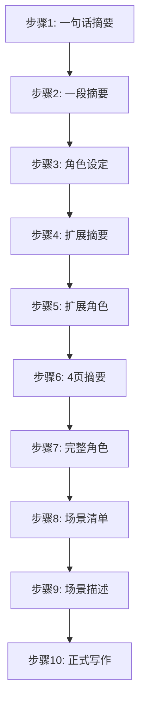
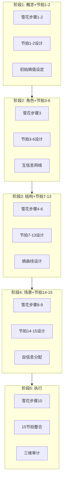

# 雪花写作法 × 救猫咪节拍表 × 信息论：终极小说创作SOP

> 三大体系深度融合：雪花的层层扩展 + 节拍的情绪节奏 + 信息论的量化控制

---

## 目录

1. [三大体系概述](#一三大体系概述)
2. [融合映射矩阵](#二融合映射矩阵)
3. [15节拍信息论详解](#三15节拍信息论详解)
4. [完整SOP工作流](#四完整sop工作流)
5. [AI辅助提示词库](#五ai辅助提示词库)
6. [质量检查清单](#六质量检查清单)

---

## 一、三大体系概述

### 1.1 雪花写作法（结构框架）

> **核心理念**：好的小说是设计出来的，像雪花一样层层扩展



### 1.2 救猫咪15节拍表（情绪节奏）

> **核心理念**：故事是情绪的过山车，15个节拍触发特定情绪反应

```mermaid
flowchart LR
    subgraph 第一幕[第一幕·开端]
        B1[1.开场画面]
        B2[2.主题呈现]
        B3[3.铺垫]
        B4[4.推动]
        B5[5.争执]
        B6[6.第二幕衔接点]
    end
    
    subgraph 第二幕[第二幕·中段]
        B7[7.B故事]
        B8[8.游戏]
        B9[9.中点]
        B10[10.坏蛋逼近]
        B11[11.一无所有]
        B12[12.灵魂黑夜]
        B13[13.第三幕衔接点]
    end
    
    subgraph 第三幕[第三幕·结尾]
        B14[14.结局]
        B15[15.终场画面]
    end
    
    B1 --> B2 --> B3 --> B4 --> B5 --> B6 --> B7 --> B8 --> B9 --> B10 --> B11 --> B12 --> B13 --> B14 --> B15
```



### 1.3 信息论三大概念（量化控制）

> **核心理念**：用数学思维管理不确定性

| 概念 | 公式 | 小说映射 |
|------|------|---------|
| **自信息** | $I(x) = -\log P(x)$ | 情节惊喜度 |
| **信息熵** | $H(X) = -\sum p(x)\log p(x)$ | 叙事节奏/悬念 |
| **互信息** | $I(X;Y) = H(X) - H(X|Y)$ | 角色/伏笔关联 |

---

## 二、融合映射矩阵

### 2.1 三体系融合总图

```mermaid
graph TB
    subgraph 雪花层[雪花写作法]
        X1[概念层]
        X2[角色层]
        X3[结构层]
        X4[场景层]
        X5[执行层]
    end
    
    subgraph 节拍层[救猫咪节拍]
        J1[第一幕 1-6]
        J2[第二幕A 7-9]
        J3[第二幕B 10-13]
        J4[第三幕 14-15]
    end
    
    subgraph 信息层[信息论]
        I1[信息熵 H(X)]
        I2[条件熵 H(X|Y)]
        I3[互信息 I(X;Y)]
        I4[自信息 I(x)]
    end
    
    X1 -->|"设定初始熵"| I1
    X1 -->|"映射到"| J1
    
    X2 -->|"建立互信息"| I3
    X2 -->|"贯穿所有节拍"| J1
    X2 -->|"贯穿所有节拍"| J2
    X2 -->|"贯穿所有节拍"| J3
    X2 -->|"贯穿所有节拍"| J4
    
    X3 -->|"设计熵曲线"| I2
    X3 -->|"对应"| J1
    X3 -->|"对应"| J2
    X3 -->|"对应"| J3
    X3 -->|"对应"| J4
    
    X4 -->|"分配自信息"| I4
    X4 -->|"细化"| J1
    X4 -->|"细化"| J2
    X4 -->|"细化"| J3
    X4 -->|"细化"| J4
    
    X5 -->|"综合应用"| I1
    X5 -->|"综合应用"| I2
    X5 -->|"综合应用"| I3
    X5 -->|"综合应用"| I4
    
    style X1 fill:#f96,stroke:#333
    style X5 fill:#9f6,stroke:#333,stroke-width:2px
    style J2 fill:#bbf,stroke:#333
    style J3 fill:#bfb,stroke:#333
    style I2 fill:#fbb,stroke:#333
```

### 2.2 15节拍 × 信息论 映射表

| 节拍 | 名称 | 页码 | 情绪功能 | 信息论概念 | 信息论作用 |
|------|------|------|---------|-----------|-----------|
| **1** | 开场画面 | 第1页 | 定调 | **信息熵** | 设定初始熵值，建立世界观不确定性 |
| **2** | 主题呈现 | 第5页 | 暗示 | **互信息** | 埋下主题线索，与后续情节建立关联 |
| **3** | 铺垫 | 第1-10页 | 建置 | **条件熵** | 保持高条件熵，展示人物原始状态 |
| **4** | 推动 | 第12页 | 催化 | **自信息** | 高自信息事件，打破常态 |
| **5** | 争执 | 第12-25页 | 辩论 | **信息熵** | 熵值波动，内心冲突 |
| **6** | 第二幕衔接点 | 第25页 | 转折 | **互信息** | 角色关系突变，互信息重构 |
| **7** | B故事 | 第30页 | 并行 | **互信息** | 建立A/B故事互信息通道 |
| **8** | 游戏 | 第30-55页 | 爽点 | **自信息** | 高自信息密度，读者愉悦 |
| **9** | 中点 | 第55页 | 升级 | **自信息** | 极高自信息，虚假胜利/失败 |
| **10** | 坏蛋逼近 | 第55-75页 | 压力 | **条件熵** | 条件熵下降，真相逼近 |
| **11** | 一无所有 | 第75页 | 低谷 | **信息熵** | 熵值谷底，失去一切 |
| **12** | 灵魂黑夜 | 第75-85页 | 反思 | **互信息** | 领悟互信息，发现隐藏关联 |
| **13** | 第三幕衔接点 | 第85页 | 觉醒 | **自信息** | 顿悟时刻，高自信息 |
| **14** | 结局 | 第85-110页 | 高潮 | **条件熵** | 条件熵归零，真相揭晓 |
| **15** | 终场画面 | 第110页 | 收束 | **信息熵** | 熵值归零，确定感满足 |

---

## 三、15节拍信息论详解

### 3.1 第一幕：开端（节拍1-6）

> **核心信息论任务**：设定初始熵值，建立世界观，埋下互信息线索

```mermaid
xychart-beta
    title "第一幕信息熵变化曲线"
    x-axis [开场, 主题, 铺垫, 推动, 争执, 衔接点]
    y-axis "信息熵/条件熵" 0 --> 1
    line [0.9, 0.85, 0.9, 0.7, 0.75, 0.6]
```

#### 节拍1：开场画面（第1页）

**情绪功能**：定调、展示题材、类型、影调

**信息论映射**：
- **信息熵 H(X)**：设定故事的初始不确定性
- **目标**：中等偏高熵值（有好奇但不过度）

**设计要点**：
```markdown
【信息论设计】
- 熵值设定：H(故事) = 中高（0.7-0.8）
- 展示前史，但不揭示核心秘密
- 建立世界观的不确定性空间

【检查清单】
- [ ] 是否展示了主角的原始状态？
- [ ] 是否设定了故事类型/基调？
- [ ] 是否保留了足够的好奇空间？
- [ ] 熵值是否适中（不过高/过低）？
```

**AI提示词**：
```
【节拍1：开场画面】

设计开场画面，要求：
1. 展示主角原始状态
2. 设定故事类型/基调
3. 设定初始信息熵（中高，0.7-0.8）
4. 保留核心秘密，建立好奇空间

输出：300字以内的开场场景
```

---

#### 节拍2：主题呈现（第5页）

**情绪功能**：通过对话暗示主题

**信息论映射**：
- **互信息 I(X;Y)**：埋下主题与后续情节的关联线索
- **目标**：建立"主题-情节"的弱互信息通道

**设计要点**：
```markdown
【信息论设计】
- 互信息等级：低-中（表面无关，深层关联）
- 通过配角之口说出主题暗示
- 主角此时不以为意，后期回响

【检查清单】
- [ ] 是否有人对主角说出主题相关的话？
- [ ] 这种表述是否足够隐晦？
- [ ] 是否与后续情节建立互信息关联？
```

---

#### 节拍3：铺垫（第1-10页）

**情绪功能**：展现人物原始状态，建立内在/外在问题

**信息论映射**：
- **条件熵 H(X|Y)**：保持高条件熵，展示人物问题
- **目标**：H(结局|已知) 保持高位，悬念充足

**设计要点**：
```markdown
【信息论设计】
- 条件熵维持：H(结局|铺垫) > 0.8
- 展示主角的缺陷/问题（需要改变的地方）
- 每个问题都是后期反转的伏笔（互信息预设）

【检查清单】
- [ ] 是否展示了主角的内在问题？
- [ ] 是否展示了主角的外在问题？
- [ ] 是否为每个问题埋下改变线索？
- [ ] 条件熵是否保持高位？
```

---

#### 节拍4：推动（第12页）

**情绪功能**：催化剂，改变主角命运的外部事件

**信息论映射**：
- **自信息 I(x)**：高自信息事件，打破常态
- **目标**：I(x) > 2 bit，足够意外

**设计要点**：
```markdown
【信息论设计】
- 自信息值：高（>2 bit）
- 打破主角的常态生活
- 迫使主角必须做出反应

【检查清单】
- [ ] 事件是否足够意外（高自信息）？
- [ ] 是否彻底改变了主角的生活？
- [ ] 主角是否无法忽视这个事件？
```

---

#### 节拍5：争执（第12-25页）

**情绪功能**：内心辩论，是否接受挑战

**信息论映射**：
- **信息熵 H(X)**：熵值波动，内心冲突
- **目标**：展示决策的不确定性

**设计要点**：
```markdown
【信息论设计】
- 熵值波动：0.6 → 0.8 → 0.7
- 展示主角的犹豫和恐惧
- 各种选择的概率分布

【检查清单】
- [ ] 主角是否经历了内心挣扎？
- [ ] 是否展示了不同选择的可能性？
- [ ] 最终选择是否有足够的说服力？
```

---

#### 节拍6：第二幕衔接点（第25页）

**情绪功能**：主角做出选择，进入新世界

**信息论映射**：
- **互信息 I(X;Y)**：角色关系突变，互信息重构
- **目标**：建立新的角色关联网络

**设计要点**：
```markdown
【信息论设计】
- 互信息重构：旧关系改变，新关系建立
- 主角进入"新世界"
- 与B故事角色建立互信息

【检查清单】
- [ ] 主角是否做出了不可逆转的选择？
- [ ] 是否进入了新的环境/世界？
- [ ] 角色关系是否发生了质变？
```

---

### 3.2 第二幕A：游戏时间（节拍7-9）

> **核心信息论任务**：高自信息密度，读者愉悦，建立A/B故事关联

```mermaid
xychart-beta
    title "第二幕A信息熵变化曲线"
    x-axis [B故事, 游戏开始, 游戏中, 中点]
    y-axis "自信息/信息熵" 0 --> 1
    line [0.6, 0.7, 0.8, 0.9]
```

#### 节拍7：B故事（第30页）

**情绪功能**：并行故事线，通常是爱情/友情线

**信息论映射**：
- **互信息 I(X;Y)**：建立A/B故事的互信息通道
- **目标**：I(A故事;B故事) 适中，后期交汇

**设计要点**：
```markdown
【信息论设计】
- 互信息等级：中（表面独立，深层关联）
- B故事角色与A故事建立弱关联
- 为后期A/B交汇埋下线索

【检查清单】
- [ ] B故事是否与A故事有隐藏关联？
- [ ] B故事角色是否影响主角成长？
- [ ] 是否为后期交汇埋下伏笔？
```

---

#### 节拍8：游戏（第30-55页）

**情绪功能**：爽点密集，主角享受新世界

**信息论映射**：
- **自信息 I(x)**：高自信息密度，读者愉悦
- **目标**：连续中高自信息事件

**设计要点**：
```markdown
【信息论设计】
- 自信息分布：连续中高值（1.5-2.5 bit）
- 主角获得能力/成功/快乐
- 读者享受"如果我也能这样"的幻想

【检查清单】
- [ ] 是否有连续的高爽点情节？
- [ ] 主角是否在新世界获得成功？
- [ ] 自信息是否足够密集？
```

---

#### 节拍9：中点（第55页）

**情绪功能**：虚假胜利或虚假失败， stakes升高

**信息论映射**：
- **自信息 I(x)**：极高自信息，重大转折
- **目标**：I(x) > 3 bit，全片关键节点

**设计要点**：
```markdown
【信息论设计】
- 自信息值：极高（>3 bit）
- 虚假胜利：主角以为赢了，实际危机将至
- 或虚假失败：主角以为输了，实际转机暗藏
-  stakes（风险）大幅升高

【检查清单】
- [ ] 是否是全片最大的转折点之一？
- [ ] 自信息是否足够高？
- [ ] stakes是否大幅升高？
- [ ] 是否为后续埋下更大危机？
```

---

### 3.3 第二幕B：压力升级（节拍10-13）

> **核心信息论任务**：条件熵下降，真相逼近，互信息领悟

```mermaid
xychart-beta
    title "第二幕B信息熵变化曲线"
    x-axis [坏蛋逼近, 一无所有, 灵魂黑夜, 衔接点]
    y-axis "条件熵/互信息" 0 --> 1
    line [0.5, 0.2, 0.3, 0.4]
```

#### 节拍10：坏蛋逼近（第55-75页）

**情绪功能**：反派/压力逼近，主角节节败退

**信息论映射**：
- **条件熵 H(X|Y)**：条件熵下降，真相逼近
- **目标**：H(真相|已知) 稳步下降

**设计要点**：
```markdown
【信息论设计】
- 条件熵下降：H(真相|已知) 从0.6→0.3
- 反派/压力逐步揭示真相
- 主角失去盟友/资源

【检查清单】
- [ ] 反派/压力是否逐步升级？
- [ ] 主角是否节节败退？
- [ ] 真相是否逐步逼近？
```

---

#### 节拍11：一无所有（第75页）

**情绪功能**：主角失去一切，跌至谷底

**信息论映射**：
- **信息熵 H(X)**：熵值谷底，失去方向
- **目标**：H(X) 降至最低点

**设计要点**：
```markdown
【信息论设计】
- 熵值谷底：H(X) ≈ 0.1-0.2
- 主角失去一切（物质/精神/关系）
- 死亡的隐喻（旧我死去）

【检查清单】
- [ ] 主角是否失去了最重要的东西？
- [ ] 是否达到了情绪最低点？
- [ ] 是否为重生创造了条件？
```

---

#### 节拍12：灵魂黑夜（第75-85页）

**情绪功能**：反思、领悟、发现隐藏关联

**信息论映射**：
- **互信息 I(X;Y)**：领悟互信息，发现隐藏关联
- **目标**：I(主角;真相) 突然升高

**设计要点**：
```markdown
【信息论设计】
- 互信息顿悟：发现之前忽略的关联
- 主题回响：想起节拍2的主题暗示
- B故事启示：从B故事获得解决A故事的灵感

【检查清单】
- [ ] 主角是否经历了深刻反思？
- [ ] 是否发现了之前忽略的线索？
- [ ] 是否领悟了主题的真谛？
```

---

#### 节拍13：第三幕衔接点（第85页）

**情绪功能**：主角觉醒，找到解决方案

**信息论映射**：
- **自信息 I(x)**：顿悟时刻，高自信息
- **目标**：I(x) > 2.5 bit，解决方案出现

**设计要点**：
```markdown
【信息论设计】
- 自信息值：高（>2.5 bit）
- 主角找到解决方案
- 但代价巨大（需要牺牲）

【检查清单】
- [ ] 主角是否找到了解决方案？
- [ ] 解决方案是否有代价？
- [ ] 是否准备好进入最终决战？
```

---

### 3.4 第三幕：结局（节拍14-15）

> **核心信息论任务**：条件熵归零，真相揭晓，熵值归零

```mermaid
xychart-beta
    title "第三幕信息熵变化曲线"
    x-axis [结局开始, 高潮, 真相, 终场]
    y-axis "条件熵/信息熵" 0 --> 1
    line [0.3, 0.1, 0, 0]
```

#### 节拍14：结局（第85-110页）

**情绪功能**：高潮、决战、真相揭晓

**信息论映射**：
- **条件熵 H(X|Y)**：条件熵归零，真相揭晓
- **目标**：H(真相|全部已知) = 0

**设计要点**：
```markdown
【信息论设计】
- 条件熵归零：所有悬念揭晓
- 主角应用新获得的领悟
- A/B故事交汇，互信息最大化

【检查清单】
- [ ] 所有悬念是否揭晓？
- [ ] 主角是否应用了新领悟？
- [ ] A/B故事是否完美交汇？
```

---

#### 节拍15：终场画面（第110页）

**情绪功能**：与开场画面对照，展示改变

**信息论映射**：
- **信息熵 H(X)**：熵值归零，确定感满足
- **目标**：H(X) = 0，故事完全确定

**设计要点**：
```markdown
【信息论设计】
- 熵值归零：H(X) = 0
- 与开场画面对照
- 展示主角的彻底改变
- 读者获得确定感和满足感

【检查清单】
- [ ] 是否与开场画面对照？
- [ ] 是否展示了主角的改变？
- [ ] 读者是否获得满足感？
```

---

## 四、完整SOP工作流

### 4.1 工作流总图



### 4.2 各阶段详细流程

#### 阶段1：概念设计 + 节拍1-2

**时间**：2小时
**输出**：一句话摘要 + 一段摘要 + 节拍1-2设计

```markdown
【阶段1操作清单】

□ 雪花步骤1：一句话摘要（1小时）
  - 设定初始信息熵（中高）
  
□ 雪花步骤2：一段摘要（1小时）
  - 5句话对应三幕结构
  - 规划条件熵下降曲线
  
□ 节拍1设计：开场画面
  - 展示主角原始状态
  - 设定H(故事) = 0.7-0.8
  
□ 节拍2设计：主题呈现
  - 埋下主题-情节互信息
  - 弱关联，后期回响

【信息论检查】
- 初始熵值：?/10
- 主题互信息：?/10
```

---

#### 阶段2：角色设计 + 节拍3-6

**时间**：3-5天
**输出**：角色卡 + 节拍3-6详细设计 + 互信息网络

```markdown
【阶段2操作清单】

□ 雪花步骤3：基础角色卡（每角色1小时）
  - 角色熵值评估
  
□ 节拍3设计：铺垫（第1-10页）
  - 保持高条件熵 H>0.8
  - 展示人物问题
  
□ 节拍4设计：推动（第12页）
  - 高自信息事件 I>2
  - 催化剂功能
  
□ 节拍5设计：争执（第12-25页）
  - 熵值波动
  - 内心冲突
  
□ 节拍6设计：第二幕衔接点（第25页）
  - 互信息重构
  - 进入新世界

□ 雪花步骤5：扩展角色（1-2天）
  - 深化互信息网络
  - 设计隐藏关系

【信息论检查】
- 角色互信息网络：?/10
- 节拍3-6信息论契合度：?/10
```

---

#### 阶段3：结构设计 + 节拍7-13

**时间**：2-3周
**输出**：4页摘要 + 节拍7-13详细设计 + 熵曲线

```markdown
【阶段3操作清单】

□ 雪花步骤4：扩展摘要（几小时）
  - 细化条件熵下降曲线
  
□ 节拍7设计：B故事（第30页）
  - 建立A/B互信息通道
  
□ 节拍8设计：游戏（第30-55页）
  - 高自信息密度
  - 读者愉悦
  
□ 节拍9设计：中点（第55页）
  - 极高自信息 I>3
  - stakes升高
  
□ 雪花步骤6：4页摘要（1周）
  - 精确到章节级别
  - 每章目标熵值
  
□ 节拍10设计：坏蛋逼近（第55-75页）
  - 条件熵下降
  
□ 节拍11设计：一无所有（第75页）
  - 熵值谷底
  
□ 节拍12设计：灵魂黑夜（第75-85页）
  - 互信息顿悟
  
□ 节拍13设计：第三幕衔接点（第85页）
  - 高自信息顿悟

□ 雪花步骤7：完整角色（1周）
  - 完整角色介绍
  - 伏笔网络完善

【信息论检查】
- 熵曲线设计：?/10
- 节拍7-13信息论契合度：?/10
```

---

#### 阶段4：场景设计 + 节拍14-15

**时间**：2-3周
**输出**：场景清单 + 节拍14-15详细设计 + 自信息分配

```markdown
【阶段4操作清单】

□ 雪花步骤8：场景清单（1-2周）
  - 所有场景自信息评估
  - 分布检查（低60%/中25%/高15%）
  
□ 节拍14设计：结局（第85-110页）
  - 条件熵归零
  - 真相揭晓
  
□ 节拍15设计：终场画面（第110页）
  - 熵值归零
  - 与开场对照
  
□ 雪花步骤9：场景描述（数周）
  - 每场景详细描述
  - 自信息分布优化

【信息论检查】
- 自信息分布：?/10
- 节拍14-15信息论契合度：?/10
```

---

#### 阶段5：执行写作

**时间**：持续
**输出**：小说正文 + 持续审计

```markdown
【阶段5操作清单】

□ 雪花步骤10：正式写作
  - 根据场景描述写作
  
□ 15节拍整合检查
  - 每个节拍是否到位？
  - 情绪节奏是否流畅？
  
□ 信息论三维审计（每章）
  - 自信息评分：?/10
  - 信息熵评分：?/10
  - 互信息评分：?/10
  
□ 动态迭代
  - 根据审计结果调整
  - 保持前进势头

【最终检查】
- 15节拍完整性：?/15
- 信息论三维平均：?/10
- 整体质量评级：?
```

---

## 五、AI辅助提示词库

### 5.1 15节拍生成提示词

```
【15节拍 × 信息论：节拍生成器】

你是一位精通救猫咪节拍表和信息论的资深编剧。请为以下小说生成15节拍设计。

【输入】
- 小说类型：{填写}
- 一句话摘要：{填写}
- 主角设定：{填写}
- 目标页数：{填写}

【输出要求】

为每个节拍提供：
1. 节拍名称和页码
2. 情绪功能描述
3. 信息论映射：
   - 使用概念（自信息/信息熵/互信息/条件熵）
   - 具体数值目标
4. 设计要点
5. 检查清单

【15节拍清单】

第一幕（开端）：
□ 节拍1 开场画面（第1页）
  - 情绪：定调
  - 信息论：信息熵 H=0.7-0.8
  
□ 节拍2 主题呈现（第5页）
  - 情绪：暗示
  - 信息论：互信息 I=低-中
  
□ 节拍3 铺垫（第1-10页）
  - 情绪：建置
  - 信息论：条件熵 H>0.8
  
□ 节拍4 推动（第12页）
  - 情绪：催化
  - 信息论：自信息 I>2
  
□ 节拍5 争执（第12-25页）
  - 情绪：辩论
  - 信息论：信息熵波动
  
□ 节拍6 第二幕衔接点（第25页）
  - 情绪：转折
  - 信息论：互信息重构

第二幕A（游戏）：
□ 节拍7 B故事（第30页）
  - 情绪：并行
  - 信息论：互信息通道
  
□ 节拍8 游戏（第30-55页）
  - 情绪：爽点
  - 信息论：自信息密集
  
□ 节拍9 中点（第55页）
  - 情绪：升级
  - 信息论：自信息 I>3

第二幕B（压力）：
□ 节拍10 坏蛋逼近（第55-75页）
  - 情绪：压力
  - 信息论：条件熵下降
  
□ 节拍11 一无所有（第75页）
  - 情绪：低谷
  - 信息论：熵值谷底
  
□ 节拍12 灵魂黑夜（第75-85页）
  - 情绪：反思
  - 信息论：互信息顿悟
  
□ 节拍13 第三幕衔接点（第85页）
  - 情绪：觉醒
  - 信息论：自信息顿悟

第三幕（结局）：
□ 节拍14 结局（第85-110页）
  - 情绪：高潮
  - 信息论：条件熵归零
  
□ 节拍15 终场画面（第110页）
  - 情绪：收束
  - 信息论：熵值归零

【输出格式】
每个节拍包含：
- 节拍描述（100字）
- 信息论分析
- 设计检查清单
```

### 5.2 节拍审计提示词

```
【15节拍 × 信息论：节拍审计】

你是一位严格的剧本审计师。请对以下小说的15节拍进行信息论审计。

【输入】
- 小说正文/大纲：{粘贴}
- 15节拍定位：{标注各节拍位置}

【审计维度】

1. 【节拍完整性审计】
   - 15个节拍是否都存在？
   - 每个节拍的功能是否到位？
   - 节拍之间过渡是否流畅？

2. 【信息论契合度审计】
   
   对每个节拍：
   - 节拍1：初始熵值是否适中？
   - 节拍2：主题互信息是否埋下？
   - 节拍3：条件熵是否保持高位？
   - 节拍4：自信息是否足够高？
   - 节拍5：熵值波动是否合理？
   - 节拍6：互信息是否重构？
   - 节拍7：A/B互信息是否建立？
   - 节拍8：自信息密度是否足够？
   - 节拍9：自信息是否达到峰值？
   - 节拍10：条件熵是否下降？
   - 节拍11：熵值是否达到谷底？
   - 节拍12：互信息是否顿悟？
   - 节拍13：自信息是否顿悟？
   - 节拍14：条件熵是否归零？
   - 节拍15：熵值是否归零？

3. 【情绪节奏审计】
   - 情绪曲线是否流畅？
   - 高潮/低谷是否到位？
   - 读者情绪是否被有效调动？

【输出格式】
- 各节拍评分（1-10分）
- 问题清单
- 改进建议
- 修改后的节拍设计
```

---

## 六、质量检查清单

### 6.1 15节拍完整性检查

| 节拍 | 名称 | 检查项 | 结果 |
|------|------|--------|------|
| 1 | 开场画面 | 是否展示主角原始状态？ | ✅/❌ |
| 2 | 主题呈现 | 是否有人暗示主题？ | ✅/❌ |
| 3 | 铺垫 | 是否展示人物问题？ | ✅/❌ |
| 4 | 推动 | 是否有催化剂事件？ | ✅/❌ |
| 5 | 争执 | 是否有内心挣扎？ | ✅/❌ |
| 6 | 第二幕衔接点 | 是否进入新世界？ | ✅/❌ |
| 7 | B故事 | 是否建立并行故事？ | ✅/❌ |
| 8 | 游戏 | 是否有爽点密集区？ | ✅/❌ |
| 9 | 中点 | 是否有重大转折？ | ✅/❌ |
| 10 | 坏蛋逼近 | 压力是否升级？ | ✅/❌ |
| 11 | 一无所有 | 是否跌至谷底？ | ✅/❌ |
| 12 | 灵魂黑夜 | 是否有深刻反思？ | ✅/❌ |
| 13 | 第三幕衔接点 | 是否找到解决方案？ | ✅/❌ |
| 14 | 结局 | 是否揭晓所有悬念？ | ✅/❌ |
| 15 | 终场画面 | 是否与开场对照？ | ✅/❌ |
| **完整性** | | **?/15** | |

### 6.2 信息论三维检查

| 维度 | 检查项 | 目标 | 实际 | 达标? |
|------|--------|------|------|-------|
| **自信息** | 高自信息事件密度 | 10-15% | ?% | |
| | 分布均匀度 | 避免等距 | ? | |
| | 伏笔支撑率 | >80% | ?% | |
| **信息熵** | 初始熵值 | 0.7-0.8 | ? | |
| | 条件熵下降曲线 | 平滑下降 | ? | |
| | 谷底/峰值到位 | 是 | ? | |
| **互信息** | 角色网络深度 | 有隐藏关系 | ? | |
| | 伏笔-真相关联 | 适中 | ? | |
| | A/B故事交汇 | 完美 | ? | |

### 6.3 综合质量评级

```markdown
【终极SOP质量评估】

## 雪花写作法完成度
- 步骤1-2（概念）：?/10
- 步骤3-5-7（角色）：?/10
- 步骤4-6（结构）：?/10
- 步骤8-9（场景）：?/10
- 步骤10（执行）：?/10
- **雪花总分**：?/10

## 15节拍完成度
- 第一幕（节拍1-6）：?/6
- 第二幕A（节拍7-9）：?/3
- 第二幕B（节拍10-13）：?/4
- 第三幕（节拍14-15）：?/2
- **节拍总分**：?/15 → ?/10

## 信息论三维评分
- 自信息维度：?/10
- 信息熵维度：?/10
- 互信息维度：?/10
- **信息论总分**：?/10

## 综合评级
- 三维平均：?/10
- 评级：
  - S级（≥9.0）：完美契合
  - A级（≥8.0）：优秀
  - B级（≥7.0）：良好
  - C级（≥6.0）：合格
  - D级（<6.0）：需大幅改进
```

---

## 七、总结

### 三大体系融合价值

| 体系 | 核心优势 | 融合后增强 |
|------|---------|-----------|
| **雪花写作法** | 层层扩展，结构清晰 | 每层扩展都有信息论量化指导 |
| **救猫咪节拍** | 情绪节奏，观众导向 | 每个节拍都有信息论理论支撑 |
| **信息论** | 量化控制，科学管理 | 抽象概念具象化为可操作的节拍 |

### 核心洞察

> [!tip] 雪花是骨架，节拍是血肉，信息论是灵魂
> 
> - **雪花**提供结构框架：从概念到场景的层层扩展
> - **节拍**提供情绪节奏：15个情绪触发点
> - **信息论**提供量化控制：用数学管理不确定性

### 使用建议

1. **新手路径**：先学节拍 → 再用雪花扩展 → 最后用信息论优化
2. **老手路径**：直接用SOP工作流 → 重点优化信息论三维指标
3. **AI辅助**：使用提示词库快速生成和审计

---

*本终极SOP将雪花写作法、救猫咪15节拍表、信息论三大体系深度融合，为小说创作提供从结构到情绪到量化的全方位方法论。*

#雪花写作法 #救猫咪 #节拍表 #信息论 #SOP #小说创作 #AI写作