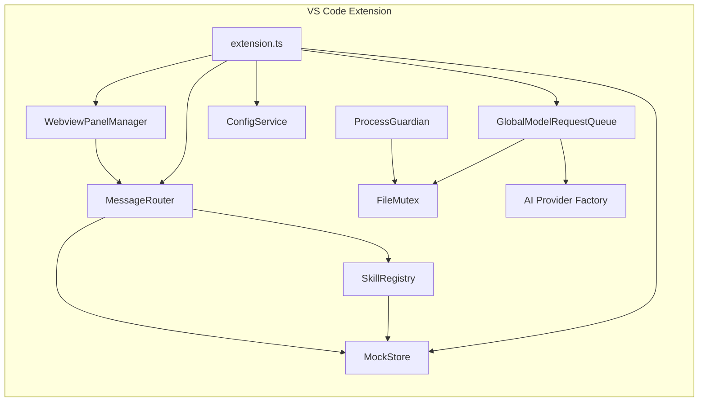

# StoryTree2 Code Wiki

> **项目**: OpenCode Creative Studio (StoryTree2)
> **版本**: v2.0
> **最后更新**: 2026-06-10
> **状态**: 持续更新中

---

## 目录

1. [项目概述](#1-项目概述)
2. [项目架构](#2-项目架构)
3. [核心模块详解](#3-核心模块详解)
   - 3.1 [VS Code Extension 核心模块](#31-vs-code-extension-核心模块)
   - 3.2 [Claude-Code-Src 参考架构](#32-claude-code-src-参考架构)
   - 3.3 [Novel Editor (OpenCode 二次开发)](#33-novel-editor-opencode-二次开发)
4. [关键类和函数说明](#4-关键类和函数说明)
5. [依赖关系](#5-依赖关系)
6. [项目运行方式](#6-项目运行方式)
7. [数据类型定义](#7-数据类型定义)
8. [扩展点与接口](#8-扩展点与接口)
9. [测试体系](#9-测试体系)
10. [附录](#10-附录)

---

## 1. 项目概述

### 1.1 项目定位

**StoryTree2** 是一个基于 Claude-Code 架构的开放式 AI 创作平台，采用 **clean-room architecture rewrite** 方法论，在借鉴 Claude Code 架构、抽象、流程和模块边界的基础上，进行独立的原创实现。

### 1.2 核心设计原则

| 原则 | 说明 |
|------|------|
| **Novel Editor Core** | 小说编辑器作为免费 Core Product，而非付费插件 |
| **Skill/Plugin/Provider 严格区分** | Skill 是任务说明包，Plugin 是产品模块，Provider 是外部服务适配器 |
| **Creative Agent Runtime** | 底层执行内核，负责 Agent 的运行机制 |
| **Creative Core** | 业务抽象层，负责创作项目的管理 |

### 1.3 项目结构

```
storytree2/
├── caiode/                          # 核心代码目录
│   ├── claude-code-src/             # Claude Code 源码分析基准（研究材料）
│   │   ├── QueryEngine.ts           # 会话生命周期管理引擎
│   │   ├── query.ts                 # Agent 主循环实现
│   │   ├── Tool.ts / tools.ts       # 工具抽象与注册
│   │   ├── Task.ts / tasks.ts       # 任务状态机管理
│   │   ├── skills/                  # Skill 发现与加载
│   │   ├── commands.ts              # 命令注册与分发
│   │   ├── context.ts               # 上下文构建与压缩
│   │   ├── state/                   # 状态持久化管理
│   │   ├── bridge/                  # 外部服务桥接
│   │   ├── hooks/                   # 生命周期扩展点
│   │   └── cost-tracker.ts          # 成本追踪统计
│   │
│   ├── vscode-extension/            # VS Code 扩展实现
│   │   ├── src/
│   │   │   ├── extension.ts         # 扩展主入口
│   │   │   ├── core/                # 核心服务层
│   │   │   │   ├── message-router.ts      # JSON-RPC 消息路由
│   │   │   │   ├── global-model-request-queue.ts  # LLM 请求队列
│   │   │   │   ├── file-mutex.ts          # 文件互斥锁
│   │   │   │   ├── config-service.ts      # 配置服务
│   │   │   │   ├── mock-store.ts          # Mock 数据存储
│   │   │   │   ├── process-guardian.ts    # 进程守护
│   │   │   │   ├── event-bus.ts           # 事件总线
│   │   │   │   ├── rpc-adapter.ts         # RPC 适配器
│   │   │   │   ├── queue-monitor.ts       # 队列监控
│   │   │   │   ├── sqlite-db.ts           # SQLite 数据库
│   │   │   │   ├── secret-manager.ts      # 密钥管理
│   │   │   │   └── ai/                    # AI Provider 层
│   │   │   │       ├── provider-factory.ts    # Provider 工厂
│   │   │   │       ├── openai-provider.ts     # OpenAI 适配
│   │   │   │       ├── anthropic-provider.ts  # Anthropic 适配
│   │   │   │       ├── ollama-provider.ts     # Ollama 本地模型
│   │   │   │       ├── stream-processor.ts    # 流式响应处理
│   │   │   │       └── conversation-manager.ts # 对话管理
│   │   │   ├── webview/               # Webview 面板层
│   │   │   │   ├── panel-manager.ts       # 面板管理器
│   │   │   │   ├── ai-chat-panel.ts       # AI 聊天面板
│   │   │   │   ├── enhanced-dashboard.ts  # 增强仪表板
│   │   │   │   ├── settings-page.ts       # 设置页面
│   │   │   │   ├── workbench-page.ts      # 工作台页面
│   │   │   │   └── html-generator.ts      # HTML 生成器
│   │   │   ├── automation/            # 自动化层
│   │   │   │   ├── orchestrator/task-orchestrator.ts  # 任务编排器
│   │   │   │   ├── queue/automation-queue.ts          # 自动化队列
│   │   │   │   └── drivers/cdp-driver.ts              # CDP 驱动
│   │   │   ├── skills/                # Skill 系统
│   │   │   │   ├── skill-registry.ts      # Skill 注册表
│   │   │   │   └── types.ts               # Skill 类型定义
│   │   │   ├── rules/                 # 规则引擎
│   │   │   │   ├── rule-engine.ts         # 规则执行引擎
│   │   │   │   └── types.ts               # 规则类型定义
│   │   │   └── types/                 # 共享类型
│   │   │       └── ipc-protocol.ts        # IPC 通信协议
│   │   └── __tests__/                 # 测试目录（45+ 测试文件）
│   │
│   ├── opencode-1.4.0/              # OpenCode 核心实现（参考）
│   └── Trae-Ralph-main/             # Trae + Ralph 工具链
│
├── backups/                         # 备份和历史文件
│   ├── dreamweaver/                 # Next.js 前端（已废弃）
│   └── patches/                     # Git 补丁历史
│
├── docs/                            # 项目文档
│   ├── roadmap/                     # 路书文档（13份架构文档）
│   ├── planning/                    # 规划文档
│   ├── stitch/                      # Stitch 原型场景文档
│   ├── task-reports/                # 任务报告
│   ├── boundary/                    # 边界与规范
│   ├── CODE_WIKI.md                 # 本文档
│   └── CODE_WIKI_INDEX.md           # 文档索引
│
├── workspaces/                      # 多模型 AI 工作空间
│   ├── Claude/, Kimi-K2.5/, MiniMax-M2/, Gemini/ 等
│
└── .trae/                           # Agent 规则和工具
    ├── rules/                       # Ralph 执行规则
    ├── skills/                      # Agent 技能定义
    └── documents/                   # PRD 和分析文档
```

---

## 2. 项目架构

### 2.1 三层架构模型

```text
┌─────────────────────────────────────────────────────────────┐
│                    Presentation Layer (UI)                  │
│  ┌─────────────┐  ┌─────────────┐  ┌─────────────────────┐ │
│  │ Novel Editor │  │ Plugin Pages │  │ Settings Panels    │ │
│  └─────────────┘  └─────────────┘  └─────────────────────┘ │
├─────────────────────────────────────────────────────────────┤
│                    Creative Core (Business)                 │
│  ┌─────────────┐  ┌─────────────┐  ┌─────────────────────┐ │
│  │ Project     │  │ Asset       │  │ License Gate        │ │
│  │ Workspace   │  │ Library     │  │                     │ │
│  └─────────────┘  └─────────────┘  └─────────────────────┘ │
├─────────────────────────────────────────────────────────────┤
│               Creative Agent Runtime (Kernel)               │
│  ┌─────────────┐  ┌─────────────┐  ┌─────────────────────┐ │
│  │ AgentLoop   │  │ TaskRuntime │  │ ToolRuntime         │ │
│  │             │  │             │  │                     │ │
│  └─────────────┘  └─────────────┘  └─────────────────────┘ │
└─────────────────────────────────────────────────────────────┘
```

### 2.2 VS Code Extension 运行时架构

```text
┌─────────────────────────────────────────────────────────────┐
│                    VS Code Extension Host                    │
│  ┌─────────────────────────────────────────────────────┐   │
│  │              extension.ts (主入口)                   │   │
│  │  • activate() / deactivate()                        │   │
│  │  • 初始化所有子系统                                  │   │
│  └─────────────────────────────────────────────────────┘   │
│                              │                              │
│  ┌───────────────────────────┼───────────────────────────┐ │
│  │                           ▼                           │ │
│  │  ┌─────────────┐  ┌─────────────┐  ┌─────────────┐   │ │
│  │  │ Message     │  │ Webview     │  │ GlobalModel │   │ │
│  │  │ Router      │  │ Manager     │  │ Queue       │   │ │
│  │  │ (JSON-RPC)  │  │ (UI 面板)    │  │ (LLM 调度)   │   │ │
│  │  └─────────────┘  └─────────────┘  └─────────────┘   │ │
│  │         │                  │                  │       │ │
│  │         ▼                  ▼                  ▼       │ │
│  │  ┌─────────────┐  ┌─────────────┐  ┌─────────────┐   │ │
│  │  │ Mock Store  │  │ AI Provider │  │ FileMutex   │   │ │
│  │  │ (数据层)     │  │ Factory     │  │ (并发控制)   │   │ │
│  │  └─────────────┘  └─────────────┘  └─────────────┘   │ │
│  │                                                       │ │
│  │  ┌─────────────┐  ┌─────────────┐  ┌─────────────┐   │ │
│  │  │ Skill       │  │ Process     │  │ Config      │   │ │
│  │  │ Registry    │  │ Guardian    │  │ Service     │   │ │
│  │  └─────────────┘  └─────────────┘  └─────────────┘   │ │
│  └───────────────────────────────────────────────────────┘ │
└─────────────────────────────────────────────────────────────┘
```

---

## 3. 核心模块详解

### 3.1 VS Code Extension 核心模块

#### 3.1.1 extension.ts - 扩展主入口

| 属性 | 说明 |
|------|------|
| **职责** | VS Code 扩展生命周期管理、子系统初始化、命令注册 |
| **核心函数** | `activate()`, `deactivate()`, `registerCommands()` |
| **初始化顺序** | Mock Data → Message Router → Webview Manager → Global Queue → Config Service |

**关键代码**:
```typescript
export function activate(context: vscode.ExtensionContext): void {
  initializeMockData();
  initializeMessageRouter();
  initializeWebviewManager();
  initializeGlobalModelQueue();
  initializeConfigService();
  registerCommands();
}
```

#### 3.1.2 MessageRouter - JSON-RPC 消息路由

| 属性 | 说明 |
|------|------|
| **文件** | `caiode/vscode-extension/src/core/message-router.ts` |
| **职责** | 接收 IPC 消息，解析 JSON-RPC 请求，路由到对应处理器 |
| **核心能力** | Action 路由、中间件管道、错误处理、请求日志 |

**核心类**:
```typescript
export class MessageRouter {
  private handlers: Map<ActionName, { handler: ActionHandler; options: RouteOptions }>;
  private beforeMiddlewares: BeforeMiddleware[];
  private afterMiddlewares: AfterMiddleware[];

  on<T>(action: ActionName, handler: ActionHandler<T>, options?: RouteOptions): this;
  async processMessage(rawMessage: unknown): Promise<IPCResponse>;
  useBefore(middleware: BeforeMiddleware): this;
  useAfter(middleware: AfterMiddleware): this;
}
```

**处理流程**:
```
接收消息 → 解析请求 → Before 中间件 → 路由匹配 → 执行 Handler → After 中间件 → 返回响应
```

#### 3.1.3 GlobalModelRequestQueue - LLM 请求队列

| 属性 | 说明 |
|------|------|
| **文件** | `caiode/vscode-extension/src/core/global-model-request-queue.ts` |
| **职责** | 全局 LLM 请求串行化调度、优先级管理、超时重试 |
| **核心机制** | 全局锁 + 优先级队列 + 自动重试 |

**核心类**:
```typescript
export class GlobalModelRequestQueue extends EventEmitter {
  private queue: QueueRequestEntry[];
  private running: Set<string>;
  private provider: LLMProvider;
  private mutex: FileMutex;

  async enqueue(request: LLMRequest): Promise<LLMResponse>;
  async enqueuePriority(request: LLMRequest, priority: number): Promise<LLMResponse>;
  cancel(requestId: string): boolean;
  getQueueStatus(): QueueStatus;
}
```

**队列状态**:
```typescript
interface QueueStatus {
  pending: number;           // 等待中
  running: number;           // 运行中
  completed: number;         // 已完成
  failed: number;            // 失败
  totalProcessed: number;    // 总处理数
  averageWaitTime: number;   // 平均等待时间
  averageProcessingTime: number; // 平均处理时间
}
```

#### 3.1.4 FileMutex - 文件互斥锁

| 属性 | 说明 |
|------|------|
| **文件** | `caiode/vscode-extension/src/core/file-mutex.ts` |
| **职责** | 基于文件系统的分布式锁，防止并发冲突 |
| **依赖** | `proper-lockfile` |

**核心类**:
```typescript
export class FileMutex extends EventEmitter {
  async acquire(lockId: string, options?: LockOptions): Promise<LockHandle>;
  async release(handle: LockHandle): Promise<void>;
  async withLock<T>(lockId: string, fn: () => Promise<T>, options?: LockOptions): Promise<T>;
  async isLocked(lockId: string): Promise<boolean>;
  async forceRelease(lockId: string): Promise<void>;
}
```

#### 3.1.5 WebviewPanelManager - Webview 面板管理

| 属性 | 说明 |
|------|------|
| **文件** | `caiode/vscode-extension/src/webview/panel-manager.ts` |
| **职责** | 管理 VS Code Webview 面板生命周期、消息通信 |

**核心方法**:
```typescript
export class WebviewPanelManager implements vscode.Disposable {
  async showDashboard(): Promise<void>;      // 显示工作台
  async toggleAIChat(): Promise<void>;       // 切换 AI 聊天
  async createNewProject(): Promise<void>;   // 创建项目
  async createNewChapter(): Promise<void>;   // 创建章节
  async showWordCount(): Promise<void>;      // 字数统计
  async refresh(): Promise<void>;            // 刷新面板
}
```

#### 3.1.6 AI Provider 层

| 属性 | 说明 |
|------|------|
| **文件** | `caiode/vscode-extension/src/core/ai/` |
| **职责** | 多 LLM Provider 统一抽象和工厂创建 |

**Provider 接口**:
```typescript
export interface LLMProvider {
  readonly providerName: string;
  readonly supportedModels: readonly string[];

  chatCompletion(options: ChatCompletionOptions): Promise<ChatCompletionResult>;
  streamChatCompletion(options: ChatCompletionOptions, onChunk: StreamCallback, signal?: AbortSignal): Promise<ChatCompletionResult>;
  listModels?(): Promise<string[]>;
  dispose?(): void;
}
```

**Provider 工厂**:
```typescript
export function createLLMProvider(config: AIConfig): LLMProvider;
// 支持: openai | anthropic | ollama | custom
```

**已实现的 Provider**:
| Provider | 文件 | 默认模型 |
|----------|------|---------|
| OpenAI | `openai-provider.ts` | gpt-4o-mini |
| Anthropic | `anthropic-provider.ts` | claude-haiku-4-20250514 |
| Ollama | `ollama-provider.ts` | qwen2.5:7b |
| Noop (fallback) | `provider-factory.ts` | - |

#### 3.1.7 MockStore - Mock 数据存储

| 属性 | 说明 |
|------|------|
| **文件** | `caiode/vscode-extension/src/core/mock-store.ts` |
| **职责** | 内存数据存储，模拟数据库操作，用于开发和测试 |

**数据实体**:
```typescript
interface Project extends MockEntity { name, description, genre, status }
interface Chapter extends MockEntity { projectId, title, content, order, wordCount, status }
interface Character extends MockEntity { projectId, name, role, description, traits }
interface WorldSetting extends MockEntity { projectId, category, name, description }
interface OutlineNode extends MockEntity { projectId, chapterId, type, title, synopsis }
```

#### 3.1.8 ProcessGuardian - 进程守护

| 属性 | 说明 |
|------|------|
| **文件** | `caiode/vscode-extension/src/core/process-guardian.ts` |
| **职责** | 子进程生命周期管理、心跳监控、自动重启 |

**核心类**:
```typescript
export class ProcessGuardian extends EventEmitter {
  async spawn(config: ProcessConfig): Promise<ChildProcess>;
  async restart(name: string): Promise<boolean>;
  async stop(name: string): Promise<void>;
  async stopAll(): Promise<void>;
  getProcessStatus(name: string): ProcessStatus | null;
  isRunning(name: string): boolean;
}
```

**进程状态**:
```typescript
interface ProcessStatus {
  pid: number | null;
  name: string;
  state: "starting" | "running" | "heartbeat_missing" | "stopping" | "stopped" | "crashed";
  startTime: number;
  lastHeartbeat: number;
  restartCount: number;
  exitCode: number | null;
}
```

#### 3.1.9 SkillRegistry - Skill 注册表

| 属性 | 说明 |
|------|------|
| **文件** | `caiode/vscode-extension/src/skills/skill-registry.ts` |
| **职责** | Skill 发现、加载、沙箱绑定 |

**内置 Skill**:
| Skill ID | 名称 | 激活工具 | 触发关键词 |
|----------|------|---------|-----------|
| novel-writing | 小说写作 | ReadFileTool, WriteFileTool | 写小说、创作、故事 |
| code-review | 代码审查 | ReadFileTool, GrepTool | 代码审查、review |
| file-organizer | 文件整理 | ReadFileTool, WriteFileTool, BashTool | 整理文件、归档 |
| researcher | 资料收集 | ReadFileTool, WebFetchTool | 搜索、资料、研究 |

### 3.2 Claude-Code-Src 参考架构

#### 3.2.1 QueryEngine - 会话生命周期管理

| 属性 | 说明 |
|------|------|
| **文件** | `caiode/claude-code-src/QueryEngine.ts` |
| **职责** | 拥有查询生命周期和会话状态，每会话一个实例 |
| **核心方法** | `submitMessage()`, `interrupt()`, `getMessages()` |

**核心类**:
```typescript
export class QueryEngine {
  private config: QueryEngineConfig;
  private mutableMessages: Message[];
  private abortController: AbortController;
  private totalUsage: NonNullableUsage;

  async *submitMessage(prompt: string, options?: { uuid?: string; isMeta?: boolean }): AsyncGenerator<SDKMessage>;
  interrupt(): void;
  getMessages(): readonly Message[];
  setModel(model: string): void;
}
```

#### 3.2.2 Task - 任务状态机

| 属性 | 说明 |
|------|------|
| **文件** | `caiode/claude-code-src/Task.ts` |
| **职责** | 任务类型定义、状态管理、ID 生成 |

**任务类型**:
```typescript
type TaskType = 'local_bash' | 'local_agent' | 'remote_agent' | 'in_process_teammate' | 'local_workflow' | 'monitor_mcp' | 'dream';
type TaskStatus = 'pending' | 'running' | 'completed' | 'failed' | 'killed';
```

### 3.3 Novel Editor (OpenCode 二次开发)

#### 3.3.1 模块定位

| 属性 | 说明 |
|------|------|
| **路径** | `caiode/opencode-1.4.0/packages/app/src/novel/` |
| **技术栈** | SolidJS + TypeScript + TailwindCSS |
| **状态** | Mock 模式开发中（基于 FakeAgentProvider） |
| **路由** | `/novel` (App 路由懒加载) |
| **定位** | Core Product（免费小说编辑器，非付费插件） |

#### 3.3.2 目录结构

```
caiode/opencode-1.4.0/packages/app/src/novel/
├── index.ts                           # 模块入口：导出 NovelEditor 组件
├── components/
│   ├── index.ts                       # 组件聚合导出
│   ├── mock-mode-banner.tsx           # Mock 模式提示横幅
│   └── novel-editor/
│       ├── index.tsx                  # NovelEditor 主组件（三栏布局）
│       ├── chapter-list.tsx           # 左侧：章节列表 + 大纲
│       ├── chapter-editor.tsx         # 中间：章节编辑器 + AI 续写
│       ├── character-panel.tsx        # 右侧：角色面板
│       ├── ai-task-panel.tsx          # AI 任务面板（续写/改写/总结/配音）
│       ├── ai-result-card.tsx         # AI 结果卡片（接受/拒绝/重新生成）
│       └── ai-log-drawer.tsx          # AI 日志抽屉（任务历史）
├── hooks/
│   ├── use-novel-project.ts           # 项目数据 Hook（Provider 聚合）
│   ├── use-ai-task.ts                 # AI 任务 Hook（FakeAgent）
│   └── use-ai-log.ts                  # AI 日志 Hook（本地状态）
├── providers/
│   ├── index.ts                       # Provider 聚合导出
│   ├── providers-index.ts             # Provider 索引文件
│   ├── fake-agent.ts                  # FakeAgentProvider（Mock AI 服务）
│   ├── fake-agent.test.ts             # FakeAgent 测试（9 个场景）
│   ├── novel-project.ts               # NovelProjectProvider（项目 CRUD）
│   ├── novel-chapter.ts               # NovelChapterProvider（章节 CRUD）
│   ├── novel-character.ts             # NovelCharacterProvider（角色 CRUD）
│   └── ai-log.ts                      # AILogProvider（日志管理）
├── types/
│   ├── index.ts                       # 类型聚合导出
│   ├── project.ts                     # 项目类型定义
│   ├── chapter.ts                     # 章节类型定义
│   ├── character.ts                   # 角色类型定义
│   ├── ai-task.ts                     # AI 任务类型定义
│   ├── ai-log.ts                      # AI 日志类型定义
│   └── sandbox.ts                     # 沙箱类型定义
├── mock-data/
│   ├── index.ts                       # Mock 数据聚合导出
│   ├── projects.ts                    # 项目 Mock 数据（《星辰之海》）
│   ├── chapters.ts                    # 章节 Mock 数据（5 章）
│   ├── characters.ts                  # 角色 Mock 数据（4 人）
│   ├── ai-tasks.ts                    # AI 任务 Mock 数据（2 个）
│   └── mock-data.test.ts              # Mock 数据验证测试
└── utils/
    └── mock-delay.ts                  # Mock 延迟工具函数
```

#### 3.3.3 核心组件详解

**NovelEditor (`novel-editor/index.tsx`)**

| 属性 | 说明 |
|------|------|
| **职责** | 小说编辑器主页面，三栏布局容器 |
| **布局** | 左侧章节列表(280px) + 中间编辑器(flex-1) + 右侧角色面板(280px) |
| **状态** | `activeChapterId`（当前选中章节） |
| **子组件** | ChapterList, ChapterEditor, CharacterPanel |

**ChapterList (`novel-editor/chapter-list.tsx`)**

| 属性 | 说明 |
|------|------|
| **职责** | 展示章节列表、大纲信息、字数统计 |
| **Props** | `chapters`, `activeChapterId`, `onSelectChapter` |
| **功能** | 按 orderIndex 排序显示，高亮当前章节，显示每章字数 |

**ChapterEditor (`novel-editor/chapter-editor.tsx`)**

| 属性 | 说明 |
|------|------|
| **职责** | 章节内容编辑 + AI 续写交互 |
| **Props** | `chapter`, `onUpdateContent`, `onAITask` |
| **功能** | 文本编辑、AI 续写按钮、字数统计、状态显示 |
| **AI 集成** | 点击 AI 续写 → 调用 `useAITask().continueWriting()` → 显示 AITaskPanel |

**CharacterPanel (`novel-editor/character-panel.tsx`)**

| 属性 | 说明 |
|------|------|
| **职责** | 展示角色列表、性格标签、目标、秘密 |
| **Props** | `characters` |
| **功能** | 角色卡片列表、性格标签展示、目标/秘密折叠显示 |

**AITaskPanel (`novel-editor/ai-task-panel.tsx`)**

| 属性 | 说明 |
|------|------|
| **职责** | AI 任务操作面板（续写/改写/总结/配音） |
| **Props** | `chapter`, `onTaskComplete` |
| **任务类型** | `continue-writing`, `rewrite-selection`, `summarize-chapter`, `character-voice` |
| **状态** | `isProcessing`, `taskType`, `result` |

**AIResultCard (`novel-editor/ai-result-card.tsx`)**

| 属性 | 说明 |
|------|------|
| **职责** | 展示 AI 生成结果，提供接受/拒绝/重新生成操作 |
| **Props** | `result`, `onAccept`, `onReject`, `onRegenerate` |
| **功能** | 文本预览、字数统计、操作按钮 |

**AILogDrawer (`novel-editor/ai-log-drawer.tsx`)**

| 属性 | 说明 |
|------|------|
| **职责** | AI 任务历史日志抽屉 |
| **Props** | `logs`, `isOpen`, `onClose` |
| **功能** | 按时间倒序显示任务历史、状态标签、结果预览 |

**MockModeBanner (`mock-mode-banner.tsx`)**

| 属性 | 说明 |
|------|------|
| **职责** | Mock 模式提示横幅 |
| **显示条件** | `import.meta.env.DEV` 或 `import.meta.env.VITE_MOCK_MODE` |
| **内容** | "当前处于 Mock 模式，AI 功能由 FakeAgent 模拟" |

#### 3.3.4 核心 Hooks 详解

**useNovelProject (`hooks/use-novel-project.ts`)**

| 属性 | 说明 |
|------|------|
| **职责** | 聚合所有 Novel Provider，提供统一的项目数据接口 |
| **返回值** | `{ project, chapters, characters, createChapter, updateChapter, deleteChapter, createCharacter, updateCharacter, deleteCharacter }` |
| **依赖** | NovelProjectProvider, NovelChapterProvider, NovelCharacterProvider |

**useAITask (`hooks/use-ai-task.ts`)**

| 属性 | 说明 |
|------|------|
| **职责** | 封装 AI 任务操作，对接 FakeAgentProvider |
| **返回值** | `{ isProcessing, task, result, error, continueWriting, rewriteSelection, summarizeChapter, characterVoice, cancelTask }` |
| **核心方法** | `continueWriting(chapterId, text)`, `rewriteSelection(chapterId, text, selectedText)` |
| **状态流转** | `idle` → `submitting` → `processing` → `completed`/`failed`/`cancelled` |

**useAILog (`hooks/use-ai-log.ts`)**

| 属性 | 说明 |
|------|------|
| **职责** | 管理 AI 任务日志的本地状态 |
| **返回值** | `{ logs, addLog, clearLogs }` |
| **存储** | 内存数组（非持久化） |

#### 3.3.5 Provider 层详解

**FakeAgentProvider (`providers/fake-agent.ts`)**

| 属性 | 说明 |
|------|------|
| **职责** | Mock AI 服务，模拟异步任务执行 |
| **核心方法** | `submitTask(input)`, `getTask(id)`, `cancelTask(id)`, `onTaskUpdate(callback)` |
| **任务状态** | `pending` → `running` → `success`/`failed`/`cancelled`/`denied`/`quota` |
| **模拟延迟** | 1.5s - 2.5s 随机延迟 |
| **错误模拟** | 文本包含 "fail" → 失败，"sudo admin" → 权限不足，连续 10 次 → 配额不足 |
| **输出格式** | `{ text, wordCount, confidence }` |

**NovelProjectProvider (`providers/novel-project.ts`)**

| 属性 | 说明 |
|------|------|
| **职责** | 项目数据 CRUD 操作 |
| **接口** | `getProject()`, `updateProject(project)`, `getProjects()` |
| **数据** | 基于 `mockProject`（《星辰之海》） |

**NovelChapterProvider (`providers/novel-chapter.ts`)**

| 属性 | 说明 |
|------|------|
| **职责** | 章节数据 CRUD 操作 |
| **接口** | `getChapters()`, `getChapter(id)`, `createChapter(chapter)`, `updateChapter(chapter)`, `deleteChapter(id)` |
| **数据** | 基于 `mockChapters`（5 章） |

**NovelCharacterProvider (`providers/novel-character.ts`)**

| 属性 | 说明 |
|------|------|
| **职责** | 角色数据 CRUD 操作 |
| **接口** | `getCharacters()`, `getCharacter(id)`, `createCharacter(character)`, `updateCharacter(character)`, `deleteCharacter(id)` |
| **数据** | 基于 `mockCharacters`（4 人：苏瑶、顾沉舟、林小满、沈墨白） |

**AILogProvider (`providers/ai-log.ts`)**

| 属性 | 说明 |
|------|------|
| **职责** | AI 任务日志管理 |
| **接口** | `getLogs()`, `addLog(log)`, `clearLogs()` |
| **数据** | 基于 `mockAITasks`（2 个历史任务） |

#### 3.3.6 类型定义

**Project (`types/project.ts`)**

```typescript
interface Project {
  id: string;
  name: string;
  genre: string;
  description: string;
  targetAudience: string;
  totalWordCount: number;
  chapterCount: number;
  characterCount: number;
  status: 'active' | 'archived' | 'draft';
  createdAt: Date;
  updatedAt: Date;
}
```

**Chapter (`types/chapter.ts`)**

```typescript
interface Chapter {
  id: string;
  projectId: string;
  title: string;
  content: string;
  orderIndex: number;
  wordCount: number;
  status: 'draft' | 'writing' | 'review' | 'completed';
  outline: ChapterOutline;
  aiSuggestions: AISuggestion[];
  createdAt: Date;
  updatedAt: Date;
}

interface ChapterOutline {
  goal: string;
  conflict: string;
  resolution: string;
  keyScenes: string[];
}

interface AISuggestion {
  id: string;
  type: 'continuation' | 'rewrite' | 'summary' | 'character_voice';
  content: string;
  accepted: boolean;
  createdAt: Date;
}
```

**Character (`types/character.ts`)**

```typescript
interface Character {
  id: string;
  projectId: string;
  name: string;
  role: string;
  description: string;
  personalityTags: string[];
  goal: string;
  secret: string;
  relationships: CharacterRelationship[];
  createdAt: Date;
  updatedAt: Date;
}

interface CharacterRelationship {
  characterId: string;
  type: 'ally' | 'enemy' | 'neutral' | 'family' | 'romantic';
  description: string;
}
```

**AITask (`types/ai-task.ts`)**

```typescript
type AITaskType = 'continue-writing' | 'rewrite-selection' | 'summarize-chapter' | 'character-voice';
type AITaskStatus = 'pending' | 'running' | 'success' | 'failed' | 'cancelled' | 'denied' | 'quota';

interface AITask {
  id: string;
  type: AITaskType;
  status: AITaskStatus;
  chapterId: string;
  input: AITaskInput;
  output?: AITaskOutput;
  error?: string;
  duration?: number;
  createdAt: Date;
  updatedAt: Date;
}

interface AITaskInput {
  text: string;
  selectedText?: string;
  characterId?: string;
}

interface AITaskOutput {
  text: string;
  wordCount: number;
  confidence: number;
}
```

**Sandbox (`types/sandbox.ts`)**

```typescript
interface Sandbox {
  id: string;
  name: string;
  type: 'code' | 'writing' | 'design' | 'analysis';
  status: 'active' | 'paused' | 'completed';
  files: SandboxFile[];
  createdAt: Date;
  updatedAt: Date;
}
```

#### 3.3.7 Mock 数据

**项目数据 (`mock-data/projects.ts`)**

| 字段 | 值 |
|------|-----|
| 名称 | 《星辰之海》 |
| 类型 | 科幻/太空歌剧 |
| 描述 | 在遥远的未来，人类已经殖民了银河系... |
| 字数 | 45,000 |
| 章节数 | 5 |
| 角色数 | 4 |
| 状态 | active |

**章节数据 (`mock-data/chapters.ts`)**

| 章节 | 标题 | 字数 | 状态 |
|------|------|------|------|
| 1 | 觉醒 | 8,500 | completed |
| 2 | 星际联盟 | 9,200 | writing |
| 3 | 暗流涌动 | 7,800 | draft |
| 4 | 真相大白 | 10,500 | draft |
| 5 | 最终决战 | 9,000 | draft |

**角色数据 (`mock-data/characters.ts`)**

| 角色 | 身份 | 性格标签 | 目标 | 秘密 |
|------|------|---------|------|------|
| 苏瑶 | 主角 | 勇敢、好奇、坚韧 | 寻找失踪的父亲 | 拥有古老的星际导航基因 |
| 顾沉舟 | 导师 | 睿智、沉稳、神秘 | 引导苏瑶完成使命 | 曾是星际联盟的高级指挥官 |
| 林小满 | 伙伴 | 活泼、机智、忠诚 | 保护苏瑶 | 拥有预知未来的能力 |
| 沈墨白 | 对手 | 冷酷、野心、聪明 | 控制星际联盟 | 其实是苏瑶的失散多年的哥哥 |

#### 3.3.8 测试覆盖

**FakeAgentProvider 测试 (`providers/fake-agent.test.ts`)**

| 场景 | 测试内容 | 验证点 |
|------|---------|--------|
| 场景 1 | AI 续写成功 | 任务状态流转、输出非空 |
| 场景 2 | AI 改写成功 | 任务类型正确、输出存在 |
| 场景 3 | AI 总结成功 | 输出文本长度 > 0 |
| 场景 4 | 角色语气改写 | 任务类型为 character-voice |
| 场景 5 | 任务失败 | 输入包含 "fail" → 状态 failed |
| 场景 6 | 用户取消 | 调用 cancelTask → 状态 cancelled |
| 场景 7 | 权限不足 | 输入包含 "sudo admin" → 状态 denied |
| 场景 8 | 配额不足 | 连续 11 次调用 → 状态 quota |
| 场景 9 | 长任务处理 | 持续时间 > 0 |
| 额外 | 状态订阅 | onTaskUpdate 回调触发 |
| 额外 | 字数统计 | output.wordCount > 0 |

**Mock Data 测试 (`mock-data/mock-data.test.ts`)**

| 测试项 | 验证内容 |
|--------|---------|
| 项目数据 | id、名称、类型、字数、章节数、角色数、状态 |
| 章节结构 | id、标题、projectId、字数、状态、大纲 |
| 章节顺序 | orderIndex 递增 |
| 角色结构 | id、名称、身份、性格标签、目标、秘密 |
| 核心主角 | 苏瑶存在且 role 包含"主角" |
| AI 任务 | id、类型、状态、chapterId、createdAt |

#### 3.3.9 与 App 的集成

**路由配置 (`app.tsx`)**

```typescript
const loadNovel = () => import("@/novel");
const NovelRoute = lazy(loadNovel);

// 在 Router 中注册
<Route path="/novel" component={NovelRoute} />
```

**入口导航 (`pages/home.tsx`)**

```typescript
<Button onClick={() => navigate("/novel")}>
  <span>📖</span>
  <span>AI 小说编辑器 (Mock)</span>
</Button>
```

**懒加载优势**：Novel 模块代码在访问 `/novel` 路由时才加载，减少首屏 bundle 体积。

#### 3.3.10 与 VS Code Extension 的关系

| 层面 | OpenCode Novel | VS Code Extension |
|------|---------------|-------------------|
| **技术栈** | SolidJS + Vite | TypeScript + VS Code API |
| **运行环境** | 浏览器 (Webview) | VS Code Extension Host |
| **数据层** | Mock Provider（内存） | MockStore（内存） |
| **AI 服务** | FakeAgentProvider | AI Provider Factory |
| **通信** | 直接函数调用 | JSON-RPC IPC |
| **目标** | 独立 Web 应用 | VS Code 插件 |

**未来集成方向**：
- Novel Editor 的数据层可从 Mock Provider 迁移到 VS Code Extension 的 MockStore
- AI 服务可从 FakeAgentProvider 迁移到 GlobalModelRequestQueue
- 通过 IPC 协议实现 Webview 与 Extension Host 的数据同步

---

## 4. 关键类和函数说明

### 4.1 VS Code Extension 核心模块映射

| 模块路径 | 核心文件 | 职责 | 关键类/函数 |
|---------|---------|------|-----------|
| **core/** | `message-router.ts` | JSON-RPC 路由 | `MessageRouter` |
| | `global-model-request-queue.ts` | LLM 请求队列 | `GlobalModelRequestQueue` |
| | `file-mutex.ts` | 文件互斥锁 | `FileMutex`, `createFileMutex()` |
| | `config-service.ts` | 配置服务 | `ConfigService`, `getConfigService()` |
| | `mock-store.ts` | Mock 数据 | `StoryTreeMockStore`, `mockStore` |
| | `process-guardian.ts` | 进程守护 | `ProcessGuardian`, `createProcessGuardian()` |
| | `event-bus.ts` | 事件总线 | `EventBus` |
| | `rpc-adapter.ts` | RPC 适配 | `RpcAdapter` |
| | `queue-monitor.ts` | 队列监控 | `createQueueMonitor()` |
| | `sqlite-db.ts` | SQLite 数据库 | `SQLiteDB` |
| | `secret-manager.ts` | 密钥管理 | `SecretManager` |
| **core/ai/** | `provider-factory.ts` | Provider 工厂 | `createLLMProvider()`, `NoopProvider` |
| | `openai-provider.ts` | OpenAI 适配 | `OpenAIProvider` |
| | `anthropic-provider.ts` | Anthropic 适配 | `AnthropicProvider` |
| | `ollama-provider.ts` | Ollama 适配 | `OllamaProvider` |
| | `stream-processor.ts` | 流处理 | `StreamProcessor` |
| | `conversation-manager.ts` | 对话管理 | `ConversationManager` |
| **webview/** | `panel-manager.ts` | 面板管理 | `WebviewPanelManager` |
| | `ai-chat-panel.ts` | AI 聊天 | `getAIChatPanelHtml()` |
| | `enhanced-dashboard.ts` | 仪表板 | `getEnhancedDashboardHtml()` |
| | `html-generator.ts` | HTML 生成 | `getDashboardHtml()` |
| **automation/** | `task-orchestrator.ts` | 任务编排 | `TaskOrchestrator` |
| | `queue/automation-queue.ts` | 自动化队列 | `AutomationQueue` |
| | `drivers/cdp-driver.ts` | CDP 驱动 | `CDPDriver` |
| **skills/** | `skill-registry.ts` | Skill 注册 | `SkillRegistry` |
| **rules/** | `rule-engine.ts` | 规则引擎 | `RuleEngine` |
| **types/** | `ipc-protocol.ts` | IPC 协议 | `IPCRequest`, `IPCResponse`, `ErrorCode` |

### 4.2 claude-code-src 核心模块映射

| claude-code-src 模块 | Creative Runtime 对应 | 职责说明 |
|---------------------|----------------------|---------|
| `QueryEngine.ts` | `CreativeQueryEngine` | 会话生命周期管理 |
| `query.ts` | `AgentLoop` | 主 Agent Loop，流式响应 |
| `Tool.ts` / `tools.ts` | `ToolRuntime` | 工具抽象与执行 |
| `Task.ts` / `tasks.ts` | `TaskRuntime` | 任务状态机管理 |
| `skills/` | `SkillLoader` | Skill 发现与加载 |
| `commands.ts` | `CommandRegistry` | 命令注册与分发 |
| `context.ts` | `CreativeContextBuilder` | 上下文构造与压缩 |
| `state/` | `StateStore` | 状态持久化管理 |
| `bridge/` | `ProviderBridge` | 外部服务桥接 |
| `coordinator/` | `WorkflowOrchestrator` | 工作流编排 |
| `hooks/` | `HookPipeline` | 生命周期扩展点 |
| `cost-tracker.ts` | `CostTracker` | 成本追踪统计 |

---

## 5. 依赖关系

### 5.1 VS Code Extension 模块依赖矩阵



### 5.2 插件消费链路

```text
Novel Scene
  ↓
Script Studio：改写成剧本场景
  ↓
Storyboard Studio：拆成镜头
  ↓
3D Shot Draft：生成 3D 构图草稿
  ↓
Image Prompt：生成图像提示词
  ↓
Image Generation：生成图像资产
  ↓
Video Prompt：生成视频提示词
  ↓
Video Generation：生成视频资产
  ↓
Timeline Draft：拼接剪辑草稿
  ↓
Long Video Manager：管理长项目结构
```

### 5.3 外部依赖

| 依赖类型 | 具体依赖 | 说明 |
|---------|---------|------|
| **AI Provider** | Anthropic (Claude) | 主要 AI 模型 |
| | OpenAI | GPT 模型支持 |
| | OpenRouter | 多模型路由 |
| | Ollama | 本地模型支持 |
| **媒体处理** | FFmpeg | 视频处理 |
| **存储** | SQLite | 本地数据库 |
| **构建工具** | TypeScript | 类型系统 |
| | esbuild | 代码打包 |
| | vsce | VS Code 扩展打包 |
| **测试** | Vitest | 单元测试 |
| | Playwright | E2E 测试 |
| **运行时** | proper-lockfile | 文件锁 |
| | retry | 重试逻辑 |

---

## 6. 项目运行方式

### 6.1 开发环境配置

#### 6.1.1 环境要求

- **Node.js**: >= 18.0.0
- **npm/yarn/pnpm/bun**: 最新稳定版
- **VS Code**: >= 1.85.0
- **Git**: 2.x

#### 6.1.2 安装步骤

```bash
# 克隆项目
git clone https://github.com/storytree/storytree2.git
cd storytree2

# 安装 VS Code Extension 依赖
cd caiode/vscode-extension
npm install
```

#### 6.1.3 环境变量配置

创建 `.env` 文件：

```bash
# API Keys
ANTHROPIC_API_KEY=your_key_here
OPENAI_API_KEY=your_key_here
OPENROUTER_API_KEY=your_key_here

# 数据库配置
DATABASE_PATH=./data/storytree.db

# 功能开关
ENABLE_TELEMETRY=true
ENABLE_AUTO_UPDATE=true
```

### 6.2 运行命令

#### 6.2.1 VS Code Extension

```bash
cd caiode/vscode-extension

# 开发模式（监听文件变化）
npm run watch

# 生产构建
npm run build:prod

# 打包 .vsix 文件
npm run package
```

#### 6.2.2 测试

```bash
# 单元测试
npm run test

# 单元测试（监听模式）
npm run test:watch

# 覆盖率报告
npm run test:coverage
```

#### 6.2.3 代码质量

```bash
# 代码检查
npm run lint

# 自动修复
npm run lint:fix

# 代码格式化
npm run format

# 格式化检查
npm run format:check

# TypeScript 类型检查
npm run typecheck
```

### 6.3 扩展启动流程

```
1. VS Code 加载 extension.ts
   ↓
2. activate() 被调用
   ↓
3. 初始化 MockStore（内存数据）
   ↓
4. 初始化 MessageRouter（消息路由）
   ↓
5. 初始化 WebviewPanelManager（UI 面板）
   ↓
6. 初始化 GlobalModelRequestQueue（LLM 队列）
   ↓
7. 初始化 ConfigService（配置服务）
   ↓
8. 注册所有 VS Code 命令
   ↓
9. 监听用户交互
```

### 6.4 消息处理流程

```
用户操作（Webview UI）
   ↓
发送 IPC 消息（JSON-RPC 2.0）
   ↓
MessageRouter.processMessage()
   ↓
Before 中间件
   ↓
路由匹配（action 名称）
   ↓
执行 Handler（操作 MockStore）
   ↓
After 中间件
   ↓
返回 IPCResponse
   ↓
Webview 更新 UI
```

---

## 7. 数据类型定义

### 7.1 IPC 通信协议

```typescript
// 请求
interface IPCRequest {
  jsonrpc: "2.0";
  id: string | number;
  action: string;
  payload?: any;
  timestamp: string;
}

// 响应
interface IPCResponse {
  jsonrpc: "2.0";
  id: string | number;
  status: "success" | "error";
  data?: any;
  error?: { code: number; message: string };
  timestamp: string;
  durationMs?: number;
}

// 预定义 Action
enum SystemAction {
  HEALTH_CHECK = "system.healthCheck",
  GET_CONFIG = "system.getConfig",
}

enum ProjectAction {
  LIST = "project.list",
  GET = "project.get",
  CREATE = "project.create",
  UPDATE = "project.update",
  DELETE = "project.delete",
}

enum ChapterAction {
  LIST = "chapter.list",
  GET = "chapter.get",
  CREATE = "chapter.create",
  UPDATE = "chapter.update",
  DELETE = "chapter.delete",
}

enum CharacterAction {
  LIST = "character.list",
  GET = "character.get",
  CREATE = "character.create",
  UPDATE = "character.update",
  DELETE = "character.delete",
}
```

### 7.2 LLM Provider 类型

```typescript
interface ChatCompletionOptions {
  model: string;
  messages: ChatMessage[];
  temperature?: number;
  maxTokens?: number;
  topP?: number;
  stopSequences?: string[];
}

interface ChatCompletionResult {
  id: string;
  object: "chat.completion";
  created: number;
  model: string;
  content: string;
  usage: TokenUsage;
  finishReason: "stop" | "length" | "tool_calls" | "content_filter";
}

interface LLMProviderConfig {
  apiKey: string;
  baseUrl?: string;
  defaultModel: string;
  timeoutMs?: number;
  maxRetries?: number;
}
```

### 7.3 Skill 定义

```typescript
interface Skill {
  id: string;
  name: string;
  description: string;
  enabledTools: string[];
  systemPromptFragment: string;
  triggerKeywords: string[];
}

interface SkillRegistry {
  loadSkill(id: string): Skill | undefined;
  listSkills(): Skill[];
  registerSkill(skill: Skill): void;
  removeSkill(id: string): void;
  getSandboxSkills(sandboxName: string): Skill[];
  bindSkillToSandbox(sandboxName: string, skillId: string): void;
}
```

### 7.4 Plugin Manifest

```typescript
type CreativePluginManifest = {
  id: string;
  name: string;
  version: string;
  description: string;
  category: 'story' | 'script' | 'storyboard' | '3d' | 'image' | 'video' | 'audio' | 'editing' | 'workflow' | 'team';
  pricing: {
    model: 'free' | 'one_time' | 'subscription' | 'credits' | 'bundle';
    sku: string;
    trialDays?: number;
  };
  dependencies: {
    coreVersion: string;
    plugins?: string[];
    providers?: string[];
    skills?: string[];
  };
  permissions: {
    fileRead?: boolean;
    fileWrite?: boolean;
    assetRead?: boolean;
    assetWrite?: boolean;
    taskCreate?: boolean;
    providerUse?: string[];
    networkAccess?: boolean;
    ffmpegAccess?: boolean;
  };
  extensionPoints: {
    pages?: string[];
    panels?: string[];
    commands?: string[];
    assetTypes?: string[];
    taskTypes?: string[];
    skills?: string[];
    providers?: string[];
  };
};
```

---

## 8. 扩展点与接口

### 8.1 VS Code Extension 扩展点

| 扩展点 | 用途 | 注册方式 |
|--------|------|---------|
| `commands` | 注册 VS Code 命令 | `vscode.commands.registerCommand()` |
| `viewsContainers` | 注册侧边栏容器 | `package.json contributes.viewsContainers` |
| `views` | 注册树视图 | `package.json contributes.views` |
| `configuration` | 注册配置项 | `package.json contributes.configuration` |
| `menus` | 注册上下文菜单 | `package.json contributes.menus` |
| `keybindings` | 注册快捷键 | `package.json contributes.keybindings` |

### 8.2 OpenCode Core 扩展点

| 扩展点 | 用途 | 注册方式 |
|--------|------|---------|
| `workspace.page` | 注册新页面 | `runtime.registerPage(manifest.id, pageConfig)` |
| `workspace.panel` | 注册侧栏/右栏面板 | `runtime.registerPanel(manifest.id, panelConfig)` |
| `command.palette` | 注册命令 | `runtime.registerCommand(manifest.id, commandDef)` |
| `asset.type` | 注册资产类型 | `runtime.registerAssetType(manifest.id, assetTypeDef)` |
| `task.type` | 注册任务类型 | `runtime.registerTaskType(manifest.id, taskTypeDef)` |
| `skill.type` | 注册 Skill | `runtime.registerSkill(manifest.id, skillDef)` |
| `provider.type` | 注册 Provider | `runtime.registerProvider(manifest.id, providerDef)` |
| `export.format` | 注册导出格式 | `runtime.registerExportFormat(manifest.id, formatDef)` |
| `settings.section` | 注册设置页面 | `runtime.registerSettingsSection(manifest.id, sectionDef)` |
| `license.feature` | 注册付费功能点 | `runtime.registerLicenseFeature(manifest.id, featureDef)` |

### 8.3 权限边界

| 权限 | 默认状态 | 说明 |
|------|---------|------|
| fileRead | false | 需显式申请 |
| fileWrite | false | 需显式申请 |
| assetRead | true | 可读取资产库 |
| assetWrite | false | 需显式申请 |
| taskCreate | false | 需显式申请 |
| providerUse | [] | 需显式申请可用 Provider |
| networkAccess | false | 需显式申请 |
| ffmpegAccess | false | 需显式申请 |

### 8.4 高危操作限制

以下操作插件禁止直接执行，必须通过 Core 提供的抽象接口：

- Bash 命令执行
- WebFetch 远程请求
- WebSearch 网络搜索
- 子 Agent 调用
- 环境变量读取
- 系统目录访问
- 沙箱外路径访问

---

## 9. 测试体系

### 9.1 测试目录结构

```
caiode/vscode-extension/src/__tests__/
├── extension-lifecycle.test.ts      # 扩展生命周期
├── extension-skeleton.test.ts       # 扩展骨架
├── message-router.test.ts           # 消息路由
├── global-model-request-queue.test.ts  # LLM 队列
├── file-mutex.test.ts               # 文件互斥锁
├── mock-store.test.ts               # Mock 存储
├── sqlite-db.test.ts                # SQLite 数据库
├── db-integration.test.ts           # 数据库集成
├── conversation-manager.test.ts     # 对话管理
├── stream-processor.test.ts         # 流处理
├── provider-factory.test.ts         # Provider 工厂
├── openai-provider.test.ts          # OpenAI Provider
├── anthropic-provider.test.ts       # Anthropic Provider
├── ollama-provider.test.ts          # Ollama Provider
├── ai-chat-panel.test.ts            # AI 聊天面板
├── enhanced-dashboard.test.ts       # 增强仪表板
├── settings-page.test.ts            # 设置页面
├── workbench-page.test.ts           # 工作台页面
├── tree-view-provider.test.ts       # 树视图
├── event-sync.test.ts               # 事件同步
├── rpc-adapter.test.ts              # RPC 适配
├── cloud-gateway.test.ts            # 云网关
├── secret-manager.test.ts           # 密钥管理
├── encrypted-db.test.ts             # 加密数据库
├── file-sandbox.test.ts             # 文件沙箱
├── obfuscator.test.ts               # 混淆器
├── security-audit.test.ts           # 安全审计
├── process-guardian.test.ts         # 进程守护
├── performance-benchmark.test.ts    # 性能基准
├── ipc-protocol.test.ts             # IPC 协议
├── ipc-coverage.test.ts             # IPC 覆盖
├── ipc-concurrent.test.ts           # IPC 并发
├── ipc-nested-performance.test.ts   # IPC 嵌套性能
├── ipc-es6-types.test.ts            # IPC ES6 类型
├── ipc-e2e.test.ts                  # IPC E2E
├── ui-e2e.test.ts                   # UI E2E
├── webview-ui-vrt.test.ts           # Webview VRT
├── stitch-pages.test.ts             # Stitch 页面
├── static-export.test.ts            # 静态导出
├── build-config.test.ts             # 构建配置
├── prompt-template.test.ts          # 提示模板
├── vscode-native-features.test.ts   # VS Code 原生功能
└── ... (45+ 测试文件)
```

### 9.2 测试命令

```bash
# 运行所有测试
npm run test

# 监听模式
npm run test:watch

# 覆盖率
npm run test:coverage
```

---

## 10. 附录

### A. 文件命名规范

| 类型 | 规范 | 示例 |
|------|------|------|
| TypeScript 文件 | PascalCase.ts | `CreativeQueryEngine.ts` |
| React 组件 | PascalCase.tsx | `AiChatPanel.tsx` |
| 类型定义 | `*.types.ts` | `provider.types.ts` |
| 测试文件 | `*.test.ts` | `provider-factory.test.ts` |
| 样式文件 | kebab-case.css | `ai-chat-panel.css` |

### B. Git 分支规范

| 分支类型 | 命名格式 | 示例 |
|---------|---------|------|
| 功能开发 | `feat/DEV-{任务编号}-{简短描述}` | `feat/DEV-1.2.1-llm-request-queue` |
| 缺陷修复 | `fix/BUG-{编号}-{简短描述}` | `fix/BUG-042-stale-lock-cleanup` |
| 测试专项 | `test/TEST-{任务编号}-{简短描述}` | `test/TEST-1.3.2c-race-condition` |
| 文档更新 | `docs/DOC-{简短描述}` | `docs/DOC-phase1-breakdown` |
| AI Agent | `trae/solo-agent-{标识符}` | `trae/solo-agent-jY1pa4` |

### C. Commit Message 规范

```
<type>(<scope>): <subject>

[type]: feat | fix | test | docs | refactor | perf | chore | revert
[scope]: 任务编号，如 DEV-1.2.1
[subject]: 简短描述

示例：
feat(DEV-1.2.1): 实现 GlobalModelRequestQueue 串行化调度器
fix(DEV-1.3.2): 修复 FileMutex 重入检测逻辑
```

### D. 项目状态速查

| 模块 | 状态 | 说明 |
|------|------|------|
| VS Code Extension | 🔄 开发中 | 核心功能已实现，45+ 测试覆盖 |
| Creative Agent Runtime | 📋 规划中 | 11个核心模块定义完成 |
| Creative Core | 📋 规划中 | 业务抽象层设计完成 |
| **Novel Editor Core** | **🔄 Mock 开发中** | **SolidJS 实现，FakeAgent 模拟 AI，11 测试覆盖** |
| Plugin System | 📋 规划中 | 扩展点规范完成 |
| AI Provider Layer | ✅ 已完成 | 支持 OpenAI/Anthropic/Ollama |
| Message Router | ✅ 已完成 | JSON-RPC 路由实现 |
| File Mutex | ✅ 已完成 | 基于 proper-lockfile |
| Mock Store | ✅ 已完成 | 内存数据存储 |
| Process Guardian | ✅ 已完成 | 进程守护实现 |
| Skill Registry | ✅ 已完成 | 4个内置 Skill |
| Novel Editor UI | 🔄 Mock 开发中 | 三栏布局，7 个核心组件 |
| Novel Editor Data | 🔄 Mock 开发中 | 5 个 Provider，Mock 数据驱动 |
| Novel Editor AI | 🔄 Mock 开发中 | FakeAgentProvider，4 种任务类型 |

---

*本文档由 AI 自动生成，最后更新于 2026-06-10*
