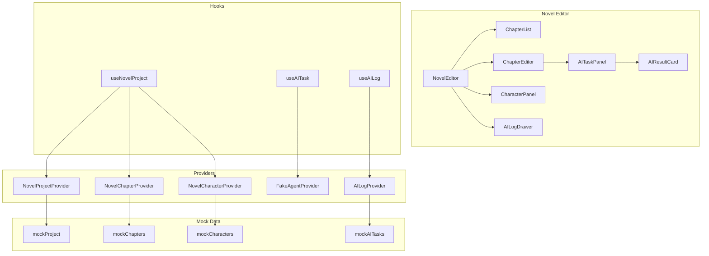

# StoryTree2 Code Wiki

> **项目**: OpenCode Creative Studio (StoryTree2)
> **版本**: v2.1
> **最后更新**: 2026-06-10
> **状态**: 持续更新中

---

## 目录

1. [项目概述](#1-项目概述)
2. [项目架构](#2-项目架构)
3. [核心模块详解](#3-核心模块详解)
   - 3.1 [Claude-Code-Src 参考架构](#31-claude-code-src-参考架构)
   - 3.2 [Novel Editor (OpenCode 二次开发)](#32-novel-editor-opencode-二次开发)
4. [关键类和函数说明](#4-关键类和函数说明)
5. [依赖关系](#5-依赖关系)
6. [项目运行方式](#6-项目运行方式)
7. [数据类型定义](#7-数据类型定义)
8. [测试体系](#8-测试体系)
9. [附录](#9-附录)

---

## 1. 项目概述

### 1.1 项目定位

**StoryTree2** 是一个基于 Claude-Code 架构的开放式 AI 创作平台，采用 **clean-room architecture rewrite** 方法论，在借鉴 Claude Code 架构、抽象、流程和模块边界的基础上，进行独立的原创实现。

当前核心开发聚焦于 **Novel Editor** —— 基于 OpenCode 1.4.0 二次开发的 AI 小说编辑器，作为免费 Core Product 提供。

### 1.2 核心设计原则

| 原则 | 说明 |
|------|------|
| **Novel Editor Core** | 小说编辑器作为免费 Core Product，而非付费插件 |
| **Skill/Plugin/Provider 严格区分** | Skill 是任务说明包，Plugin 是产品模块，Provider 是外部服务适配器 |
| **Creative Agent Runtime** | 底层执行内核，负责 Agent 的运行机制 |
| **Creative Core** | 业务抽象层，负责创作项目的管理 |

### 1.3 项目结构

```
storytree2/
├── caiode/                          # 核心代码目录
│   ├── claude-code-src/             # Claude Code 源码分析基准（研究材料）
│   │   ├── QueryEngine.ts           # 会话生命周期管理引擎
│   │   ├── query.ts                 # Agent 主循环实现
│   │   ├── Tool.ts / tools.ts       # 工具抽象与注册
│   │   ├── Task.ts / tasks.ts       # 任务状态机管理
│   │   ├── skills/                  # Skill 发现与加载
│   │   ├── commands.ts              # 命令注册与分发
│   │   ├── context.ts               # 上下文构建与压缩
│   │   ├── state/                   # 状态持久化管理
│   │   ├── bridge/                  # 外部服务桥接
│   │   ├── hooks/                   # 生命周期扩展点
│   │   └── cost-tracker.ts          # 成本追踪统计
│   │
│   ├── opencode-1.4.0/              # [当前活跃] OpenCode 核心实现
│   │   └── packages/
│   │       └── app/
│   │           └── src/
│   │               ├── novel/       # Novel Editor 模块
│   │               ├── novel-3d/    # 3D 镜头预览模块
│   │               ├── novel-canvas/ # 故事画布模块
│   │               └── app.tsx      # 应用路由入口
│   │
│   └── Trae-Ralph-main/             # Trae + Ralph 工具链
│
├── backups/                         # 备份和历史文件
│   ├── dreamweaver/                 # [已废弃] Next.js 前端
│   └── patches/                     # Git 补丁历史
│
├── docs/                            # 项目文档
│   ├── roadmap/                     # 路书文档（13份架构文档）
│   ├── planning/                    # 规划文档
│   ├── stitch/                      # Stitch 原型场景文档
│   ├── task-reports/                # 任务报告
│   ├── boundary/                    # 边界与规范
│   ├── CODE_WIKI.md                 # 本文档
│   └── CODE_WIKI_INDEX.md           # 文档索引
│
├── workspaces/                      # 多模型 AI 工作空间
│   ├── Claude/, Kimi-K2.5/, MiniMax-M2/, Gemini/ 等
│
└── .trae/                           # Agent 规则和工具
    ├── rules/                       # Ralph 执行规则
    ├── skills/                      # Agent 技能定义
    └── documents/                   # PRD 和分析文档
```

---

## 2. 项目架构

### 2.1 三层架构模型

```text
┌─────────────────────────────────────────────────────────────┐
│                    Presentation Layer (UI)                  │
│  ┌─────────────┐  ┌─────────────┐  ┌─────────────────────┐ │
│  │ Novel Editor │  │ Plugin Pages │  │ Settings Panels    │ │
│  └─────────────┘  └─────────────┘  └─────────────────────┘ │
├─────────────────────────────────────────────────────────────┤
│                    Creative Core (Business)                 │
│  ┌─────────────┐  ┌─────────────┐  ┌─────────────────────┐ │
│  │ Project     │  │ Asset       │  │ License Gate        │ │
│  │ Workspace   │  │ Library     │  │                     │ │
│  └─────────────┘  └─────────────┘  └─────────────────────┘ │
├─────────────────────────────────────────────────────────────┤
│               Creative Agent Runtime (Kernel)               │
│  ┌─────────────┐  ┌─────────────┐  ┌─────────────────────┐ │
│  │ AgentLoop   │  │ TaskRuntime │  │ ToolRuntime         │ │
│  │             │  │             │  │                     │ │
│  └─────────────┘  └─────────────┘  └─────────────────────┘ │
└─────────────────────────────────────────────────────────────┘
```

### 2.2 Novel Editor 应用架构

```text
┌─────────────────────────────────────────────────────────────┐
│                    OpenCode App (SolidJS)                    │
│  ┌─────────────────────────────────────────────────────┐   │
│  │              app.tsx (路由入口)                       │   │
│  │  • /novel → NovelEditor                             │   │
│  │  • /canvas → StoryCanvas                            │   │
│  │  • /shot3d → Shot3DPreview                          │   │
│  └─────────────────────────────────────────────────────┘   │
│                              │                              │
│  ┌───────────────────────────┼───────────────────────────┐ │
│  │                           ▼                           │ │
│  │  ┌─────────────┐  ┌─────────────┐  ┌─────────────┐   │ │
│  │  │ NovelEditor │  │ StoryCanvas │  │ Shot3D      │   │ │
│  │  │ (三栏布局)   │  │ (故事画布)   │  │ (3D预览)    │   │ │
│  │  └─────────────┘  └─────────────┘  └─────────────┘   │ │
│  │         │                  │                  │       │ │
│  │         ▼                  ▼                  ▼       │ │
│  │  ┌─────────────┐  ┌─────────────┐  ┌─────────────┐   │ │
│  │  │ Hooks       │  │ Providers   │  │ Mock Data   │   │ │
│  │  │ (状态管理)   │  │ (数据层)     │  │ (Mock驱动)   │   │ │
│  │  └─────────────┘  └─────────────┘  └─────────────┘   │ │
│  └───────────────────────────────────────────────────────┘ │
└─────────────────────────────────────────────────────────────┘
```

---

## 3. 核心模块详解

### 3.1 Claude-Code-Src 参考架构

#### 3.1.1 QueryEngine - 会话生命周期管理

| 属性 | 说明 |
|------|------|
| **文件** | `caiode/claude-code-src/QueryEngine.ts` |
| **职责** | 拥有查询生命周期和会话状态，每会话一个实例 |
| **核心方法** | `submitMessage()`, `interrupt()`, `getMessages()` |

**核心类**:
```typescript
export class QueryEngine {
  private config: QueryEngineConfig;
  private mutableMessages: Message[];
  private abortController: AbortController;
  private totalUsage: NonNullableUsage;

  async *submitMessage(prompt: string, options?: { uuid?: string; isMeta?: boolean }): AsyncGenerator<SDKMessage>;
  interrupt(): void;
  getMessages(): readonly Message[];
  setModel(model: string): void;
}
```

#### 3.1.2 Task - 任务状态机

| 属性 | 说明 |
|------|------|
| **文件** | `caiode/claude-code-src/Task.ts` |
| **职责** | 任务类型定义、状态管理、ID 生成 |

**任务类型**:
```typescript
type TaskType = 'local_bash' | 'local_agent' | 'remote_agent' | 'in_process_teammate' | 'local_workflow' | 'monitor_mcp' | 'dream';
type TaskStatus = 'pending' | 'running' | 'completed' | 'failed' | 'killed';
```

### 3.2 Novel Editor (OpenCode 二次开发)

#### 3.2.1 模块定位

| 属性 | 说明 |
|------|------|
| **路径** | `caiode/opencode-1.4.0/packages/app/src/novel/` |
| **技术栈** | SolidJS + TypeScript + TailwindCSS |
| **状态** | Mock 模式开发中（基于 FakeAgentProvider） |
| **路由** | `/novel` (App 路由懒加载) |
| **定位** | Core Product（免费小说编辑器，非付费插件） |

#### 3.2.2 目录结构

```
caiode/opencode-1.4.0/packages/app/src/novel/
├── index.ts                           # 模块入口：导出 NovelEditor 组件
├── components/
│   ├── index.ts                       # 组件聚合导出
│   ├── mock-mode-banner.tsx           # Mock 模式提示横幅
│   └── novel-editor/
│       ├── index.tsx                  # NovelEditor 主组件（三栏布局）
│       ├── chapter-list.tsx           # 左侧：章节列表 + 大纲
│       ├── chapter-editor.tsx         # 中间：章节编辑器 + AI 续写
│       ├── character-panel.tsx        # 右侧：角色面板
│       ├── ai-task-panel.tsx          # AI 任务面板（续写/改写/总结/配音）
│       ├── ai-result-card.tsx         # AI 结果卡片（接受/拒绝/重新生成）
│       └── ai-log-drawer.tsx          # AI 日志抽屉（任务历史）
├── hooks/
│   ├── use-novel-project.ts           # 项目数据 Hook（Provider 聚合）
│   ├── use-ai-task.ts                 # AI 任务 Hook（FakeAgent）
│   └── use-ai-log.ts                  # AI 日志 Hook（本地状态）
├── providers/
│   ├── index.ts                       # Provider 聚合导出
│   ├── providers-index.ts             # Provider 索引文件
│   ├── fake-agent.ts                  # FakeAgentProvider（Mock AI 服务）
│   ├── fake-agent.test.ts             # FakeAgent 测试（9 个场景）
│   ├── novel-project.ts               # NovelProjectProvider（项目 CRUD）
│   ├── novel-chapter.ts               # NovelChapterProvider（章节 CRUD）
│   ├── novel-character.ts             # NovelCharacterProvider（角色 CRUD）
│   └── ai-log.ts                      # AILogProvider（日志管理）
├── types/
│   ├── index.ts                       # 类型聚合导出
│   ├── project.ts                     # 项目类型定义
│   ├── chapter.ts                     # 章节类型定义
│   ├── character.ts                   # 角色类型定义
│   ├── ai-task.ts                     # AI 任务类型定义
│   ├── ai-log.ts                      # AI 日志类型定义
│   └── sandbox.ts                     # 沙箱类型定义
├── mock-data/
│   ├── index.ts                       # Mock 数据聚合导出
│   ├── projects.ts                    # 项目 Mock 数据（《星辰之海》）
│   ├── chapters.ts                    # 章节 Mock 数据（5 章）
│   ├── characters.ts                  # 角色 Mock 数据（4 人）
│   ├── ai-tasks.ts                    # AI 任务 Mock 数据（2 个）
│   └── mock-data.test.ts              # Mock 数据验证测试
└── utils/
    └── mock-delay.ts                  # Mock 延迟工具函数
```

#### 3.2.3 核心组件详解

**NovelEditor (`novel-editor/index.tsx`)**

| 属性 | 说明 |
|------|------|
| **职责** | 小说编辑器主页面，三栏布局容器 |
| **布局** | 左侧章节列表(280px) + 中间编辑器(flex-1) + 右侧角色面板(280px) |
| **状态** | `activeChapterId`（当前选中章节） |
| **子组件** | ChapterList, ChapterEditor, CharacterPanel |

**ChapterList (`novel-editor/chapter-list.tsx`)**

| 属性 | 说明 |
|------|------|
| **职责** | 展示章节列表、大纲信息、字数统计 |
| **Props** | `chapters`, `activeChapterId`, `onSelectChapter` |
| **功能** | 按 orderIndex 排序显示，高亮当前章节，显示每章字数 |

**ChapterEditor (`novel-editor/chapter-editor.tsx`)**

| 属性 | 说明 |
|------|------|
| **职责** | 章节内容编辑 + AI 续写交互 |
| **Props** | `chapter`, `onUpdateContent`, `onAITask` |
| **功能** | 文本编辑、AI 续写按钮、字数统计、状态显示 |
| **AI 集成** | 点击 AI 续写 → 调用 `useAITask().continueWriting()` → 显示 AITaskPanel |

**CharacterPanel (`novel-editor/character-panel.tsx`)**

| 属性 | 说明 |
|------|------|
| **职责** | 展示角色列表、性格标签、目标、秘密 |
| **Props** | `characters` |
| **功能** | 角色卡片列表、性格标签展示、目标/秘密折叠显示 |

**AITaskPanel (`novel-editor/ai-task-panel.tsx`)**

| 属性 | 说明 |
|------|------|
| **职责** | AI 任务操作面板（续写/改写/总结/配音） |
| **Props** | `chapter`, `onTaskComplete` |
| **任务类型** | `continue-writing`, `rewrite-selection`, `summarize-chapter`, `character-voice` |
| **状态** | `isProcessing`, `taskType`, `result` |

**AIResultCard (`novel-editor/ai-result-card.tsx`)**

| 属性 | 说明 |
|------|------|
| **职责** | 展示 AI 生成结果，提供接受/拒绝/重新生成操作 |
| **Props** | `result`, `onAccept`, `onReject`, `onRegenerate` |
| **功能** | 文本预览、字数统计、操作按钮 |

**AILogDrawer (`novel-editor/ai-log-drawer.tsx`)**

| 属性 | 说明 |
|------|------|
| **职责** | AI 任务历史日志抽屉 |
| **Props** | `logs`, `isOpen`, `onClose` |
| **功能** | 按时间倒序显示任务历史、状态标签、结果预览 |

**MockModeBanner (`mock-mode-banner.tsx`)**

| 属性 | 说明 |
|------|------|
| **职责** | Mock 模式提示横幅 |
| **显示条件** | `import.meta.env.DEV` 或 `import.meta.env.VITE_MOCK_MODE` |
| **内容** | "当前处于 Mock 模式，AI 功能由 FakeAgent 模拟" |

#### 3.2.4 核心 Hooks 详解

**useNovelProject (`hooks/use-novel-project.ts`)**

| 属性 | 说明 |
|------|------|
| **职责** | 聚合所有 Novel Provider，提供统一的项目数据接口 |
| **返回值** | `{ project, chapters, characters, createChapter, updateChapter, deleteChapter, createCharacter, updateCharacter, deleteCharacter }` |
| **依赖** | NovelProjectProvider, NovelChapterProvider, NovelCharacterProvider |

**useAITask (`hooks/use-ai-task.ts`)**

| 属性 | 说明 |
|------|------|
| **职责** | 封装 AI 任务操作，对接 FakeAgentProvider |
| **返回值** | `{ isProcessing, task, result, error, continueWriting, rewriteSelection, summarizeChapter, characterVoice, cancelTask }` |
| **核心方法** | `continueWriting(chapterId, text)`, `rewriteSelection(chapterId, text, selectedText)` |
| **状态流转** | `idle` → `submitting` → `processing` → `completed`/`failed`/`cancelled` |

**useAILog (`hooks/use-ai-log.ts`)**

| 属性 | 说明 |
|------|------|
| **职责** | 管理 AI 任务日志的本地状态 |
| **返回值** | `{ logs, addLog, clearLogs }` |
| **存储** | 内存数组（非持久化） |

#### 3.2.5 Provider 层详解

**FakeAgentProvider (`providers/fake-agent.ts`)**

| 属性 | 说明 |
|------|------|
| **职责** | Mock AI 服务，模拟异步任务执行 |
| **核心方法** | `submitTask(input)`, `getTask(id)`, `cancelTask(id)`, `onTaskUpdate(callback)` |
| **任务状态** | `pending` → `running` → `success`/`failed`/`cancelled`/`denied`/`quota` |
| **模拟延迟** | 1.5s - 2.5s 随机延迟 |
| **错误模拟** | 文本包含 "fail" → 失败，"sudo admin" → 权限不足，连续 10 次 → 配额不足 |
| **输出格式** | `{ text, wordCount, confidence }` |

**NovelProjectProvider (`providers/novel-project.ts`)**

| 属性 | 说明 |
|------|------|
| **职责** | 项目数据 CRUD 操作 |
| **接口** | `getProject()`, `updateProject(project)`, `getProjects()` |
| **数据** | 基于 `mockProject`（《星辰之海》） |

**NovelChapterProvider (`providers/novel-chapter.ts`)**

| 属性 | 说明 |
|------|------|
| **职责** | 章节数据 CRUD 操作 |
| **接口** | `getChapters()`, `getChapter(id)`, `createChapter(chapter)`, `updateChapter(chapter)`, `deleteChapter(id)` |
| **数据** | 基于 `mockChapters`（5 章） |

**NovelCharacterProvider (`providers/novel-character.ts`)**

| 属性 | 说明 |
|------|------|
| **职责** | 角色数据 CRUD 操作 |
| **接口** | `getCharacters()`, `getCharacter(id)`, `createCharacter(character)`, `updateCharacter(character)`, `deleteCharacter(id)` |
| **数据** | 基于 `mockCharacters`（4 人：苏瑶、顾沉舟、林小满、沈墨白） |

**AILogProvider (`providers/ai-log.ts`)**

| 属性 | 说明 |
|------|------|
| **职责** | AI 任务日志管理 |
| **接口** | `getLogs()`, `addLog(log)`, `clearLogs()` |
| **数据** | 基于 `mockAITasks`（2 个历史任务） |

#### 3.2.6 类型定义

**Project (`types/project.ts`)**

```typescript
interface Project {
  id: string;
  name: string;
  genre: string;
  description: string;
  targetAudience: string;
  totalWordCount: number;
  chapterCount: number;
  characterCount: number;
  status: 'active' | 'archived' | 'draft';
  createdAt: Date;
  updatedAt: Date;
}
```

**Chapter (`types/chapter.ts`)**

```typescript
interface Chapter {
  id: string;
  projectId: string;
  title: string;
  content: string;
  orderIndex: number;
  wordCount: number;
  status: 'draft' | 'writing' | 'review' | 'completed';
  outline: ChapterOutline;
  aiSuggestions: AISuggestion[];
  createdAt: Date;
  updatedAt: Date;
}

interface ChapterOutline {
  goal: string;
  conflict: string;
  resolution: string;
  keyScenes: string[];
}

interface AISuggestion {
  id: string;
  type: 'continuation' | 'rewrite' | 'summary' | 'character_voice';
  content: string;
  accepted: boolean;
  createdAt: Date;
}
```

**Character (`types/character.ts`)**

```typescript
interface Character {
  id: string;
  projectId: string;
  name: string;
  role: string;
  description: string;
  personalityTags: string[];
  goal: string;
  secret: string;
  relationships: CharacterRelationship[];
  createdAt: Date;
  updatedAt: Date;
}

interface CharacterRelationship {
  characterId: string;
  type: 'ally' | 'enemy' | 'neutral' | 'family' | 'romantic';
  description: string;
}
```

**AITask (`types/ai-task.ts`)**

```typescript
type AITaskType = 'continue-writing' | 'rewrite-selection' | 'summarize-chapter' | 'character-voice';
type AITaskStatus = 'pending' | 'running' | 'success' | 'failed' | 'cancelled' | 'denied' | 'quota';

interface AITask {
  id: string;
  type: AITaskType;
  status: AITaskStatus;
  chapterId: string;
  input: AITaskInput;
  output?: AITaskOutput;
  error?: string;
  duration?: number;
  createdAt: Date;
  updatedAt: Date;
}

interface AITaskInput {
  text: string;
  selectedText?: string;
  characterId?: string;
}

interface AITaskOutput {
  text: string;
  wordCount: number;
  confidence: number;
}
```

**Sandbox (`types/sandbox.ts`)**

```typescript
interface Sandbox {
  id: string;
  name: string;
  type: 'code' | 'writing' | 'design' | 'analysis';
  status: 'active' | 'paused' | 'completed';
  files: SandboxFile[];
  createdAt: Date;
  updatedAt: Date;
}
```

#### 3.2.7 Mock 数据

**项目数据 (`mock-data/projects.ts`)**

| 字段 | 值 |
|------|-----|
| 名称 | 《星辰之海》 |
| 类型 | 科幻/太空歌剧 |
| 描述 | 在遥远的未来，人类已经殖民了银河系... |
| 字数 | 45,000 |
| 章节数 | 5 |
| 角色数 | 4 |
| 状态 | active |

**章节数据 (`mock-data/chapters.ts`)**

| 章节 | 标题 | 字数 | 状态 |
|------|------|------|------|
| 1 | 觉醒 | 8,500 | completed |
| 2 | 星际联盟 | 9,200 | writing |
| 3 | 暗流涌动 | 7,800 | draft |
| 4 | 真相大白 | 10,500 | draft |
| 5 | 最终决战 | 9,000 | draft |

**角色数据 (`mock-data/characters.ts`)**

| 角色 | 身份 | 性格标签 | 目标 | 秘密 |
|------|------|---------|------|------|
| 苏瑶 | 主角 | 勇敢、好奇、坚韧 | 寻找失踪的父亲 | 拥有古老的星际导航基因 |
| 顾沉舟 | 导师 | 睿智、沉稳、神秘 | 引导苏瑶完成使命 | 曾是星际联盟的高级指挥官 |
| 林小满 | 伙伴 | 活泼、机智、忠诚 | 保护苏瑶 | 拥有预知未来的能力 |
| 沈墨白 | 对手 | 冷酷、野心、聪明 | 控制星际联盟 | 其实是苏瑶的失散多年的哥哥 |

#### 3.2.8 测试覆盖

**FakeAgentProvider 测试 (`providers/fake-agent.test.ts`)**

| 场景 | 测试内容 | 验证点 |
|------|---------|--------|
| 场景 1 | AI 续写成功 | 任务状态流转、输出非空 |
| 场景 2 | AI 改写成功 | 任务类型正确、输出存在 |
| 场景 3 | AI 总结成功 | 输出文本长度 > 0 |
| 场景 4 | 角色语气改写 | 任务类型为 character-voice |
| 场景 5 | 任务失败 | 输入包含 "fail" → 状态 failed |
| 场景 6 | 用户取消 | 调用 cancelTask → 状态 cancelled |
| 场景 7 | 权限不足 | 输入包含 "sudo admin" → 状态 denied |
| 场景 8 | 配额不足 | 连续 11 次调用 → 状态 quota |
| 场景 9 | 长任务处理 | 持续时间 > 0 |
| 额外 | 状态订阅 | onTaskUpdate 回调触发 |
| 额外 | 字数统计 | output.wordCount > 0 |

**Mock Data 测试 (`mock-data/mock-data.test.ts`)**

| 测试项 | 验证内容 |
|--------|---------|
| 项目数据 | id、名称、类型、字数、章节数、角色数、状态 |
| 章节结构 | id、标题、projectId、字数、状态、大纲 |
| 章节顺序 | orderIndex 递增 |
| 角色结构 | id、名称、身份、性格标签、目标、秘密 |
| 核心主角 | 苏瑶存在且 role 包含"主角" |
| AI 任务 | id、类型、状态、chapterId、createdAt |

#### 3.2.9 与 App 的集成

**路由配置 (`app.tsx`)**

```typescript
const loadNovel = () => import("@/novel");
const NovelRoute = lazy(loadNovel);

// 在 Router 中注册
<Route path="/novel" component={NovelRoute} />
```

**入口导航 (`pages/home.tsx`)**

```typescript
<Button onClick={() => navigate("/novel")}>
  <span>📖</span>
  <span>AI 小说编辑器 (Mock)</span>
</Button>
```

**懒加载优势**：Novel 模块代码在访问 `/novel` 路由时才加载，减少首屏 bundle 体积。

#### 3.2.10 关联模块

**novel-3d** (`caiode/opencode-1.4.0/packages/app/src/novel-3d/`)

| 属性 | 说明 |
|------|------|
| **职责** | 3D 镜头预览，基于 Three.js |
| **路由** | `/shot3d` |
| **核心类型** | `ShotScene3D`, `ShotCamera`, `CylinderObject` |
| **用途** | 将小说场景转换为 3D 构图草稿 |

**novel-canvas** (`caiode/opencode-1.4.0/packages/app/src/novel-canvas/`)

| 属性 | 说明 |
|------|------|
| **职责** | 故事画布，可视化故事结构 |
| **路由** | `/canvas` |
| **用途** | 以画布形式展示故事线、角色关系、情节发展 |

---

## 4. 关键类和函数说明

### 4.1 Novel Editor 核心模块映射

| 模块路径 | 核心文件 | 职责 | 关键类/函数 |
|---------|---------|------|-----------|
| **components/** | `novel-editor/index.tsx` | 主组件容器 | `NovelEditor` |
| | `chapter-list.tsx` | 章节列表 | `ChapterList` |
| | `chapter-editor.tsx` | 章节编辑 | `ChapterEditor` |
| | `character-panel.tsx` | 角色面板 | `CharacterPanel` |
| | `ai-task-panel.tsx` | AI 任务面板 | `AITaskPanel` |
| | `ai-result-card.tsx` | AI 结果卡片 | `AIResultCard` |
| | `ai-log-drawer.tsx` | AI 日志抽屉 | `AILogDrawer` |
| | `mock-mode-banner.tsx` | Mock 提示 | `MockModeBanner` |
| **hooks/** | `use-novel-project.ts` | 项目数据聚合 | `useNovelProject()` |
| | `use-ai-task.ts` | AI 任务操作 | `useAITask()` |
| | `use-ai-log.ts` | AI 日志管理 | `useAILog()` |
| **providers/** | `fake-agent.ts` | Mock AI 服务 | `FakeAgentProvider` |
| | `novel-project.ts` | 项目 CRUD | `NovelProjectProvider` |
| | `novel-chapter.ts` | 章节 CRUD | `NovelChapterProvider` |
| | `novel-character.ts` | 角色 CRUD | `NovelCharacterProvider` |
| | `ai-log.ts` | 日志管理 | `AILogProvider` |
| **types/** | `project.ts` | 项目类型 | `Project` |
| | `chapter.ts` | 章节类型 | `Chapter`, `ChapterOutline` |
| | `character.ts` | 角色类型 | `Character` |
| | `ai-task.ts` | AI 任务类型 | `AITask`, `AITaskType` |
| | `ai-log.ts` | AI 日志类型 | `AILog` |
| | `sandbox.ts` | 沙箱类型 | `Sandbox` |
| **mock-data/** | `projects.ts` | 项目 Mock | `mockProject` |
| | `chapters.ts` | 章节 Mock | `mockChapters` |
| | `characters.ts` | 角色 Mock | `mockCharacters` |
| | `ai-tasks.ts` | AI 任务 Mock | `mockAITasks` |

### 4.2 claude-code-src 核心模块映射

| claude-code-src 模块 | Creative Runtime 对应 | 职责说明 |
|---------------------|----------------------|---------|
| `QueryEngine.ts` | `CreativeQueryEngine` | 会话生命周期管理 |
| `query.ts` | `AgentLoop` | 主 Agent Loop，流式响应 |
| `Tool.ts` / `tools.ts` | `ToolRuntime` | 工具抽象与执行 |
| `Task.ts` / `tasks.ts` | `TaskRuntime` | 任务状态机管理 |
| `skills/` | `SkillLoader` | Skill 发现与加载 |
| `commands.ts` | `CommandRegistry` | 命令注册与分发 |
| `context.ts` | `CreativeContextBuilder` | 上下文构造与压缩 |
| `state/` | `StateStore` | 状态持久化管理 |
| `bridge/` | `ProviderBridge` | 外部服务桥接 |
| `coordinator/` | `WorkflowOrchestrator` | 工作流编排 |
| `hooks/` | `HookPipeline` | 生命周期扩展点 |
| `cost-tracker.ts` | `CostTracker` | 成本追踪统计 |

---

## 5. 依赖关系

### 5.1 Novel Editor 模块依赖矩阵



### 5.2 插件消费链路

```text
Novel Scene
  ↓
Script Studio：改写成剧本场景
  ↓
Storyboard Studio：拆成镜头
  ↓
3D Shot Draft：生成 3D 构图草稿
  ↓
Image Prompt：生成图像提示词
  ↓
Image Generation：生成图像资产
  ↓
Video Prompt：生成视频提示词
  ↓
Video Generation：生成视频资产
  ↓
Timeline Draft：拼接剪辑草稿
  ↓
Long Video Manager：管理长项目结构
```

### 5.3 外部依赖

| 依赖类型 | 具体依赖 | 说明 |
|---------|---------|------|
| **前端框架** | SolidJS | 响应式 UI 框架 |
| **样式** | TailwindCSS | 原子化 CSS |
| **UI 组件** | @kobalte/core | 无障碍 UI 组件库 |
| **状态管理** | @tanstack/solid-query | 服务端状态管理 |
| **路由** | @solidjs/router | 前端路由 |
| **构建工具** | Vite | 开发服务器和打包 |
| **测试** | bun:test | 单元测试 |
| **E2E 测试** | Playwright | 端到端测试 |
| **3D 渲染** | Three.js | 3D 镜头预览 |
| **日期处理** | luxon | 日期时间库 |
| **Markdown** | marked | Markdown 渲染 |
| **代码高亮** | shiki | 语法高亮 |
| **函数式编程** | effect | Effect-TS 函数式编程 |
| **工具库** | remeda | 函数式工具库 |

---

## 6. 项目运行方式

### 6.1 开发环境配置

#### 6.1.1 环境要求

- **Node.js**: >= 18.0.0
- **npm/yarn/pnpm/bun**: 最新稳定版
- **Git**: 2.x

#### 6.1.2 安装步骤

```bash
# 克隆项目
git clone https://github.com/storytree/storytree2.git
cd storytree2

# 安装 OpenCode App 依赖
cd caiode/opencode-1.4.0/packages/app
npm install
```

### 6.2 运行命令

#### 6.2.1 OpenCode App 运行命令

```bash
cd caiode/opencode-1.4.0/packages/app

# 开发模式
npm run dev

# 生产构建
npm run build

# 预览生产构建
npm run serve
```

#### 6.2.2 测试

```bash
# 单元测试
npm run test:unit

# 单元测试（监听模式）
npm run test:unit:watch

# E2E 测试
npm run test:e2e

# E2E 测试（UI 模式）
npm run test:e2e:ui
```

#### 6.2.3 代码质量

```bash
# TypeScript 类型检查
npm run typecheck

# 代码检查（如有配置）
npm run lint

# 自动修复
npm run lint:fix
```

### 6.3 Novel Editor 启动流程

```
1. 用户访问 /novel 路由
   ↓
2. App 懒加载 novel 模块
   ↓
3. NovelEditor 组件初始化
   ↓
4. useNovelProject Hook 加载 Mock 数据
   ↓
5. 渲染三栏布局（章节列表 | 编辑器 | 角色面板）
   ↓
6. 用户交互触发 AI 任务
   ↓
7. useAITask Hook 调用 FakeAgentProvider
   ↓
8. 模拟异步任务执行，更新 UI 状态
```

### 6.4 AI 任务处理流程

```
用户点击 AI 续写
   ↓
ChapterEditor 调用 onAITask 回调
   ↓
useAITask.continueWriting(chapterId, text)
   ↓
FakeAgentProvider.submitTask({ type: "continue-writing", ... })
   ↓
任务状态: pending → running（1.5-2.5s 延迟）
   ↓
任务完成: success / failed / cancelled
   ↓
AITaskPanel 显示 AIResultCard
   ↓
用户选择接受/拒绝/重新生成
   ↓
ChapterEditor 更新内容（如接受）
   ↓
AILogDrawer 记录任务历史
```

---

## 7. 数据类型定义

### 7.1 Novel Editor 核心类型

**Project**

```typescript
interface Project {
  id: string;
  name: string;
  genre: string;
  description: string;
  targetAudience: string;
  totalWordCount: number;
  chapterCount: number;
  characterCount: number;
  status: 'active' | 'archived' | 'draft';
  createdAt: Date;
  updatedAt: Date;
}
```

**Chapter**

```typescript
interface Chapter {
  id: string;
  projectId: string;
  title: string;
  content: string;
  orderIndex: number;
  wordCount: number;
  status: 'draft' | 'writing' | 'review' | 'completed';
  outline: ChapterOutline;
  aiSuggestions: AISuggestion[];
  createdAt: Date;
  updatedAt: Date;
}

interface ChapterOutline {
  goal: string;
  conflict: string;
  resolution: string;
  keyScenes: string[];
}
```

**Character**

```typescript
interface Character {
  id: string;
  projectId: string;
  name: string;
  role: string;
  description: string;
  personalityTags: string[];
  goal: string;
  secret: string;
  relationships: CharacterRelationship[];
  createdAt: Date;
  updatedAt: Date;
}

interface CharacterRelationship {
  characterId: string;
  type: 'ally' | 'enemy' | 'neutral' | 'family' | 'romantic';
  description: string;
}
```

**AITask**

```typescript
type AITaskType = 'continue-writing' | 'rewrite-selection' | 'summarize-chapter' | 'character-voice';
type AITaskStatus = 'pending' | 'running' | 'success' | 'failed' | 'cancelled' | 'denied' | 'quota';

interface AITask {
  id: string;
  type: AITaskType;
  status: AITaskStatus;
  chapterId: string;
  input: AITaskInput;
  output?: AITaskOutput;
  error?: string;
  duration?: number;
  createdAt: Date;
  updatedAt: Date;
}

interface AITaskInput {
  text: string;
  selectedText?: string;
  characterId?: string;
}

interface AITaskOutput {
  text: string;
  wordCount: number;
  confidence: number;
}
```

### 7.2 3D Shot 类型

```typescript
interface ShotCamera {
  mode: 'perspective' | 'orthographic';
  position: Vec3;
  target: Vec3;
  fov: number;
  near: number;
  far: number;
}

interface CylinderObject {
  id: string;
  label: string;
  position: Vec3;
  radius: number;
  height: number;
  color: string;
  glow: boolean;
  selected: boolean;
  importance: 'hero' | 'secondary' | 'background';
}

interface ShotScene3D {
  id: string;
  title: string;
  prompt: string;
  camera: ShotCamera;
  cylinders: CylinderObject[];
  selectedObjectId?: string;
}
```

---

## 8. 测试体系

### 8.1 Novel Editor 测试结构

```
caiode/opencode-1.4.0/packages/app/src/novel/
├── providers/
│   └── fake-agent.test.ts           # FakeAgentProvider 测试（11 场景）
├── mock-data/
│   └── mock-data.test.ts            # Mock 数据验证测试（6 项）
```

### 8.2 FakeAgentProvider 测试场景

| 场景 | 测试内容 | 验证点 |
|------|---------|--------|
| 场景 1 | AI 续写成功 | 任务状态流转、输出非空 |
| 场景 2 | AI 改写成功 | 任务类型正确、输出存在 |
| 场景 3 | AI 总结成功 | 输出文本长度 > 0 |
| 场景 4 | 角色语气改写 | 任务类型为 character-voice |
| 场景 5 | 任务失败 | 输入包含 "fail" → 状态 failed |
| 场景 6 | 用户取消 | 调用 cancelTask → 状态 cancelled |
| 场景 7 | 权限不足 | 输入包含 "sudo admin" → 状态 denied |
| 场景 8 | 配额不足 | 连续 11 次调用 → 状态 quota |
| 场景 9 | 长任务处理 | 持续时间 > 0 |
| 额外 | 状态订阅 | onTaskUpdate 回调触发 |
| 额外 | 字数统计 | output.wordCount > 0 |

### 8.3 Mock Data 验证测试

| 测试项 | 验证内容 |
|--------|---------|
| 项目数据 | id、名称、类型、字数、章节数、角色数、状态 |
| 章节结构 | id、标题、projectId、字数、状态、大纲 |
| 章节顺序 | orderIndex 递增 |
| 角色结构 | id、名称、身份、性格标签、目标、秘密 |
| 核心主角 | 苏瑶存在且 role 包含"主角" |
| AI 任务 | id、类型、状态、chapterId、createdAt |

### 8.4 测试命令

```bash
cd caiode/opencode-1.4.0/packages/app

# 运行所有测试
npm run test:unit

# 监听模式
npm run test:unit:watch

# E2E 测试
npm run test:e2e
```

---

## 9. 附录

### A. 文件命名规范

| 类型 | 规范 | 示例 |
|------|------|------|
| TypeScript 文件 | PascalCase.ts | `CreativeQueryEngine.ts` |
| SolidJS 组件 | PascalCase.tsx | `NovelEditor.tsx` |
| 类型定义 | `*.types.ts` | `ai-task.types.ts` |
| 测试文件 | `*.test.ts` | `fake-agent.test.ts` |
| 样式文件 | kebab-case.css | `novel-editor.css` |

### B. Git 分支规范

| 分支类型 | 命名格式 | 示例 |
|---------|---------|------|
| 功能开发 | `feat/DEV-{任务编号}-{简短描述}` | `feat/DEV-1.2.1-llm-request-queue` |
| 缺陷修复 | `fix/BUG-{编号}-{简短描述}` | `fix/BUG-042-stale-lock-cleanup` |
| 测试专项 | `test/TEST-{任务编号}-{简短描述}` | `test/TEST-1.3.2c-race-condition` |
| 文档更新 | `docs/DOC-{简短描述}` | `docs/DOC-phase1-breakdown` |
| AI Agent | `trae/solo-agent-{标识符}` | `trae/solo-agent-jY1pa4` |

### C. Commit Message 规范

```
<type>(<scope>): <subject>

[type]: feat | fix | test | docs | refactor | perf | chore | revert
[scope]: 任务编号，如 DEV-1.2.1
[subject]: 简短描述

示例：
feat(DEV-1.2.1): 实现 GlobalModelRequestQueue 串行化调度器
fix(DEV-1.3.2): 修复 FileMutex 重入检测逻辑
```

### D. 项目状态速查

| 模块 | 状态 | 说明 |
|------|------|------|
| **Novel Editor Core** | **🔄 Mock 开发中** | **SolidJS 实现，FakeAgent 模拟 AI，11 测试覆盖** |
| Novel Editor UI | 🔄 Mock 开发中 | 三栏布局，7 个核心组件 |
| Novel Editor Data | 🔄 Mock 开发中 | 5 个 Provider，Mock 数据驱动 |
| Novel Editor AI | 🔄 Mock 开发中 | FakeAgentProvider，4 种任务类型 |
| Creative Agent Runtime | 📋 规划中 | 11个核心模块定义完成 |
| Creative Core | 📋 规划中 | 业务抽象层设计完成 |
| Plugin System | 📋 规划中 | 扩展点规范完成 |
| novel-3d | 📋 规划中 | 3D 镜头预览模块 |
| novel-canvas | 📋 规划中 | 故事画布模块 |

---

*本文档由 AI 自动生成，最后更新于 2026-06-10*
