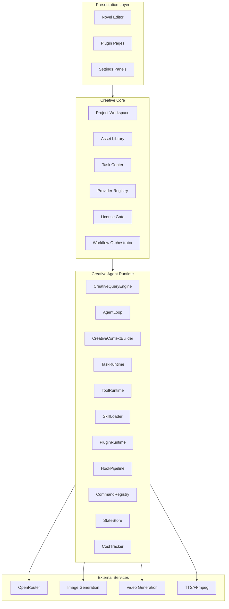
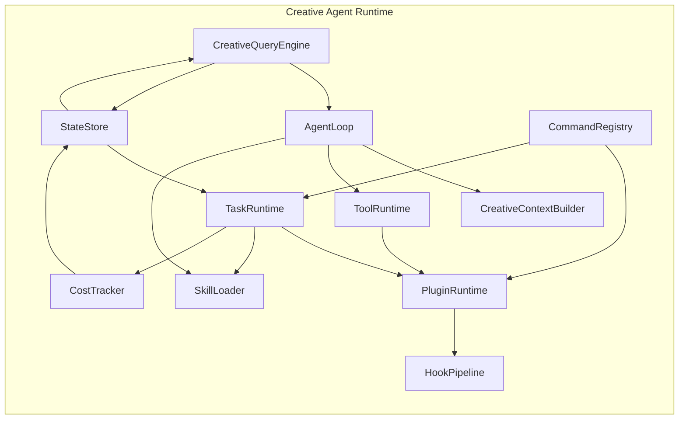

# StoryTree2 Code Wiki

> **项目**: OpenCode Creative Studio (StoryTree2)  
> **版本**: v1.0  
> **最后更新**: 2026-05-31  
> **状态**: 持续更新中

---

## 目录

1. [项目概述](#1-项目概述)
2. [项目架构](#2-项目架构)
3. [核心模块详解](#3-核心模块详解)
4. [关键类和函数说明](#4-关键类和函数说明)
5. [依赖关系](#5-依赖关系)
6. [项目运行方式](#6-项目运行方式)
7. [数据类型定义](#7-数据类型定义)
8. [扩展点与接口](#8-扩展点与接口)

---

## 1. 项目概述

### 1.1 项目定位

**StoryTree2** 是一个基于 Claude-Code 架构的开放式 AI 创作平台，采用 **clean-room architecture rewrite** 方法论，在借鉴 Claude Code 架构、抽象、流程和模块边界的基础上，进行独立的原创实现。

### 1.2 核心设计原则

| 原则 | 说明 |
|------|------|
| **Novel Editor Core** | 小说编辑器作为免费 Core Product，而非付费插件 |
| **Skill/Plugin/Provider 严格区分** | Skill 是任务说明包，Plugin 是产品模块，Provider 是外部服务适配器 |
| **Creative Agent Runtime** | 底层执行内核，负责 Agent 的运行机制 |
| **Creative Core** | 业务抽象层，负责创作项目的管理 |

### 1.3 项目结构

```
storytree2/
├── caiode/                          # 核心代码目录
│   ├── claude-code-src/             # Claude Code 源码分析基准（研究材料，非开源）
│   ├── opencode-1.4.0/              # OpenCode 核心实现
│   ├── vscode-extension/            # VS Code 扩展实现
│   └── Trae-Ralph-main/             # Trae + Ralph 工具链
├── backups/                         # 备份和历史文件
│   ├── dreamweaver/                 # Next.js 前端（已废弃）
│   └── dreamweaver/                # 补丁历史
├── docs/                            # 项目文档
│   ├── planning/                    # 规划文档
│   ├── roadmap/                     # 路书文档（13份架构文档）
│   └── task-reports/                # 任务报告
├── workspaces/                      # 多模型 AI 工作空间
│   ├── Claude/
│   ├── Kimi-K2.5/
│   ├── MiniMax-M2/
│   └── Gemini/
└── .trae/                           # Agent 规则和工具
    ├── rules/                       # Ralph 执行规则
    └── skills/                      # Agent 技能定义
```

---

## 2. 项目架构

### 2.1 三层架构模型

```text
┌─────────────────────────────────────────────────────────────┐
│                    Presentation Layer (UI)                  │
│  ┌─────────────┐  ┌─────────────┐  ┌─────────────────────┐ │
│  │ Novel Editor │  │ Plugin Pages │  │ Settings Panels    │ │
│  └─────────────┘  └─────────────┘  └─────────────────────┘ │
├─────────────────────────────────────────────────────────────┤
│                    Creative Core (Business)                 │
│  ┌─────────────┐  ┌─────────────┐  ┌─────────────────────┐ │
│  │ Project     │  │ Asset       │  │ License Gate        │ │
│  │ Workspace   │  │ Library     │  │                     │ │
│  └─────────────┘  └─────────────┘  └─────────────────────┘ │
├─────────────────────────────────────────────────────────────┤
│               Creative Agent Runtime (Kernel)               │
│  ┌─────────────┐  ┌─────────────┐  ┌─────────────────────┐ │
│  │ AgentLoop   │  │ TaskRuntime │  │ ToolRuntime         │ │
│  │             │  │             │  │                     │ │
│  └─────────────┘  └─────────────┘  └─────────────────────┘ │
└─────────────────────────────────────────────────────────────┘
```

### 2.2 模块分层图



---

## 3. 核心模块详解

### 3.1 Creative Agent Runtime（底层执行内核）

#### 3.1.1 CreativeQueryEngine

| 属性 | 说明 |
|------|------|
| **职责** | 会话生命周期管理、Agent 请求入口、流式响应输出 |
| **输入** | 用户请求、项目上下文、会话状态 |
| **输出** | 流式响应、任务创建、状态更新 |
| **依赖模块** | AgentLoop, StateStore, CostTracker |

**核心接口**：
```typescript
interface CreativeQueryEngine {
  createSession(config: SessionConfig): Promise<Session>
  sendRequest(sessionId: string, request: UserRequest): AsyncGenerator<StreamChunk>
  closeSession(sessionId: string): Promise<void>
  getSession(sessionId: string): Session | undefined
}
```

#### 3.1.2 AgentLoop

| 属性 | 说明 |
|------|------|
| **职责** | 主循环：模型响应、工具调用、观察结果、继续推理 |
| **输入** | 用户请求、上下文、可用工具列表 |
| **输出** | 流式响应、工具调用结果、最终答案 |
| **依赖模块** | ToolRuntime, SkillLoader, CreativeContextBuilder |

**核心接口**：
```typescript
interface AgentLoop {
  run(input: AgentInput): AsyncGenerator<AgentOutput>
  pause(): void
  resume(): void
  stop(): void
}

type AgentOutput =
  | { type: 'thinking'; content: string }
  | { type: 'tool_call'; tool: string; input: unknown }
  | { type: 'tool_result'; tool: string; output: unknown }
  | { type: 'final'; content: string }
  | { type: 'error'; message: string }
```

#### 3.1.3 TaskRuntime

| 属性 | 说明 |
|------|------|
| **职责** | 所有生成任务统一调度 |
| **输入** | 任务定义、Skill 名称、插件ID |
| **输出** | 任务状态、任务结果 |
| **依赖模块** | LicenseGate, SkillLoader, PluginRuntime |

**核心接口**：
```typescript
interface TaskRuntime {
  createTask(task: TaskInput): Promise<CreativeTask>
  getTask(taskId: string): CreativeTask | undefined
  cancelTask(taskId: string): Promise<void>
  retryTask(taskId: string): Promise<CreativeTask>
  listTasks(filter?: TaskFilter): CreativeTask[]
}
```

**CreativeTask 数据结构**：
```typescript
interface CreativeTask {
  id: string
  type: string
  title: string
  status: 'queued' | 'running' | 'waiting_for_permission' | 'waiting_for_user' | 'completed' | 'failed' | 'cancelled'
  projectId: string
  sourceAssetIds: string[]
  outputAssetIds: string[]
  skillName?: string
  pluginId?: string
  providerIds?: string[]
  licenseFeature?: string
  input: unknown
  output?: unknown
  error?: CreativeTaskError
  cost?: {
    inputTokens?: number
    outputTokens?: number
    providerCostUsd?: number
    localComputeCost?: number
  }
  createdAt: string
  updatedAt: string
}
```

#### 3.1.4 ToolRuntime

| 属性 | 说明 |
|------|------|
| **职责** | 具体可执行动作注册与执行 |
| **输入** | 工具名称、工具输入 |
| **输出** | 工具执行结果 |
| **依赖模块** | ProviderBridge, AssetLibrary |

**核心接口**：
```typescript
interface ToolRuntime {
  registerTool(tool: ToolDefinition): void
  unregisterTool(toolId: string): void
  executeTool(toolId: string, input: unknown, context: ToolContext): Promise<ToolResult>
  listTools(): ToolDefinition[]
}

interface ToolDefinition {
  id: string
  name: string
  description: string
  inputSchema: JSONSchema
  outputSchema: JSONSchema
  execute: (input: unknown, context: ToolContext) => Promise<ToolResult>
}

interface ToolContext {
  worktreePath: string
  permissionManager: PermissionManager
  taskCenter: TaskRuntime
  assetLibrary: AssetLibrary
}
```

#### 3.1.5 SkillLoader

| 属性 | 说明 |
|------|------|
| **职责** | 发现 `.claude/skills/*/SKILL.md`，按需加载 |
| **输入** | Skill 名称、任务上下文 |
| **输出** | Skill 定义、Skill 内容 |
| **依赖模块** | 文件系统 |

**核心接口**：
```typescript
interface SkillLoader {
  discoverSkills(): SkillCatalogEntry[]
  loadSkill(skillName: string): Promise<SkillDefinition>
  unloadSkill(skillName: string): void
  getSkill(skillName: string): SkillDefinition | undefined
}
```

**Skill 目录结构**：
```
.claude/skills/
├── novel-outline/
│   └── SKILL.md
├── novel-to-script/
│   └── SKILL.md
├── story-to-shot/
│   └── SKILL.md
├── shot-camera-plan/
│   └── SKILL.md
├── shot-to-image-prompt/
│   └── SKILL.md
├── shot-to-video-prompt/
│   └── SKILL.md
├── timeline-assembly/
│   └── SKILL.md
└── consistency-check/
    └── SKILL.md
```

#### 3.1.6 PluginRuntime

| 属性 | 说明 |
|------|------|
| **职责** | 插件加载、扩展点、权限系统 |
| **输入** | 插件 Manifest |
| **输出** | 插件实例、扩展点注册 |
| **依赖模块** | LicenseGate, StateStore |

**核心接口**：
```typescript
interface PluginRuntime {
  load(manifest: CreativePluginManifest): Promise<PluginInstance>
  unload(pluginId: string): Promise<void>
  enable(pluginId: string): Promise<void>
  disable(pluginId: string): Promise<void>
  getInstance(pluginId: string): PluginInstance | undefined
  listPlugins(): CreativePluginManifest[]
  getCapability(pluginId: string, capabilityId: string): PluginCapability | undefined
}
```

### 3.2 Creative Core（业务抽象层）

#### 3.2.1 Novel Editor Core

**定位**：Novel Editor Core 不是普通插件，而是 OpenCode Creative Studio 的基础入口和所有下游插件的内容源。

**核心数据模型**：

```typescript
interface NovelProject {
  id: string
  name: string
  description: string
  type: 'novel' | 'screenplay' | 'short_story'
  status: 'draft' | 'in_progress' | 'completed'
  createdAt: string
  updatedAt: string
}

interface Character {
  id: string
  projectId: string
  name: string
  role: 'protagonist' | 'antagonist' | 'supporting' | 'minor'
  age: number
  gender: string
  appearance: string
  personality: string
  background: string
  motivation: string
  arc: string
  relationships: CharacterRelationship[]
}

interface Chapter {
  id: string
  projectId: string
  number: number
  title: string
  summary: string
  scenes: Scene[]
  status: 'outline' | 'draft' | 'revision' | 'final'
}

interface Scene {
  id: string
  chapterId: string
  number: number
  title: string
  setting: string
  characters: string[]
  goal: string
  conflict: string
  outcome: string
  beats: Beat[]
}

interface Beat {
  id: string
  sceneId: string
  number: number
  description: string
  type: 'action' | 'dialogue' | 'description' | 'transition'
}
```

#### 3.2.2 Asset Library

| 属性 | 说明 |
|------|------|
| **职责** | 统一管理所有创作产物 |
| **功能** | 资产版本管理、来源和引用关系维护 |

**核心接口**：
```typescript
interface AssetLibrary {
  createAsset(asset: AssetInput): Promise<Asset>
  getAsset(assetId: string): Asset | undefined
  updateAsset(assetId: string, data: Partial<Asset>): Promise<Asset>
  deleteAsset(assetId: string): Promise<void>
  listAssets(filter?: AssetFilter): Asset[]
  createVersion(assetId: string, data: unknown): Promise<AssetVersion>
  getVersions(assetId: string): AssetVersion[]
}
```

#### 3.2.3 License Gate

| 属性 | 说明 |
|------|------|
| **职责** | 单模块付费权限校验 |

**核心接口**：
```typescript
interface LicenseGate {
  check(pluginId: string, feature?: string): LicenseGateResult
  getLicenseInfo(pluginId: string): LicenseInfo
}

type LicenseGateResult = {
  allowed: boolean
  reason?: 'not_installed' | 'trial_expired' | 'license_missing' | 'quota_exceeded'
  upgradeUrl?: string
}
```

---

## 4. 关键类和函数说明

### 4.1 claude-code-src 核心模块映射

| claude-code-src 模块 | Creative Runtime 对应 | 职责说明 |
|---------------------|----------------------|---------|
| `QueryEngine.ts` | `CreativeQueryEngine` | 会话生命周期管理 |
| `query.ts` | `AgentLoop` | 主 Agent Loop，流式响应 |
| `Tool.ts` / `tools.ts` | `ToolRuntime` | 工具抽象与执行 |
| `Task.ts` / `tasks.ts` | `TaskRuntime` | 任务状态机管理 |
| `skills/` | `SkillLoader` | Skill 发现与加载 |
| `commands.ts` | `CommandRegistry` | 命令注册与分发 |
| `context.ts` | `CreativeContextBuilder` | 上下文构造与压缩 |
| `state/` | `StateStore` | 状态持久化管理 |
| `bridge/` | `ProviderBridge` | 外部服务桥接 |
| `coordinator/` | `WorkflowOrchestrator` | 工作流编排 |
| `hooks/` | `HookPipeline` | 生命周期扩展点 |
| `cost-tracker.ts` | `CostTracker` | 成本追踪统计 |

### 4.2 VS Code Extension 核心模块

位于 `caiode/vscode-extension/src/`：

| 模块路径 | 核心文件 | 职责 |
|---------|---------|------|
| **core/** | `sync-push-service.ts` | 同步推送服务 |
| | `sqlite-db.ts` | SQLite 数据库操作 |
| | `global-model-request-queue.ts` | 全局模型请求队列 |
| | `file-mutex.ts` | 文件互斥锁 |
| | `config-service.ts` | 配置服务 |
| | `event-bus.ts` | 事件总线 |
| | `rpc-adapter.ts` | RPC 适配器 |
| | `queue-monitor.ts` | 队列监控 |
| **core/ai/** | `anthropic-provider.ts` | Anthropic API 提供者 |
| | `openai-provider.ts` | OpenAI API 提供者 |
| | `ollama-provider.ts` | Ollama 本地模型 |
| | `provider-factory.ts` | 提供者工厂 |
| | `conversation-manager.ts` | 对话管理器 |
| | `stream-processor.ts` | 流式响应处理 |
| **core/db-adapter.ts** | - | 数据库适配器 |
| **webview/** | `ai-chat-panel.ts` | AI 聊天面板 |
| | `enhanced-dashboard.ts` | 增强仪表板 |
| | `settings-page.ts` | 设置页面 |
| | `html-generator.ts` | HTML 生成器 |
| **automation/** | `task-orchestrator.ts` | 任务编排器 |
| | `automation-queue.ts` | 自动化队列 |
| | `cdp-driver.ts` | CDP 驱动 |
| **skills/** | `skill-registry.ts` | Skill 注册表 |

---

## 5. 依赖关系

### 5.1 模块依赖矩阵



### 5.2 插件消费链路

```text
Novel Scene
  ↓
Script Studio：改写成剧本场景
  ↓
Storyboard Studio：拆成镜头
  ↓
3D Shot Draft：生成 3D 构图草稿
  ↓
Image Prompt：生成图像提示词
  ↓
Image Generation：生成图像资产
  ↓
Video Prompt：生成视频提示词
  ↓
Video Generation：生成视频资产
  ↓
Timeline Draft：拼接剪辑草稿
  ↓
Long Video Manager：管理长项目结构
```

### 5.3 外部依赖

| 依赖类型 | 具体依赖 | 说明 |
|---------|---------|------|
| **AI Provider** | Anthropic (Claude) | 主要 AI 模型 |
| | OpenAI | GPT 模型支持 |
| | OpenRouter | 多模型路由 |
| | Ollama | 本地模型支持 |
| **媒体处理** | FFmpeg | 视频处理 |
| **存储** | SQLite | 本地数据库 |
| **构建工具** | Next.js | 前端框架 |
| | TypeScript | 类型系统 |
| | esbuild | 代码打包 |
| **测试** | Vitest | 单元测试 |
| | Playwright | E2E 测试 |

---

## 6. 项目运行方式

### 6.1 开发环境配置

#### 6.1.1 环境要求

- **Node.js**: >= 18.0.0
- **npm/yarn/pnpm/bun**: 最新稳定版
- **VS Code**: 最新版本
- **Git**: 2.x

#### 6.1.2 安装步骤

```bash
# 克隆项目
git clone https://github.com/storytree/storytree2.git
cd storytree2

# 安装根目录依赖
npm install

# 安装 caiode 依赖
cd caiode/vscode-extension
npm install
```

#### 6.1.3 环境变量配置

创建 `.env` 文件：

```bash
# API Keys
ANTHROPIC_API_KEY=your_key_here
OPENAI_API_KEY=your_key_here
OPENROUTER_API_KEY=your_key_here

# 数据库配置
DATABASE_PATH=./data/storytree.db

# 功能开关
ENABLE_TELEMETRY=true
ENABLE_AUTO_UPDATE=true
```

### 6.2 运行命令

#### 6.2.1 VS Code Extension

```bash
cd caiode/vscode-extension

# 开发模式运行
npm run watch
# 或
npm run dev

# 构建生产版本
npm run build

# 打包 .vsix
npm run package
```

#### 6.2.2 测试

```bash
# 单元测试
npm run test:unit

# 单元测试（监听模式）
npm run test:unit:watch

# E2E 测试
npm run test:e2e

# E2E 测试（UI 模式）
npm run test:e2e:ui

# 覆盖率报告
npm run coverage
```

#### 6.2.3 代码质量

```bash
# 代码检查
npm run lint

# 自动修复
npm run lint:fix

# 代码格式化
npm run format

# 格式化检查
npm run format:check
```

### 6.3 项目启动流程

```
1. 初始化 StateStore
   ↓
2. 加载配置文件
   ↓
3. 初始化 ProviderRegistry
   ↓
4. 加载已安装插件
   ↓
5. 启动 PluginRuntime
   ↓
6. 启动 SkillLoader
   ↓
7. 启动 CreativeQueryEngine
   ↓
8. 监听用户输入
```

---

## 7. 数据类型定义

### 7.1 Plugin Manifest

```typescript
type CreativePluginManifest = {
  id: string
  name: string
  version: string
  description: string
  category:
    | 'story'
    | 'script'
    | 'storyboard'
    | '3d'
    | 'image'
    | 'video'
    | 'audio'
    | 'editing'
    | 'workflow'
    | 'team'

  pricing: {
    model: 'free' | 'one_time' | 'subscription' | 'credits' | 'bundle'
    sku: string
    trialDays?: number
  }

  dependencies: {
    coreVersion: string
    plugins?: string[]
    providers?: string[]
    skills?: string[]
  }

  permissions: {
    fileRead?: boolean
    fileWrite?: boolean
    assetRead?: boolean
    assetWrite?: boolean
    taskCreate?: boolean
    providerUse?: string[]
    networkAccess?: boolean
    ffmpegAccess?: boolean
  }

  extensionPoints: {
    pages?: string[]
    panels?: string[]
    commands?: string[]
    assetTypes?: string[]
    taskTypes?: string[]
    skills?: string[]
    providers?: string[]
  }
}
```

### 7.2 Provider Definition

```typescript
interface ProviderDefinition {
  id: string
  name: string
  type: 'llm' | 'image' | 'video' | 'tts' | 'ffmpeg'
  inputSchema: JSONSchema
  outputSchema: JSONSchema
  errorSchema: JSONSchema
  execute: (input: unknown, context: ProviderContext) => Promise<ProviderResult>
}

interface ProviderResult {
  success: boolean
  data?: unknown
  error?: string
  costMetadata: CostMetadata
  taskStatus: TaskStatus
}
```

### 7.3 Skill Definition

```typescript
interface SkillDefinition {
  name: string
  description: string
  whenToUse: string
  requiredPluginCapabilities?: string[]
  requiredProviders?: string[]
  requiredContext?: string[]
  workflow?: string[]
  rules?: string[]
  content: string
}
```

---

## 8. 扩展点与接口

### 8.1 OpenCode Core 扩展点

| 扩展点 | 用途 | 注册方式 |
|--------|------|---------|
| `workspace.page` | 注册新页面 | `runtime.registerPage(manifest.id, pageConfig)` |
| `workspace.panel` | 注册侧栏/右栏面板 | `runtime.registerPanel(manifest.id, panelConfig)` |
| `command.palette` | 注册命令 | `runtime.registerCommand(manifest.id, commandDef)` |
| `asset.type` | 注册资产类型 | `runtime.registerAssetType(manifest.id, assetTypeDef)` |
| `task.type` | 注册任务类型 | `runtime.registerTaskType(manifest.id, taskTypeDef)` |
| `skill.type` | 注册 Skill | `runtime.registerSkill(manifest.id, skillDef)` |
| `provider.type` | 注册 Provider | `runtime.registerProvider(manifest.id, providerDef)` |
| `export.format` | 注册导出格式 | `runtime.registerExportFormat(manifest.id, formatDef)` |
| `settings.section` | 注册设置页面 | `runtime.registerSettingsSection(manifest.id, sectionDef)` |
| `license.feature` | 注册付费功能点 | `runtime.registerLicenseFeature(manifest.id, featureDef)` |

### 8.2 权限边界

| 权限 | 默认状态 | 说明 |
|------|---------|------|
| fileRead | false | 需显式申请 |
| fileWrite | false | 需显式申请 |
| assetRead | true | 可读取资产库 |
| assetWrite | false | 需显式申请 |
| taskCreate | false | 需显式申请 |
| providerUse | [] | 需显式申请可用 Provider |
| networkAccess | false | 需显式申请 |
| ffmpegAccess | false | 需显式申请 |

### 8.3 高危操作限制

以下操作插件禁止直接执行，必须通过 Core 提供的抽象接口：

- Bash 命令执行
- WebFetch 远程请求
- WebSearch 网络搜索
- 子 Agent 调用
- 环境变量读取
- 系统目录访问
- 沙箱外路径访问

---

## 附录

### A. 文件命名规范

| 类型 | 规范 | 示例 |
|------|------|------|
| TypeScript 文件 | PascalCase.ts | `CreativeQueryEngine.ts` |
| React 组件 | PascalCase.tsx | `AiChatPanel.tsx` |
| 类型定义 | `*.types.ts` | `provider.types.ts` |
| 测试文件 | `*.test.ts` | `provider-factory.test.ts` |
| 样式文件 | kebab-case.css | `ai-chat-panel.css` |

### B. Git 分支规范

| 分支类型 | 命名格式 | 示例 |
|---------|---------|------|
| 功能开发 | `feat/DEV-{任务编号}-{简短描述}` | `feat/DEV-1.2.1-llm-request-queue` |
| 缺陷修复 | `fix/BUG-{编号}-{简短描述}` | `fix/BUG-042-stale-lock-cleanup` |
| 测试专项 | `test/TEST-{任务编号}-{简短描述}` | `test/TEST-1.3.2c-race-condition` |
| 文档更新 | `docs/DOC-{简短描述}` | `docs/DOC-phase1-breakdown` |
| AI Agent | `trae/solo-agent-{标识符}` | `trae/solo-agent-jY1pa4` |

### C. Commit Message 规范

```
<type>(<scope>): <subject>

[type]: feat | fix | test | docs | refactor | perf | chore | revert
[scope]: 任务编号，如 DEV-1.2.1
[subject]: 简短描述

示例：
feat(DEV-1.2.1): 实现 GlobalModelRequestQueue 串行化调度器
fix(DEV-1.3.2): 修复 FileMutex 重入检测逻辑
```

---

*本文档由 AI 自动生成，最后更新于 2026-05-31*
