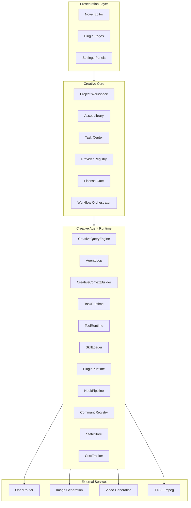
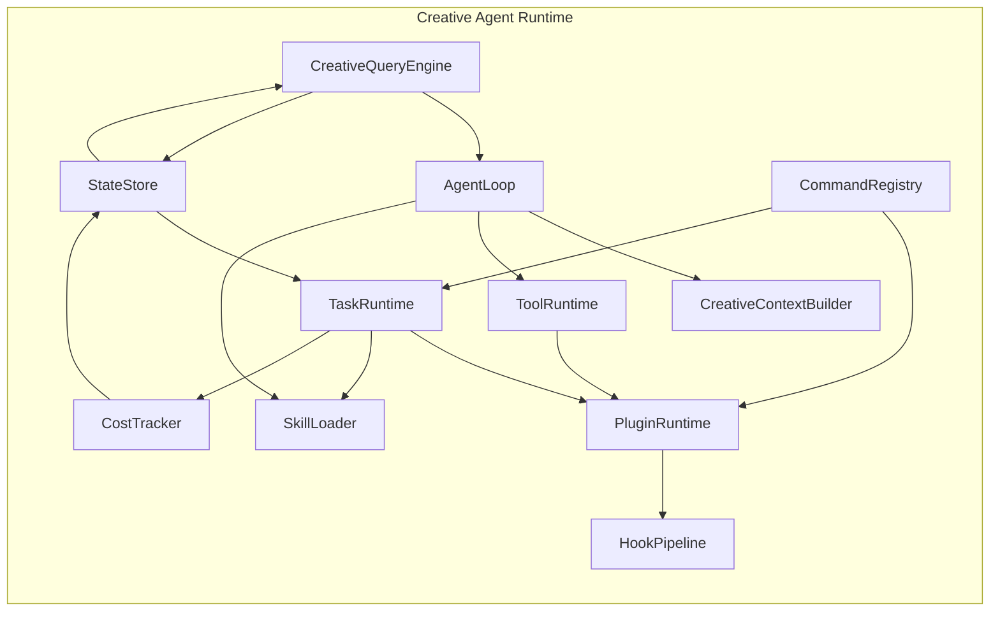
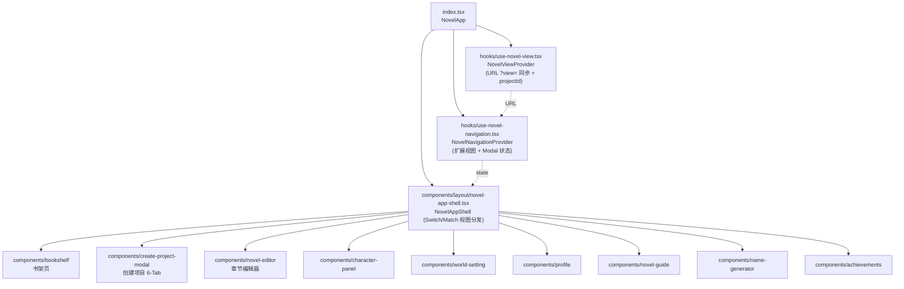
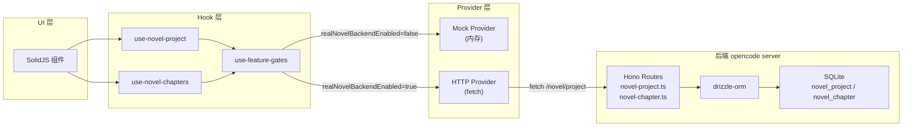
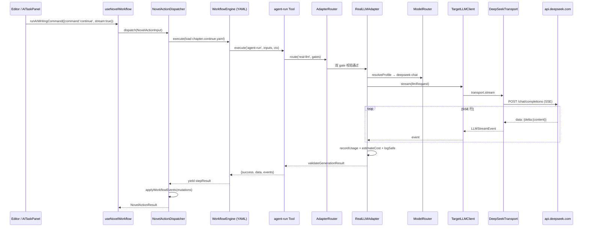
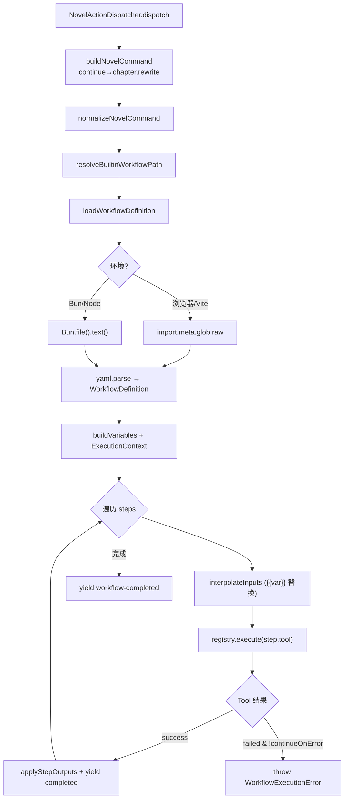
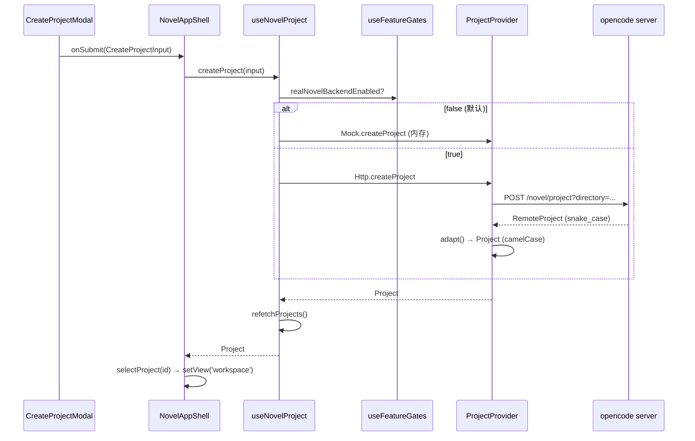
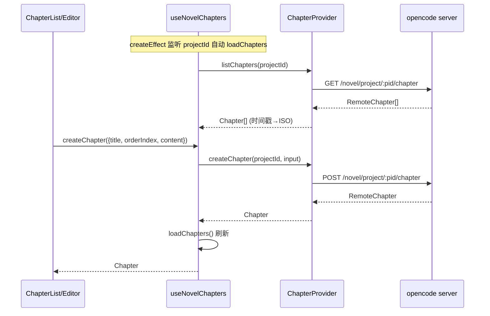

# StoryTree2 Code Wiki

> **项目**: OpenCode Creative Studio (StoryTree2)  
> **版本**: v1.1  
> **最后更新**: 2026-06-26  
> **状态**: 持续更新中

---

## 目录

1. [项目概述](#1-项目概述)
2. [项目架构](#2-项目架构)
3. [核心模块详解](#3-核心模块详解)
4. [关键类和函数说明](#4-关键类和函数说明)
5. [依赖关系](#5-依赖关系)
6. [项目运行方式](#6-项目运行方式)
7. [数据类型定义](#7-数据类型定义)
8. [扩展点与接口](#8-扩展点与接口)
9. [Novel 模块二次开发调研（基于 opencode-1.4.0）](#9-novel-模块二次开发调研基于-opencode-140)

---

## 1. 项目概述

### 1.1 项目定位

**StoryTree2** 是一个基于 Claude-Code 架构的开放式 AI 创作平台，采用 **clean-room architecture rewrite** 方法论，在借鉴 Claude Code 架构、抽象、流程和模块边界的基础上，进行独立的原创实现。

### 1.2 核心设计原则

| 原则 | 说明 |
|------|------|
| **Novel Editor Core** | 小说编辑器作为免费 Core Product，而非付费插件 |
| **Skill/Plugin/Provider 严格区分** | Skill 是任务说明包，Plugin 是产品模块，Provider 是外部服务适配器 |
| **Creative Agent Runtime** | 底层执行内核，负责 Agent 的运行机制 |
| **Creative Core** | 业务抽象层，负责创作项目的管理 |

### 1.3 项目结构

```
storytree2/
├── caiode/                          # 核心代码目录
│   ├── claude-code-src/             # Claude Code 源码分析基准（研究材料，非开源）
│   ├── opencode-1.4.0/              # OpenCode 核心实现
│   ├── vscode-extension/            # VS Code 扩展实现
│   └── Trae-Ralph-main/             # Trae + Ralph 工具链
├── backups/                         # 备份和历史文件
│   ├── dreamweaver/                 # Next.js 前端（已废弃）
│   └── dreamweaver/                # 补丁历史
├── docs/                            # 项目文档
│   ├── planning/                    # 规划文档
│   ├── roadmap/                     # 路书文档（13份架构文档）
│   └── task-reports/                # 任务报告
├── workspaces/                      # 多模型 AI 工作空间
│   ├── Claude/
│   ├── Kimi-K2.5/
│   ├── MiniMax-M2/
│   └── Gemini/
└── .trae/                           # Agent 规则和工具
    ├── rules/                       # Ralph 执行规则
    └── skills/                      # Agent 技能定义
```

---

## 2. 项目架构

### 2.1 三层架构模型

```text
┌─────────────────────────────────────────────────────────────┐
│                    Presentation Layer (UI)                  │
│  ┌─────────────┐  ┌─────────────┐  ┌─────────────────────┐ │
│  │ Novel Editor │  │ Plugin Pages │  │ Settings Panels    │ │
│  └─────────────┘  └─────────────┘  └─────────────────────┘ │
├─────────────────────────────────────────────────────────────┤
│                    Creative Core (Business)                 │
│  ┌─────────────┐  ┌─────────────┐  ┌─────────────────────┐ │
│  │ Project     │  │ Asset       │  │ License Gate        │ │
│  │ Workspace   │  │ Library     │  │                     │ │
│  └─────────────┘  └─────────────┘  └─────────────────────┘ │
├─────────────────────────────────────────────────────────────┤
│               Creative Agent Runtime (Kernel)               │
│  ┌─────────────┐  ┌─────────────┐  ┌─────────────────────┐ │
│  │ AgentLoop   │  │ TaskRuntime │  │ ToolRuntime         │ │
│  │             │  │             │  │                     │ │
│  └─────────────┘  └─────────────┘  └─────────────────────┘ │
└─────────────────────────────────────────────────────────────┘
```

### 2.2 模块分层图



---

## 3. 核心模块详解

### 3.1 Creative Agent Runtime（底层执行内核）

#### 3.1.1 CreativeQueryEngine

| 属性 | 说明 |
|------|------|
| **职责** | 会话生命周期管理、Agent 请求入口、流式响应输出 |
| **输入** | 用户请求、项目上下文、会话状态 |
| **输出** | 流式响应、任务创建、状态更新 |
| **依赖模块** | AgentLoop, StateStore, CostTracker |

**核心接口**：
```typescript
interface CreativeQueryEngine {
  createSession(config: SessionConfig): Promise<Session>
  sendRequest(sessionId: string, request: UserRequest): AsyncGenerator<StreamChunk>
  closeSession(sessionId: string): Promise<void>
  getSession(sessionId: string): Session | undefined
}
```

#### 3.1.2 AgentLoop

| 属性 | 说明 |
|------|------|
| **职责** | 主循环：模型响应、工具调用、观察结果、继续推理 |
| **输入** | 用户请求、上下文、可用工具列表 |
| **输出** | 流式响应、工具调用结果、最终答案 |
| **依赖模块** | ToolRuntime, SkillLoader, CreativeContextBuilder |

**核心接口**：
```typescript
interface AgentLoop {
  run(input: AgentInput): AsyncGenerator<AgentOutput>
  pause(): void
  resume(): void
  stop(): void
}

type AgentOutput =
  | { type: 'thinking'; content: string }
  | { type: 'tool_call'; tool: string; input: unknown }
  | { type: 'tool_result'; tool: string; output: unknown }
  | { type: 'final'; content: string }
  | { type: 'error'; message: string }
```

#### 3.1.3 TaskRuntime

| 属性 | 说明 |
|------|------|
| **职责** | 所有生成任务统一调度 |
| **输入** | 任务定义、Skill 名称、插件ID |
| **输出** | 任务状态、任务结果 |
| **依赖模块** | LicenseGate, SkillLoader, PluginRuntime |

**核心接口**：
```typescript
interface TaskRuntime {
  createTask(task: TaskInput): Promise<CreativeTask>
  getTask(taskId: string): CreativeTask | undefined
  cancelTask(taskId: string): Promise<void>
  retryTask(taskId: string): Promise<CreativeTask>
  listTasks(filter?: TaskFilter): CreativeTask[]
}
```

**CreativeTask 数据结构**：
```typescript
interface CreativeTask {
  id: string
  type: string
  title: string
  status: 'queued' | 'running' | 'waiting_for_permission' | 'waiting_for_user' | 'completed' | 'failed' | 'cancelled'
  projectId: string
  sourceAssetIds: string[]
  outputAssetIds: string[]
  skillName?: string
  pluginId?: string
  providerIds?: string[]
  licenseFeature?: string
  input: unknown
  output?: unknown
  error?: CreativeTaskError
  cost?: {
    inputTokens?: number
    outputTokens?: number
    providerCostUsd?: number
    localComputeCost?: number
  }
  createdAt: string
  updatedAt: string
}
```

#### 3.1.4 ToolRuntime

| 属性 | 说明 |
|------|------|
| **职责** | 具体可执行动作注册与执行 |
| **输入** | 工具名称、工具输入 |
| **输出** | 工具执行结果 |
| **依赖模块** | ProviderBridge, AssetLibrary |

**核心接口**：
```typescript
interface ToolRuntime {
  registerTool(tool: ToolDefinition): void
  unregisterTool(toolId: string): void
  executeTool(toolId: string, input: unknown, context: ToolContext): Promise<ToolResult>
  listTools(): ToolDefinition[]
}

interface ToolDefinition {
  id: string
  name: string
  description: string
  inputSchema: JSONSchema
  outputSchema: JSONSchema
  execute: (input: unknown, context: ToolContext) => Promise<ToolResult>
}

interface ToolContext {
  worktreePath: string
  permissionManager: PermissionManager
  taskCenter: TaskRuntime
  assetLibrary: AssetLibrary
}
```

#### 3.1.5 SkillLoader

| 属性 | 说明 |
|------|------|
| **职责** | 发现 `.claude/skills/*/SKILL.md`，按需加载 |
| **输入** | Skill 名称、任务上下文 |
| **输出** | Skill 定义、Skill 内容 |
| **依赖模块** | 文件系统 |

**核心接口**：
```typescript
interface SkillLoader {
  discoverSkills(): SkillCatalogEntry[]
  loadSkill(skillName: string): Promise<SkillDefinition>
  unloadSkill(skillName: string): void
  getSkill(skillName: string): SkillDefinition | undefined
}
```

**Skill 目录结构**：
```
.claude/skills/
├── novel-outline/
│   └── SKILL.md
├── novel-to-script/
│   └── SKILL.md
├── story-to-shot/
│   └── SKILL.md
├── shot-camera-plan/
│   └── SKILL.md
├── shot-to-image-prompt/
│   └── SKILL.md
├── shot-to-video-prompt/
│   └── SKILL.md
├── timeline-assembly/
│   └── SKILL.md
└── consistency-check/
    └── SKILL.md
```

#### 3.1.6 PluginRuntime

| 属性 | 说明 |
|------|------|
| **职责** | 插件加载、扩展点、权限系统 |
| **输入** | 插件 Manifest |
| **输出** | 插件实例、扩展点注册 |
| **依赖模块** | LicenseGate, StateStore |

**核心接口**：
```typescript
interface PluginRuntime {
  load(manifest: CreativePluginManifest): Promise<PluginInstance>
  unload(pluginId: string): Promise<void>
  enable(pluginId: string): Promise<void>
  disable(pluginId: string): Promise<void>
  getInstance(pluginId: string): PluginInstance | undefined
  listPlugins(): CreativePluginManifest[]
  getCapability(pluginId: string, capabilityId: string): PluginCapability | undefined
}
```

### 3.2 Creative Core（业务抽象层）

#### 3.2.1 Novel Editor Core

**定位**：Novel Editor Core 不是普通插件，而是 OpenCode Creative Studio 的基础入口和所有下游插件的内容源。

**核心数据模型**：

```typescript
interface NovelProject {
  id: string
  name: string
  description: string
  type: 'novel' | 'screenplay' | 'short_story'
  status: 'draft' | 'in_progress' | 'completed'
  createdAt: string
  updatedAt: string
}

interface Character {
  id: string
  projectId: string
  name: string
  role: 'protagonist' | 'antagonist' | 'supporting' | 'minor'
  age: number
  gender: string
  appearance: string
  personality: string
  background: string
  motivation: string
  arc: string
  relationships: CharacterRelationship[]
}

interface Chapter {
  id: string
  projectId: string
  number: number
  title: string
  summary: string
  scenes: Scene[]
  status: 'outline' | 'draft' | 'revision' | 'final'
}

interface Scene {
  id: string
  chapterId: string
  number: number
  title: string
  setting: string
  characters: string[]
  goal: string
  conflict: string
  outcome: string
  beats: Beat[]
}

interface Beat {
  id: string
  sceneId: string
  number: number
  description: string
  type: 'action' | 'dialogue' | 'description' | 'transition'
}
```

#### 3.2.2 Asset Library

| 属性 | 说明 |
|------|------|
| **职责** | 统一管理所有创作产物 |
| **功能** | 资产版本管理、来源和引用关系维护 |

**核心接口**：
```typescript
interface AssetLibrary {
  createAsset(asset: AssetInput): Promise<Asset>
  getAsset(assetId: string): Asset | undefined
  updateAsset(assetId: string, data: Partial<Asset>): Promise<Asset>
  deleteAsset(assetId: string): Promise<void>
  listAssets(filter?: AssetFilter): Asset[]
  createVersion(assetId: string, data: unknown): Promise<AssetVersion>
  getVersions(assetId: string): AssetVersion[]
}
```

#### 3.2.3 License Gate

| 属性 | 说明 |
|------|------|
| **职责** | 单模块付费权限校验 |

**核心接口**：
```typescript
interface LicenseGate {
  check(pluginId: string, feature?: string): LicenseGateResult
  getLicenseInfo(pluginId: string): LicenseInfo
}

type LicenseGateResult = {
  allowed: boolean
  reason?: 'not_installed' | 'trial_expired' | 'license_missing' | 'quota_exceeded'
  upgradeUrl?: string
}
```

---

## 4. 关键类和函数说明

### 4.1 claude-code-src 核心模块映射

| claude-code-src 模块 | Creative Runtime 对应 | 职责说明 |
|---------------------|----------------------|---------|
| `QueryEngine.ts` | `CreativeQueryEngine` | 会话生命周期管理 |
| `query.ts` | `AgentLoop` | 主 Agent Loop，流式响应 |
| `Tool.ts` / `tools.ts` | `ToolRuntime` | 工具抽象与执行 |
| `Task.ts` / `tasks.ts` | `TaskRuntime` | 任务状态机管理 |
| `skills/` | `SkillLoader` | Skill 发现与加载 |
| `commands.ts` | `CommandRegistry` | 命令注册与分发 |
| `context.ts` | `CreativeContextBuilder` | 上下文构造与压缩 |
| `state/` | `StateStore` | 状态持久化管理 |
| `bridge/` | `ProviderBridge` | 外部服务桥接 |
| `coordinator/` | `WorkflowOrchestrator` | 工作流编排 |
| `hooks/` | `HookPipeline` | 生命周期扩展点 |
| `cost-tracker.ts` | `CostTracker` | 成本追踪统计 |

### 4.2 VS Code Extension 核心模块

位于 `caiode/vscode-extension/src/`：

| 模块路径 | 核心文件 | 职责 |
|---------|---------|------|
| **core/** | `sync-push-service.ts` | 同步推送服务 |
| | `sqlite-db.ts` | SQLite 数据库操作 |
| | `global-model-request-queue.ts` | 全局模型请求队列 |
| | `file-mutex.ts` | 文件互斥锁 |
| | `config-service.ts` | 配置服务 |
| | `event-bus.ts` | 事件总线 |
| | `rpc-adapter.ts` | RPC 适配器 |
| | `queue-monitor.ts` | 队列监控 |
| **core/ai/** | `anthropic-provider.ts` | Anthropic API 提供者 |
| | `openai-provider.ts` | OpenAI API 提供者 |
| | `ollama-provider.ts` | Ollama 本地模型 |
| | `provider-factory.ts` | 提供者工厂 |
| | `conversation-manager.ts` | 对话管理器 |
| | `stream-processor.ts` | 流式响应处理 |
| **core/db-adapter.ts** | - | 数据库适配器 |
| **webview/** | `ai-chat-panel.ts` | AI 聊天面板 |
| | `enhanced-dashboard.ts` | 增强仪表板 |
| | `settings-page.ts` | 设置页面 |
| | `html-generator.ts` | HTML 生成器 |
| **automation/** | `task-orchestrator.ts` | 任务编排器 |
| | `automation-queue.ts` | 自动化队列 |
| | `cdp-driver.ts` | CDP 驱动 |
| **skills/** | `skill-registry.ts` | Skill 注册表 |

---

## 5. 依赖关系

### 5.1 模块依赖矩阵



### 5.2 插件消费链路

```text
Novel Scene
  ↓
Script Studio：改写成剧本场景
  ↓
Storyboard Studio：拆成镜头
  ↓
3D Shot Draft：生成 3D 构图草稿
  ↓
Image Prompt：生成图像提示词
  ↓
Image Generation：生成图像资产
  ↓
Video Prompt：生成视频提示词
  ↓
Video Generation：生成视频资产
  ↓
Timeline Draft：拼接剪辑草稿
  ↓
Long Video Manager：管理长项目结构
```

### 5.3 外部依赖

| 依赖类型 | 具体依赖 | 说明 |
|---------|---------|------|
| **AI Provider** | Anthropic (Claude) | 主要 AI 模型 |
| | OpenAI | GPT 模型支持 |
| | OpenRouter | 多模型路由 |
| | Ollama | 本地模型支持 |
| **媒体处理** | FFmpeg | 视频处理 |
| **存储** | SQLite | 本地数据库 |
| **构建工具** | Next.js | 前端框架 |
| | TypeScript | 类型系统 |
| | esbuild | 代码打包 |
| **测试** | Vitest | 单元测试 |
| | Playwright | E2E 测试 |

---

## 6. 项目运行方式

### 6.1 开发环境配置

#### 6.1.1 环境要求

- **Node.js**: >= 18.0.0
- **npm/yarn/pnpm/bun**: 最新稳定版
- **VS Code**: 最新版本
- **Git**: 2.x

#### 6.1.2 安装步骤

```bash
# 克隆项目
git clone https://github.com/storytree/storytree2.git
cd storytree2

# 安装根目录依赖
npm install

# 安装 caiode 依赖
cd caiode/vscode-extension
npm install
```

#### 6.1.3 环境变量配置

创建 `.env` 文件：

```bash
# API Keys
ANTHROPIC_API_KEY=your_key_here
OPENAI_API_KEY=your_key_here
OPENROUTER_API_KEY=your_key_here

# 数据库配置
DATABASE_PATH=./data/storytree.db

# 功能开关
ENABLE_TELEMETRY=true
ENABLE_AUTO_UPDATE=true
```

### 6.2 运行命令

#### 6.2.1 VS Code Extension

```bash
cd caiode/vscode-extension

# 开发模式运行
npm run watch
# 或
npm run dev

# 构建生产版本
npm run build

# 打包 .vsix
npm run package
```

#### 6.2.2 测试

```bash
# 单元测试
npm run test:unit

# 单元测试（监听模式）
npm run test:unit:watch

# E2E 测试
npm run test:e2e

# E2E 测试（UI 模式）
npm run test:e2e:ui

# 覆盖率报告
npm run coverage
```

#### 6.2.3 代码质量

```bash
# 代码检查
npm run lint

# 自动修复
npm run lint:fix

# 代码格式化
npm run format

# 格式化检查
npm run format:check
```

### 6.3 项目启动流程

```
1. 初始化 StateStore
   ↓
2. 加载配置文件
   ↓
3. 初始化 ProviderRegistry
   ↓
4. 加载已安装插件
   ↓
5. 启动 PluginRuntime
   ↓
6. 启动 SkillLoader
   ↓
7. 启动 CreativeQueryEngine
   ↓
8. 监听用户输入
```

---

## 7. 数据类型定义

### 7.1 Plugin Manifest

```typescript
type CreativePluginManifest = {
  id: string
  name: string
  version: string
  description: string
  category:
    | 'story'
    | 'script'
    | 'storyboard'
    | '3d'
    | 'image'
    | 'video'
    | 'audio'
    | 'editing'
    | 'workflow'
    | 'team'

  pricing: {
    model: 'free' | 'one_time' | 'subscription' | 'credits' | 'bundle'
    sku: string
    trialDays?: number
  }

  dependencies: {
    coreVersion: string
    plugins?: string[]
    providers?: string[]
    skills?: string[]
  }

  permissions: {
    fileRead?: boolean
    fileWrite?: boolean
    assetRead?: boolean
    assetWrite?: boolean
    taskCreate?: boolean
    providerUse?: string[]
    networkAccess?: boolean
    ffmpegAccess?: boolean
  }

  extensionPoints: {
    pages?: string[]
    panels?: string[]
    commands?: string[]
    assetTypes?: string[]
    taskTypes?: string[]
    skills?: string[]
    providers?: string[]
  }
}
```

### 7.2 Provider Definition

```typescript
interface ProviderDefinition {
  id: string
  name: string
  type: 'llm' | 'image' | 'video' | 'tts' | 'ffmpeg'
  inputSchema: JSONSchema
  outputSchema: JSONSchema
  errorSchema: JSONSchema
  execute: (input: unknown, context: ProviderContext) => Promise<ProviderResult>
}

interface ProviderResult {
  success: boolean
  data?: unknown
  error?: string
  costMetadata: CostMetadata
  taskStatus: TaskStatus
}
```

### 7.3 Skill Definition

```typescript
interface SkillDefinition {
  name: string
  description: string
  whenToUse: string
  requiredPluginCapabilities?: string[]
  requiredProviders?: string[]
  requiredContext?: string[]
  workflow?: string[]
  rules?: string[]
  content: string
}
```

---

## 8. 扩展点与接口

### 8.1 OpenCode Core 扩展点

| 扩展点 | 用途 | 注册方式 |
|--------|------|---------|
| `workspace.page` | 注册新页面 | `runtime.registerPage(manifest.id, pageConfig)` |
| `workspace.panel` | 注册侧栏/右栏面板 | `runtime.registerPanel(manifest.id, panelConfig)` |
| `command.palette` | 注册命令 | `runtime.registerCommand(manifest.id, commandDef)` |
| `asset.type` | 注册资产类型 | `runtime.registerAssetType(manifest.id, assetTypeDef)` |
| `task.type` | 注册任务类型 | `runtime.registerTaskType(manifest.id, taskTypeDef)` |
| `skill.type` | 注册 Skill | `runtime.registerSkill(manifest.id, skillDef)` |
| `provider.type` | 注册 Provider | `runtime.registerProvider(manifest.id, providerDef)` |
| `export.format` | 注册导出格式 | `runtime.registerExportFormat(manifest.id, formatDef)` |
| `settings.section` | 注册设置页面 | `runtime.registerSettingsSection(manifest.id, sectionDef)` |
| `license.feature` | 注册付费功能点 | `runtime.registerLicenseFeature(manifest.id, featureDef)` |

### 8.2 权限边界

| 权限 | 默认状态 | 说明 |
|------|---------|------|
| fileRead | false | 需显式申请 |
| fileWrite | false | 需显式申请 |
| assetRead | true | 可读取资产库 |
| assetWrite | false | 需显式申请 |
| taskCreate | false | 需显式申请 |
| providerUse | [] | 需显式申请可用 Provider |
| networkAccess | false | 需显式申请 |
| ffmpegAccess | false | 需显式申请 |

### 8.3 高危操作限制

以下操作插件禁止直接执行，必须通过 Core 提供的抽象接口：

- Bash 命令执行
- WebFetch 远程请求
- WebSearch 网络搜索
- 子 Agent 调用
- 环境变量读取
- 系统目录访问
- 沙箱外路径访问

---

## 附录

### A. 文件命名规范

| 类型 | 规范 | 示例 |
|------|------|------|
| TypeScript 文件 | PascalCase.ts | `CreativeQueryEngine.ts` |
| React 组件 | PascalCase.tsx | `AiChatPanel.tsx` |
| 类型定义 | `*.types.ts` | `provider.types.ts` |
| 测试文件 | `*.test.ts` | `provider-factory.test.ts` |
| 样式文件 | kebab-case.css | `ai-chat-panel.css` |

### B. Git 分支规范

| 分支类型 | 命名格式 | 示例 |
|---------|---------|------|
| 功能开发 | `feat/DEV-{任务编号}-{简短描述}` | `feat/DEV-1.2.1-llm-request-queue` |
| 缺陷修复 | `fix/BUG-{编号}-{简短描述}` | `fix/BUG-042-stale-lock-cleanup` |
| 测试专项 | `test/TEST-{任务编号}-{简短描述}` | `test/TEST-1.3.2c-race-condition` |
| 文档更新 | `docs/DOC-{简短描述}` | `docs/DOC-phase1-breakdown` |
| AI Agent | `trae/solo-agent-{标识符}` | `trae/solo-agent-jY1pa4` |

### C. Commit Message 规范

```
<type>(<scope>): <subject>

[type]: feat | fix | test | docs | refactor | perf | chore | revert
[scope]: 任务编号，如 DEV-1.2.1
[subject]: 简短描述

示例：
feat(DEV-1.2.1): 实现 GlobalModelRequestQueue 串行化调度器
fix(DEV-1.3.2): 修复 FileMutex 重入检测逻辑
```

---

## 9. Novel 模块二次开发调研（基于 opencode-1.4.0）

> **调研路径**: `caiode/opencode-1.4.0/packages/app/src/novel/`
> **技术栈**: SolidJS（非 React）+ TypeScript + Vite，运行时 Bun/Node 双环境兼容
> **后端路径**: `caiode/opencode-1.4.0/packages/opencode/src/novel/` + `server/routes/novel-*.ts`
> **调研时间**: 2026-06-26

### 9.1 调研链

```text
用户需求（TabAI 会话）
   ↓
架构优化路书（13 份文档，docs/roadmap/）
   ├─ CREATIVE-AGENT-RUNTIME-ARCHITECTURE.md（11 个核心模块接口）
   ├─ CREATIVE-CORE-ARCHITECTURE.md（业务抽象层）
   ├─ NOVEL-EDITOR-AS-CORE-PRODUCT.md（Novel Editor Core 定位）
   ├─ PLUGIN-ARCHITECTURE.md（Creative Agent Runtime 架构）
   └─ SKILL-DEFINITION-AND-USAGE.md（Skill 规范）
   ↓
PRD（caiode/docs/tabbit/06/）§3.3 ~ §3.8 逐页拆分
   ↓
页级规范（novel/docs/page-specs/）
   ├─ PAGE-03_bookshelf.md          （我的书架）
   ├─ PAGE-04_create_project_basic.md（创建项目-基本信息 6-Tab）
   ├─ PAGE-05_create_project_protagonist.md（主角设定 9 元素）
   ├─ PAGE-06_create_project_worldview.md（世界观 4 元素）
   ├─ PAGE-07_create_project_plot_outline.md（剧情总纲 8 元素）
   ├─ PAGE-08_create_project_custom_settings.md（自定义设定 5 元素）
   ├─ PAGE-10_chapter_editor.md     （章节编辑器统一工作台）
   ├─ PAGE-11_ai_model_settings.md  （AI 模型设置）
   └─ PAGE-14_name_generator.md     （名字生成器）
   ↓
阶段实施计划（novel/docs/phase-p2/、phase-p3/）
   ├─ P2-A/B/C/E：YAML Workflow Engine / Plugin Tool Registry / Info-Theory Audit / Adapter Router
   ├─ P3-0/A/B/C/D：Real LLM Readiness / Adapter Pilot / UI Continue / Chapter Generation / Model Routing
   └─ PAGE-03~14：UI 端到端真实交互 + 后端存储 + E2E 验收
   ↓
代码实现 + 单元测试 + 有头浏览器 E2E + 任务报告
   ↓
代码评审（docs/reviews/2026-06-21/NOVEL-CODE-REVIEW-20260621.md，9 维度 28 改进建议）
```

**关键调研依据文件**：

| 文件 | 用途 |
|------|------|
| `caiode/docs/tabbit/TabAI会话_1778901717836.md` | 架构优化原始路书 |
| `caiode/docs/tabbit/06/P3P4P5阶段目标.md` | P3/P4/P5 阶段目标 |
| `caiode/docs/tabbit/06/novelforge-scheme-review.md` | NovelForge 方案评审 |
| `caiode/docs/tabbit/06/novelforge-code-review.md` | NovelForge 代码评审 |
| `docs/reviews/2026-06-21/NOVEL-CODE-REVIEW-20260621.md` | 9 维度代码评审报告 |

### 9.2 模块结构与子目录职责

```text
novel/
├── index.tsx                  # 模块入口：NovelViewProvider → NovelNavigationProvider → NovelAppShell
├── feature-gates.ts           # 22 个 FeatureGate 默认值（控制 realLLM/backend/UI 开关）
├── actions/                   # UI 动作分发层：NovelActionInput → NovelCommand → Workflow Engine
├── adapters/                  # Agent 执行适配器路由（mock/opencode/claudecode/real-llm）
├── chat-debug/                # 开发态调试控制台（命令解析/LLM 运行/日志存储）
├── components/                # 全部 SolidJS UI 组件（按页面/功能分子目录）
│   ├── achievements/          # 成就页
│   ├── bookshelf/             # 书架页（项目卡片/空态/悬浮 widget）
│   ├── character-panel/       # 角色面板（主角/反派/配角）
│   ├── create-project-modal/  # 创建项目 6-Tab 向导
│   ├── layout/                # 应用骨架（novel-app-shell 路由分发 + 侧栏/顶栏/ModalHost）
│   ├── name-generator/        # 名字生成器（PAGE-14）
│   ├── novel-editor/          # 编辑器主区（章节列表/编辑器/AI 工具栏/AI 任务面板）
│   ├── novel-guide/           # AI 创作引导页
│   ├── novel-workspace/       # 工作台容器（layout/outline/generation/editor/ai-task）
│   ├── profile/               # 个人中心（AI 模型/积分/充值 Tab）
│   ├── ui/                    # 基础 UI 原子组件（button/badge/tab-bar/stepper 等）
│   └── world-setting/         # 世界观设置页
├── docs/                      # 设计与验收文档（page-specs/phase-p2/phase-p3）
├── hooks/                     # SolidJS 业务 Hook 层（视图/导航/项目/章节/工作流/LLM 任务）
├── info-theory/               # 信息论审计引擎（熵/互信息/信息原子抽取）
├── llm/                       # 真实 LLM 调用全链路（路由/上下文/prompt/client/transport/流式/重试/成本）
├── mock-data/                 # 内存 Mock 数据源
├── plugins/                   # Novel Tool 插件体系（registry + 6 个内置工具）
├── providers/                 # 数据 Provider 抽象层（Mock + HTTP 双实现）
├── services/                  # 通用服务（上下文组装 + 类型 prompt 模板）
├── styles/                    # 设计令牌（design-tokens.ts）
├── types/                     # 21 个 TypeScript 类型文件（统一 re-export）
├── utils/                     # 通用工具（mock-delay）
└── workflows/                 # YAML 工作流引擎（engine/ + yaml/ + 事件应用）
```

### 9.3 依赖链

#### 9.3.1 入口与路由依赖链



#### 9.3.2 前后端数据依赖链（双轨数据源）



**后端路由注册**（`packages/opencode/src/server/instance.ts`）：

```typescript
.route("/novel/project", NovelProjectRoutes())
.route("/novel/project/:projectId/chapter", NovelChapterRoutes())
```

**API 端点清单**：

| 模块 | 端点 | 方法 | 说明 |
|------|------|------|------|
| Project | `/novel/project` | GET | 列表（非回收站） |
| Project | `/novel/project/trash` | GET | 回收站列表 |
| Project | `/novel/project/search` | GET | 搜索 |
| Project | `/novel/project/:id` | GET/PATCH/DELETE | 详情/更新/软删除 |
| Project | `/novel/project` | POST | 创建 |
| Project | `/novel/project/:id/restore` | POST | 恢复 |
| Chapter | `/novel/project/:pid/chapter` | GET/POST | 列表/创建 |
| Chapter | `/novel/project/:pid/chapter/trash` | GET | 章节回收站 |
| Chapter | `/novel/project/:pid/chapter/:id` | GET/PATCH/DELETE | 详情/更新/软删除 |
| Chapter | `/novel/project/:pid/chapter/:id/restore` | POST | 恢复 |

#### 9.3.3 LLM 生成调用链



**LLM 子模块依赖**：

| 文件 | 职责 |
|------|------|
| `llm/model-router.ts` | 命令 → ModelRole → 默认 profileId（deepseek-flash/chat） |
| `llm/model-profile-registry.ts` | 模型 profile 注册表 |
| `llm/chapter-context-assembler.ts` | 章节上下文组装 + token-budget 裁剪 |
| `llm/chapter-prompt-builder.ts` | 章节 prompt 构建 |
| `llm/target-llm-request-builder.ts` | LLM 请求构建 |
| `llm/target-llm-client.ts` | LLM 客户端（complete/stream，默认 disabled transport） |
| `llm/deepseek-transport.ts` | DeepSeek HTTP transport（OpenAI 兼容 + SSE） |
| `llm/target-llm-stream-parser.ts` | SSE 流解析 |
| `llm/retry-policy.ts` | 重试策略 |
| `llm/fallback-handler.ts` | 失败 fallback 到 mock |
| `llm/generation-result-validator.ts` | 生成结果校验 |
| `llm/usage-tracker.ts` + `cost-estimator.ts` | 用量追踪 + 成本估算 |
| `llm/llm-secret-policy.ts` + `llm-safe-logger.ts` | 密钥安全 + 安全日志 |
| `llm/llm-feature-gates.ts` | LLM gate 断言（assertRealLLMExecutionAllowed） |

**密钥注入约定**：`deepseek-transport.ts` 不读 `process.env`，API Key 仅由 `agent-run.tool.ts` 从 `import.meta.env.VITE_DEEPSEEK_API_KEY`（Vite 构建期静态替换）注入；默认 `disabledLLMTransport` 保证不误发真实请求。

#### 9.3.4 Workflow 调用链



**内置 YAML 工作流**（`workflows/yaml/`）：
- `chapter.generate.yaml` — 章节生成
- `chapter.continue.yaml` — 章节续写
- `info.extract.yaml` — 信息抽取

**内置 Tool 注册表**（`plugins/builtin-novel-tools.ts`）注册 6 个工具：
`mock-generation-wrapper` / `context-assemble` / `build-workflow-events` / `info-extract-placeholder` / `info-theory-audit` / `agent-run`

#### 9.3.5 类型依赖清单（`types/` 目录）

| 类型文件 | 用途 |
|---------|------|
| `project.ts` | Project + CreateProjectInput + 枚举（Genre/Gender/WorldType/Era/SocialSystem/WritingStyle/StoryTheme/TargetAudience） |
| `chapter.ts` | Chapter + ChapterOutline + AISuggestion + ChapterExtractedInfo |
| `editor.ts` | ChapterStatus + AIExtractedInfo + AIWritingCommand（continue/rewrite/expand/polish/summarize） |
| `character.ts` | Character + CharacterRelationship |
| `world.ts` | WorldSetting/Overview/Location/Item/Skill/Faction/Tab |
| `outline.ts` | OutlineViewMode/NodeType/Node |
| `ai-task.ts` | AITask + NovelAgentResult |
| `ai-log.ts` | AILog |
| `bookshelf.ts` | BookshelfFilter/FloatingWidgetData/ToolbarItem |
| `workspace.ts` | WorkspacePanelId/State |
| `novel-view.ts` | NovelView 联合类型 |
| `novel-modal.ts` | NovelModal |
| `novel-guide.ts` | GuideProject/Question/Option/Genre/TargetLength |
| `name-generator.ts` | 名字生成器类型 |
| `profile.ts` | CreditRecord/RechargePackage/ProfileTab |
| `achievement.ts` | Achievement/Category |
| `generation-config.ts` | GenerationConfig/ContextReference/AIModelOption |
| `information-flow.ts` | InformationAtom/Link/ChapterInformationState/SaveTheCatBeatId |
| `provider-error.ts` | ProviderError/ProviderErrorCode |
| `sandbox.ts` | Sandbox |
| `index.ts` | 统一 re-export 聚合入口 |

### 9.4 数据流时序

#### 9.4.1 创建项目（UI → Hook → Provider → HTTP）



#### 9.4.2 创建章节



### 9.5 FeatureGate 矩阵

`feature-gates.ts` 定义 22 个 gate，控制真实 LLM / 后端 / UI 功能开关：

| Gate | 默认 | 说明 |
|------|------|------|
| `realLLMEnabled` | true | 真实 LLM 调用（2026-06-23 测试 DeepSeek 临时开启） |
| `targetLLMAdapterEnabled` | true | target LLM adapter |
| `openCodeAdapterEnabled` | false | OpenCode adapter |
| `claudeCodeAdapterEnabled` | false | Claude Code adapter |
| `modelRoutingEnabled` | true | 模型路由 |
| `llmFallbackToMockEnabled` | true | LLM 失败 fallback 到 mock |
| `modelSelectionUIEnabled` | true | PAGE-11 AI 模型设置 Tab |
| `llmStreamingEnabled` | true | LLM 流式 |
| `llmRequestLogEnabled` | true | LLM 请求日志 |
| `llmCostTrackingEnabled` | false | LLM 成本追踪 |
| `llmSafePromptLoggingEnabled` | false | 安全 prompt 日志 |
| `nameGeneratorEnabled` | true | PAGE-14 名字生成器 |
| `realNovelBackendEnabled` | false | 后端真实数据存储（默认 mock） |
| `gitWorktreeEnabled` | false | Git worktree |
| `customSkillEnabled` | false | 自定义 Skill |
| `paymentEnabled` | false | 支付 |
| `cloudSyncEnabled` | false | 云同步 |
| `exportEnabled` | false | 导出 |
| `importEnabled` | false | 导入 |
| `bookAnalysisEnabled` | false | 书籍分析 |
| `guide25Enabled` | false | 25 题引导 |
| `batchGenerationEnabled` | false | 批量生成 |
| `chatDebugEnabled` | false | 调试控制台 |
| `branchExperimentEnabled` | false | 分支实验 |

**Adapter Router 纪律**：被 gate 关闭的 adapter 返回结构化 `ADAPTER_DISABLED` 而非 fallback 到 mock，防止伪成功；`real-llm-adapter` 需 `realLLMEnabled && targetLLMAdapterEnabled` 双 gate 同时满足。

**E2E 测试钩子**：`use-feature-gates.ts` 监听 `window.__NOVEL_BACKEND_ENABLED__` 在 E2E 中强制开启后端。

### 9.6 当前进度

#### 9.6.1 已完成阶段

| 阶段 | 任务 ID | 关键产出 | 验证结果 |
|------|---------|---------|---------|
| **Phase 0** | DOC-PHASE0-001~014 | 13 份架构路书文档 | ✅ |
| **Phase P2-A** | P2-A-WORKFLOW-ENGINE | YAML Workflow Engine | typecheck + 173 UT pass |
| **Phase P2-B** | P2-B-PLUGIN-TOOL-REGISTRY | Plugin Tool Registry | 190 UT pass |
| **Phase P2-C** | P2-C-INFO-THEORY-AUDIT | Info-Theory Audit Tool | 229 UT pass |
| **Phase P2-E** | P2-E-ADAPTER-ROUTER | Adapter Router + Stub + Commit Governance | 260 UT pass |
| **Phase P3-0** | P3-0-REAL-LLM-READINESS | Real LLM Readiness | 290 UT pass |
| **Phase P3-A** | P3-A-REAL-LLM-ADAPTER | Real LLM Adapter Pilot（DeepSeek 真实调用） | 340 UT pass |
| **Phase P3-B** | P3-B-REAL-LLM-UI-CONTINUE | Real LLM UI Continue Integration | 362 UT pass |
| **Phase P3-C** | P3-C-REAL-LLM-CHAPTER | Real LLM Chapter Generation | 390 UT pass |
| **Phase P3-D** | P3-D-MODEL-ROUTING | Model Routing + Cost Governance | 424 UT pass |
| **PAGE-03** | PAGE-03-BOOKSHELF | 我的书架端到端 + 后端 4 阶段（建表/HTTP Provider/E2E/真实 CRUD） | 424 UT + 13 E2E + 真实 server CRUD |
| **PAGE-04** | PAGE-04-CREATE-PROJECT | 创建项目-基本信息（6-Tab 严格顺序 + 封面 localStorage + LLM 生成） | 424 UT + 8 E2E |
| **PAGE-05** | PAGE-05-PROTAGONIST | 主角设定（9 元素 + 随机姓名生成器） | 424 UT + 8 E2E |
| **PAGE-06** | PAGE-06-WORLDVIEW | 世界观（3 下拉框 + LLM 生成） | 424 UT + 10 E2E |
| **PAGE-07** | PAGE-07-PLOT-OUTLINE | 剧情总纲（8 文本框 + LLM 生成） | 424 UT + 7 E2E |
| **PAGE-08** | PAGE-08-CUSTOM-SETTINGS | 自定义设定（4 预设模板 + 添加设定） | 424 UT + 9 E2E |
| **PAGE-10** | PAGE-10-CHAPTER-EDITOR | 章节编辑器统一工作台（前端+后端 + 合并 Workspace） | 424 UT + 7 E2E |
| **PAGE-11** | PAGE-11-AI-MODEL-SETTINGS | AI 模型设置（作者中心 Tab + localStorage） | 424 UT + 5 E2E |
| **PAGE-14** | PAGE-14-NAME-GENERATOR | 名字生成器（2 Tab 随机/AI + 3 性别 + 6 风格） | 424 UT + 9 E2E |
| **E2E 回归** | E2E-REGRESSION | 创建新项目 6-Tab 整体回归（8 文件 67 用例） | 62 pass / 5 fail（P3 旧测试次要问题） |
| **代码评审** | NOVEL-CODE-REVIEW | 9 维度评审（基础架构/调用链/数据流/安全/边界/质量） | 2 高 + 5 中 + 4 低风险，28 改进建议 |

#### 9.6.2 测试覆盖

- **单元测试**：61 个 `*.test.ts` 文件，424 pass / 0 fail / 2 skip / 1211 expect() calls
  - `llm/` 21 个（覆盖最厚：transport/client/router/profile/retry/fallback/stream/usage/cost/secret）
  - `hooks/` 12 个
  - `workflows/` 6 个
  - `providers/` 5 个
  - `info-theory/` 4 个
  - `chat-debug/` 4 个
  - `plugins/` 4 个
  - `adapters/` 3 个
  - `actions/` 1 个 + `mock-data/` 1 个
- **E2E 测试**：Playwright 有头浏览器，覆盖 PAGE-03~14 共 67 用例（含录屏 + 截图）
- **真实后端验证**：opencode server（端口 4096）+ bun:sqlite + drizzle-orm，7 API 端点 CRUD 全部通过

#### 9.6.3 待执行任务

Phase 0 核心研发任务（Creative Agent Runtime 11 个核心模块）尚未实施，当前 novel 模块是基于 opencode-1.4.0 的 SolidJS 二次开发，与原架构路书的 Claude-Code-Style Runtime 是两条并行路径：

| 任务 ID | 模块 | 角色 | 优先级 |
|---------|------|------|--------|
| DEV-PHASE0-001 | CreativeQueryEngine | VS Code 插件架构师 | P0 |
| DEV-PHASE0-002 | AgentLoop | VS Code 插件架构师 | P0 |
| DEV-PHASE0-003 | CreativeContextBuilder | VS Code 插件架构师 | P0 |
| DEV-PHASE0-004 | TaskRuntime | Node.js 后端工程师 | P0 |
| DEV-PHASE0-005 | ToolRuntime | Node.js 后端工程师 | P0 |
| DEV-PHASE0-006 | SkillLoader | Node.js 后端工程师 | P0 |
| DEV-PHASE0-007 | PluginRuntime | VS Code 插件架构师 | P0 |
| DEV-PHASE0-008 | HookPipeline | Node.js 后端工程师 | P1 |
| DEV-PHASE0-009 | CommandRegistry | Node.js 后端工程师 | P1 |
| DEV-PHASE0-010 | StateStore | Node.js 后端工程师 | P0 |
| DEV-PHASE0-011 | CostTracker | Node.js 后端工程师 | P1 |
| DEV-PHASE0-012 | Novel Editor Core | 前端工程师 | P0 |
| DEV-PHASE0-013 | Mock License Gate | Node.js 后端工程师 | P0 |
| DEV-PHASE0-014 | Mock Provider (LLM/Image/Video) | Node.js 后端工程师 | P0 |

#### 9.6.4 关键架构观察

1. **双轨数据源**：所有数据 Hook 通过 `useFeatureGates().realNovelBackendEnabled` 在内存 Mock Provider 与 HTTP Provider 间切换，默认关闭（走 mock），E2E 通过 `window.__NOVEL_BACKEND_ENABLED__` 钩子开启。

2. **统一执行路径**：UI 的 AI 操作全部经 `useNovelWorkflow` → `NovelActionDispatcher` → YAML Workflow Engine → Tool Registry → `agent-run` Tool → `AdapterRouter`，避免 UI 直接接触具体模型。

3. **FeatureGate 纪律**：`adapter-router.ts` 对被 gate 关闭的 adapter 返回结构化 `ADAPTER_DISABLED` 而非 fallback 到 mock，防止伪成功。

4. **密钥安全**：`deepseek-transport.ts` 不读 `process.env`，API Key 仅由 `agent-run.tool.ts` 从 `import.meta.env.VITE_DEEPSEEK_API_KEY` 注入；默认 `disabledLLMTransport` 保证不误发真实请求。

5. **流式聚合边界**：`use-novel-llm-task.ts` 作为边界层，把底层 `LLMStreamEvent` 翻译为 UI 可绑定的 `AITask` 状态，UI 不直接解析供应商原始流。

6. **双环境 YAML 加载**：`workflow-loader.ts` 浏览器用 Vite `import.meta.glob`（构建期打包 raw 字符串），Bun/Node 测试用 `Bun.file` 读取真实文件。

7. **workspace 隔离**：后端 `novel_project` 表通过 `workspace_id`（`Instance.directory`）隔离项目，`deleted_at` 实现软删除（回收站）。

### 9.7 关键文件索引

| 类别 | 文件路径 |
|------|---------|
| 入口 | `caiode/opencode-1.4.0/packages/app/src/novel/index.tsx` |
| 路由分发 | `caiode/opencode-1.4.0/packages/app/src/novel/components/layout/novel-app-shell.tsx` |
| FeatureGate | `caiode/opencode-1.4.0/packages/app/src/novel/feature-gates.ts` |
| 数据 Hook | `hooks/use-novel-project.ts` / `hooks/use-novel-chapters.ts` |
| HTTP Provider | `providers/novel-project-http.ts` / `providers/novel-chapter-http.ts` |
| 工作流入口 | `hooks/use-novel-workflow.ts` / `actions/novel-action-dispatcher.ts` |
| 引擎 | `workflows/engine/workflow-engine.ts` / `workflows/engine/workflow-loader.ts` |
| 工具注册 | `plugins/novel-tool-registry.ts` / `plugins/builtin-novel-tools.ts` / `plugins/core-writing-tools/agent-run.tool.ts` |
| Adapter/LLM | `adapters/adapter-router.ts` / `adapters/real-llm-adapter.ts` / `llm/model-router.ts` / `llm/target-llm-client.ts` / `llm/deepseek-transport.ts` |
| 信息论 | `info-theory/information-auditor.ts` |
| 后端路由 | `caiode/opencode-1.4.0/packages/opencode/src/server/routes/novel-project.ts` / `novel-chapter.ts` |
| 后端 schema | `caiode/opencode-1.4.0/packages/opencode/src/novel/schema.ts` / `novel-project.sql.ts` / `novel-chapter.sql.ts` |
| 后端路由注册 | `caiode/opencode-1.4.0/packages/opencode/src/server/instance.ts` |
| 页级规范 | `caiode/opencode-1.4.0/packages/app/src/novel/docs/page-specs/PAGE-03~14_*.md` |
| 代码评审 | `docs/reviews/2026-06-21/NOVEL-CODE-REVIEW-20260621.md` |

---

*本文档由 AI 自动生成，最后更新于 2026-06-26*
