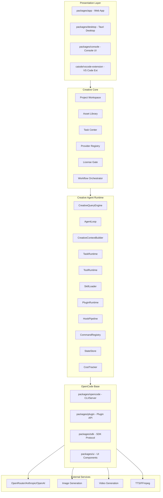
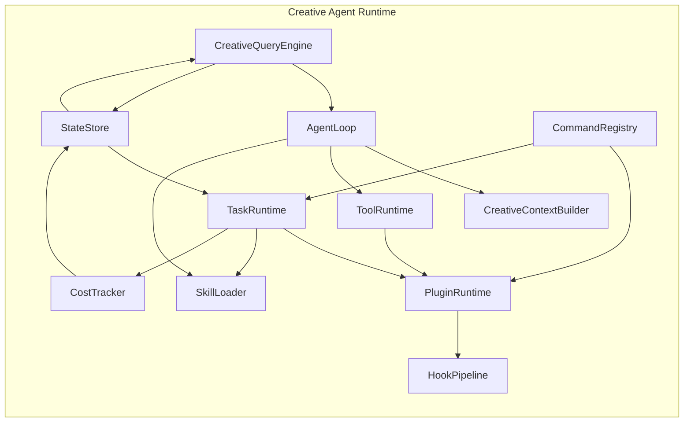

# StoryTree2 Code Wiki

> **项目**: OpenCode Creative Studio (StoryTree2)
> **版本**: v2.0
> **最后更新**: 2026-06-11
> **状态**: 持续更新中

---

## 目录

1. [项目概述](#1-项目概述)
2. [项目架构](#2-项目架构)
3. [核心模块详解](#3-核心模块详解)
4. [关键类和函数说明](#4-关键类和函数说明)
5. [依赖关系](#5-依赖关系)
6. [项目运行方式](#6-项目运行方式)
7. [数据类型定义](#7-数据类型定义)
8. [扩展点与接口](#8-扩展点与接口)

---

## 1. 项目概述

### 1.1 项目定位

**StoryTree2** 是一个基于 **OpenCode 1.4.0** 二次开发的开放式 AI 创作平台，采用 clean-room architecture rewrite 方法论，在借鉴 Claude Code 架构、抽象、流程和模块边界的基础上，进行独立的原创实现。

项目核心定位：
- **底座**: OpenCode 1.4.0（开源 AI Coding Agent）
- **业务扩展**: 小说编辑器 / 故事画布 / 3D 镜头等创作工具
- **集成环境**: VS Code OSS 扩展 + Trae IDE + Ralph 自动化工具链

### 1.2 核心设计原则

| 原则 | 说明 |
|------|------|
| **Novel Editor Core** | 小说编辑器作为免费 Core Product，而非付费插件 |
| **Skill/Plugin/Provider 严格区分** | Skill 是任务说明包，Plugin 是产品模块，Provider 是外部服务适配器 |
| **Creative Agent Runtime** | 底层执行内核，负责 Agent 的运行机制 |
| **Creative Core** | 业务抽象层，负责创作项目的管理 |
| **OpenCode 底座保护** | 默认保护 OpenCode 核心，优先在 `packages/app/src` 内完成业务功能 |

### 1.3 项目结构

```
storytree2/
├── caiode/                          # 核心代码目录
│   ├── opencode-1.4.0/              # OpenCode 底座（二次开发基础）
│   │   ├── packages/
│   │   │   ├── opencode/            # CLI / Server 核心
│   │   │   ├── app/                 # Web 前端 (SolidJS + Vite)
│   │   │   ├── ui/                  # 全局 UI 组件库
│   │   │   ├── plugin/              # 插件接口定义
│   │   │   ├── sdk/                 # SDK 协议
│   │   │   ├── desktop/             # Tauri 桌面壳
│   │   │   ├── desktop-electron/    # Electron 桌面壳
│   │   │   ├── console/             # 控制台应用
│   │   │   ├── web/                 # Web 端资源
│   │   │   └── ...
│   │   ├── github/                  # GitHub Action 集成
│   │   ├── infra/                   # SST 基础设施
│   │   └── script/                  # 构建/发布脚本
│   │
│   ├── claude-code-src/             # Claude Code 源码分析基准（研究材料）
│   │   ├── QueryEngine.ts           # 会话引擎
│   │   ├── query.ts                 # Agent Loop
│   │   ├── Tool.ts / tools.ts       # 工具抽象与执行
│   │   ├── Task.ts / tasks.ts       # 任务状态机
│   │   ├── skills/                  # Skill 加载
│   │   ├── commands.ts              # 命令注册
│   │   ├── context.ts               # 上下文构建
│   │   ├── bridge/                  # 服务桥接
│   │   └── cost-tracker.ts          # 成本追踪
│   │
│   ├── vscode-extension/            # VS Code 扩展实现 (StoryTree IDE)
│   │   ├── package.json             # 扩展清单
│   │   └── esbuild.config.mjs       # 构建配置
│   │
│   └── Trae-Ralph-main/             # Trae + Ralph 工具链
│       ├── bin/cli.js               # CLI 入口
│       ├── src/launcher.js          # CDP 自动化启动器
│       ├── src/injector.js          # 规则注入器
│       └── scripts/                 # 初始化脚本
│
├── backups/                         # 备份和历史文件
│   ├── dreamweaver/                 # Next.js 前端原型（已归档）
│   └── patches/                     # Git 补丁历史
│
├── docs/                            # 项目文档
│   ├── planning/                    # 规划文档
│   ├── roadmap/                     # 路书文档（13份架构文档）
│   ├── stitch/                      # Stitch 原型 PRD（S01-S21）
│   ├── task-reports/                # 任务报告
│   ├── boundary/                    # 边界与协议文档
│   ├── CODE_WIKI.md                 # 本文档
│   └── CODE_WIKI_INDEX.md           # 文档索引
│
├── stitch/                          # Stitch 原型设计资产
│   └── stitch_ai_novel_writing_dashboard/
│
├── workspaces/                      # 多模型 AI 工作空间
│   ├── Claude/, Kimi-K2.5/, MiniMax-M2/, Gemini/, Doubao/
│
└── .trae/                           # Agent 规则和工具
    ├── rules/                       # Ralph 执行规则
    ├── skills/                      # Agent 技能定义
    └── documents/                   # PRD 与决策文档
```

---

## 2. 项目架构

### 2.1 三层架构模型

```text
┌─────────────────────────────────────────────────────────────┐
│                    Presentation Layer (UI)                  │
│  ┌─────────────┐  ┌─────────────┐  ┌─────────────────────┐ │
│  │ Novel Editor │  │ Plugin Pages │  │ Settings Panels    │ │
│  │ (SolidJS)    │  │ (SolidJS)    │  │ (TUI/Web)          │ │
│  └─────────────┘  └─────────────┘  └─────────────────────┘ │
├─────────────────────────────────────────────────────────────┤
│                    Creative Core (Business)                 │
│  ┌─────────────┐  ┌─────────────┐  ┌─────────────────────┐ │
│  │ Project     │  │ Asset       │  │ License Gate        │ │
│  │ Workspace   │  │ Library     │  │                     │ │
│  └─────────────┘  └─────────────┘  └─────────────────────┘ │
├─────────────────────────────────────────────────────────────┤
│               Creative Agent Runtime (Kernel)               │
│  ┌─────────────┐  ┌─────────────┐  ┌─────────────────────┐ │
│  │ AgentLoop   │  │ TaskRuntime │  │ ToolRuntime         │ │
│  │             │  │             │  │                     │ │
│  └─────────────┘  └─────────────┘  └─────────────────────┘ │
├─────────────────────────────────────────────────────────────┤
│                      OpenCode Base (底座)                    │
│  ┌─────────────┐  ┌─────────────┐  ┌─────────────────────┐ │
│  │ CLI Engine   │  │ Server/API  │  │ Session Manager     │ │
│  │ Provider Reg │  │ Plugin Sys  │  │ Storage (SQLite)    │ │
│  └─────────────┘  └─────────────┘  └─────────────────────┘ │
└─────────────────────────────────────────────────────────────┘
```

### 2.2 OpenCode 底座模块分层图



### 2.3 OpenCode 1.4.0 包结构

| 包路径 | 名称 | 职责 |
|--------|------|------|
| `packages/opencode` | `opencode` | CLI 入口、Server、Session、Tool、Provider 核心 |
| `packages/app` | `@opencode-ai/app` | Web 前端应用 (SolidJS + Vite) |
| `packages/ui` | `@opencode-ai/ui` | 全局 UI 组件库、主题、图标 |
| `packages/plugin` | `@opencode-ai/plugin` | 插件接口与 TUI 组件定义 |
| `packages/sdk` | `@opencode-ai/sdk` | SDK 协议（Client/Server/V2） |
| `packages/desktop` | `@opencode-ai/desktop` | Tauri 桌面壳 |
| `packages/desktop-electron` | - | Electron 桌面壳 |
| `packages/console/*` | - | 控制台应用（app/core/function/mail/resource） |
| `packages/web` | - | Web 端资源与文档 |
| `packages/enterprise` | - | 企业版入口 |
| `packages/storybook` | - | Storybook 组件文档 |
| `github/` | - | GitHub Action 集成 |

---

## 3. 核心模块详解

### 3.1 OpenCode 底座核心（packages/opencode/src）

#### 3.1.1 CLI / 入口层

| 模块 | 路径 | 职责 |
|------|------|------|
| **CLI Bootstrap** | `cli/bootstrap.ts` | 命令行启动、参数解析、初始化流程 |
| **CLI UI** | `cli/ui.ts` | TUI 界面渲染与交互 |
| **CLI Network** | `cli/network.ts` | 网络状态检测与代理配置 |
| **CLI Upgrade** | `cli/upgrade.ts` | 版本检查与自动更新 |

#### 3.1.2 Agent 与会话层

| 模块 | 路径 | 职责 |
|------|------|------|
| **Agent** | `agent/agent.ts` | 核心 Agent 逻辑，行为与任务执行流程 |
| **Session** | `session/*.ts` | 会话生命周期、消息处理、压缩、重试、状态 |
| **Session LLM** | `session/llm.ts` | LLM 请求封装与流式处理 |
| **Session Processor** | `session/processor.ts` | 消息处理器 |
| **Session Prompt** | `session/prompt.ts` | 系统提示词构建 |
| **ACP** | `acp/*.ts` | Agent Control Protocol 实现 |

#### 3.1.3 工具层（Tool Runtime）

| 模块 | 路径 | 职责 |
|------|------|------|
| **Tool Registry** | `tool/registry.ts` | 工具注册表 |
| **Bash Tool** | `tool/bash.ts` | Bash 命令执行工具 |
| **Edit Tool** | `tool/edit.ts` | 代码编辑工具 |
| **Read Tool** | `tool/read.ts` | 文件读取工具 |
| **Write Tool** | `tool/write.ts` | 文件写入工具 |
| **Glob Tool** | `tool/glob.ts` | 文件匹配工具 |
| **Grep Tool** | `tool/grep.ts` | 文本搜索工具 |
| **LSP Tool** | `tool/lsp.ts` | LSP 语言服务工具 |
| **WebFetch** | `tool/webfetch.ts` | 网页抓取工具 |
| **WebSearch** | `tool/websearch.ts` | 网络搜索工具 |
| **Task Tool** | `tool/task.ts` | 子任务调用工具 |
| **Todo Tool** | `tool/todo.ts` | Todo 管理工具 |

#### 3.1.4 Provider 层

| 模块 | 路径 | 职责 |
|------|------|------|
| **Provider Core** | `provider/provider.ts` | Provider 抽象与统一接口 |
| **Provider Auth** | `provider/auth.ts` | Provider 认证管理 |
| **Provider Models** | `provider/models.ts` | 模型列表与配置 |
| **Provider Transform** | `provider/transform.ts` | 请求/响应转换 |

支持 Provider：Anthropic、OpenAI、OpenRouter、Ollama、Azure、Google、Groq、Mistral、TogetherAI、AWS Bedrock、GitLab Duo 等。

#### 3.1.5 存储与数据层

| 模块 | 路径 | 职责 |
|------|------|------|
| **Storage DB** | `storage/db.ts` | 数据库抽象（Bun/Node 双适配） |
| **Storage Schema** | `storage/schema.sql.ts` | Drizzle ORM Schema |
| **Project SQL** | `project/project.sql.ts` | 项目数据表 |
| **Session SQL** | `session/session.sql.ts` | 会话数据表 |
| **Account SQL** | `account/account.sql.ts` | 账户数据表 |
| **Sync Event SQL** | `sync/event.sql.ts` | 同步事件表 |

#### 3.1.6 其他核心模块

| 模块 | 路径 | 职责 |
|------|------|------|
| **Bus** | `bus/*.ts` | 全局事件总线 |
| **Config** | `config/*.ts` | 配置管理、TUI 配置迁移 |
| **File** | `file/*.ts` | 文件系统操作、忽略规则、Ripgrep |
| **Git** | `git/*.ts` | Git 操作封装 |
| **LSP** | `lsp/*.ts` | LSP 客户端管理 |
| **MCP** | `mcp/*.ts` | Model Context Protocol 支持 |
| **Permission** | `permission/*.ts` | 权限评估与校验 |
| **Plugin** | `plugin/*.ts` | 插件加载、安装、元数据 |
| **Project** | `project/*.ts` | 项目管理、状态、VCS |
| **Server** | `server/*.ts` | HTTP/WebSocket 服务器 |
| **Shell** | `shell/*.ts` | Shell 执行封装 |
| **Skill** | `skill/*.ts` | Skill 发现与加载 |
| **Sync** | `sync/*.ts` | 数据同步机制 |

### 3.2 Creative Agent Runtime（底层执行内核）

#### 3.2.1 CreativeQueryEngine

| 属性 | 说明 |
|------|------|
| **职责** | 会话生命周期管理、Agent 请求入口、流式响应输出 |
| **输入** | 用户请求、项目上下文、会话状态 |
| **输出** | 流式响应、任务创建、状态更新 |
| **依赖模块** | AgentLoop, StateStore, CostTracker |

**核心接口**：
```typescript
interface CreativeQueryEngine {
  createSession(config: SessionConfig): Promise<Session>
  sendRequest(sessionId: string, request: UserRequest): AsyncGenerator<StreamChunk>
  closeSession(sessionId: string): Promise<void>
  getSession(sessionId: string): Session | undefined
}
```

#### 3.2.2 AgentLoop

| 属性 | 说明 |
|------|------|
| **职责** | 主循环：模型响应、工具调用、观察结果、继续推理 |
| **输入** | 用户请求、上下文、可用工具列表 |
| **输出** | 流式响应、工具调用结果、最终答案 |
| **依赖模块** | ToolRuntime, SkillLoader, CreativeContextBuilder |

**核心接口**：
```typescript
interface AgentLoop {
  run(input: AgentInput): AsyncGenerator<AgentOutput>
  pause(): void
  resume(): void
  stop(): void
}

type AgentOutput =
  | { type: 'thinking'; content: string }
  | { type: 'tool_call'; tool: string; input: unknown }
  | { type: 'tool_result'; tool: string; output: unknown }
  | { type: 'final'; content: string }
  | { type: 'error'; message: string }
```

#### 3.2.3 TaskRuntime

| 属性 | 说明 |
|------|------|
| **职责** | 所有生成任务统一调度 |
| **输入** | 任务定义、Skill 名称、插件ID |
| **输出** | 任务状态、任务结果 |
| **依赖模块** | LicenseGate, SkillLoader, PluginRuntime |

**核心接口**：
```typescript
interface TaskRuntime {
  createTask(task: TaskInput): Promise<CreativeTask>
  getTask(taskId: string): CreativeTask | undefined
  cancelTask(taskId: string): Promise<void>
  retryTask(taskId: string): Promise<CreativeTask>
  listTasks(filter?: TaskFilter): CreativeTask[]
}
```

**CreativeTask 数据结构**：
```typescript
interface CreativeTask {
  id: string
  type: string
  title: string
  status: 'queued' | 'running' | 'waiting_for_permission' | 'waiting_for_user' | 'completed' | 'failed' | 'cancelled'
  projectId: string
  sourceAssetIds: string[]
  outputAssetIds: string[]
  skillName?: string
  pluginId?: string
  providerIds?: string[]
  licenseFeature?: string
  input: unknown
  output?: unknown
  error?: CreativeTaskError
  cost?: {
    inputTokens?: number
    outputTokens?: number
    providerCostUsd?: number
    localComputeCost?: number
  }
  createdAt: string
  updatedAt: string
}
```

#### 3.2.4 ToolRuntime

| 属性 | 说明 |
|------|------|
| **职责** | 具体可执行动作注册与执行 |
| **输入** | 工具名称、工具输入 |
| **输出** | 工具执行结果 |
| **依赖模块** | ProviderBridge, AssetLibrary |

**核心接口**：
```typescript
interface ToolRuntime {
  registerTool(tool: ToolDefinition): void
  unregisterTool(toolId: string): void
  executeTool(toolId: string, input: unknown, context: ToolContext): Promise<ToolResult>
  listTools(): ToolDefinition[]
}

interface ToolDefinition {
  id: string
  name: string
  description: string
  inputSchema: JSONSchema
  outputSchema: JSONSchema
  execute: (input: unknown, context: ToolContext) => Promise<ToolResult>
}

interface ToolContext {
  worktreePath: string
  permissionManager: PermissionManager
  taskCenter: TaskRuntime
  assetLibrary: AssetLibrary
}
```

#### 3.2.5 SkillLoader

| 属性 | 说明 |
|------|------|
| **职责** | 发现 `.claude/skills/*/SKILL.md`，按需加载 |
| **输入** | Skill 名称、任务上下文 |
| **输出** | Skill 定义、Skill 内容 |
| **依赖模块** | 文件系统 |

**核心接口**：
```typescript
interface SkillLoader {
  discoverSkills(): SkillCatalogEntry[]
  loadSkill(skillName: string): Promise<SkillDefinition>
  unloadSkill(skillName: string): void
  getSkill(skillName: string): SkillDefinition | undefined
}
```

**Skill 目录结构**：
```
.claude/skills/
├── novel-outline/
│   └── SKILL.md
├── novel-to-script/
│   └── SKILL.md
├── story-to-shot/
│   └── SKILL.md
├── shot-camera-plan/
│   └── SKILL.md
├── shot-to-image-prompt/
│   └── SKILL.md
├── shot-to-video-prompt/
│   └── SKILL.md
├── timeline-assembly/
│   └── SKILL.md
└── consistency-check/
    └── SKILL.md
```

#### 3.2.6 PluginRuntime

| 属性 | 说明 |
|------|------|
| **职责** | 插件加载、扩展点、权限系统 |
| **输入** | 插件 Manifest |
| **输出** | 插件实例、扩展点注册 |
| **依赖模块** | LicenseGate, StateStore |

**核心接口**：
```typescript
interface PluginRuntime {
  load(manifest: CreativePluginManifest): Promise<PluginInstance>
  unload(pluginId: string): Promise<void>
  enable(pluginId: string): Promise<void>
  disable(pluginId: string): Promise<void>
  getInstance(pluginId: string): PluginInstance | undefined
  listPlugins(): CreativePluginManifest[]
  getCapability(pluginId: string, capabilityId: string): PluginCapability | undefined
}
```

### 3.3 Creative Core（业务抽象层）

#### 3.3.1 Novel Editor Core

**定位**：Novel Editor Core 不是普通插件，而是 OpenCode Creative Studio 的基础入口和所有下游插件的内容源。

**核心数据模型**：
```typescript
interface NovelProject {
  id: string
  name: string
  description: string
  type: 'novel' | 'screenplay' | 'short_story'
  status: 'draft' | 'in_progress' | 'completed'
  createdAt: string
  updatedAt: string
}

interface Character {
  id: string
  projectId: string
  name: string
  role: 'protagonist' | 'antagonist' | 'supporting' | 'minor'
  age: number
  gender: string
  appearance: string
  personality: string
  background: string
  motivation: string
  arc: string
  relationships: CharacterRelationship[]
}

interface Chapter {
  id: string
  projectId: string
  number: number
  title: string
  summary: string
  scenes: Scene[]
  status: 'outline' | 'draft' | 'revision' | 'final'
}

interface Scene {
  id: string
  chapterId: string
  number: number
  title: string
  setting: string
  characters: string[]
  goal: string
  conflict: string
  outcome: string
  beats: Beat[]
}

interface Beat {
  id: string
  sceneId: string
  number: number
  description: string
  type: 'action' | 'dialogue' | 'description' | 'transition'
}
```

#### 3.3.2 Asset Library

| 属性 | 说明 |
|------|------|
| **职责** | 统一管理所有创作产物 |
| **功能** | 资产版本管理、来源和引用关系维护 |

**核心接口**：
```typescript
interface AssetLibrary {
  createAsset(asset: AssetInput): Promise<Asset>
  getAsset(assetId: string): Asset | undefined
  updateAsset(assetId: string, data: Partial<Asset>): Promise<Asset>
  deleteAsset(assetId: string): Promise<void>
  listAssets(filter?: AssetFilter): Asset[]
  createVersion(assetId: string, data: unknown): Promise<AssetVersion>
  getVersions(assetId: string): AssetVersion[]
}
```

#### 3.3.3 License Gate

| 属性 | 说明 |
|------|------|
| **职责** | 单模块付费权限校验 |

**核心接口**：
```typescript
interface LicenseGate {
  check(pluginId: string, feature?: string): LicenseGateResult
  getLicenseInfo(pluginId: string): LicenseInfo
}

type LicenseGateResult = {
  allowed: boolean
  reason?: 'not_installed' | 'trial_expired' | 'license_missing' | 'quota_exceeded'
  upgradeUrl?: string
}
```

### 3.4 Web 前端（packages/app）

| 目录 | 职责 |
|------|------|
| `src/app.tsx` | 应用根组件 |
| `src/entry.tsx` | 入口渲染 |
| `src/components/` | UI 组件（prompt-input, session, terminal 等） |
| `src/context/` | 全局上下文（global-sync, models, permission 等） |
| `src/pages/` | 页面路由（session-layout 等） |
| `src/utils/` | 工具函数（prompt.ts 等） |

### 3.5 VS Code 扩展（caiode/vscode-extension）

| 模块路径 | 核心文件 | 职责 |
|---------|---------|------|
| **core/** | `sync-push-service.ts` | 同步推送服务 |
| | `sqlite-db.ts` | SQLite 数据库操作 |
| | `global-model-request-queue.ts` | 全局模型请求队列 |
| | `file-mutex.ts` | 文件互斥锁 |
| | `config-service.ts` | 配置服务 |
| | `event-bus.ts` | 事件总线 |
| | `rpc-adapter.ts` | RPC 适配器 |
| | `queue-monitor.ts` | 队列监控 |
| **core/ai/** | `anthropic-provider.ts` | Anthropic API 提供者 |
| | `openai-provider.ts` | OpenAI API 提供者 |
| | `ollama-provider.ts` | Ollama 本地模型 |
| | `provider-factory.ts` | 提供者工厂 |
| | `conversation-manager.ts` | 对话管理器 |
| | `stream-processor.ts` | 流式响应处理 |
| **core/db-adapter.ts** | - | 数据库适配器 |
| **webview/** | `ai-chat-panel.ts` | AI 聊天面板 |
| | `enhanced-dashboard.ts` | 增强仪表板 |
| | `settings-page.ts` | 设置页面 |
| | `html-generator.ts` | HTML 生成器 |
| **automation/** | `task-orchestrator.ts` | 任务编排器 |
| | `automation-queue.ts` | 自动化队列 |
| | `cdp-driver.ts` | CDP 驱动 |
| **skills/** | `skill-registry.ts` | Skill 注册表 |

---

## 4. 关键类和函数说明

### 4.1 claude-code-src 核心模块映射

| claude-code-src 模块 | Creative Runtime 对应 | 职责说明 |
|---------------------|----------------------|---------|
| `QueryEngine.ts` | `CreativeQueryEngine` | 会话生命周期管理 |
| `query.ts` | `AgentLoop` | 主 Agent Loop，流式响应 |
| `Tool.ts` / `tools.ts` | `ToolRuntime` | 工具抽象与执行 |
| `Task.ts` / `tasks.ts` | `TaskRuntime` | 任务状态机管理 |
| `skills/` | `SkillLoader` | Skill 发现与加载 |
| `commands.ts` | `CommandRegistry` | 命令注册与分发 |
| `context.ts` | `CreativeContextBuilder` | 上下文构造与压缩 |
| `state/` | `StateStore` | 状态持久化管理 |
| `bridge/` | `ProviderBridge` | 外部服务桥接 |
| `coordinator/` | `WorkflowOrchestrator` | 工作流编排 |
| `hooks/` | `HookPipeline` | 生命周期扩展点 |
| `cost-tracker.ts` | `CostTracker` | 成本追踪统计 |

### 4.2 OpenCode 底座关键文件

| 文件路径 | 职责 |
|---------|------|
| `packages/opencode/src/index.ts` | CLI 入口，命令注册与分发 |
| `packages/opencode/src/agent/agent.ts` | Agent 核心逻辑 |
| `packages/opencode/src/session/index.ts` | 会话管理入口 |
| `packages/opencode/src/tool/registry.ts` | 工具注册表 |
| `packages/opencode/src/provider/provider.ts` | Provider 统一接口 |
| `packages/opencode/src/plugin/loader.ts` | 插件加载器 |
| `packages/opencode/src/skill/discovery.ts` | Skill 发现机制 |
| `packages/opencode/src/bus/index.ts` | 全局事件总线 |
| `packages/opencode/src/storage/db.ts` | 存储抽象层 |

### 4.3 Trae-Ralph 工具链

| 文件路径 | 职责 |
|---------|------|
| `bin/cli.js` | CLI 入口 |
| `src/launcher.js` | CDP 自动化启动器，驱动 Trae IDE |
| `src/injector.js` | 向 Trae 注入规则与技能 |
| `src/config.js` | 配置管理 |
| `scripts/inject-rules.js` | 规则注入脚本 |
| `scripts/inject-skills.js` | 技能注入脚本 |
| `scripts/init-planning.js` | 规划初始化 |

---

## 5. 依赖关系

### 5.1 模块依赖矩阵



### 5.2 OpenCode 包依赖关系

```text
opencode (CLI/Server)
  ├── @opencode-ai/plugin (workspace)
  ├── @opencode-ai/sdk (workspace)
  ├── @opencode-ai/script (workspace)
  ├── @opencode-ai/util (workspace)
  ├── ai (Vercel AI SDK)
  ├── effect (Effect-TS)
  ├── hono (Web Framework)
  ├── drizzle-orm (ORM)
  └── ...

app (Web Frontend)
  ├── @opencode-ai/sdk (workspace)
  ├── @opencode-ai/ui (workspace)
  ├── @opencode-ai/util (workspace)
  ├── solid-js (UI Framework)
  ├── @solidjs/router (Router)
  ├── @tanstack/solid-query (Query)
  └── ...

ui (Component Library)
  ├── @opencode-ai/sdk (workspace)
  ├── @opencode-ai/util (workspace)
  ├── solid-js
  ├── @kobalte/core (Headless UI)
  └── ...

desktop (Tauri)
  ├── @opencode-ai/app (workspace)
  ├── @opencode-ai/ui (workspace)
  └── @tauri-apps/api
```

### 5.3 插件消费链路

```text
Novel Scene
  ↓
Script Studio：改写成剧本场景
  ↓
Storyboard Studio：拆成镜头
  ↓
3D Shot Draft：生成 3D 构图草稿
  ↓
Image Prompt：生成图像提示词
  ↓
Image Generation：生成图像资产
  ↓
Video Prompt：生成视频提示词
  ↓
Video Generation：生成视频资产
  ↓
Timeline Draft：拼接剪辑草稿
  ↓
Long Video Manager：管理长项目结构
```

### 5.4 外部依赖

| 依赖类型 | 具体依赖 | 说明 |
|---------|---------|------|
| **AI Provider** | Anthropic (Claude) | 主要 AI 模型 |
| | OpenAI | GPT 模型支持 |
| | OpenRouter | 多模型路由 |
| | Ollama | 本地模型支持 |
| | Vercel AI SDK | 统一 AI SDK (`ai`) |
| **媒体处理** | FFmpeg | 视频处理 |
| **存储** | SQLite (Drizzle ORM) | 本地数据库 |
| **构建工具** | Bun | 运行时与包管理 |
| | Vite | 前端构建 |
| | TypeScript | 类型系统 |
| | esbuild | 代码打包 |
| | Turbo |  monorepo 构建编排 |
| **UI 框架** | SolidJS | 响应式 UI |
| | TailwindCSS | 样式 |
| | OpenTUI | 终端 UI |
| **测试** | Vitest | 单元测试 |
| | Playwright | E2E 测试 |

---

## 6. 项目运行方式

### 6.1 环境要求

- **Bun**: >= 1.3.11（项目使用 Bun 作为包管理器和运行时）
- **Node.js**: >= 18.0.0（部分工具兼容）
- **VS Code**: >= 1.85.0（扩展开发）
- **Git**: 2.x

### 6.2 OpenCode 底座运行

```bash
# 进入 OpenCode 目录
cd caiode/opencode-1.4.0

# 安装依赖（使用 Bun）
bun install

# 开发模式启动 CLI
bun dev

# 开发模式启动 Web 前端
cd packages/app && bun dev

# 开发模式启动桌面端
cd packages/desktop && bun run tauri dev

# 类型检查
bun typecheck

# 构建
bun turbo build
```

### 6.3 VS Code Extension 运行

```bash
cd caiode/vscode-extension

# 安装依赖
npm install

# 开发模式
npm run watch

# 生产构建
npm run build:prod

# 打包 .vsix
npm run package

# 测试
npm run test
```

### 6.4 Trae-Ralph 工具链运行

```bash
cd caiode/Trae-Ralph-main

# 安装依赖
npm install

# 启动 Ralph Loop
npm start

# 中国版启动
npm run start:cn

# 注入规则
npm run rules:inject

# 注入技能
npm run skills:inject

# 初始化规划
npm run plan
```

### 6.5 Dreamweaver 前端（已归档）

```bash
cd backups/dreamweaver

# 安装依赖
npm install

# 开发模式
npm run dev

# 构建
npm run build

# 测试
npm run test:unit
npm run test:e2e
```

### 6.6 测试命令

```bash
# OpenCode 单元测试（不要在 root 运行）
cd packages/opencode && bun test

# App 单元测试
cd packages/app && bun run test:unit

# App E2E 测试
cd packages/app && bun run test:e2e

# VS Code Extension 测试
cd caiode/vscode-extension && npm run test

# 覆盖率报告
cd packages/opencode && bun test --coverage
```

### 6.7 项目启动流程

```
1. 初始化 StateStore
   ↓
2. 加载配置文件
   ↓
3. 初始化 ProviderRegistry
   ↓
4. 加载已安装插件
   ↓
5. 启动 PluginRuntime
   ↓
6. 启动 SkillLoader
   ↓
7. 启动 CreativeQueryEngine
   ↓
8. 监听用户输入
```

---

## 7. 数据类型定义

### 7.1 Plugin Manifest

```typescript
type CreativePluginManifest = {
  id: string
  name: string
  version: string
  description: string
  category:
    | 'story'
    | 'script'
    | 'storyboard'
    | '3d'
    | 'image'
    | 'video'
    | 'audio'
    | 'editing'
    | 'workflow'
    | 'team'

  pricing: {
    model: 'free' | 'one_time' | 'subscription' | 'credits' | 'bundle'
    sku: string
    trialDays?: number
  }

  dependencies: {
    coreVersion: string
    plugins?: string[]
    providers?: string[]
    skills?: string[]
  }

  permissions: {
    fileRead?: boolean
    fileWrite?: boolean
    assetRead?: boolean
    assetWrite?: boolean
    taskCreate?: boolean
    providerUse?: string[]
    networkAccess?: boolean
    ffmpegAccess?: boolean
  }

  extensionPoints: {
    pages?: string[]
    panels?: string[]
    commands?: string[]
    assetTypes?: string[]
    taskTypes?: string[]
    skills?: string[]
    providers?: string[]
  }
}
```

### 7.2 Provider Definition

```typescript
interface ProviderDefinition {
  id: string
  name: string
  type: 'llm' | 'image' | 'video' | 'tts' | 'ffmpeg'
  inputSchema: JSONSchema
  outputSchema: JSONSchema
  errorSchema: JSONSchema
  execute: (input: unknown, context: ProviderContext) => Promise<ProviderResult>
}

interface ProviderResult {
  success: boolean
  data?: unknown
  error?: string
  costMetadata: CostMetadata
  taskStatus: TaskStatus
}
```

### 7.3 Skill Definition

```typescript
interface SkillDefinition {
  name: string
  description: string
  whenToUse: string
  requiredPluginCapabilities?: string[]
  requiredProviders?: string[]
  requiredContext?: string[]
  workflow?: string[]
  rules?: string[]
  content: string
}
```

---

## 8. 扩展点与接口

### 8.1 OpenCode Core 扩展点

| 扩展点 | 用途 | 注册方式 |
|--------|------|---------|
| `workspace.page` | 注册新页面 | `runtime.registerPage(manifest.id, pageConfig)` |
| `workspace.panel` | 注册侧栏/右栏面板 | `runtime.registerPanel(manifest.id, panelConfig)` |
| `command.palette` | 注册命令 | `runtime.registerCommand(manifest.id, commandDef)` |
| `asset.type` | 注册资产类型 | `runtime.registerAssetType(manifest.id, assetTypeDef)` |
| `task.type` | 注册任务类型 | `runtime.registerTaskType(manifest.id, taskTypeDef)` |
| `skill.type` | 注册 Skill | `runtime.registerSkill(manifest.id, skillDef)` |
| `provider.type` | 注册 Provider | `runtime.registerProvider(manifest.id, providerDef)` |
| `export.format` | 注册导出格式 | `runtime.registerExportFormat(manifest.id, formatDef)` |
| `settings.section` | 注册设置页面 | `runtime.registerSettingsSection(manifest.id, sectionDef)` |
| `license.feature` | 注册付费功能点 | `runtime.registerLicenseFeature(manifest.id, featureDef)` |

### 8.2 权限边界

| 权限 | 默认状态 | 说明 |
|------|---------|------|
| fileRead | false | 需显式申请 |
| fileWrite | false | 需显式申请 |
| assetRead | true | 可读取资产库 |
| assetWrite | false | 需显式申请 |
| taskCreate | false | 需显式申请 |
| providerUse | [] | 需显式申请可用 Provider |
| networkAccess | false | 需显式申请 |
| ffmpegAccess | false | 需显式申请 |

### 8.3 高危操作限制

以下操作插件禁止直接执行，必须通过 Core 提供的抽象接口：

- Bash 命令执行
- WebFetch 远程请求
- WebSearch 网络搜索
- 子 Agent 调用
- 环境变量读取
- 系统目录访问
- 沙箱外路径访问

---

## 附录

### A. 文件命名规范

| 类型 | 规范 | 示例 |
|------|------|------|
| TypeScript 文件 | PascalCase.ts | `CreativeQueryEngine.ts` |
| React/Solid 组件 | PascalCase.tsx | `AiChatPanel.tsx` |
| 类型定义 | `*.types.ts` | `provider.types.ts` |
| 测试文件 | `*.test.ts` | `provider-factory.test.ts` |
| 样式文件 | kebab-case.css | `ai-chat-panel.css` |

### B. Git 分支规范

| 分支类型 | 命名格式 | 示例 |
|---------|---------|------|
| 功能开发 | `feat/DEV-{任务编号}-{简短描述}` | `feat/DEV-1.2.1-llm-request-queue` |
| 缺陷修复 | `fix/BUG-{编号}-{简短描述}` | `fix/BUG-042-stale-lock-cleanup` |
| 测试专项 | `test/TEST-{任务编号}-{简短描述}` | `test/TEST-1.3.2c-race-condition` |
| 文档更新 | `docs/DOC-{简短描述}` | `docs/DOC-phase1-breakdown` |
| AI Agent | `trae/solo-agent-{标识符}` | `trae/solo-agent-jY1pa4` |

### C. Commit Message 规范

```
<type>(<scope>): <subject>

[type]: feat | fix | test | docs | refactor | perf | chore | revert
[scope]: 任务编号，如 DEV-1.2.1
[subject]: 简短描述

示例：
feat(DEV-1.2.1): 实现 GlobalModelRequestQueue 串行化调度器
fix(DEV-1.3.2): 修复 FileMutex 重入检测逻辑
```

### D. 技术栈速查

| 层级 | 技术 | 版本 |
|------|------|------|
| 运行时 | Bun | 1.3.11 |
| 语言 | TypeScript | 5.8.2 |
| UI 框架 | SolidJS | 1.9.10 |
| 路由 | @solidjs/router | 0.15.4 |
| 构建 | Vite | 7.1.4 |
| Monorepo | Turbo | 2.8.13 |
| ORM | Drizzle ORM | 1.0.0-beta.19 |
| AI SDK | Vercel AI SDK | 6.0.149 |
| 函数式 | Effect-TS | 4.0.0-beta.43 |
| 样式 | TailwindCSS | 4.1.11 |
| 终端 UI | OpenTUI | 0.1.97 |
| 桌面壳 | Tauri | v2 |
| 测试 | Vitest | latest |
| E2E | Playwright | 1.51.0 |

---

*本文档由 AI 自动生成，最后更新于 2026-06-11*
