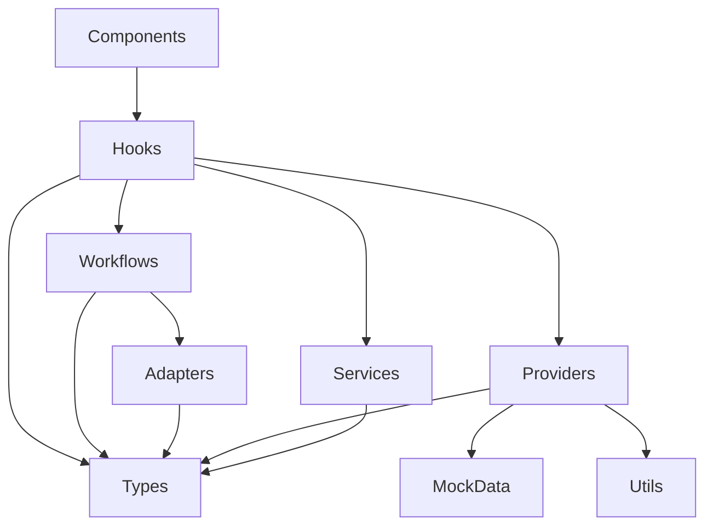

# Novel Editor Code Wiki

> **项目**: StoryTree2 / OpenCode 1.4.0 小说编辑器
> **模块路径**: `caiode/opencode-1.4.0/packages/app/src/novel`
> **版本**: 1.4.0
> **最后更新**: 2026-06-19
> **状态**: 持续更新中

---

## 目录

1. [项目概述](#1-项目概述)
2. [整体架构](#2-整体架构)
3. [模块职责](#3-模块职责)
4. [关键类型与数据结构](#4-关键类型与数据结构)
5. [关键类与函数说明](#5-关键类与函数说明)
6. [依赖关系](#6-依赖关系)
7. [AI 工作流与 Info-Lite 信息审计](#7-ai-工作流与-info-lite-信息审计)
8. [项目运行方式](#8-项目运行方式)
9. [测试策略](#9-测试策略)
10. [扩展点与接口](#10-扩展点与接口)

---

## 1. 项目概述

### 1.1 定位

`packages/app/src/novel` 是 StoryTree2 中基于 OpenCode 1.4.0 实现的小说编辑器模块。它作为 OpenCode 应用的一个子应用（sub-application），通过 `/novel` 路由独立挂载，提供从书架、项目创建、工作台、章节编辑到 AI 辅助创作的完整小说写作体验。

该模块遵循 **STDD（Spec → Types → Tests → Mock → Dev → Verify）** 方法论，当前阶段（P1）以 Mock 数据为主，尚未接入真实后端或 LLM，所有 AI 能力由 `MockAgentAdapter` 和 `FakeAgentProvider` 提供确定性输出。

### 1.2 技术栈

| 技术 | 说明 |
|------|------|
| **Bun** | 包管理与运行时（替代 npm/yarn/pnpm） |
| **SolidJS** | 响应式 UI 框架 |
| **Vite** | 构建工具与 Dev Server |
| **TypeScript** | 类型系统，禁用 `any` |
| **Tailwind CSS** | 原子化样式 |
| **@kobalte/core / @opencode-ai/ui** | UI 组件库 |
| **@solidjs/router** | 路由与 URL 状态同步 |
| **Vitest** | 单元测试框架 |
| **Playwright** | E2E 测试框架 |

### 1.3 目录结构

```
caiode/opencode-1.4.0/packages/app/src/novel/
├── index.tsx                 # 模块入口 /novel
├── types/                    # 领域模型与类型定义
├── providers/                # 数据访问层（Mock Provider）
├── hooks/                    # UI 适配层（状态管理 Hook）
├── components/               # 展示交互层（页面与组件）
├── services/                 # 业务服务（上下文组装、Prompt 模板）
├── workflows/                # AI 生成工作流编排
├── adapters/                 # AI Agent 适配器接口与实现
├── mock-data/                # 种子/mock 数据
├── utils/                    # 工具函数
└── styles/                   # 设计令牌
```

---

## 2. 整体架构

### 2.1 分层架构

小说编辑器采用清晰的分层架构：

```text
┌─────────────────────────────────────────────────────────────┐
│                    Presentation Layer (UI)                  │
│  components/           — 页面、布局、卡片、编辑器             │
├─────────────────────────────────────────────────────────────┤
│                    UI Adaptation Layer (Hooks)              │
│  hooks/                — 状态管理、数据聚合、副作用           │
├─────────────────────────────────────────────────────────────┤
│                    Business Service Layer                   │
│  services/             — 上下文组装                         │
│  workflows/            — 命令 → 工作流 → 事件 → 写回        │
│  adapters/             — AI Agent 适配器抽象                │
├─────────────────────────────────────────────────────────────┤
│                    Data Access Layer (Providers)            │
│  providers/            — 项目/章节/角色/大纲/AI 数据接口      │
├─────────────────────────────────────────────────────────────┤
│                    Domain Model (Types + Mock Data)         │
│  types/                — 类型契约                           │
│  mock-data/            — 种子数据（只读）                    │
└─────────────────────────────────────────────────────────────┘
```

### 2.2 视图路由

URL 模式：`/novel?view={viewName}`

| 视图 | 值 | 对应组件 | 说明 |
|------|-----|---------|------|
| 书架 | `bookshelf` | `BookshelfPage` | 项目列表与搜索 |
| 创建项目 | `create-project` | `CreateProjectModal` | 新建项目弹框 |
| 工作台 | `workspace` | `Workspace` | 三栏式项目工作台 |
| 编辑器 | `editor` | `NovelEditor` | 单章编辑页面 |
| 引导 | `guide` / `novel-guide` | `NovelGuidePage` | AI 创作引导 |
| 角色面板 | `character-panel` | `CharacterPanelPage` | 角色管理（扩展视图） |
| 世界设定 | `world-setting` | `WorldSettingPage` | 世界设定（扩展视图） |
| 个人中心 | `profile` | `ProfilePage` | 用户资料（扩展视图） |
| 成就 | `achievements` | `AchievementsPage` | 成就系统 |
| 教程 | `tutorial` | `NovelGuidePage` | 引导教程 |

核心视图由 `useNovelView` 同步 URL；扩展视图（`character-panel` 等）由 `useNovelNavigation` 在核心视图基础上叠加。

### 2.3 数据流

```text
UI 操作（按钮/输入）
    ↓
Hook（useNovelWorkflow / useAITask）
    ↓
构建 NovelCommand
    ↓
Adapter（MockAgentAdapter）生成 NovelAgentResult
    ↓
Workflow（runMockGeneration）产出 NovelWorkflowEvent[]
    ↓
applyWorkflowEvents(events, mutations) 写回 Provider/Store
    ↓
Hook 重新拉取 → UI 更新
```

---

## 3. 模块职责

### 3.1 `types/` — 领域模型

定义小说编辑器的全部类型契约，是其他所有模块的依赖源头。主要包括：

- `Project`、`Chapter`、`Character`、`OutlineNode` 等核心实体
- `AITask`、`NovelAgentResult` 等 AI 相关类型
- `ChapterInformationState`、`InformationAtom`、`InformationLink` 等 Info-Lite 信息审计类型
- `ProviderError` 统一错误类型
- `GenerationConfig`、`NovelView`、`NovelModal` 等 UI/配置类型

### 3.2 `providers/` — 数据访问层

实现面向接口的数据访问，当前全部为 Mock 实现：

- 初始化时复制 `mock-data`，返回对象副本防止 UI 污染内部状态
- 所有方法均为 `async`，使用 `mockDelay` 模拟网络延迟
- 通过 `ProviderError` 统一抛错

主要 Provider：

| Provider | 接口 | 数据 |
|----------|------|------|
| `NovelProjectProvider` | `INovelProjectProvider` | `mockProjects` |
| `NovelChapterProvider` | `INovelChapterProvider` | `mockChapters` |
| `NovelCharacterProvider` | `INovelCharacterProvider` | `mockCharacters` |
| `NovelOutlineProvider` | `INovelOutlineProvider` | `mockOutlines` |
| `FakeAgentProvider` | `INovelAgentProvider` | 运行时生成 |
| `AILogProvider` | `IAILogProvider` | 内存数组 |

### 3.3 `hooks/` — UI 适配层

SolidJS 自定义 Hook，管理组件状态和数据获取：

| Hook | 职责 |
|------|------|
| `useNovelView` | URL 视图同步、projectId 管理 |
| `useNovelNavigation` | 视图/弹框导航状态 |
| `useNovelProject` | 项目列表与当前项目 |
| `useNovelChapters` | 章节列表、选中、保存、AI 建议 |
| `useWorkspace` | 工作台面板状态与数据聚合 |
| `useAITask` | AI 任务提交、监听、取消 |
| `useAILog` | AI 日志查询与过滤 |
| `useChapterEditor` | 编辑器本地状态（内容、字数、工具栏） |
| `useNovelWorkflow` | 统一 AI 工作流入口（P1-B） |

### 3.4 `components/` — 展示交互层

按功能分子目录：

| 子目录 | 说明 |
|--------|------|
| `layout/` | 应用外壳、导航、占位页面、弹框宿主 |
| `bookshelf/` | 书架页面 |
| `create-project-modal/` | 创建项目弹框 |
| `novel-workspace/` | 工作台（三栏布局 + ViewModel） |
| `novel-editor/` | 章节编辑器 |
| `character-panel/` | 角色面板 |
| `world-setting/` | 世界设定 |
| `profile/` | 个人中心 |
| `achievements/` | 成就系统 |
| `novel-guide/` | 引导教程 |
| `ui/` | 复用基础组件（Button、Badge、Progress 等） |

### 3.5 `services/` — 业务服务

| 文件 | 职责 |
|------|------|
| `context-assembler.ts` | 组装写作上下文（大纲、前序章节、角色、世界物品等） |
| `genre-prompt-template.ts` | 按小说类型提供静态 Prompt 模板 |

### 3.6 `workflows/` — 工作流编排

| 文件 | 职责 |
|------|------|
| `novel-command.ts` | 定义 `NovelCommand` 类型与工厂函数 |
| `workflow-events.ts` | 定义 7 种工作流事件与 `WorkflowMutations` 接口 |
| `mock-generation-workflow.ts` | 编排命令 → Adapter → 事件列表 |
| `apply-workflow-events.ts` | 将事件分发到 mutations，执行真实写回 |
| `types.ts` | 工作流状态与上下文类型 |

### 3.7 `adapters/` — AI Agent 适配器

| 文件 | 职责 |
|------|------|
| `novel-agent-adapter.ts` | `NovelAgentAdapter` 接口定义 |
| `mock-agent-adapter.ts` | Mock 实现，产出确定性文本 + Info-Lite 数据 |

### 3.8 `mock-data/` — 种子数据

只读种子数据，Provider 初始化时复制：

| 文件 | 数据 |
|------|------|
| `projects.ts` | `mockProjects` 项目列表 |
| `chapters.ts` | `mockChapters` 章节与 `mockAIExtractedInfo` |
| `characters.ts` | `mockCharacters` 角色 |
| `outlines.ts` | `mockOutlines` 大纲树 |
| `ai-tasks.ts` | Mock AI 任务 |
| `world-settings.ts` | 世界设定 |
| `achievements.ts` | 成就 |
| `profile.ts` | 用户与充值记录 |
| `guide-questions.ts` | 引导问题 |

### 3.9 `utils/` — 工具函数

- `mock-delay.ts`：模拟异步延迟。

---

## 4. 关键类型与数据结构

### 4.1 项目 `Project`

```typescript
interface Project {
  id: string;
  name: string;
  genre: string;
  description: string;
  totalWordCount: number;
  chapterCount: number;
  characterCount: number;
  lastUpdated: Date;
  status: 'active' | 'archived' | 'draft';
}
```

### 4.2 章节 `Chapter`

```typescript
interface Chapter {
  id: string;
  projectId: string;
  title: string;
  orderIndex: number;
  status: 'draft' | 'revising' | 'completed' | 'published';
  wordCount: number;
  content: string;
  outline: { goal: string; conflict: string; keyPlot: string };
  aiSuggestions?: AISuggestion[];
  informationState?: ChapterInformationState;
  createdAt: string;
  updatedAt: string;
}
```

### 4.3 AI 任务 `AITask`

```typescript
interface AITask {
  id: string;
  type: 'continue-writing' | 'rewrite-selection' | 'summarize-chapter' | 'character-voice';
  chapterId: string;
  status: 'pending' | 'running' | 'completed' | 'failed' | 'cancelled' | 'denied' | 'quota';
  input: { text: string; selectedText?: string; characterId?: string };
  output?: { text: string; wordCount: number };
  error?: string;
  duration?: number;
  createdAt: Date;
  completedAt?: Date;
}
```

### 4.4 Agent 结果 `NovelAgentResult`

```typescript
interface NovelAgentResult {
  taskId: string;
  attemptId: number;
  status: 'completed' | 'failed' | 'cancelled' | 'denied' | 'quota';
  text: string;
  wordCount: number;
  summary: string;
  error?: string;
  durationMs: number;
  informationState?: ChapterInformationState;
}
```

### 4.5 Info-Lite 信息审计 `ChapterInformationState`

```typescript
interface ChapterInformationState {
  chapterId: string;
  projectId: string;
  beatId?: SaveTheCatBeatId;
  beatName?: string;
  entropyBefore: number;
  entropyAfter: number;
  entropyDelta: number;
  selfInformationScore: number;
  newAtoms: InformationAtom[];
  newLinks: InformationLink[];
  auditScore?: number;
}
```

### 4.6 命令 `NovelCommand`

```typescript
interface NovelCommand {
  type: 'chapter.generate' | 'chapter.rewrite' | 'chapter.expand' | 'chapter.polish' | 'chapter.summarize' | 'chapter.extract-info';
  chapterId: string;
  projectId: string;
  chapterIndex: number;
  genre: string;
  command?: 'continue' | 'rewrite' | 'expand' | 'polish' | 'summarize';
  text: string;
  selectedText?: string;
  targetWordCount?: number;
  contextRefs?: string[];
  createdAt: Date;
}
```

---

## 5. 关键类与函数说明

### 5.1 Provider 层

#### `NovelProjectProvider`

- **职责**：项目管理 CRUD。
- **关键方法**：
  - `listProjects(): Promise<Project[]>` — 按最后更新时间排序返回副本。
  - `getProject(id): Promise<Project | null>` — 返回副本。
  - `createProject(input): Promise<Project>` — 校验必填字段，生成 `proj-${Date.now()}`。

#### `NovelChapterProvider`

- **职责**：章节数据管理。
- **关键方法**：
  - `listChapters(projectId)` — 按 `orderIndex` 排序。
  - `saveChapter(id, content)` — 更新内容、字数，draft 状态自动转 revising。
  - `addAISuggestion(chapterId, suggestion)` — 添加建议但不追加正文。
  - `acceptSuggestion(chapterId, suggestionId)` — 将建议文本追加到正文。

#### `NovelOutlineProvider`

- **职责**：大纲树（卷 > 章）管理。
- **关键方法**：
  - `listOutlines(projectId)` — 返回深拷贝的大纲树。
  - `generateOutline(projectId)` — Mock AI 生成，返回预设数据。

#### `FakeAgentProvider`

- **职责**：旧版 AI 任务 Mock 调度。
- **关键方法**：
  - `submitTask(input)` — 创建任务并模拟执行。
  - `cancelTask(taskId)` — 取消任务。
  - `onTaskUpdate(callback)` — 订阅任务状态变更。
- **触发错误关键词**：`fail`/`错误` → failed；`sudo`/`admin`/`权限` → denied；调用超过 10 次 → quota。

#### `AILogProvider`

- **职责**：AI 任务日志记录与查询。
- **关键方法**：
  - `logTask(task)` — 将任务摘要记录到内存。
  - `listLogs({ status?, limit? })` — 按状态/数量筛选。

### 5.2 Hook 层

#### `useNovelView`

- **职责**：管理 `/novel` 核心视图与 URL 同步，管理 `projectId`。
- **返回值**：`currentView`, `setView`, `projectId`, `selectProject`, `rawViewParam`。
- **默认行为**：无参数时默认进入 `bookshelf`；`selectProject` 自动跳转 `workspace`。

#### `useNovelNavigation`

- **职责**：在 `useNovelView` 之上叠加扩展视图与弹框状态。
- **返回值**：`currentView`, `currentModal`, `openView`, `openModal`, `closeModal`。
- **默认行为**：`/novel` 无参数时默认进入 `workspace`。

#### `useNovelChapters(projectId)`

- **职责**：章节资源获取与操作。
- **返回值**：`chapters`, `selectedChapter`, `saveChapter`, `acceptSuggestion`, `addAISuggestion`, `selectChapter`, `refetch`。
- **实现**：使用 `createResource` 响应 `projectId` 变化。

#### `useWorkspace(projectId)`

- **职责**：聚合项目与章节数据，管理右侧面板显隐与日志抽屉。
- **返回值**：`project`, `chapters`, `selectedChapter`, `visiblePanels`, `togglePanel`, `isLogDrawerOpen` 等。

#### `useNovelWorkflow(mutations)`

- **职责**：P1-B 所有 AI 操作的统一入口。
- **关键方法**：
  - `runChapterGeneration(params)` — 构建 `chapter.generate` 命令并执行。
  - `runAIWritingCommand(params)` — 构建 `chapter.rewrite` 命令并执行。
  - `cancelCurrentTask()` — 产出 `cancelled` 结果。
  - `retryLastCommand()` — 基于上次命令重新生成。

### 5.3 组件层

#### `NovelAppShell`

- **职责**：根据 `useNovelNavigation().currentView` 渲染不同页面，挂载 `NovelModalHost`。
- **位置**：`components/layout/novel-app-shell.tsx`。

#### `Workspace`

- **职责**：工作台三栏布局组装件。
- **关键依赖**：`createWorkspaceViewModel`。
- **布局**：顶部导航栏 + 左侧边栏（大纲列表） + 中间编辑区 + 右侧生成面板。

#### `NovelEditor`

- **职责**：单章编辑页面。
- **关键依赖**：`useNovelNavigation`、`useNovelProject`、`useNovelChapters`、`useAITask`、`useAILog`、`useChapterEditor`。
- **功能**：编辑正文、AI 续写/改写/总结、结果卡片采纳/保存/丢弃、右侧信息面板、AI 日志抽屉。

### 5.4 工作流层

#### `runMockGeneration(command)`

- **职责**：编排命令 → Adapter → 事件列表。
- **返回**：`{ result, events, durationMs }`。
- **注意**：只生成不写回，写回由调用方显式调用 `applyWorkflowEvents`。

#### `applyWorkflowEvents(events, mutations)`

- **职责**：将 `NovelWorkflowEvent[]` 分发到 `WorkflowMutations`。
- **事件类型**：
  - `chapter.generated` → 更新内容/摘要/字数/信息状态
  - `chapter.extracted` → 更新提取信息
  - `character.updated` → 更新角色出场
  - `world.referenced` → 增加世界物品引用
  - `achievement.progressed` → 累加成就进度
  - `profile.stats.updated` → 更新个人统计
  - `information.assessed` → 仅记录日志

### 5.5 适配器层

#### `MockAgentAdapter`

- **职责**：P1 阶段 AI 适配器实现。
- **特点**：
  - 不调用真实 LLM。
  - 使用 `uid(prefix, chapterIndex, genre, seq)` 生成确定性 ID。
  - 基于 `chapterIndex` 和 `genre` 生成确定性 `informationState`、摘要、正文。
  - 维护全局 `attemptId` 自增计数器。

### 5.6 工具函数

#### `uid(prefix, chapterIndex, genre, seq)`

- **位置**：`types/information-flow.ts`。
- **职责**：基于参数哈希生成确定性 ID，用于 E2E 断言。
- **示例**：`uid('atk', 3, '玄幻', 0)` → `atk-000003lq`。

---

## 6. 依赖关系

### 6.1 模块间依赖



### 6.2 关键调用链

**书架 → 工作台**：
```
BookshelfPage → useNovelNavigation.openView('workspace')
              → useNovelView.selectProject(id)
              → URL view=workspace
              → NovelAppShell 渲染 Workspace
              → Workspace 使用 createWorkspaceViewModel
              → useWorkspace → useNovelProject + useNovelChapters
```

**工作台 → AI 生成**：
```
Workspace → createWorkspaceViewModel
          → submitChapterGenerationTask
          → useNovelWorkflow.runChapterGeneration
          → createChapterGenerateCommand
          → runMockGeneration
          → mockAgentAdapter.run
          → buildEventsForCommand
          → applyWorkflowEvents(events, mutations)
          → Provider 更新 → UI 刷新
```

**编辑器 → AI 任务**：
```
NovelEditor → useAITask.submitTask
            → FakeAgentProvider.submitTask
            → simulateTaskExecution
            → onTaskUpdate 回调
            → useAITask 内部 tasks 信号更新
            → AIResultCard 渲染
```

### 6.3 外部依赖

| 包 | 用途 |
|----|------|
| `solid-js` | 响应式框架 |
| `@solidjs/router` | 路由 |
| `@opencode-ai/ui` | UI 组件 |
| `@opencode-ai/sdk` | SDK 协议 |
| `@kobalte/core` | 基础组件 |
| `tailwindcss` | 样式 |
| `marked`, `marked-shiki` | Markdown 渲染 |
| `shiki` | 代码高亮 |
| `luxon` | 日期处理 |
| `zod` | 运行时校验 |

---

## 7. AI 工作流与 Info-Lite 信息审计

### 7.1 AITask 状态机

```text
pending → running → completed / failed / cancelled / denied / quota
```

### 7.2 工作流事件模型

每次 AI 操作会产生一组 `NovelWorkflowEvent`，通过 `WorkflowMutations` 写回：

```text
chapter.generated
    ├── updateChapterContent
    ├── updateChapterSummary
    ├── updateChapterWordCount
    └── updateChapterInfoState

chapter.extracted
    └── updateChapterExtractedInfo

character.updated
    └── updateCharacterAppearance

world.referenced
    └── incrementWorldReference

achievement.progressed
    └── addAchievementProgress

profile.stats.updated
    └── updateProfileStats

information.assessed
    └── （仅日志记录）
```

### 7.3 Info-Lite 信息原子

`InformationAtom` 表示章节中新增的信息点：

| 类型 | 说明 |
|------|------|
| `fact` | 事实 |
| `question` | 问题 |
| `foreshadow` | 伏笔 |
| `reveal` | 揭示 |
| `character-state` | 角色状态 |
| `world-rule` | 世界规则 |
| `item` | 物品 |
| `relationship` | 关系 |
| `theme` | 主题 |
| `event` | 事件 |
| `emotion` | 情绪 |
| `mystery` | 谜团 |

### 7.4 Save The Cat 节拍

`SaveTheCatBeatId` 提供 15 个故事节拍，按章节序号循环分配：

`opening-image` → `theme-stated` → `setup` → `catalyst` → `debate` → `break-into-two` → `b-story` → `fun-and-games` → `midpoint` → `bad-guys-close-in` → `all-is-lost` → `dark-night-of-soul` → `break-into-three` → `finale` → `final-image`

---

## 8. 项目运行方式

### 8.1 环境要求

- Bun 1.x
- Node.js（Bun 兼容）

### 8.2 安装依赖

```bash
cd /workspace/caiode/opencode-1.4.0
bun install
```

### 8.3 启动开发服务器

```bash
# 后端（OpenCode Server）
cd /workspace/caiode/opencode-1.4.0/packages/opencode
bun run --conditions=browser ./src/index.ts serve --port 4096

# 前端（App）
cd /workspace/caiode/opencode-1.4.0/packages/app
bun dev -- --port 4444
```

浏览器访问：`http://localhost:4444`

小说编辑器入口：首页点击 **"AI 小说编辑器 (Mock)"** 或访问 `/novel`。

### 8.4 构建

```bash
cd /workspace/caiode/opencode-1.4.0/packages/app
bun build
```

### 8.5 类型检查

```bash
cd /workspace/caiode/opencode-1.4.0/packages/app
bun typecheck
```

---

## 9. 测试策略

### 9.1 测试框架

- **单元测试**：Vitest + @happy-dom/global-registrator
- **E2E 测试**：Playwright

### 9.2 运行命令

```bash
# 单元测试
cd /workspace/caiode/opencode-1.4.0/packages/app
bun test

# 单元测试（Watch 模式）
bun test:unit:watch

# CI 模式（生成 JUnit 报告）
bun test:ci

# E2E 测试
bun test:e2e
```

### 9.3 测试组织

- 测试文件与被测对象同目录，后缀 `.test.ts`。
- Provider 测试：成功路径 + 失败路径 + 副本污染验证。
- Hook 测试：验证状态变化和副作用。
- 工作流测试：覆盖完整 AI 生成链路（VB04-VB15）。

### 9.4 关键测试文件

| 测试文件 | 覆盖内容 |
|----------|----------|
| `providers/novel-project.test.ts` | 项目 Provider |
| `providers/novel-chapter.test.ts` | 章节 Provider |
| `providers/novel-character.test.ts` | 角色 Provider |
| `providers/novel-outline.test.ts` | 大纲 Provider |
| `hooks/use-novel-chapters.test.ts` | 章节 Hook |
| `hooks/use-novel-project.test.ts` | 项目 Hook |
| `hooks/use-novel-outline.test.ts` | 大纲 Hook |
| `hooks/use-ai-log.test.ts` | AI 日志 Hook |
| `hooks/use-ai-task.test.ts` | AI 任务 Hook |
| `hooks/use-workspace.test.ts` | 工作台 Hook |
| `workflows/mock-generation-workflow.test.ts` | 工作流编排 E2E |
| `mock-data/mock-data.test.ts` | Mock 数据验证 |

---

## 10. 扩展点与接口

### 10.1 Provider 接口

```typescript
interface INovelProjectProvider {
  listProjects(): Promise<Project[]>;
  getProject(id: string): Promise<Project | null>;
  getActiveProject(): Promise<Project | null>;
  searchProjects(keyword: string): Promise<Project[]>;
  createProject(input: CreateProjectInput): Promise<Project>;
}

interface INovelChapterProvider {
  listChapters(projectId: string): Promise<Chapter[]>;
  getChapter(id: string): Promise<Chapter | null>;
  saveChapter(id: string, content: string): Promise<void>;
  updateChapterStatus(id: string, status: ChapterStatus): Promise<void>;
  addAISuggestion(chapterId: string, suggestion: AISuggestion): Promise<void>;
  acceptSuggestion(chapterId: string, suggestionId: string): Promise<void>;
}

interface INovelAgentProvider {
  submitTask(input: AITaskInput): Promise<AITask>;
  cancelTask(taskId: string): Promise<void>;
  getTaskStatus(taskId: string): Promise<AITaskStatus>;
  onTaskUpdate(callback: (task: AITask) => void): () => void;
}
```

### 10.2 Agent Adapter 接口

```typescript
interface NovelAgentAdapter {
  readonly name: string;
  run(command: NovelCommand): Promise<NovelAgentResult>;
}
```

P1 使用 `MockAgentAdapter`；后续可替换为真实 LLM 适配器（如 OpenAI、Anthropic、豆包等）。

### 10.3 WorkflowMutations 接口

```typescript
interface WorkflowMutations {
  updateChapterContent: (chapterId: string, content: string) => void;
  updateChapterSummary: (chapterId: string, summary: string) => void;
  updateChapterWordCount: (chapterId: string, wordCount: number) => void;
  updateChapterInfoState: (chapterId: string, state: ChapterInformationState) => void;
  updateChapterExtractedInfo: (chapterId: string, info: {...}) => void;
  updateCharacterAppearance: (charIds: string[], chapterId: string) => void;
  incrementWorldReference: (itemIds: string[], chapterId: string) => void;
  addAchievementProgress: (achievementId: string, delta: number) => void;
  updateProfileStats: (projectId: string, delta: { words: number; generations: number; credits: number }) => void;
  logDiscardedTask: (taskId: string) => void;
}
```

### 10.4 后续扩展建议

1. **真实后端接入**：将 Provider 替换为 HTTP API 调用。
2. **真实 LLM 接入**：实现新的 `NovelAgentAdapter`。
3. **WorldSettingProvider / AchievementProvider**：补充缺失的 Provider 实现。
4. **Mutations 实现**：当前 `WorkflowMutations` 由 Hook 注入，真实 Store 实现后可替换。
5. **权限/额度管理**：`FakeAgentProvider` 已模拟 denied/quota，后续接入真实鉴权。

---

*文档路径*: [docs/NOVEL_EDITOR_CODE_WIKI.md](NOVEL_EDITOR_CODE_WIKI.md)
*源码路径*: [caiode/opencode-1.4.0/packages/app/src/novel](../caiode/opencode-1.4.0/packages/app/src/novel)
*最后更新*: 2026-06-19
