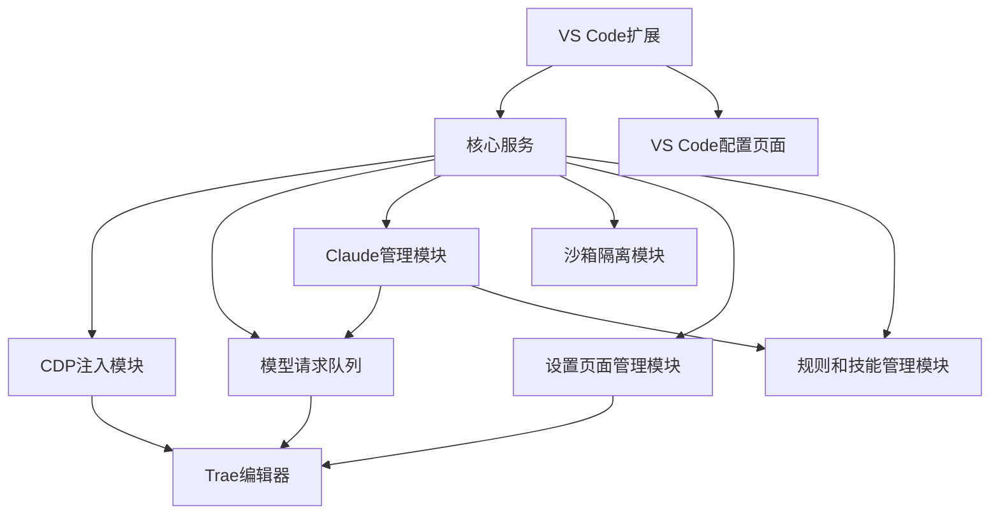

# 中间版本需求文档：CDP注入Trae编辑器实现Claude管理

## 1. 项目概述

### 1.1 项目背景

当前项目正在进行架构重构，将Claude Code引入Caiode作为本地服务端。在最终版本完成前，需要一个中间版本来验证核心技术可行性，特别是通过CDP（Chrome DevTools Protocol）注入Trae编辑器实现Claude管理的方案。

### 1.2 目标与范围

**核心目标**：
- 通过CDP注入Trae编辑器，实现对Trae内置大模型的调用
- 实现Claude管理功能，包括模型请求队列管理
- 输出VS Code配置页面，提供用户界面
- 不包含Dreamweaver（DW）相关功能

**范围限定**：
- 仅实现核心功能验证，不追求完整的多智能体并发
- 重点验证单智能体+模型调用队列的稳定性
- 提供基础的VS Code配置界面

## 2. 功能需求

### 2.1 核心功能

| 功能模块 | 功能描述 | 优先级 |
|---------|---------|--------|
| **CDP注入模块** | 通过Chrome DevTools Protocol连接并注入Trae编辑器 | 高 |
| **模型请求队列** | 管理多个智能体对Trae内置模型的请求，实现串行化调用 | 高 |
| **Claude管理** | 集成Claude Code的核心功能，包括工具链和工作流 | 高 |
| **VS Code配置页面** | 提供配置参数页面，用于绑定会话、调整参数等功能 | 高 |
| **沙箱隔离** | 为每个Trae会话提供独立的沙箱环境，实现文件和权限隔离 | 高 |
| **设置页面管理** | 自动调用Trae设置页面，注入智能体提示词 | 高 |
| **规则和技能管理** | 从Claude Code移植独立的rules和skills | 高 |
| **状态同步** | 实现Trae编辑器状态与本地服务的双向同步 | 中 |
| **错误处理** | 提供完善的错误处理机制，确保系统稳定性 | 中 |

### 2.2 详细功能描述

#### 2.2.1 CDP注入模块

- **功能**：连接到Trae编辑器的远程调试端口，注入控制脚本
- **实现细节**：
  - 支持自动检测可用CDP端口
  - 支持国际版和国内版Trae
  - 防止重复注入
  - 提供注入状态反馈

#### 2.2.2 模型请求队列

- **功能**：管理多个智能体对Trae内置模型的请求
- **实现细节**：
  - 实现全局模型请求队列
  - 支持请求优先级管理
  - 提供请求状态跟踪
  - 处理请求超时和失败重试

#### 2.2.3 Claude管理

- **功能**：集成Claude Code的核心功能
- **实现细节**：
  - 移植Claude Code的工具链（Bash, FileEdit, Glob等）
  - 实现工作流循环（loop）机制
  - 支持智能体任务管理
  - 提供模型调用接口

#### 2.2.4 VS Code配置页面

- **功能**：提供用户友好的配置界面
- **实现细节**：
  - Trae连接配置（端口、路径等）
  - 模型设置（超时、重试等）
  - 队列管理配置
  - 状态监控面板

#### 2.2.5 状态同步

- **功能**：实现Trae编辑器与本地服务的双向同步
- **实现细节**：
  - 定期心跳检测
  - 状态变更通知
  - 异常状态处理

#### 2.2.6 错误处理

- **功能**：提供完善的错误处理机制
- **实现细节**：
  - CDP连接错误处理
  - 模型调用错误处理
  - 队列管理错误处理
  - 用户友好的错误提示

#### 2.2.7 沙箱隔离

- **功能**：为每个Trae会话提供独立的沙箱环境
- **实现细节**：
  - 基于文件系统隔离的沙箱环境
  - 权限隔离机制，限制文件系统访问范围
  - 会话级别的资源隔离
  - 沙箱环境的创建、管理和销毁

#### 2.2.8 设置页面管理

- **功能**：自动调用Trae设置页面，注入智能体提示词
- **实现细节**：
  - 通过CDP自动导航到Trae设置页面
  - 注入智能体提示词和配置
  - 保存和加载设置配置
  - 设置变更的实时同步

#### 2.2.9 规则和技能管理

- **功能**：从Claude Code移植独立的rules和skills
- **实现细节**：
  - 移植Claude Code的规则系统
  - 移植Claude Code的技能系统
  - 提供规则和技能的配置界面
  - 支持规则和技能的自定义和扩展

## 3. 非功能需求

### 3.1 性能需求

- **响应时间**：模型请求队列处理延迟不超过500ms
- **并发能力**：支持至少5个智能体的并行操作（模型调用串行）
- **资源占用**：内存占用不超过512MB，CPU使用率不超过50%

### 3.2 可靠性需求

- **稳定性**：系统运行24小时无崩溃
- **容错性**：能够处理Trae编辑器重启、网络中断等异常情况
- **恢复能力**：异常后能够自动恢复正常运行状态

### 3.3 安全性需求

- **沙箱隔离**：智能体操作在隔离环境中执行
- **权限控制**：限制文件系统访问权限
- **数据安全**：保护用户配置和敏感信息

### 3.4 易用性需求

- **安装便捷**：提供一键安装和配置向导
- **界面友好**：VS Code配置页面直观易用
- **文档完善**：提供详细的使用文档和故障排除指南

## 4. 技术架构

### 4.1 系统架构

### 4.2 核心组件

| 组件 | 职责 | 技术实现 |
|------|------|----------|
| **CDP注入模块** | 连接并控制Trae编辑器 | Chrome DevTools Protocol |
| **模型请求队列** | 管理模型调用请求 | Node.js队列实现 |
| **Claude管理模块** | 集成Claude Code功能 | 移植Claude Code工具链 |
| **VS Code扩展** | 提供配置参数页面 | VS Code Extension API |
| **沙箱隔离模块** | 为每个Trae会话提供独立沙箱环境 | 文件系统隔离 |
| **设置页面管理模块** | 自动调用Trae设置页面，注入智能体提示词 | CDP导航和注入 |
| **规则和技能管理模块** | 管理独立的rules和skills | 移植Claude Code规则和技能系统 |
| **核心服务** | 协调各模块工作 | Node.js服务 |

### 4.3 技术栈

- **前端**：TypeScript, React, VS Code Extension API
- **后端**：Node.js, Chrome DevTools Protocol
- **工具链**：Claude Code工具链
- **构建工具**：npm, TypeScript compiler

## 5. 实现计划

### 5.1 阶段划分

| 阶段 | 任务 | 完成标准 |
|------|------|----------|
| **阶段1：基础搭建** | 搭建VS Code扩展基础结构，实现CDP连接 | 能够成功连接Trae编辑器并注入脚本 |
| **阶段2：核心功能** | 实现模型请求队列和Claude管理模块 | 能够通过队列调用Trae内置模型 |
| **阶段3：沙箱隔离** | 实现沙箱隔离模块，为每个Trae会话提供独立环境 | 每个Trae会话都有独立的沙箱环境，实现权限隔离 |
| **阶段4：设置和规则管理** | 实现设置页面管理和规则技能管理模块 | 能够自动调用Trae设置页面，注入智能体提示词，管理独立的rules和skills |
| **阶段5：界面开发** | 开发VS Code配置参数页面 | 提供绑定会话、调整参数等功能的配置页面 |
| **阶段6：测试验证** | 功能测试和性能优化 | 系统稳定运行，满足性能需求 |

### 5.2 关键技术点

1. **CDP连接管理**：处理Trae编辑器的启动、连接和断开
2. **模型请求队列**：实现公平的请求调度机制
3. **Claude功能移植**：将Claude Code的核心功能适配到新架构
4. **沙箱隔离实现**：为每个Trae会话创建独立的文件系统和权限隔离环境
5. **设置页面管理**：通过CDP自动导航到Trae设置页面并注入智能体提示词
6. **规则和技能管理**：移植Claude Code的规则和技能系统，实现独立管理
7. **VS Code界面开发**：创建配置参数页面，提供绑定会话、调整参数等功能
8. **错误处理和容错**：确保系统在各种异常情况下的稳定性

## 6. 依赖关系

### 6.1 外部依赖

| 依赖 | 版本 | 用途 |
|------|------|------|
| Chrome DevTools Protocol | latest | 与Trae编辑器通信 |
| VS Code Extension API | latest | 开发VS Code扩展 |
| Node.js | >=16.0.0 | 运行时环境 |
| TypeScript | >=4.5.0 | 开发语言 |

### 6.2 内部依赖

| 依赖 | 用途 | 来源 |
|------|------|------|
| Trae-Ralph-main | CDP注入基础 | /workspace/caiode/Trae-Ralph-main |
| claude-code-src | Claude功能实现 | /workspace/caiode/claude-code-src |
| vscode-extension | VS Code扩展基础 | /workspace/caiode/vscode-extension |

## 7. 验收标准

### 7.1 功能验收

- [ ] 能够成功连接并注入Trae编辑器
- [ ] 模型请求队列正常工作，实现串行化调用
- [ ] Claude管理功能正常，能够执行工具操作
- [ ] VS Code配置参数页面功能完整，支持绑定会话、调整参数等功能
- [ ] 沙箱隔离功能正常，为每个Trae会话提供独立的沙箱环境
- [ ] 设置页面管理功能正常，能够自动调用Trae设置页面并注入智能体提示词
- [ ] 规则和技能管理功能正常，能够管理独立的rules和skills
- [ ] 状态同步机制正常，能够检测Trae状态变化
- [ ] 错误处理机制有效，能够处理各种异常情况

### 7.2 性能验收

- [ ] 模型请求队列处理延迟不超过500ms
- [ ] 支持至少5个智能体的并行操作
- [ ] 内存占用不超过512MB
- [ ] CPU使用率不超过50%

### 7.3 可靠性验收

- [ ] 系统运行24小时无崩溃
- [ ] 能够处理Trae编辑器重启、网络中断等异常情况
- [ ] 异常后能够自动恢复正常运行状态

## 8. 风险评估

| 风险 | 可能性 | 影响 | 缓解措施 |
|------|--------|------|----------|
| Trae版本更新导致DOM选择器失效 | 中 | 高 | 建立选择器版本适配机制，提供容错重试 |
| CDP连接不稳定 | 中 | 中 | 实现重连机制和心跳检测 |
| 模型请求队列阻塞 | 低 | 中 | 实现队列监控和超时处理 |
| 资源占用过高 | 低 | 中 | 优化代码，设置资源使用限制 |
| 沙箱隔离不彻底 | 中 | 高 | 加强权限控制，定期审计沙箱安全性 |
| 智能体提示词注入失败 | 中 | 中 | 实现注入失败检测和重试机制 |
| 规则和技能移植不完整 | 低 | 中 | 建立完整的移植测试用例，确保功能完整性 |
| 会话管理复杂性增加 | 低 | 中 | 实现会话生命周期管理，提供会话监控工具 |

## 9. 结论与建议

本中间版本需求文档详细描述了通过CDP注入Trae编辑器实现Claude管理的功能需求、技术架构和实现计划。该版本作为最终架构的验证阶段，重点验证核心技术的可行性，为后续完整版本的开发奠定基础，同时为后期的Dreamweaver集成提供基础功能。

**建议**：
1. 优先实现CDP注入和模型请求队列功能，确保核心技术路径可行
2. 重点关注沙箱隔离机制的实现，确保每个Trae会话都有独立的安全环境
3. 采用增量开发策略，逐步完善功能，特别是设置页面管理和规则技能管理
4. 建立完善的测试和监控机制，确保系统稳定性和安全性
5. 文档化所有技术决策和实现细节，便于后续维护和扩展
6. 为后期的Dreamweaver集成预留接口和扩展点，确保平滑过渡
7. 定期进行安全审计，确保沙箱隔离的有效性和安全性