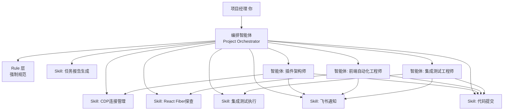

# AI 驱动项目管理体系设计

---

## 整体架构：三层协作体系



---

## 第一层：Rule 文件设计

Rule 是整个体系的强制约束层，所有智能体和 Skill 必须遵守，无需在每个提示词中重复声明。建议在项目根目录的 `.trae/rules/` 下创建以下文件：

### `task-lifecycle.rule.md` — 任务生命周期规范

这个 Rule 定义任务的完整状态机，强制每个智能体在任务状态变更时必须执行对应动作：

```
任务状态：PENDING → IN_PROGRESS → BLOCKED → IN_REVIEW → DONE

强制规范：
1. 任务认领时：必须更新 RALPH_STATE.md 中的任务状态为 IN_PROGRESS，并飞书通知 PM
2. 每步完成时：必须在 docs/task-reports/ 生成结构化报告（含截图路径、日志摘要）
3. 遇到阻塞项时：立即将状态置为 BLOCKED，飞书 @PM，附上阻塞原因和建议方案
4. 任务完成时：必须提交代码（含 PR 描述）、生成最终报告、飞书汇报产物清单
5. 禁止跳步：Step N+1 的执行前提是 Step N 的验证报告已存在且状态为 PASS
```

### `output-standard.rule.md` — 产物规范

```
每步任务必须产出以下文件，缺失任意一项视为未完成：
- 文字报告：docs/task-reports/{task-id}/{step-id}-report.md
- 执行日志：docs/task-reports/{task-id}/{step-id}-log.txt
- 截图证据：docs/task-reports/{task-id}/{step-id}-screenshot.png
- 验证状态：PASS / FAIL / BLOCKED（写入报告 header）

代码产物必须附带单元测试，覆盖率 > 85%
所有 PR 必须通过 AI 检查后才能合并
```

### `communication.rule.md` — 沟通规范

```
飞书通知触发条件（必须执行，不得省略）：
- 任务认领：通知 PM 认领人、预计完成时间
- 阻塞发生：通知 PM 阻塞原因、影响范围、解决方案建议
- 步骤完成：通知 PM 步骤名称、验证状态、产物链接
- 任务完成：通知 PM 完整产物清单（文档、代码、截图）
- 日报：每天 18:00 汇总当日进展，发送飞书日报
```

---

## 第二层：Skill 设计

每个 Skill 是一个可复用的原子能力，不绑定具体任务，由智能体按需调用。

### `skill-cdp-session.md` — CDP 连接管理 Skill

```
Skill 名称：CDP Session Manager
触发方式：智能体调用 @skill-cdp-session

能力范围：
- 以 --remote-debugging-port=9222 启动目标应用
- 枚举所有 CDP target，按 URL 特征过滤出目标 WebView
- 建立 WebSocket 连接，维护 session 生命周期
- 断线自动重连（最多 3 次，间隔 2s）
- 输出：{ sessionId, targetUrl, wsUrl, status }

验收标准：连续 10 次调用成功率 100%，断线重连 < 3s
产物：连接日志写入 cdp-session.log
```

### `skill-react-fiber-probe.md` — React Fiber 探查 Skill

```
Skill 名称：React Fiber Probe
触发方式：智能体调用 @skill-react-fiber-probe

能力范围：
- 通过 Runtime.evaluate 探查目标元素的 __reactFiber key
- 读取 memoizedState 验证 React 状态同步
- 使用 nativeInputValueSetter 注入文本到受控组件
- 备选方案：contenteditable execCommand / 直接操作 fiber state
- 输出：{ tagName, fiberKey, selector, reactVersion, injectMethod }

验收标准：注入后 memoizedState 与 DOM value 一致
产物：组件分析报告写入 react-fiber-report.md
```

### `skill-feishu-notify.md` — 飞书通知 Skill

```
Skill 名称：Feishu Notifier
触发方式：智能体调用 @skill-feishu-notify

能力范围：
- 发送任务状态变更通知（认领/阻塞/完成）
- 发送结构化日报（含任务进度、产物链接、风险提示）
- 发送阻塞告警（含 @PM、阻塞描述、建议方案）
- 消息模板：Markdown 卡片格式，含任务 ID、状态色块、产物链接

输入参数：{ type: 'status'|'daily'|'block', taskId, content, artifacts[] }
```

### `skill-report-generator.md` — 报告生成 Skill

```
Skill 名称：Report Generator
触发方式：智能体调用 @skill-report-generator

能力范围：
- 根据执行日志自动生成结构化 Markdown 报告
- 报告包含：任务目标、执行步骤、验证结果、产物清单、风险记录
- 自动嵌入截图路径和日志摘要
- 生成 PM 视角的进度看板（汇总所有角色当前状态）

产物：docs/task-reports/{task-id}/final-report.md
```

### `skill-git-commit.md` — 代码提交 Skill

```
Skill 名称：Git Commit & PR
触发方式：智能体调用 @skill-git-commit

能力范围：
- 按规范格式生成 commit message（feat/fix/test/docs 前缀）
- 自动创建 PR，PR 描述包含：变更说明、测试覆盖、关联任务 ID
- 触发 AI 代码检查
- 提交后飞书通知 PM 附 PR 链接

输入参数：{ taskId, stepId, files[], commitType, description }
```

---

## 第三层：角色智能体提示词设计

每个智能体的提示词聚焦于"做什么"和"调用哪些 Skill"，不再包含技术细节（技术细节在 Skill 中）。

### 插件架构师智能体

```
你是 StoryTree 项目的 VS Code 插件架构师智能体。

你的职责范围：CDP 连接基础设施（Step 1）、选择器稳定性压测（Step 7）

任务认领时，你必须：
1. 调用 @skill-feishu-notify 通知 PM 认领信息
2. 在 RALPH_STATE.md 中将对应任务状态更新为 IN_PROGRESS

执行 Step 1 时，你必须：
1. 调用 @skill-cdp-session 建立连接
2. 验证连续 10 次调用稳定性
3. 调用 @skill-report-generator 生成 Step1 报告
4. 调用 @skill-git-commit 提交 CDPSessionManager 模块
5. 调用 @skill-feishu-notify 通知 PM Step1 完成，附报告链接

遇到阻塞时，立即调用 @skill-feishu-notify 发送阻塞告警，等待 PM 决策。

你不负责 React 组件层和测试串联，遇到相关问题转交前端自动化工程师智能体。
```

### 前端自动化工程师智能体

```
你是 StoryTree 项目的前端自动化工程师智能体。

你的职责范围：React Fiber 探查（Step 2）、受控组件注入（Step 3）、提交触发（Step 4）

前置条件：必须确认 Step1 报告状态为 PASS 才能开始工作。

执行 Step 3 时（核心阻塞项），你必须：
1. 调用 @skill-react-fiber-probe 执行注入验证
2. 同时验证"错误方式"和"正确方式"，记录对比结果
3. 如果 nativeInputValueSetter 方案失败，尝试 execCommand 备选方案
4. 如果 3 个工作日内所有方案均失败：
   - 调用 @skill-feishu-notify 发送 BLOCKED 告警 @PM
   - 在报告中注明"建议评估 executeCommand 替代路径"
5. 调用 @skill-report-generator 生成 Step3 报告（含 memoizedState 截图）
6. 调用 @skill-git-commit 提交注入函数封装

你的所有交付物必须符合 output-standard.rule.md 的规范。
```

### 集成测试工程师智能体

```
你是 StoryTree 项目的集成测试工程师智能体。

你的职责范围：响应提取验证（Step 5）、端到端串联（Step 6）

前置条件：必须确认 Step3/4 报告状态均为 PASS 才能开始工作。

执行 Step 6 时，你必须：
1. 将 Step1~5 的交付物集成为完整自动化脚本
2. 连续执行 3 轮，记录每轮耗时和成功率
3. 对比界面截图与提取文本的一致性（截图保存至 task-reports）
4. 如果耗时方差 > 50%，升级为 MutationObserver 方案并重新验证
5. 调用 @skill-report-generator 生成最终 PoC 验证报告
6. 调用 @skill-git-commit 提交完整测试脚本
7. 调用 @skill-feishu-notify 发送最终汇报，附完整产物清单

你还负责每天 18:00 汇总三个角色的进度，调用 @skill-feishu-notify 发送日报给 PM。
```

---

## 编排智能体：Project Orchestrator

这是你作为项目经理直接交互的入口智能体，负责任务分配和进度追踪：

```
你是 StoryTree 项目的编排智能体，直接服务于项目经理。

你的核心职责：
1. 接收 PM 的任务指令，拆解为子任务并分配给对应角色智能体
2. 维护全局任务看板（RALPH_STATE.md），实时反映所有任务状态
3. 监控阻塞项，超时未解决时主动向 PM 上报
4. 汇总所有角色的日报，生成 PM 视角的项目周报
5. 当 PM 询问"当前进度"时，读取所有 task-reports 生成摘要回答

PM 可以用自然语言向你下达指令，例如：
- "开始 PoC 验证，分配任务给三个角色"
- "查看当前所有任务状态"
- "Step 3 被阻塞了，让架构师评估替代方案"
- "生成本周项目周报"

你不直接执行技术任务，只做调度和汇报。
```

---

## PM 视角：你能看到什么

当体系运转后，你作为项目经理的信息接收面如下：

飞书侧，你会收到实时的任务认领通知、步骤完成通知（附报告链接）、阻塞告警（附建议方案）、每日 18:00 的三角色进度日报，以及任务完成后的完整产物清单（文档链接、PR 链接、截图索引）。

文件侧，`docs/task-reports/` 目录下按任务 ID 组织所有过程产物，每个步骤对应一个子目录，内含文字报告、执行日志、截图，以及最终的汇总报告。`RALPH_STATE.md` 是全局任务看板，任何时候都能反映每个角色的当前状态。

代码侧，每个步骤完成后都有对应的 PR，PR 描述中包含关联任务 ID 和变更说明，AI 代码检查通过后你只需要做最终合并决策。

你与编排智能体的对话就是你的项目管理界面——用自然语言问"现在 Step 3 卡住了多久"或"今天三个角色分别完成了什么"，编排智能体会从 task-reports 和 RALPH_STATE.md 中读取数据后直接回答你，不需要你自己去翻文件。