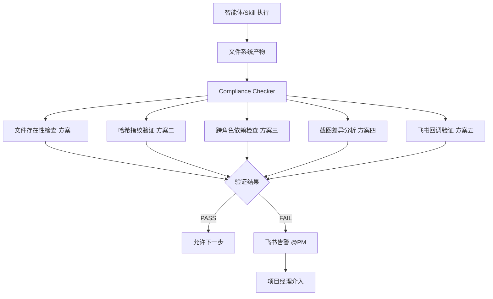

# AI 执行验证体系设计

---

## 核心问题：AI 执行的不可信性

智能体和 Skill 的执行存在三类不可信场景：**遗漏执行**（忘记调用某个 Skill）、**伪造执行**（生成了报告内容但没有真正写入文件）、**绕过规则**（Step 3 未通过就推进了 Step 4）。任何验证方案都必须针对这三类场景设计对应的检测机制。

---

## 方案一：基于文件系统的强制验证（最可靠）

这是最务实的方案，核心思路是**把执行证明和产物写入文件系统，用文件存在性作为唯一信任锚点**，而不是相信智能体的自我汇报。

在 Rule 层加入一条强制约束：每个步骤的"完成"定义不是智能体说完成了，而是以下文件同时存在且通过格式校验：

```
docs/task-reports/{task-id}/{step-id}/
  ├── report.md          # 必须包含 status: PASS|FAIL|BLOCKED
  ├── execution.log      # 必须包含时间戳和关键操作记录
  ├── screenshot.png     # 必须是有效图片文件（非空）
  └── artifacts.json     # 产物清单，机器可读格式
```

然后创建一个独立的**验证 Agent（Compliance Checker）**，它不参与执行，只做审计。每当有步骤声称完成时，Compliance Checker 自动运行以下检查：

```javascript
// compliance-checker 伪代码
async function verifyStepCompletion(taskId, stepId) {
  const required = ['report.md', 'execution.log', 'screenshot.png', 'artifacts.json'];
  const missing = required.filter(f => !fileExists(`task-reports/${taskId}/${stepId}/${f}`));
  
  if (missing.length > 0) return { status: 'FAIL', reason: `缺少产物: ${missing.join(', ')}` };
  
  const report = readFile(`task-reports/${taskId}/${stepId}/report.md`);
  if (!report.includes('status:')) return { status: 'FAIL', reason: 'report.md 缺少 status 字段' };
  
  const screenshot = getFileSize(`task-reports/${taskId}/${stepId}/screenshot.png`);
  if (screenshot < 1024) return { status: 'FAIL', reason: '截图文件异常（可能为空）' };
  
  return { status: 'PASS' };
}
```

这个方案的关键优势是**验证逻辑与执行逻辑完全解耦**，Compliance Checker 不依赖任何智能体的自我汇报，只看文件系统的客观状态。

---

## 方案二：哈希指纹 + 时间戳防伪

针对"伪造执行"场景——智能体可能生成了看起来合法的报告内容，但实际上是凭空捏造的，并没有真正运行验证脚本。解决方案是在每个关键执行步骤中，要求智能体将**运行时产生的唯一数据**写入报告，这些数据无法事先伪造。

具体做法是在 Skill 的执行规范中要求：

对于 `skill-cdp-session`，报告中必须包含从 `/json` 接口返回的原始 JSON 片段（含实际的 `webSocketDebuggerUrl`，每次运行都不同）。

对于 `skill-react-fiber-probe`，报告中必须包含 `Runtime.evaluate` 返回的实际 fiber key 名称（如 `__reactFiber$abc123xyz`，其中后缀是 React 运行时生成的随机值）。

对于 `skill-feishu-notify`，飞书消息发送后会返回一个 `message_id`，这个 ID 必须写入 `artifacts.json`，PM 可以通过飞书 API 反查这条消息是否真实存在。

这些运行时数据具有**不可预测性**，智能体无法在不真正执行的情况下伪造出合法的值，从而形成执行证明。

---

## 方案三：跨角色交叉验证

这是针对"绕过规则"场景最有效的方案。核心思路是：**每个角色的输入来自上一个角色的产物，而不是来自上一个角色的声明**。

在编排智能体的调度逻辑中加入强制检查：

```
前端自动化工程师智能体启动 Step 2 的前提：
  读取 docs/task-reports/poc-01/step-1/report.md
  确认文件存在 AND status == PASS
  如果不满足 → 拒绝启动，向 PM 发送告警

集成测试工程师智能体启动 Step 5 的前提：
  读取 docs/task-reports/poc-01/step-3/report.md
  读取 docs/task-reports/poc-01/step-4/report.md
  两者均存在 AND status == PASS
  如果不满足 → 拒绝启动
```

这种设计让每个角色都成为上一个角色的"被动验证者"——集成测试工程师在读取 Step 3 报告时，实际上完成了对前端自动化工程师交付物的隐式验证。任何一步的伪造或遗漏都会在下游角色启动时被阻断。

---

## 方案四：Playwright 自动化截图作为执行证明

针对 CDP 注入这类需要界面交互的验证步骤，单纯的文字报告无法证明操作真的发生了。更可靠的方案是要求每个涉及界面操作的 Skill 在执行前后各截一张图，并将两张图的差异作为执行证明：

```
Step 3 执行证明要求：
  before.png：注入前的输入框截图（输入框为空）
  after.png：注入后的输入框截图（输入框显示注入文本）
  diff 分析：两张图的像素差异必须集中在输入框区域

如果 before.png 和 after.png 完全相同 → 注入未生效，报告状态强制为 FAIL
```

这个方案可以通过 Playwright 的 `page.screenshot()` 自动实现，截图文件写入 `task-reports` 目录后由 Compliance Checker 做像素级对比，完全不依赖智能体的主观判断。

---

## 方案五：飞书 Webhook 回调验证

这是针对"飞书通知是否真实发送"的专项验证。在飞书机器人配置中开启消息回调，每条消息发送后飞书会向你的服务器推送一个包含 `message_id` 的回调事件。在 Compliance Checker 中加入以下验证逻辑：

```
验证飞书通知是否真实发送：
1. 从 artifacts.json 读取智能体声称发送的 message_id
2. 调用飞书 API: GET /open-apis/im/v1/messages/{message_id}
3. 如果 API 返回 404 → 通知未发送，记录违规
4. 如果 API 返回消息内容 → 对比内容与报告中的描述是否一致
```

这样飞书通知就从"智能体说我发了"变成"飞书服务器证明我发了"，PM 在飞书侧看到的消息与系统记录完全对应。

---

## 整体验证体系设计

将以上五个方案整合为一个分层验证架构：



Compliance Checker 本身也需要被验证，它的执行日志应该写入独立的 `compliance-logs/` 目录，与任务产物目录完全隔离，确保执行智能体无法篡改审计记录。

---

## 最重要的一个原则

所有验证方案的有效性最终取决于一点：**验证逻辑必须由独立的 Compliance Checker 执行，而不是由被验证的智能体自我申报**。如果让插件架构师智能体自己判断"我的 Step 1 是否通过了"，那所有的 Rule 和产物规范都形同虚设。Compliance Checker 的独立性是整个体系可信度的基础，它只读文件系统和外部 API，不接受任何智能体的口头汇报。