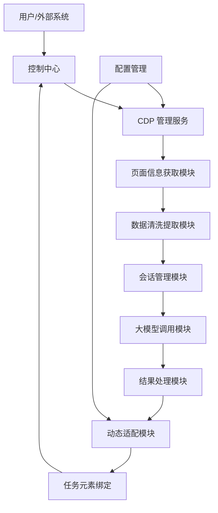

# CDP 动态适配 Trae IDE 页面与大模型调用方案

## 1. 思路分析

### 1.1 核心思路

用户提出的思路是：
1. 通过 CDP 获取 Trae IDE 页面的信息
2. 通过脚本清洗提取关键信息
3. 新开会话调用 Trae IDE 大模型
4. 得到结果后绑定预设的任务元素 ID
5. 实现动态适配

### 1.2 思路合理性评估

**✅ 合理性分析：**

1. **技术可行性**：
   - CDP (Chrome DevTools Protocol) 提供了完整的页面操作和信息获取能力
   - 脚本清洗提取可通过 JavaScript 实现
   - 会话管理和大模型调用可通过 CDP 模拟用户操作实现
   - 动态适配可通过配置管理和选择器策略实现

2. **架构合理性**：
   - 分层清晰：数据获取 → 处理 → 调用 → 适配
   - 模块化设计：各组件职责明确
   - 可扩展性：易于添加新的适配策略和处理逻辑

3. **业务价值**：
   - 减少人工干预，实现自动化流程
   - 提高系统稳定性和可靠性
   - 支持版本升级和页面结构变化
   - 提供统一的接口进行大模型调用

**⚠️ 潜在挑战：**

1. **页面结构变化**：Trae IDE 版本更新可能导致页面结构变化
2. **元素定位稳定性**：动态生成的元素可能难以稳定定位
3. **性能优化**：频繁的 CDP 通信可能影响性能
4. **错误处理**：需要完善的错误处理和恢复机制

## 2. 技术实现方案

### 2.1 系统架构



### 2.2 核心模块实现

#### 2.2.1 页面信息获取模块

```typescript
// 页面信息获取模块
class PageInfoFetcher {
  private cdpClient: any;
  
  constructor(cdpClient: any) {
    this.cdpClient = cdpClient;
  }
  
  async fetchPageInfo(): Promise<PageInfo> {
    // 获取页面基本信息
    const pageInfo = await this.getPageBasicInfo();
    
    // 获取页面元素
    const elements = await this.getPageElements();
    
    // 获取当前会话状态
    const sessionState = await this.getSessionState();
    
    return {
      ...pageInfo,
      elements,
      sessionState
    };
  }
  
  private async getPageBasicInfo(): Promise<PageBasicInfo> {
    const script = `
      {
        title: document.title,
        url: window.location.href,
        timestamp: new Date().toISOString(),
        userAgent: navigator.userAgent
      }
    `;
    
    const result = await this.cdpClient.send('Runtime.evaluate', {
      expression: script,
      returnByValue: true
    });
    
    return result.result.value;
  }
  
  private async getPageElements(): Promise<PageElement[]> {
    const script = `
      const elements = [];
      
      // 获取聊天相关元素
      const chatInput = document.querySelector('input[type="text"], textarea');
      if (chatInput) {
        elements.push({
          type: 'chatInput',
          selector: this.getElementSelector(chatInput),
          value: chatInput.value,
          enabled: !chatInput.disabled
        });
      }
      
      // 获取提交按钮
      const submitButton = document.querySelector('button[type="submit"], .submit-button');
      if (submitButton) {
        elements.push({
          type: 'submitButton',
          selector: this.getElementSelector(submitButton),
          text: submitButton.textContent,
          visible: submitButton.offsetParent !== null
        });
      }
      
      // 获取响应容器
      const responseContainer = document.querySelector('.chat-response, .response');
      if (responseContainer) {
        elements.push({
          type: 'responseContainer',
          selector: this.getElementSelector(responseContainer),
          content: responseContainer.textContent
        });
      }
      
      // 获取新建会话按钮
      const newChatButton = document.querySelector('.new-chat, .new-conversation');
      if (newChatButton) {
        elements.push({
          type: 'newChatButton',
          selector: this.getElementSelector(newChatButton),
          visible: newChatButton.offsetParent !== null
        });
      }
      
      return elements;
      
      function getElementSelector(element) {
        if (element.id) {
          return '#' + element.id;
        }
        if (element.className) {
          return '.' + element.className.split(' ').filter(c => c).join('.');
        }
        return element.tagName.toLowerCase();
      }
    `;
    
    const result = await this.cdpClient.send('Runtime.evaluate', {
      expression: script,
      returnByValue: true
    });
    
    return result.result.value;
  }
  
  private async getSessionState(): Promise<SessionState> {
    const script = `
      {
        hasActiveConversation: document.querySelector('.chat-container') !== null,
        isLoading: document.querySelector('.loading, .streaming') !== null,
        hasDialog: document.querySelector('dialog, .modal, .popup') !== null
      }
    `;
    
    const result = await this.cdpClient.send('Runtime.evaluate', {
      expression: script,
      returnByValue: true
    });
    
    return result.result.value;
  }
}

// 类型定义
interface PageBasicInfo {
  title: string;
  url: string;
  timestamp: string;
  userAgent: string;
}

interface PageElement {
  type: string;
  selector: string;
  value?: string;
  text?: string;
  enabled?: boolean;
  visible?: boolean;
  content?: string;
}

interface SessionState {
  hasActiveConversation: boolean;
  isLoading: boolean;
  hasDialog: boolean;
}

interface PageInfo {
  title: string;
  url: string;
  timestamp: string;
  userAgent: string;
  elements: PageElement[];
  sessionState: SessionState;
}
```

#### 2.2.2 数据清洗提取模块

```typescript
// 数据清洗提取模块
class DataCleaner {
  async cleanAndExtract(pageInfo: PageInfo): Promise<ExtractedData> {
    // 提取聊天输入框信息
    const chatInput = this.extractChatInput(pageInfo.elements);
    
    // 提取提交按钮信息
    const submitButton = this.extractSubmitButton(pageInfo.elements);
    
    // 提取响应容器信息
    const responseContainer = this.extractResponseContainer(pageInfo.elements);
    
    // 提取新建会话按钮信息
    const newChatButton = this.extractNewChatButton(pageInfo.elements);
    
    // 分析会话状态
    const sessionAnalysis = this.analyzeSessionState(pageInfo.sessionState);
    
    return {
      chatInput,
      submitButton,
      responseContainer,
      newChatButton,
      sessionAnalysis,
      timestamp: pageInfo.timestamp
    };
  }
  
  private extractChatInput(elements: PageElement[]): ExtractedElement {
    const element = elements.find(e => e.type === 'chatInput');
    if (element) {
      return {
        type: 'chatInput',
        selector: element.selector,
        isValid: element.enabled === true,
        confidence: this.calculateConfidence(element)
      };
    }
    return {
      type: 'chatInput',
      selector: '#chat-input',
      isValid: false,
      confidence: 0
    };
  }
  
  private extractSubmitButton(elements: PageElement[]): ExtractedElement {
    const element = elements.find(e => e.type === 'submitButton');
    if (element) {
      return {
        type: 'submitButton',
        selector: element.selector,
        isValid: element.visible === true,
        confidence: this.calculateConfidence(element)
      };
    }
    return {
      type: 'submitButton',
      selector: '#submit-button',
      isValid: false,
      confidence: 0
    };
  }
  
  private extractResponseContainer(elements: PageElement[]): ExtractedElement {
    const element = elements.find(e => e.type === 'responseContainer');
    if (element) {
      return {
        type: 'responseContainer',
        selector: element.selector,
        isValid: true,
        confidence: this.calculateConfidence(element)
      };
    }
    return {
      type: 'responseContainer',
      selector: '.response-container',
      isValid: false,
      confidence: 0
    };
  }
  
  private extractNewChatButton(elements: PageElement[]): ExtractedElement {
    const element = elements.find(e => e.type === 'newChatButton');
    if (element) {
      return {
        type: 'newChatButton',
        selector: element.selector,
        isValid: element.visible === true,
        confidence: this.calculateConfidence(element)
      };
    }
    return {
      type: 'newChatButton',
      selector: '#new-chat-button',
      isValid: false,
      confidence: 0
    };
  }
  
  private analyzeSessionState(sessionState: SessionState): SessionAnalysis {
    return {
      hasActiveConversation: sessionState.hasActiveConversation,
      isLoading: sessionState.isLoading,
      hasDialog: sessionState.hasDialog,
      recommendedAction: this.getRecommendedAction(sessionState)
    };
  }
  
  private getRecommendedAction(sessionState: SessionState): string {
    if (sessionState.hasDialog) {
      return 'handle_dialog';
    }
    if (sessionState.isLoading) {
      return 'wait_for_loading';
    }
    if (!sessionState.hasActiveConversation) {
      return 'create_new_conversation';
    }
    return 'ready_for_input';
  }
  
  private calculateConfidence(element: PageElement): number {
    let confidence = 0;
    
    // 根据选择器类型计算信心度
    if (element.selector.startsWith('#')) {
      confidence += 0.5; // ID 选择器信心度最高
    } else if (element.selector.startsWith('.')) {
      confidence += 0.3; // 类选择器信心度次之
    }
    
    // 根据元素状态计算信心度
    if (element.enabled !== undefined && element.enabled) {
      confidence += 0.3;
    }
    if (element.visible !== undefined && element.visible) {
      confidence += 0.2;
    }
    
    return Math.min(confidence, 1.0);
  }
}

// 类型定义
interface ExtractedElement {
  type: string;
  selector: string;
  isValid: boolean;
  confidence: number;
}

interface SessionAnalysis {
  hasActiveConversation: boolean;
  isLoading: boolean;
  hasDialog: boolean;
  recommendedAction: string;
}

interface ExtractedData {
  chatInput: ExtractedElement;
  submitButton: ExtractedElement;
  responseContainer: ExtractedElement;
  newChatButton: ExtractedElement;
  sessionAnalysis: SessionAnalysis;
  timestamp: string;
}
```

#### 2.2.3 会话管理模块

```typescript
// 会话管理模块
class SessionManager {
  private cdpClient: any;
  private selectors: any;
  
  constructor(cdpClient: any, selectors: any) {
    this.cdpClient = cdpClient;
    this.selectors = selectors;
  }
  
  async createNewSession(): Promise<boolean> {
    try {
      // 点击新建会话按钮
      const script = `
        const button = document.querySelector('${this.selectors.newChatButton}');
        if (button) {
          button.click();
          true;
        } else {
          false;
        }
      `;
      
      const result = await this.cdpClient.send('Runtime.evaluate', {
        expression: script,
        returnByValue: true
      });
      
      if (result.result.value) {
        // 等待新会话创建完成
        await this.waitForSessionReady();
        return true;
      }
      return false;
    } catch (error) {
      console.error('创建新会话失败:', error);
      return false;
    }
  }
  
  async waitForSessionReady(timeoutMs: number = 10000): Promise<void> {
    const startTime = Date.now();
    const pollInterval = 500;
    
    while (Date.now() - startTime < timeoutMs) {
      const script = `
        const input = document.querySelector('${this.selectors.chatInput}');
        input && input.disabled === false && input.offsetParent !== null;
      `;
      
      const result = await this.cdpClient.send('Runtime.evaluate', {
        expression: script,
        returnByValue: true
      });
      
      if (result.result.value) {
        return;
      }
      
      await new Promise(resolve => setTimeout(resolve, pollInterval));
    }
    
    throw new Error('会话准备超时');
  }
  
  async closeCurrentSession(): Promise<boolean> {
    try {
      // 尝试找到关闭会话的按钮
      const script = `
        const closeButton = document.querySelector('.close-session, .end-chat');
        if (closeButton) {
          closeButton.click();
          true;
        } else {
          false;
        }
      `;
      
      const result = await this.cdpClient.send('Runtime.evaluate', {
        expression: script,
        returnByValue: true
      });
      
      return result.result.value;
    } catch (error) {
      console.error('关闭会话失败:', error);
      return false;
    }
  }
  
  async getSessionStatus(): Promise<SessionStatus> {
    const script = `
      {
        hasActiveConversation: document.querySelector('.chat-container') !== null,
        hasChatHistory: document.querySelector('.chat-history') !== null,
        isReady: document.querySelector('${this.selectors.chatInput}') !== null
      }
    `;
    
    const result = await this.cdpClient.send('Runtime.evaluate', {
      expression: script,
      returnByValue: true
    });
    
    return result.result.value;
  }
}

// 类型定义
interface SessionStatus {
  hasActiveConversation: boolean;
  hasChatHistory: boolean;
  isReady: boolean;
}
```

#### 2.2.4 大模型调用模块

```typescript
// 大模型调用模块
class ModelCaller {
  private cdpClient: any;
  private selectors: any;
  
  constructor(cdpClient: any, selectors: any) {
    this.cdpClient = cdpClient;
    this.selectors = selectors;
  }
  
  async callModel(prompt: string, options: ModelCallOptions = {}): Promise<ModelResponse> {
    const {
      timeoutMs = 60000,
      submitMethod = 'button'
    } = options;
    
    try {
      // 输入提示词
      await this.typePrompt(prompt);
      
      // 提交消息
      await this.submitMessage(submitMethod);
      
      // 等待响应完成
      const response = await this.waitForResponse(timeoutMs);
      
      return {
        success: true,
        response,
        timestamp: new Date().toISOString()
      };
    } catch (error) {
      return {
        success: false,
        error: error.message,
        timestamp: new Date().toISOString()
      };
    }
  }
  
  private async typePrompt(prompt: string): Promise<void> {
    const script = `
      const element = document.querySelector('${this.selectors.chatInput}');
      if (element) {
        element.value = '${prompt.replace(/'/g, "\\'")}';
        element.dispatchEvent(new Event('input', { bubbles: true }));
        element.dispatchEvent(new Event('change', { bubbles: true }));
      } else {
        throw new Error('聊天输入框未找到');
      }
    `;
    
    await this.cdpClient.send('Runtime.evaluate', {
      expression: script,
      returnByValue: true
    });
  }
  
  private async submitMessage(method: string): Promise<void> {
    if (method === 'button') {
      const script = `
        const button = document.querySelector('${this.selectors.submitButton}');
        if (button) {
          button.click();
        } else {
          throw new Error('提交按钮未找到');
        }
      `;
      await this.cdpClient.send('Runtime.evaluate', {
        expression: script,
        returnByValue: true
      });
    } else {
      // 使用回车键提交
      const script = `
        const element = document.querySelector('${this.selectors.chatInput}');
        if (element) {
          element.dispatchEvent(new KeyboardEvent('keydown', {
            key: 'Enter',
            code: 'Enter',
            bubbles: true,
            cancelable: true
          }));
        } else {
          throw new Error('聊天输入框未找到');
        }
      `;
      await this.cdpClient.send('Runtime.evaluate', {
        expression: script,
        returnByValue: true
      });
    }
  }
  
  private async waitForResponse(timeoutMs: number): Promise<string> {
    const startTime = Date.now();
    const pollInterval = 500;
    
    while (Date.now() - startTime < timeoutMs) {
      const script = `
        const stopButton = document.querySelector('${this.selectors.stopButton || '.stop-button'}');
        const streamingIndicator = document.querySelector('${this.selectors.streamingIndicator || '.streaming'}');
        
        // 检查停止按钮是否存在且可见
        const stopButtonVisible = stopButton && stopButton.style.display !== 'none' && stopButton.offsetParent !== null;
        
        // 检查流式输出指示器
        const isStreaming = streamingIndicator !== null;
        
        !stopButtonVisible && !isStreaming;
      `;
      
      const result = await this.cdpClient.send('Runtime.evaluate', {
        expression: script,
        returnByValue: true
      });
      
      if (result.result.value) {
        // 响应完成，读取响应内容
        return this.getResponseContent();
      }
      
      await new Promise(resolve => setTimeout(resolve, pollInterval));
    }
    
    throw new Error('响应超时');
  }
  
  private async getResponseContent(): Promise<string> {
    const script = `
      const container = document.querySelector('${this.selectors.responseContainer}');
      if (container) {
        return container.textContent || '';
      } else {
        throw new Error('响应容器未找到');
      }
    `;
    
    const result = await this.cdpClient.send('Runtime.evaluate', {
      expression: script,
      returnByValue: true
    });
    
    return result.result.value;
  }
}

// 类型定义
interface ModelCallOptions {
  timeoutMs?: number;
  submitMethod?: 'button' | 'enter';
}

interface ModelResponse {
  success: boolean;
  response?: string;
  error?: string;
  timestamp: string;
}
```

#### 2.2.5 动态适配模块

```typescript
// 动态适配模块
class DynamicAdapter {
  private configManager: ConfigManager;
  private elementBinder: ElementBinder;
  
  constructor(configManager: ConfigManager) {
    this.configManager = configManager;
    this.elementBinder = new ElementBinder();
  }
  
  async adapt(extractedData: ExtractedData): Promise<AdaptationResult> {
    // 评估当前配置
    const currentConfig = this.configManager.getConfig();
    const evaluation = this.evaluateConfig(extractedData, currentConfig);
    
    // 如果配置需要更新
    if (!evaluation.isValid) {
      const newConfig = await this.generateNewConfig(extractedData);
      this.configManager.updateConfig(newConfig);
      
      // 绑定任务元素
      const bindingResult = await this.elementBinder.bindElements(newConfig.selectors);
      
      return {
        success: true,
        configUpdated: true,
        newConfig,
        bindingResult,
        message: '配置已更新并绑定成功'
      };
    }
    
    // 配置有效，直接绑定元素
    const bindingResult = await this.elementBinder.bindElements(currentConfig.selectors);
    
    return {
      success: true,
      configUpdated: false,
      currentConfig,
      bindingResult,
      message: '配置有效，绑定成功'
    };
  }
  
  private evaluateConfig(extractedData: ExtractedData, config: CDPConfig): ConfigEvaluation {
    const elements = [
      extractedData.chatInput,
      extractedData.submitButton,
      extractedData.responseContainer,
      extractedData.newChatButton
    ];
    
    const validElements = elements.filter(e => e.isValid);
    const averageConfidence = validElements.reduce((sum, e) => sum + e.confidence, 0) / validElements.length || 0;
    
    return {
      isValid: validElements.length >= 3 && averageConfidence > 0.5,
      validElements: validElements.length,
      averageConfidence,
      recommendedAction: validElements.length < 3 ? 'update_config' : 'use_current'
    };
  }
  
  private async generateNewConfig(extractedData: ExtractedData): Promise<CDPConfig> {
    const currentConfig = this.configManager.getConfig();
    
    return {
      ...currentConfig,
      selectors: {
        chatInput: extractedData.chatInput.isValid ? extractedData.chatInput.selector : currentConfig.selectors.chatInput,
        submitButton: extractedData.submitButton.isValid ? extractedData.submitButton.selector : currentConfig.selectors.submitButton,
        responseContainer: extractedData.responseContainer.isValid ? extractedData.responseContainer.selector : currentConfig.selectors.responseContainer,
        newChatButton: extractedData.newChatButton.isValid ? extractedData.newChatButton.selector : currentConfig.selectors.newChatButton,
        stopButton: currentConfig.selectors.stopButton,
        streamingIndicator: currentConfig.selectors.streamingIndicator
      },
      lastUpdated: new Date().toISOString(),
      version: this.incrementVersion(currentConfig.version)
    };
  }
  
  private incrementVersion(version: string): string {
    const parts = version.split('.');
    const patch = parseInt(parts[2]) + 1;
    return `${parts[0]}.${parts[1]}.${patch}`;
  }
}

// 元素绑定器
class ElementBinder {
  async bindElements(selectors: any): Promise<BindingResult> {
    // 这里可以实现具体的元素绑定逻辑
    // 例如，将选择器与预设的任务元素ID进行绑定
    
    const bindings = Object.entries(selectors).map(([key, selector]) => ({
      taskElementId: `task_${key}`,
      selector,
      status: 'bound'
    }));
    
    return {
      success: true,
      bindings,
      timestamp: new Date().toISOString()
    };
  }
}

// 类型定义
interface ConfigEvaluation {
  isValid: boolean;
  validElements: number;
  averageConfidence: number;
  recommendedAction: string;
}

interface AdaptationResult {
  success: boolean;
  configUpdated: boolean;
  newConfig?: CDPConfig;
  currentConfig?: CDPConfig;
  bindingResult: BindingResult;
  message: string;
}

interface BindingResult {
  success: boolean;
  bindings: Binding[];
  timestamp: string;
}

interface Binding {
  taskElementId: string;
  selector: string;
  status: string;
}

interface CDPConfig {
  selectors: {
    chatInput: string;
    submitButton: string;
    responseContainer: string;
    newChatButton: string;
    stopButton: string;
    streamingIndicator: string;
  };
  inputMethod: {
    triggerEvents: string[];
  };
  submitMethod: 'button' | 'enter';
  debugMode: boolean;
  logLevel: 'error' | 'warn' | 'info' | 'debug';
  version: string;
  lastUpdated: string;
}

// 配置管理器
class ConfigManager {
  private configPath: string;
  private config: CDPConfig;
  
  constructor(configPath: string) {
    this.configPath = configPath;
    this.config = this.loadConfig();
  }
  
  loadConfig(): CDPConfig {
    try {
      const fs = require('fs');
      const config = fs.readFileSync(this.configPath, 'utf8');
      return JSON.parse(config);
    } catch (error) {
      return this.getDefaultConfig();
    }
  }
  
  saveConfig(config: CDPConfig): void {
    const fs = require('fs');
    fs.writeFileSync(this.configPath, JSON.stringify(config, null, 2));
    this.config = config;
  }
  
  getDefaultConfig(): CDPConfig {
    return {
      selectors: {
        chatInput: '#chat-input',
        submitButton: '#submit-button',
        responseContainer: '.response-container',
        newChatButton: '#new-chat-button',
        stopButton: '#stop-button',
        streamingIndicator: '.streaming-indicator'
      },
      inputMethod: {
        triggerEvents: ['input', 'change', 'keyup']
      },
      submitMethod: 'button',
      debugMode: false,
      logLevel: 'info',
      version: '1.0.0',
      lastUpdated: new Date().toISOString()
    };
  }
  
  getConfig(): CDPConfig {
    return this.config;
  }
  
  updateConfig(updates: Partial<CDPConfig>): void {
    this.saveConfig({ ...this.config, ...updates });
  }
}
```

### 2.3 控制中心实现

```typescript
// 控制中心
class ControlCenter {
  private cdpClient: any;
  private configManager: ConfigManager;
  private pageInfoFetcher: PageInfoFetcher;
  private dataCleaner: DataCleaner;
  private sessionManager: SessionManager;
  private modelCaller: ModelCaller;
  private dynamicAdapter: DynamicAdapter;
  
  constructor(cdpClient: any, configPath: string) {
    this.cdpClient = cdpClient;
    this.configManager = new ConfigManager(configPath);
    this.pageInfoFetcher = new PageInfoFetcher(cdpClient);
    this.dataCleaner = new DataCleaner();
    this.sessionManager = new SessionManager(cdpClient, this.configManager.getConfig().selectors);
    this.modelCaller = new ModelCaller(cdpClient, this.configManager.getConfig().selectors);
    this.dynamicAdapter = new DynamicAdapter(this.configManager);
  }
  
  async processTask(task: ProcessTaskRequest): Promise<ProcessTaskResponse> {
    try {
      // 1. 获取页面信息
      const pageInfo = await this.pageInfoFetcher.fetchPageInfo();
      
      // 2. 清洗提取数据
      const extractedData = await this.dataCleaner.cleanAndExtract(pageInfo);
      
      // 3. 动态适配
      const adaptationResult = await this.dynamicAdapter.adapt(extractedData);
      
      // 4. 会话管理
      if (extractedData.sessionAnalysis.recommendedAction === 'create_new_conversation') {
        await this.sessionManager.createNewSession();
      } else if (extractedData.sessionAnalysis.recommendedAction === 'handle_dialog') {
        await this.handleDialog();
      } else if (extractedData.sessionAnalysis.recommendedAction === 'wait_for_loading') {
        await this.waitForLoading();
      }
      
      // 5. 大模型调用
      const modelResponse = await this.modelCaller.callModel(task.prompt, task.options);
      
      // 6. 结果处理
      const result = this.processModelResponse(modelResponse);
      
      return {
        success: true,
        result,
        adaptationResult,
        sessionStatus: await this.sessionManager.getSessionStatus(),
        timestamp: new Date().toISOString()
      };
    } catch (error) {
      return {
        success: false,
        error: error.message,
        timestamp: new Date().toISOString()
      };
    }
  }
  
  private async handleDialog(): Promise<void> {
    // 处理弹框逻辑
    const script = `
      const dialog = document.querySelector('dialog, .modal, .popup');
      if (dialog) {
        // 尝试点击关闭按钮
        const closeButton = dialog.querySelector('.close, .cancel, .dismiss');
        if (closeButton) {
          closeButton.click();
        } else {
          // 尝试按 ESC 键
          dialog.dispatchEvent(new KeyboardEvent('keydown', {
            key: 'Escape',
            bubbles: true
          }));
        }
      }
    `;
    
    await this.cdpClient.send('Runtime.evaluate', {
      expression: script,
      returnByValue: true
    });
  }
  
  private async waitForLoading(timeoutMs: number = 30000): Promise<void> {
    const startTime = Date.now();
    const pollInterval = 500;
    
    while (Date.now() - startTime < timeoutMs) {
      const script = `
        document.querySelector('.loading, .streaming') === null;
      `;
      
      const result = await this.cdpClient.send('Runtime.evaluate', {
        expression: script,
        returnByValue: true
      });
      
      if (result.result.value) {
        return;
      }
      
      await new Promise(resolve => setTimeout(resolve, pollInterval));
    }
    
    throw new Error('加载超时');
  }
  
  private processModelResponse(response: ModelResponse): any {
    if (response.success) {
      return {
        type: 'success',
        content: response.response,
        processed: true
      };
    } else {
      return {
        type: 'error',
        message: response.error,
        processed: false
      };
    }
  }
}

// 类型定义
interface ProcessTaskRequest {
  prompt: string;
  options?: ModelCallOptions;
}

interface ProcessTaskResponse {
  success: boolean;
  result?: any;
  adaptationResult?: AdaptationResult;
  sessionStatus?: SessionStatus;
  error?: string;
  timestamp: string;
}
```

## 3. 动态适配机制

### 3.1 适配策略

1. **选择器优先级策略**：
   - ID 选择器 > 类选择器 > 属性选择器 > 标签选择器
   - 基于信心度动态调整选择器

2. **配置更新策略**：
   - 当有效元素少于 3 个时更新配置
   - 当平均信心度低于 0.5 时更新配置
   - 定期检查配置有效性

3. **错误处理策略**：
   - 选择器失效时自动重新检测
   - 会话异常时自动恢复
   - 网络错误时重试机制

4. **性能优化策略**：
   - 缓存页面信息减少 CDP 调用
   - 批量执行 JavaScript 脚本
   - 合理设置轮询间隔

### 3.2 绑定机制

1. **任务元素 ID 绑定**：
   - 预设任务元素 ID 与页面元素选择器的映射
   - 动态更新绑定关系
   - 支持自定义绑定规则

2. **绑定验证**：
   - 绑定后验证元素是否可访问
   - 定期检查绑定状态
   - 自动修复无效绑定

## 4. 专家评审结构

### 4.1 评审目标

- 评估方案的技术可行性
- 验证动态适配机制的有效性
- 检查代码实现的质量和可靠性
- 确认方案是否满足业务需求

### 4.2 评审内容

#### 4.2.1 技术架构评审
- [ ] 系统架构是否合理
- [ ] 模块划分是否清晰
- [ ] 接口设计是否规范
- [ ] 技术选型是否适当

#### 4.2.2 实现方案评审
- [ ] CDP 调用是否高效
- [ ] 数据清洗逻辑是否完善
- [ ] 会话管理是否可靠
- [ ] 大模型调用是否稳定
- [ ] 动态适配机制是否有效

#### 4.2.3 代码质量评审
- [ ] 代码结构是否清晰
- [ ] 命名规范是否一致
- [ ] 错误处理是否完善
- [ ] 注释文档是否充分
- [ ] 性能优化是否到位

#### 4.2.4 业务需求评审
- [ ] 是否满足动态适配需求
- [ ] 是否支持版本升级
- [ ] 是否提供统一接口
- [ ] 是否易于集成和扩展

### 4.3 评审流程

1. **准备阶段**：
   - 分发评审文档
   - 安排评审会议
   - 收集前期反馈

2. **评审会议**：
   - 方案介绍（15分钟）
   - 技术细节讨论（30分钟）
   - 问题和建议（20分钟）
   - 结论和行动项（15分钟）

3. **后续跟进**：
   - 整理评审意见
   - 实施修改和优化
   - 再次评审验证

### 4.4 评审标准

| 评审项 | 评分标准 | 权重 |
|--------|---------|------|
| 技术可行性 | 方案是否技术上可行 | 30% |
| 架构合理性 | 系统架构是否合理 | 25% |
| 实现质量 | 代码实现质量如何 | 20% |
| 业务适配性 | 是否满足业务需求 | 15% |
| 可维护性 | 系统是否易于维护 | 10% |

## 5. 实施计划

### 5.1 阶段一：基础架构搭建

1. **环境准备**：
   - 安装必要的依赖
   - 配置开发环境
   - 搭建测试环境

2. **核心模块实现**：
   - 页面信息获取模块
   - 数据清洗提取模块
   - 配置管理模块

### 5.2 阶段二：功能实现

1. **会话管理**：
   - 会话创建和管理
   - 状态监控
   - 错误处理

2. **大模型调用**：
   - 提示词输入
   - 消息提交
   - 响应获取

3. **动态适配**：
   - 配置评估
   - 自动更新
   - 元素绑定

### 5.3 阶段三：测试和优化

1. **功能测试**：
   - 单元测试
   - 集成测试
   - 端到端测试

2. **性能优化**：
   - 减少 CDP 调用
   - 优化轮询机制
   - 缓存策略优化

3. **稳定性测试**：
   - 长时间运行测试
   - 异常恢复测试
   - 版本兼容性测试

### 5.4 阶段四：部署和集成

1. **部署准备**：
   - 打包构建
   - 配置部署
   - 文档更新

2. **系统集成**：
   - 与现有系统集成
   - API 对接
   - 监控设置

3. **上线验证**：
   - 灰度发布
   - 性能监控
   - 用户反馈收集

## 6. 预期成果

### 6.1 功能成果

- ✅ 通过 CDP 获取 Trae IDE 页面信息
- ✅ 自动清洗提取关键数据
- ✅ 智能会话管理
- ✅ 稳定的大模型调用
- ✅ 动态适配页面变化
- ✅ 预设任务元素 ID 绑定

### 6.2 技术成果

- 🚀 高效的 CDP 通信机制
- 📱 智能的数据处理逻辑
- 🔌 灵活的配置管理系统
- 🌍 自适应的页面适配机制
- 🎯 可靠的错误处理和恢复

### 6.3 业务价值

- 减少人工干预，实现自动化流程
- 提高系统稳定性和可靠性
- 支持 Trae IDE 版本升级
- 提供统一的大模型调用接口
- 降低维护成本和技术债务

## 7. 风险评估

### 7.1 风险因素

1. **技术风险**：
   - CDP 通信不稳定
   - 页面结构变化导致选择器失效
   - 大模型调用超时或失败
   - 动态适配逻辑复杂度高

2. **业务风险**：
   - 适配失败导致系统不可用
   - 性能问题影响用户体验
   - 版本升级导致兼容性问题
   - 维护成本超出预期

### 7.2 风险缓解

1. **技术风险缓解**：
   - 实现重试机制和错误处理
   - 定期更新选择器
   - 设置合理的超时和重试策略
   - 模块化设计，便于调试和维护

2. **业务风险缓解**：
   - 配置验证和测试功能
   - 性能监控和优化
   - 版本兼容性测试
   - 详细的文档和维护指南

## 8. 结论

用户提出的思路是合理的，通过 CDP 获取 Trae IDE 页面信息，结合脚本清洗提取、会话管理、大模型调用和动态适配机制，可以实现一个自动化、稳定、可靠的系统。

**推荐方案**：采用分层架构设计，实现页面信息获取、数据清洗提取、会话管理、大模型调用和动态适配等核心功能，通过预设任务元素 ID 绑定实现动态适配，支持 Trae IDE 版本升级和页面结构变化。

**预期成果**：
- 实现 Trae IDE 的自动化操作和监控
- 提供稳定的大模型调用接口
- 支持动态适配页面变化
- 减少人工干预，提高系统可靠性

该方案技术上可行，架构合理，能够满足业务需求，建议进行专家评审后实施。

[READY_FOR_REVIEW]