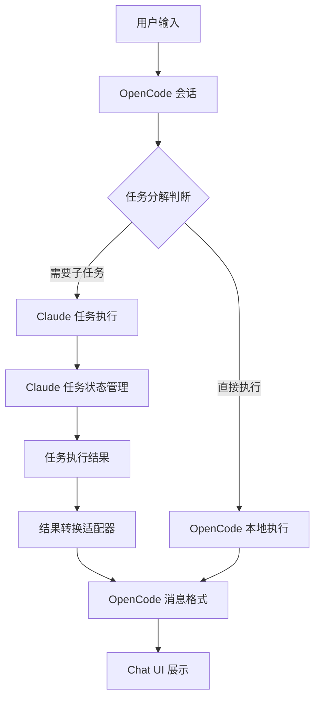

# OpenCode 与 Claude 对话任务分解与执行反馈集成方案

## 1. 概述

本方案旨在分析 OpenCode 和 Claude 的对话任务分解机制、任务执行反馈流程，并提供将 Claude 的执行结果在 OpenCode 的 Chat UI 页面中展示的适配改造方案。

## 2. 核心机制分析

### 2.1 OpenCode 任务分解机制

OpenCode 通过以下方式实现对话任务分解：

#### 子任务处理流程
- **触发机制**：通过 `subtask` 类型的消息部分触发子任务执行
- **核心函数**：`handleSubtask` 函数负责处理子任务执行
- **执行流程**：
  1. 创建助手消息作为子任务的容器
  2. 创建工具调用部分，使用 `task` 工具执行子任务
  3. 调用对应的 agent 执行子任务
  4. 处理子任务执行结果，更新工具调用状态
  5. 如有需要，创建总结消息继续任务

#### 代码实现
```typescript
// OpenCode 子任务处理核心函数
const handleSubtask = Effect.fn("SessionPrompt.handleSubtask")(function* (input: {
  task: MessageV2.SubtaskPart
  model: Provider.Model
  lastUser: MessageV2.User
  sessionID: SessionID
  session: Session.Info
  msgs: MessageV2.WithParts[]
}) {
  // 创建助手消息和工具调用部分
  // 执行子任务
  // 处理执行结果
  // 更新状态
}
```

### 2.2 Claude 任务分解机制

Claude 通过 `task` 工具实现任务分解：

#### 任务执行流程
- **触发机制**：通过 `task` 工具调用触发任务执行
- **执行方式**：使用 `runForkedAgent` 执行子任务
- **状态管理**：
  1. 任务创建时注册到 AppState
  2. 任务执行过程中更新状态（running、completed、failed、killed）
  3. 任务完成后发送通知
  4. 终端状态任务自动清理

#### 代码实现
```typescript
// Claude 任务状态更新
function updateTaskState<T extends TaskState>(
  taskId: string,
  setAppState: SetAppState,
  updater: (task: T) => T,
): void {
  // 更新任务状态
}

// 任务通知
function enqueueTaskNotification(attachment: TaskAttachment): void {
  // 发送任务状态通知
}
```

### 2.3 OpenCode 任务执行反馈机制

OpenCode 通过以下方式反馈任务执行状态：

- **工具调用状态**：通过 `ToolPart` 的 `state.status` 字段表示（running、completed、error、pending）
- **UI 展示**：
  - 进行中的任务显示加载状态
  - 完成的任务显示执行结果
  - 失败的任务显示错误信息
  - 支持工具执行详情的展开/折叠

### 2.4 Claude 任务执行反馈机制

Claude 通过以下方式反馈任务执行状态：

- **任务状态跟踪**：通过 `TaskState` 记录任务状态
- **通知机制**：通过 `enqueueTaskNotification` 发送任务状态通知
- **轮询机制**：通过 `pollTasks` 定期检查任务状态更新
- **磁盘输出**：任务执行结果写入磁盘，通过 `getTaskOutputDelta` 获取增量输出

## 3. 集成方案设计

### 3.1 架构设计



### 3.2 核心组件

#### 1. 任务分解适配器
- **功能**：将 OpenCode 的子任务请求转换为 Claude 的任务执行请求
- **实现**：
  - 监听 `subtask` 类型的消息部分
  - 提取子任务参数（prompt、agent、description 等）
  - 调用 Claude 的任务执行接口

#### 2. 状态同步器
- **功能**：同步 Claude 任务状态到 OpenCode
- **实现**：
  - 定期轮询 Claude 任务状态
  - 将 Claude 任务状态映射到 OpenCode 工具调用状态
  - 更新 OpenCode 消息中的工具调用部分

#### 3. 结果转换器
- **功能**：将 Claude 的执行结果转换为 OpenCode 的消息格式
- **实现**：
  - 读取 Claude 任务的磁盘输出
  - 转换为 OpenCode 的 `ToolPart` 格式
  - 处理附件和元数据

#### 4. UI 适配组件
- **功能**：在 OpenCode Chat UI 中展示 Claude 执行结果
- **实现**：
  - 扩展 `PART_MAPPING` 支持 Claude 特定的消息类型
  - 自定义工具组件展示 Claude 任务执行结果
  - 确保与现有 UI 风格一致

## 4. 详细实现方案

### 4.1 任务分解集成

#### 1. 子任务触发适配

```typescript
// OpenCode 子任务触发适配
function adaptSubtaskToClaude(task: MessageV2.SubtaskPart): ClaudeTaskOptions {
  return {
    prompt: task.prompt,
    description: task.description,
    subagent_type: task.agent,
    model: task.model ? {
      providerID: task.model.providerID,
      modelID: task.model.modelID
    } : undefined
  };
}
```

#### 2. 任务执行代理

```typescript
// 任务执行代理
async function executeClaudeTask(options: ClaudeTaskOptions): Promise<ClaudeTaskResult> {
  // 调用 Claude 的任务执行接口
  // 处理执行结果
  return result;
}
```

### 4.2 状态同步实现

#### 1. 状态映射

| Claude 任务状态 | OpenCode 工具状态 |
|----------------|------------------|
| pending        | pending          |
| running        | running          |
| completed      | completed        |
| failed         | error            |
| killed         | error            |

#### 2. 状态同步流程

```typescript
// 状态同步流程
async function syncClaudeTaskStatus(taskId: string, toolPart: MessageV2.ToolPart) {
  while (true) {
    const status = await getClaudeTaskStatus(taskId);
    if (isTerminalStatus(status)) {
      // 更新为终端状态
      break;
    }
    // 更新为运行状态
    await sleep(1000);
  }
}
```

### 4.3 结果转换实现

#### 1. 输出格式转换

```typescript
// 结果转换
function convertClaudeResultToOpenCode(result: ClaudeTaskResult): MessageV2.ToolPart {
  return {
    type: "tool",
    tool: "task",
    state: {
      status: result.status === "completed" ? "completed" : "error",
      input: result.input,
      output: result.output,
      title: result.title,
      metadata: result.metadata,
      attachments: result.attachments?.map(convertAttachment),
      time: result.time
    }
  };
}
```

#### 2. 附件处理

```typescript
// 附件转换
function convertAttachment(attachment: ClaudeAttachment): MessageV2.FilePart {
  return {
    type: "file",
    url: attachment.url,
    filename: attachment.filename,
    mime: attachment.mime
  };
}
```

### 4.4 UI 适配实现

#### 1. 自定义工具组件

```typescript
// 注册 Claude 任务工具组件
ToolRegistry.register({
  name: "claude-task",
  render(props) {
    return (
      <BasicTool
        {...props}
        icon="task"
        trigger={{
          title: "Claude Task",
          subtitle: props.input.description
        }}
      >
        <Show when={props.output}>
          <div data-component="tool-output" data-scrollable>
            <Markdown text={props.output!} />
          </div>
        </Show>
      </BasicTool>
    );
  }
});
```

#### 2. 消息部分映射

```typescript
// 注册 Claude 特定消息类型
PART_MAPPING["claude-task"] = function ClaudeTaskPartDisplay(props) {
  const part = props.part as ClaudeTaskPart;
  return (
    <div data-component="claude-task-part">
      <ToolRegistry.render("claude-task")(
        {
          input: part.input,
          output: part.output,
          status: part.status,
          metadata: part.metadata
        }
      ) />
    </div>
  );
};
```

## 5. 集成流程

### 5.1 任务执行流程

1. **用户输入**：用户在 OpenCode Chat UI 中输入请求
2. **任务分解**：OpenCode 识别需要分解的任务，创建 `subtask` 消息部分
3. **Claude 执行**：适配器将子任务转换为 Claude 任务并执行
4. **状态同步**：状态同步器定期更新任务执行状态
5. **结果转换**：将 Claude 执行结果转换为 OpenCode 消息格式
6. **UI 展示**：在 Chat UI 中展示执行结果

### 5.2 错误处理

1. **任务执行失败**：将 Claude 任务失败状态转换为 OpenCode 工具错误状态
2. **网络异常**：实现重试机制，确保任务执行可靠性
3. **超时处理**：设置合理的超时时间，避免任务无限等待
4. **用户取消**：支持用户取消正在执行的任务

## 6. 性能优化

### 6.1 状态同步优化

- **批量同步**：批量处理多个任务的状态更新
- **增量更新**：只同步状态发生变化的任务
- **缓存机制**：缓存任务状态，减少重复查询

### 6.2 结果处理优化

- **流式处理**：支持流式获取任务执行结果
- **增量输出**：只处理新产生的输出内容
- **并行处理**：并行处理多个任务的结果转换

### 6.3 UI 渲染优化

- **虚拟滚动**：处理大量任务执行结果时使用虚拟滚动
- **懒加载**：延迟加载非关键任务信息
- **防抖处理**：对频繁的状态更新进行防抖处理

## 7. 测试计划

### 7.1 功能测试

- **子任务分解测试**：验证 OpenCode 能够正确分解任务并发送给 Claude 执行
- **状态同步测试**：验证 Claude 任务状态能够正确同步到 OpenCode
- **结果转换测试**：验证 Claude 执行结果能够正确转换为 OpenCode 消息格式
- **UI 展示测试**：验证 Claude 执行结果能够在 OpenCode Chat UI 中正确展示

### 7.2 性能测试

- **响应时间测试**：测量任务分解到结果展示的总响应时间
- **并发测试**：测试同时执行多个任务的性能
- **稳定性测试**：测试长时间运行的稳定性

### 7.3 兼容性测试

- **不同模型测试**：测试不同 Claude 模型的执行结果兼容性
- **不同任务类型测试**：测试不同类型任务的执行结果兼容性
- **错误场景测试**：测试各种错误场景的处理

## 8. 部署与集成

### 8.1 集成步骤

1. **安装依赖**：安装 Claude 任务执行所需的依赖
2. **配置集成**：配置 Claude API 访问信息
3. **注册组件**：注册自定义工具组件和消息部分映射
4. **启动服务**：启动状态同步服务

### 8.2 配置项

| 配置项 | 说明 | 默认值 |
|--------|------|--------|
| claude.apiKey | Claude API 密钥 | - |
| claude.model | 默认 Claude 模型 | claude-3-opus-20240229 |
| claude.taskTimeout | 任务执行超时时间（秒） | 300 |
| sync.interval | 状态同步间隔（毫秒） | 1000 |
| sync.maxRetries | 状态同步最大重试次数 | 5 |

## 9. 风险与应对

### 9.1 潜在风险

- **API 限制**：Claude API 可能有请求频率限制
- **网络延迟**：网络延迟可能影响任务执行响应时间
- **状态不一致**：网络异常可能导致状态同步不一致
- **格式不兼容**：Claude 执行结果格式可能与预期不符

### 9.2 应对策略

- **速率限制**：实现请求速率限制，避免触发 API 限制
- **超时机制**：设置合理的超时时间，避免无限等待
- **状态恢复**：实现状态恢复机制，处理网络异常
- **格式验证**：实现结果格式验证，处理格式不兼容情况

## 10. 结论

本方案通过适配器模式和状态同步机制，实现了 OpenCode 与 Claude 的对话任务分解和执行反馈集成。通过将 Claude 的任务执行结果转换为 OpenCode 的消息格式，并在 Chat UI 中展示，为用户提供了统一的对话体验。

该方案具有以下优势：

1. **无缝集成**：用户可以在 OpenCode 中直接使用 Claude 的任务执行能力
2. **统一体验**：在 OpenCode Chat UI 中统一展示执行结果
3. **可靠性**：通过状态同步和错误处理确保执行可靠性
4. **可扩展性**：支持扩展到其他 LLM 服务

通过本方案的实施，OpenCode 将能够充分利用 Claude 的强大能力，为用户提供更加智能、高效的对话体验。