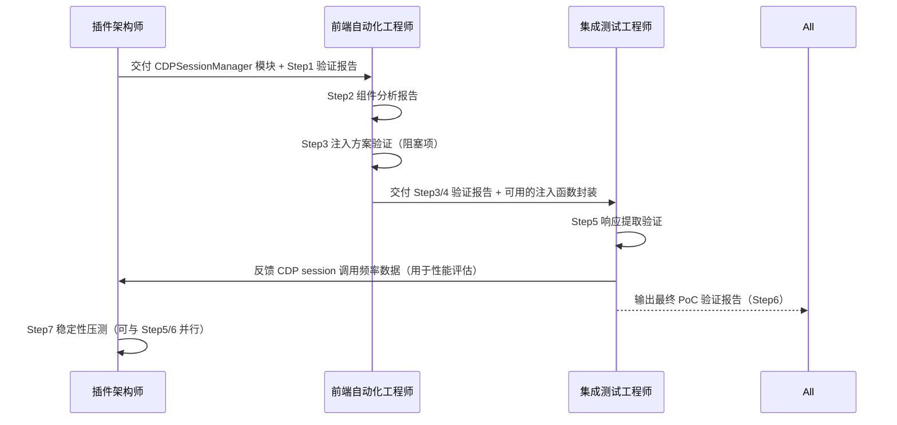

# PoC 验证任务按角色分工

---

## 角色一：VS Code 插件架构师

这个角色负责 CDP 连接层的底层基础设施，对应 Step 1 和 Step 7。

**Step 1 — 建立 CDP 连接并枚举 WebView Target** 由插件架构师主导，因为 CDP 的 WebSocket 连接管理、target 枚举过滤逻辑、以及 session 生命周期（连接断开重连、多 WebView 并发时的 target 隔离）都属于 Extension Host 层的基础能力。该角色需要交付一个 `CDPSessionManager` 模块，对外暴露稳定的 `getTargetSession(filter)` 接口，屏蔽底层 WebSocket 握手细节。验收标准是连续 10 次调用均能稳定返回正确 target，断线重连时间 < 3s。

**Step 7 — 元素 ID 绑定稳定性压测** 的基础数据采集脚本也由该角色负责，因为需要在 Extension Host 侧调度 CDP session 执行重复查询并记录结果。最终产出的选择器稳定性报告将作为动态适配模块的设计输入。

---

## 角色二：前端自动化工程师（新增角色）

这是 PoC 阶段需要明确补充的角色，专注于 React 组件交互层，对应 Step 2、Step 3、Step 4。

**Step 2 — 获取 DOM 结构快照与 React Fiber 探查** 需要熟悉 React 内部数据结构（`__reactFiber`、`memoizedState`）的工程师来编写探查脚本，并能准确判断目标元素是否处于 React 的受控管理之下。该角色需要输出一份《Trae IDE 输入框组件分析报告》，明确记录 tagName、selector 路径、fiber key 名称以及 React 版本（不同 React 版本 fiber key 命名不同）。

**Step 3 — React 受控组件注入验证** 是整个 PoC 最核心的技术攻关点，完全由该角色负责。需要同时验证"错误方式"和"正确方式"，并通过读取 `memoizedState` 确认 React 状态同步。如果 `nativeInputValueSetter` 方案不生效（例如 Trae IDE 使用了 `contenteditable` 而非 `textarea`），需要立即升级为 `execCommand` 或直接操作 fiber state 的备选方案，并记录每种方案的适用条件。

**Step 4 — 提交动作触发验证** 同样由该角色负责，需要覆盖键盘事件和按钮点击两条路径，并使用 `DOM.setEventListenerBreakpoint` 确认事件被正确 handler 捕获。

---

## 角色三：集成测试工程师

负责响应提取层和端到端串联，对应 Step 5 和 Step 6。

**Step 5 — 响应内容轮询提取验证** 由集成测试工程师主导，因为这本质上是一个可观测性问题——需要设计稳定的状态检测机制来判断流式响应是否完成。该角色需要对比轮询方案（500ms 定时）和事件驱动方案（MutationObserver）的稳定性，输出耗时数据和误判率统计。如果轮询方差超过 50%，需要直接给出 MutationObserver 的替代实现。

**Step 6 — 端到端流程串联验证** 由集成测试工程师主导，将前两个角色的交付物集成为完整的自动化脚本，执行 3 轮完整链路测试，对比界面截图与提取文本的一致性，输出最终的 PoC 验证报告。

---

## 协作边界与交接物定义

三个角色之间存在明确的串行依赖，交接物需要在进入下一步前完成评审：

---

## 阻塞项与风险责任归属

Step 3 的 React 状态同步问题是唯一的**硬性阻塞项**，由前端自动化工程师承担攻关责任，若 3 个工作日内无法找到可行的注入方案，需立即升级至架构决策层，评估是否改用 VS Code Extension API 的 `executeCommand` 路径替代 CDP 注入，这将影响整体方案的技术路径选择。

Step 7 的稳定性压测产出的选择器稳定性报告，由插件架构师汇总后反馈给方案文档负责人，用于补全评审意见中要求的"信心度评估机制量化定义"章节，形成闭环。