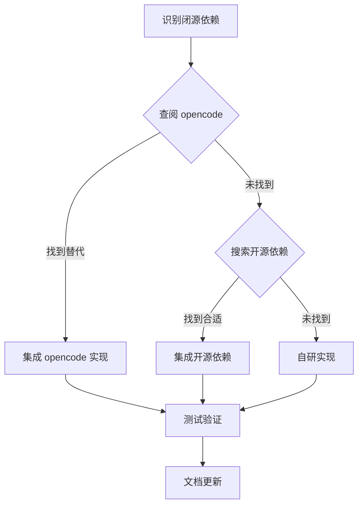

# 新移植策略：以 Claude 为准的闭源依赖处理方案

## 1. 策略概述

**核心原则**：以 Claude Code 为基准，遇到闭源依赖时，按照以下优先级处理：

1. **优先查阅 opencode**：在 [opencode](file:///workspace/caiode/opencode) 目录中查找类似功能的实现
2. **其次搜索开源依赖**：如果 opencode 中没有合适的替代方案，搜索并评估开源依赖
3. **最后考虑自研实现**：如果以上两种方式都不可行，基于 Claude Code 的设计理念自行实现

## 2. 闭源依赖处理流程

### 2.1 依赖识别与分析

**步骤 1：扫描依赖**
- 扫描 Claude Code 代码库，识别所有外部依赖
- 重点关注未在 package.json 中声明的私有依赖
- 记录依赖的使用位置、功能和影响范围

**步骤 2：分类评估**
- **开源依赖**：保留使用，确保版本兼容
- **闭源依赖**：按照以下流程处理

### 2.2 闭源依赖处理优先级

## 3. 现有闭源依赖处理方案

### 3.1 @anthropic-ai/sandbox-runtime

**功能**：沙箱隔离系统（文件系统、网络、进程隔离）

**处理方案**：
- ✅ **已找到 opencode 替代**：Git Worktree 隔离机制
- **具体实现**：
  - [worktree.ts](file:///workspace/caiode/claude-code-src/utils/worktree.ts) - 完整的 Git Worktree 实现
  - [hooks.ts](file:///workspace/caiode/claude-code-src/utils/hooks.ts) - 钩子系统支持
  - [opencode/worktree.ts](file:///workspace/caiode/opencode/packages/app/src/utils/worktree.ts) - 简化版实现，可参考

**集成策略**：
1. 保留 Claude Code 的 Git Worktree 实现
2. 参考 opencode 的简化设计，优化现有实现
3. 确保与沙箱适配器的兼容性

### 3.2 @anthropic-ai/mcpb

**功能**：MCP (Model Context Protocol) 桥接

**处理方案**：
- 🔍 **待评估**：在 opencode 中查找 MCP 相关实现
- **搜索开源依赖**：寻找标准 MCP SDK 或类似功能的开源库
- **自研计划**：如果没有合适替代，基于 MCP 协议规范自行实现

**集成策略**：
1. 先在 opencode 中搜索 MCP 相关代码
2. 评估现有开源 MCP 实现
3. 制定自研实现方案

## 4. 移植执行步骤

### 4.1 准备阶段

1. **建立依赖映射表**：
   - 列出 Claude Code 所有依赖
   - 标记开源/闭源状态
   - 记录使用位置和功能

2. **opencode 功能映射**：
   - 建立 opencode 功能与 Claude Code 功能的映射关系
   - 识别可复用的组件和工具

3. **开源依赖评估**：
   - 建立常用开源替代方案库
   - 评估兼容性和性能

### 4.2 执行阶段

**阶段一：核心引擎移植**
- 移植 QueryEngine、Tool、Task 核心组件
- 处理直接依赖，优先使用 opencode 实现

**阶段二：工具链移植**
- 移植文件操作、命令执行等工具
- 替换闭源依赖，使用 opencode 或开源实现

**阶段三：技能系统移植**
- 移植技能模块
- 确保与核心引擎的集成

**阶段四：沙箱系统移植**
- 使用 Git Worktree 替代沙箱隔离
- 参考 opencode 的实现优化

**阶段五：会话管理移植**
- 移植会话管理功能
- 确保状态持久化

**阶段六：工具函数移植**
- 移植通用工具函数
- 替换闭源依赖

### 4.3 验证阶段

1. **功能测试**：验证所有功能正常运行
2. **性能测试**：确保性能符合要求
3. **安全测试**：验证隔离机制的有效性
4. **兼容性测试**：确保与 Caiode 的兼容性

## 5. 工具与资源

### 5.1 依赖分析工具

- **代码扫描**：使用 ripgrep 搜索依赖引用
- **依赖解析**：分析 package.json 和导入语句
- **功能映射**：建立功能与实现的映射关系

### 5.2 参考资源

- **Claude Code 源码**：[claude-code-src](file:///workspace/caiode/claude-code-src)
- **Opencode 源码**：[opencode](file:///workspace/caiode/opencode)
- **非开源模块分析**：[非开源模块分析报告.md](file:///workspace/docs/planning/非开源模块分析报告.md)
- **沙箱替代方案**：[沙箱替代方案评估.md](file:///workspace/docs/planning/沙箱替代方案评估.md)

## 6. 风险与应对

### 6.1 风险识别

- **功能差异**：opencode 或开源依赖可能与闭源依赖存在功能差异
- **性能影响**：替代方案可能性能不如闭源实现
- **兼容性问题**：替代方案可能与现有代码不兼容
- **维护成本**：自研实现需要额外的维护成本

### 6.2 应对策略

- **功能等价性评估**：确保替代方案提供相同的核心功能
- **性能基准测试**：对比替代方案与原始实现的性能
- **渐进式替换**：采用渐进式替换策略，确保系统稳定性
- **文档完善**：详细记录替换方案和实现细节

## 7. 结论

通过采用「以 Claude 为准，优先查阅 opencode，其次搜索开源依赖」的策略，可以有效处理闭源依赖问题，确保移植过程的顺利进行。

这种方法不仅可以保持 Claude Code 的设计理念和核心功能，还可以利用 opencode 的开源实现和社区资源，降低移植风险和维护成本。

通过系统性的依赖分析和替换策略，我们可以确保 Caiode 获得 Claude Code 的强大功能，同时保持代码的可维护性和开放性。