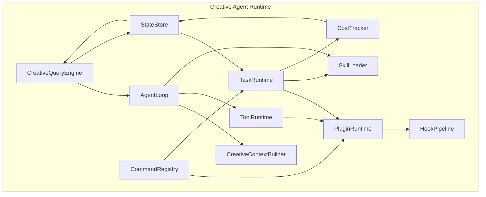

# CREATIVE-AGENT-RUNTIME-ARCHITECTURE.md

> **角色**: 项目协调 Agent (Kimi-K2.6)  
> **任务ID**: DOC-PHASE0-009  
> **日期**: 2026-05-15  
> **版本**: v1.0  
> **状态**: [READY_FOR_REVIEW]

---

## 一、架构定位

Creative Agent Runtime 是 OpenCode Creative Studio 的底层执行内核，负责 Agent 怎么运行。它不是普通插件平台，而是一个面向创作流程的 Agent 执行引擎。

```text
Claude-Code-Style Agent Runtime (底层)
  ├── CreativeQueryEngine    — 会话生命周期、Agent 请求入口
  ├── AgentLoop              — 主循环：模型响应、工具调用、观察结果
  ├── CreativeContextBuilder — 构造小说、角色、镜头、资产上下文
  ├── TaskRuntime            — 所有生成任务统一调度
  ├── ToolRuntime            — 具体可执行动作注册与执行
  ├── SkillLoader            — 发现 .claude/skills/*/SKILL.md，按需加载
  ├── PluginRuntime          — 插件加载、扩展点、权限系统
  ├── HookPipeline           — 插件生命周期、任务前后触发
  ├── CommandRegistry        — 插件命令、生成命令、导出命令
  ├── StateStore             — 会话状态、项目状态、任务状态
  └── CostTracker            — OpenRouter、图像、视频、TTS 成本统计
```

---

## 二、核心模块定义

### 2.1 CreativeQueryEngine

| 属性 | 内容 |
|------|------|
| **职责** | 会话生命周期管理、Agent 请求入口、流式响应输出 |
| **输入** | 用户请求、项目上下文、会话状态 |
| **输出** | 流式响应、任务创建、状态更新 |
| **依赖** | AgentLoop, StateStore, CostTracker |

```typescript
interface CreativeQueryEngine {
  createSession(config: SessionConfig): Promise<Session>
  sendRequest(sessionId: string, request: UserRequest): AsyncGenerator<StreamChunk>
  closeSession(sessionId: string): Promise<void>
  getSession(sessionId: string): Session | undefined
}
```

### 2.2 AgentLoop

| 属性 | 内容 |
|------|------|
| **职责** | 主循环：模型响应、工具调用、观察结果、继续推理 |
| **输入** | 用户请求、上下文、可用工具列表 |
| **输出** | 流式响应、工具调用结果、最终答案 |
| **依赖** | ToolRuntime, SkillLoader, CreativeContextBuilder |

```typescript
interface AgentLoop {
  run(input: AgentInput): AsyncGenerator<AgentOutput>
  pause(): void
  resume(): void
  stop(): void
}

type AgentInput = {
  request: string
  context: CreativeContext
  availableTools: ToolDefinition[]
  availableSkills: SkillDefinition[]
}

type AgentOutput =
  | { type: 'thinking'; content: string }
  | { type: 'tool_call'; tool: string; input: unknown }
  | { type: 'tool_result'; tool: string; output: unknown }
  | { type: 'final'; content: string }
  | { type: 'error'; message: string }
```

### 2.3 CreativeContextBuilder

| 属性 | 内容 |
|------|------|
| **职责** | 构造小说、角色、镜头、资产上下文 |
| **输入** | 项目ID、场景ID、用户选择 |
| **输出** | 压缩后的上下文字符串 |
| **依赖** | StateStore, AssetLibrary |

```typescript
interface CreativeContextBuilder {
  buildContext(request: ContextRequest): Promise<CreativeContext>
  compressContext(context: CreativeContext, maxTokens: number): CreativeContext
}

type ContextRequest = {
  projectId: string
  sceneId?: string
  shotId?: string
  characterIds?: string[]
  assetIds?: string[]
  includeWorldBuilding?: boolean
  includeContinuity?: boolean
}
```

### 2.4 TaskRuntime

| 属性 | 内容 |
|------|------|
| **职责** | 所有生成任务统一调度 |
| **输入** | 任务定义、Skill 名称、插件ID |
| **输出** | 任务状态、任务结果 |
| **依赖** | LicenseGate, SkillLoader, PluginRuntime |

```typescript
interface TaskRuntime {
  createTask(task: TaskInput): Promise<CreativeTask>
  getTask(taskId: string): CreativeTask | undefined
  cancelTask(taskId: string): Promise<void>
  retryTask(taskId: string): Promise<CreativeTask>
  listTasks(filter?: TaskFilter): CreativeTask[]
}

interface CreativeTask {
  id: string
  type: string
  title: string
  status: 'queued' | 'running' | 'waiting_for_permission' | 'waiting_for_user' | 'completed' | 'failed' | 'cancelled'
  projectId: string
  sourceAssetIds: string[]
  outputAssetIds: string[]
  skillName?: string
  pluginId?: string
  providerIds?: string[]
  licenseFeature?: string
  input: unknown
  output?: unknown
  error?: CreativeTaskError
  cost?: {
    inputTokens?: number
    outputTokens?: number
    providerCostUsd?: number
    localComputeCost?: number
  }
  createdAt: string
  updatedAt: string
}
```

### 2.5 ToolRuntime

| 属性 | 内容 |
|------|------|
| **职责** | 具体可执行动作注册与执行 |
| **输入** | 工具名称、工具输入 |
| **输出** | 工具执行结果 |
| **依赖** | ProviderBridge, AssetLibrary |

```typescript
interface ToolRuntime {
  registerTool(tool: ToolDefinition): void
  unregisterTool(toolId: string): void
  executeTool(toolId: string, input: unknown, context: ToolContext): Promise<ToolResult>
  listTools(): ToolDefinition[]
}

interface ToolDefinition {
  id: string
  name: string
  description: string
  inputSchema: JSONSchema
  outputSchema: JSONSchema
  execute: (input: unknown, context: ToolContext) => Promise<ToolResult>
}

interface ToolContext {
  worktreePath: string
  permissionManager: PermissionManager
  taskCenter: TaskRuntime
  assetLibrary: AssetLibrary
}

interface ToolResult {
  success: boolean
  data?: unknown
  error?: string
}
```

### 2.6 SkillLoader

| 属性 | 内容 |
|------|------|
| **职责** | 发现 .claude/skills/*/SKILL.md，按需加载 |
| **输入** | Skill 名称、任务上下文 |
| **输出** | Skill 定义、Skill 内容 |
| **依赖** | 文件系统 |

```typescript
interface SkillLoader {
  discoverSkills(): SkillCatalogEntry[]
  loadSkill(skillName: string): Promise<SkillDefinition>
  unloadSkill(skillName: string): void
  getSkill(skillName: string): SkillDefinition | undefined
}

interface SkillCatalogEntry {
  name: string
  description: string
  whenToUse: string
  path: string
}

interface SkillDefinition {
  name: string
  description: string
  whenToUse: string
  requiredPluginCapabilities?: string[]
  requiredProviders?: string[]
  requiredContext?: string[]
  workflow?: string[]
  rules?: string[]
  content: string
}
```

### 2.7 PluginRuntime

| 属性 | 内容 |
|------|------|
| **职责** | 插件加载、扩展点、权限系统 |
| **输入** | 插件 Manifest |
| **输出** | 插件实例、扩展点注册 |
| **依赖** | LicenseGate, StateStore |

```typescript
interface PluginRuntime {
  load(manifest: CreativePluginManifest): Promise<PluginInstance>
  unload(pluginId: string): Promise<void>
  enable(pluginId: string): Promise<void>
  disable(pluginId: string): Promise<void>
  getInstance(pluginId: string): PluginInstance | undefined
  listPlugins(): CreativePluginManifest[]
  getCapability(pluginId: string, capabilityId: string): PluginCapability | undefined
}

interface PluginInstance {
  manifest: CreativePluginManifest
  status: 'inactive' | 'active' | 'error'
  exports: Record<string, unknown>
}

interface PluginCapability {
  id: string
  description: string
  inputSchema: string
  outputSchema: string
  requiredSkill?: string
  requiredProvider?: string
  requiredLicenseFeature?: string
}
```

### 2.8 HookPipeline

| 属性 | 内容 |
|------|------|
| **职责** | 插件生命周期、任务前后触发 |
| **输入** | 事件类型、事件数据 |
| **输出** | Hook 执行结果 |
| **依赖** | PluginRuntime |

```typescript
interface HookPipeline {
  registerHook(event: string, handler: HookHandler): void
  unregisterHook(event: string, handler: HookHandler): void
  executeHooks(event: string, data: unknown): Promise<HookResult[]>
}

type HookHandler = (data: unknown) => Promise<HookResult>

interface HookResult {
  success: boolean
  data?: unknown
  error?: string
}
```

### 2.9 CommandRegistry

| 属性 | 内容 |
|------|------|
| **职责** | 插件命令、生成命令、导出命令 |
| **输入** | 命令字符串 |
| **输出** | 命令执行结果 |
| **依赖** | PluginRuntime, TaskRuntime |

```typescript
interface CommandRegistry {
  registerCommand(command: CommandDefinition): void
  unregisterCommand(commandId: string): void
  executeCommand(commandId: string, args: unknown): Promise<CommandResult>
  listCommands(): CommandDefinition[]
}

interface CommandDefinition {
  id: string
  name: string
  description: string
  inputSchema: JSONSchema
  execute: (args: unknown, context: CommandContext) => Promise<CommandResult>
}
```

### 2.10 StateStore

| 属性 | 内容 |
|------|------|
| **职责** | 会话状态、项目状态、任务状态 |
| **输入** | 状态更新 |
| **输出** | 状态查询 |
| **依赖** | 持久化存储 |

```typescript
interface StateStore {
  get<T>(key: string): T | undefined
  set<T>(key: string, value: T): void
  delete(key: string): void
  subscribe<T>(key: string, handler: (value: T) => void): void
}
```

### 2.11 CostTracker

| 属性 | 内容 |
|------|------|
| **职责** | OpenRouter、图像、视频、TTS 成本统计 |
| **输入** | 调用记录 |
| **输出** | 成本统计 |
| **依赖** | StateStore |

```typescript
interface CostTracker {
  recordUsage(usage: UsageRecord): void
  getCostSummary(filter?: CostFilter): CostSummary
  getBudgetStatus(): BudgetStatus
}

interface UsageRecord {
  providerId: string
  taskId: string
  inputTokens?: number
  outputTokens?: number
  costUsd?: number
  timestamp: string
}
```

---

## 三、模块依赖关系



---

*[READY_FOR_REVIEW]*
