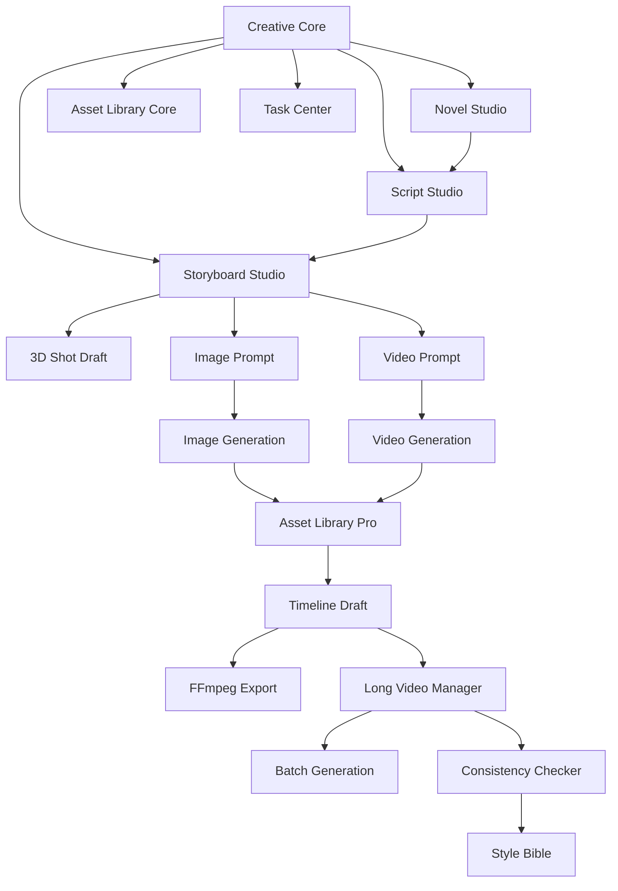

# PLUGIN-ARCHITECTURE.md

> **角色**: 项目协调 Agent (Kimi-K2.6)  
> **任务ID**: DOC-PHASE0-003  
> **日期**: 2026-05-15  
> **版本**: v1.0  
> **状态**: [READY_FOR_REVIEW]

---

## 一、Plugin Runtime

### 1.1 职责

- 加载并初始化插件
- 管理插件生命周期（启用/禁用/卸载）
- 维护插件依赖关系
- 提供扩展点注册与分发机制

### 1.2 核心接口

```typescript
interface PluginRuntime {
  load(manifest: CreativePluginManifest): Promise<PluginInstance>
  unload(pluginId: string): Promise<void>
  enable(pluginId: string): Promise<void>
  disable(pluginId: string): Promise<void>
  getInstance(pluginId: string): PluginInstance | undefined
  listPlugins(): CreativePluginManifest[]
}

interface PluginInstance {
  manifest: CreativePluginManifest
  status: 'inactive' | 'active' | 'error'
  exports: Record<string, unknown>
}
```

---

## 二、Plugin Manifest

每个插件必须提供独立 manifest，声明能力、权限、价格、入口和依赖。

```typescript
type CreativePluginManifest = {
  id: string
  name: string
  version: string
  description: string
  category:
    | 'story'
    | 'script'
    | 'storyboard'
    | '3d'
    | 'image'
    | 'video'
    | 'audio'
    | 'editing'
    | 'workflow'
    | 'team'

  pricing: {
    model: 'free' | 'one_time' | 'subscription' | 'credits' | 'bundle'
    sku: string
    trialDays?: number
  }

  dependencies: {
    coreVersion: string
    plugins?: string[]
    providers?: string[]
    skills?: string[]
  }

  permissions: {
    fileRead?: boolean
    fileWrite?: boolean
    assetRead?: boolean
    assetWrite?: boolean
    taskCreate?: boolean
    providerUse?: string[]
    networkAccess?: boolean
    ffmpegAccess?: boolean
  }

  extensionPoints: {
    pages?: string[]
    panels?: string[]
    commands?: string[]
    assetTypes?: string[]
    taskTypes?: string[]
    skills?: string[]
    providers?: string[]
  }
}
```

---

## 三、Extension Points

OpenCode Core 提供以下稳定扩展点：

| 扩展点 | 用途 | 注册方式 |
|--------|------|---------|
| `workspace.page` | 注册新页面 | `runtime.registerPage(manifest.id, pageConfig)` |
| `workspace.panel` | 注册侧栏/右栏面板 | `runtime.registerPanel(manifest.id, panelConfig)` |
| `command.palette` | 注册命令 | `runtime.registerCommand(manifest.id, commandDef)` |
| `asset.type` | 注册资产类型 | `runtime.registerAssetType(manifest.id, assetTypeDef)` |
| `task.type` | 注册任务类型 | `runtime.registerTaskType(manifest.id, taskTypeDef)` |
| `skill.type` | 注册 Skill | `runtime.registerSkill(manifest.id, skillDef)` |
| `provider.type` | 注册 Provider | `runtime.registerProvider(manifest.id, providerDef)` |
| `export.format` | 注册导出格式 | `runtime.registerExportFormat(manifest.id, formatDef)` |
| `settings.section` | 注册设置页面 | `runtime.registerSettingsSection(manifest.id, sectionDef)` |
| `license.feature` | 注册付费功能点 | `runtime.registerLicenseFeature(manifest.id, featureDef)` |

---

## 四、Skill Registry

### 4.1 职责

- 注册和管理所有 Skill
- 提供 Skill 调用接口
- 支持 Skill 组合与链式调用

### 4.2 核心接口

```typescript
interface SkillRegistry {
  register(skill: SkillDefinition): void
  unregister(skillId: string): void
  invoke(skillId: string, input: unknown, context: SkillContext): Promise<SkillResult>
  listSkills(): SkillDefinition[]
}

interface SkillDefinition {
  id: string
  name: string
  description: string
  inputSchema: JSONSchema
  outputSchema: JSONSchema
  execute: (input: unknown, context: SkillContext) => Promise<SkillResult>
}

interface SkillContext {
  worktreePath: string
  permissionManager: PermissionManager
  taskCenter: TaskCenter
  assetLibrary: AssetLibrary
}

interface SkillResult {
  success: boolean
  data?: unknown
  error?: string
  costMetadata?: CostMetadata
}
```

---

## 五、Provider Registry

### 5.1 职责

- 注册和管理所有外部 Provider
- 统一 Provider 调用接口
- 管理 Provider 配额和成本

### 5.2 核心接口

```typescript
interface ProviderRegistry {
  register(provider: ProviderDefinition): void
  unregister(providerId: string): void
  getProvider(providerId: string): ProviderDefinition | undefined
  listProviders(): ProviderDefinition[]
}

interface ProviderDefinition {
  id: string
  name: string
  type: 'llm' | 'image' | 'video' | 'tts' | 'ffmpeg'
  inputSchema: JSONSchema
  outputSchema: JSONSchema
  errorSchema: JSONSchema
  execute: (input: unknown, context: ProviderContext) => Promise<ProviderResult>
}

interface ProviderResult {
  success: boolean
  data?: unknown
  error?: string
  costMetadata: CostMetadata
  taskStatus: TaskStatus
}
```

---

## 六、Task Center

### 6.1 职责

- 所有生成任务统一进入任务中心
- 维护任务状态机
- 支持任务重试、取消、批量操作
- 记录任务日志和成本

### 6.2 核心接口

```typescript
interface TaskCenter {
  createTask(task: TaskInput): Promise<Task>
  getTask(taskId: string): Task | undefined
  cancelTask(taskId: string): Promise<void>
  retryTask(taskId: string): Promise<Task>
  listTasks(filter?: TaskFilter): Task[]
}

interface Task {
  id: string
  type: string
  status: 'pending' | 'running' | 'success' | 'failed' | 'cancelled'
  input: unknown
  output?: unknown
  error?: string
  progress?: number
  createdAt: Date
  updatedAt: Date
  costMetadata?: CostMetadata
}
```

---

## 七、Asset Library

### 7.1 职责

- 统一管理所有创作产物
- 支持资产版本管理
- 维护资产来源和引用关系
- 支持按项目/场景/Shot 筛选

### 7.2 核心接口

```typescript
interface AssetLibrary {
  createAsset(asset: AssetInput): Promise<Asset>
  getAsset(assetId: string): Asset | undefined
  updateAsset(assetId: string, data: Partial<Asset>): Promise<Asset>
  deleteAsset(assetId: string): Promise<void>
  listAssets(filter?: AssetFilter): Asset[]
}

interface Asset {
  id: string
  type: string
  name: string
  projectId: string
  sceneId?: string
  shotId?: string
  versions: AssetVersion[]
  references: AssetReference[]
  createdAt: Date
  updatedAt: Date
}

interface AssetVersion {
  version: number
  data: unknown
  createdAt: Date
  source: string
}

interface AssetReference {
  assetId: string
  relation: 'parent' | 'child' | 'related'
}
```

---

## 八、License Gate

### 8.1 职责

- 每个插件能力都经过 License Gate 校验
- 支持试用、订阅、一次性购买、额度等多种付费模式
- 提供统一的权限查询接口

### 8.2 核心接口

```typescript
interface LicenseGate {
  check(pluginId: string, feature?: string): LicenseGateResult
  getLicenseInfo(pluginId: string): LicenseInfo
}

type LicenseGateResult = {
  allowed: boolean
  reason?: 'not_installed' | 'trial_expired' | 'license_missing' | 'quota_exceeded'
  upgradeUrl?: string
}

interface LicenseInfo {
  pluginId: string
  status: 'not_installed' | 'trial' | 'purchased' | 'expired' | 'quota_exceeded'
  trialDaysLeft?: number
  expiryDate?: Date
  quotaUsed?: number
  quotaTotal?: number
}
```

### 8.3 UI 状态支持

插件 UI 必须支持以下状态展示：

- 未安装
- 试用中
- 已购买
- 已过期
- 额度不足
- 需要升级套餐

---

## 九、权限边界

### 9.1 插件默认权限

| 权限 | 默认状态 | 说明 |
|------|---------|------|
| fileRead | false | 需显式申请 |
| fileWrite | false | 需显式申请 |
| assetRead | true | 可读取资产库 |
| assetWrite | false | 需显式申请 |
| taskCreate | false | 需显式申请 |
| providerUse | [] | 需显式申请可用 Provider |
| networkAccess | false | 需显式申请 |
| ffmpegAccess | false | 需显式申请 |

### 9.2 高危操作限制

以下操作插件禁止直接执行，必须通过 Core 提供的抽象接口：

- Bash 命令执行
- WebFetch 远程请求
- WebSearch 网络搜索
- 子 Agent 调用
- 环境变量读取
- 系统目录访问
- 沙箱外路径访问

---

## 十、插件依赖关系图



---

*[READY_FOR_REVIEW]*
